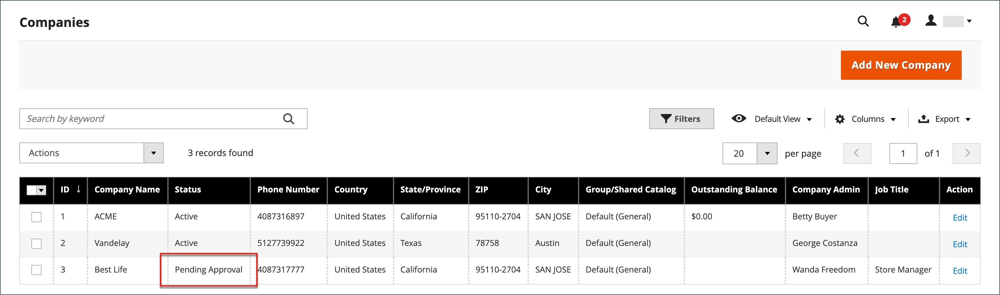

# Een bedrijfsaccount goedkeuren

De status van aanvragen die worden ontvangen van de winkel om een bedrijf te maken, is `Pending Approval` totdat het verzoek is doorgenomen door de beheerder van de winkel. De aanvraag is goedgekeurd of afgewezen. De status van een bedrijfsaccount kan op een van de volgende manieren worden ingesteld:

- [!UICONTROL Active]
- [!UICONTROL Pending Approval]
- [!UICONTROL Rejected]
- [!UICONTROL Blocked]

U kunt de [ controle van Acties ](account-company-manage.md) ook gebruiken om veelvoudige bedrijfverzoeken goed te keuren.

{width="700" zoomable="yes"}

## Een bedrijfsaccount goedkeuren dat in behandeling is

1. Voor _Admin_ sidebar, ga **[!UICONTROL Customers]** > **[!UICONTROL Companies]**.

   U kunt de kiezer _[!UICONTROL Columns]_&#x200B;boven het raster gebruiken om de kolom **[!UICONTROL Status]**&#x200B;weer te geven.

1. Klik in de kolom _[!UICONTROL Action]_&#x200B;op **[!UICONTROL Edit]**.

1. Stel **[!UICONTROL Company Status]** in op `Active` .

   {width="700" zoomable="yes"}

1. Klik op **[!UICONTROL Change status]** wanneer u wordt gevraagd om te bevestigen.

   De bedrijfsbeheerder ontvangt een e-mailbericht dat het bedrijf nu actief is.

1. Indien van toepassing, stelt u **[!UICONTROL Sales Representative]** in op een specifieke Admin-gebruikersaccount.

1. Breid  de **[!UICONTROL Account Information]** sectie uit en gebruik het **[!UICONTROL Comment]** gebied om nota&#39;s over de rekening in te gaan.

   De opmerkingen zijn niet zichtbaar vanuit de winkel.

1. Klik op **[!UICONTROL Save]** als de bewerking is voltooid.

   Er wordt een bevestigingsbericht verzonden naar het bedrijf en de systeembeheerder van het bedrijf dat de bedrijfsaccount is goedgekeurd.

## Status van onderneming

| Status | Beschrijving |
|------------------|--------------------------------------------------------------------------------------------------------------------------------------------|
| [!UICONTROL Active] | Het bedrijf wordt goedgekeurd en kan van de opslagplaats door de bedrijfbeheerder worden beheerd. |
| [!UICONTROL Pending Approval] | Een verzoek om een bedrijfsaccount te maken is ingediend door de winkel, maar wordt nog niet beoordeeld. |
| [!UICONTROL Rejected] | Het verzoek om een bedrijfsaccount te maken is afgewezen door de beheerder van de winkel. |
| [!UICONTROL Blocked] | De bedrijfsrekening verkeert niet meer in goede staat. De klant heeft toegang tot het account via de winkel, maar kan geen aankopen doen. |

{style="table-layout:auto"}
