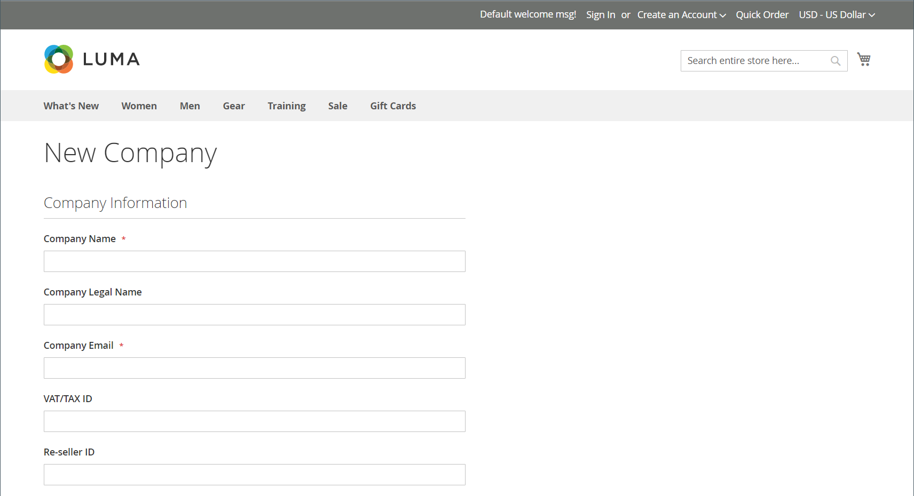
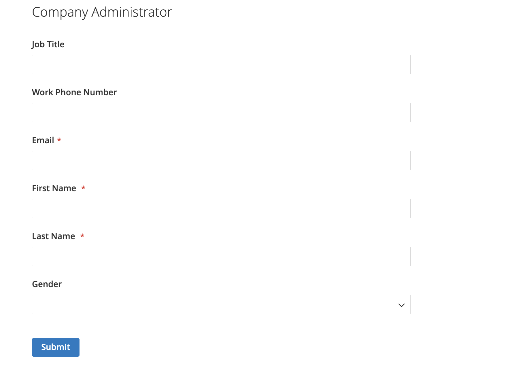

# Een bedrijfsaccount maken

Met bedrijfsaccounts kunnen B2B-bedrijven hun aankopen, gebruikers en krediet binnen Adobe Commerce beheren. Dit onderwerp behandelt het volledige proces om, bedrijfsrekeningen te creëren te vormen en te activeren.

## Overzicht van het aanmaken van bedrijfsaccounts

De rekeningen van het bedrijf kunnen door twee methodes worden gecreeerd, elk geschikt voor verschillende bedrijfsscenario&#39;s:

* **Verzoeken van de de Registratie van de Storefront**—Zelfbediening rekening door ondernemingen
* **Admin creatie**-verkoop-bijgestelde rekeningsopstelling met pre-gevormde details

Alle bedrijfsrekeningen vereisen beheerdergoedkeuring alvorens actief te worden, die juiste controle en configuratie verzekeren.

## Vereisten

Voordat u bedrijfsaccounts gaat maken, moet u controleren of aan de volgende vereisten is voldaan:

* **Vereisten van het Systeem:**
   * [ B2B eigenschappen worden toegelaten ](enable-basic-features.md) in uw installatie van Adobe Commerce
   * Bedrijfsregistratie is ingeschakeld voor het maken van winkels
   * E-mailmeldingen zijn geconfigureerd voor goedkeuringswerkstromen

* **BedrijfsVereisten:**
   * Goedkeuringsprocessen en -beleid
   * De vertegenwoordigers van de verkoop worden toegewezen (voor Admin-gecreeerde rekeningen)
   * Kredietbeleid wordt gedefinieerd (als het bedrijfskrediet wordt gebruikt)
   * Klantgroepen en gedeelde catalogi worden geconfigureerd

* **Administratieve Toegang:**
   * Passende machtigingen voor bedrijfsbeheer
   * Toegang tot afdelingen van klanten en bedrijfsbeheer

Het systeem wijst de [ rol van de bedrijfbeheerder ](account-company-admin.md) aan de persoon toe die opstelling een bedrijfrekening van de storefront. Nadat de opslagbeheerder het verzoek tot oprichting van een bedrijfsaccount in Admin heeft goedgekeurd, kan de bedrijfsbeheerder een accountwachtwoord instellen en zich aanmelden bij de account.

## Methode 1: de klant maakt de account aan via de winkel

**wanneer om deze methode te gebruiken:**

* De zelfbedienings bedrijfsregistratie wordt geprefereerd
* Klanten hebben alle noodzakelijke bedrijfsinformatie gemakkelijk beschikbaar
* De standaardgoedkeuringswerkstroom is voldoende
* Geen speciale configuratie of pre-populatie vereist

>[!IMPORTANT]
>
>Om deze methode te steunen (die klanten toestaat om hun bedrijf van de winkel te registreren), zorg ervoor dat de [ Eigenschappen B2B ](enable-basic-features.md) worden toegelaten.

1. In de rechterbovenhoek van de winkelkoptekst klikt de klant op **[!UICONTROL Create an Account]** en kiest de klant **[!UICONTROL Create New Company Account]** .

   {width="700" zoomable="yes"}

   >[!NOTE]
   >
   >Als een bezoeker is aangemeld bij een geregistreerde gebruikersaccount, kan hij of zij een bedrijfsaccount maken door naar _[!UICONTROL Customer Profile]_>**[!UICONTROL Company Structure]**>**[!UICONTROL Create a Company Account]**&#x200B;te navigeren.

1. In de sectie _[!UICONTROL Company Information]_&#x200B;doet de klant het volgende:

   * Vul de vereiste velden in:

      * **[!UICONTROL Company Name]**
      * **[!UICONTROL Company Email]**

   * Vul de overige velden in, al naargelang van toepassing:

      * **[!UICONTROL Company Legal Name]**
      * **[!UICONTROL VAT/TAX ID]**
      * **[!UICONTROL Reseller ID]**

   {width="700" zoomable="yes"}

1. Voltooit de vereiste velden in de sectie _[!UICONTROL Legal Address]_.

   * **[!UICONTROL Street Address]**
   * **[!UICONTROL City]**
   * **[!UICONTROL Country]**
   * **[!UICONTROL State/Province]**
   * **[!UICONTROL ZIP/Postal Code]**
   * **[!UICONTROL Phone Number]**

   {width="700" zoomable="yes"}

1. Voer in de sectie _[!UICONTROL Company Administrator]_&#x200B;de volgende handelingen uit:

   * Voer de **[!UICONTROL Email address]** in voor de bedrijfsbeheerder.

     Het e-mailadres van de bedrijfsbeheerder kan hetzelfde zijn als het e-mailadres van het bedrijf of een ander e-mailadres. Als u een ander e-mailadres invoert, maakt het systeem naast de beheerdersaccount van het bedrijf ook een gebruikersaccount voor het bedrijf.

   * Voer de **[!UICONTROL First Name]** en **[!UICONTROL Last Name]** van de bedrijfsbeheerder in.

   * De volgende velden worden optioneel ingevuld:

      * **[!UICONTROL Job Title]**
      * **[!UICONTROL Work Phone Number]**
      * **[!UICONTROL Gender]**

   

1. Hiermee wordt de validatie voltooid als reCAPTCHA is ingeschakeld voor deze storefront-functie.

1. Selecteer **[!UICONTROL Submit]** wanneer de informatie is voltooid.

   Wanneer de handelaar het verzoek om een bedrijfrekening tot stand te brengen goedkeurt, verzendt het systeem een e-mailbericht naar de bedrijfbeheerder.

   {width="500"}

   Wanneer het wachtwoord wordt geplaatst, kan de bedrijfbeheerder [ binnen ondertekenen ](../customers/customer-sign-in.md) aan de rekening.

## Methode 2: Merchant maakt de account via Beheer

**wanneer om deze methode te gebruiken:**

* Het maken van een account met verkoopondersteuning verdient de voorkeur
* Pre-populating accountdetails uit bestaande bedrijfsverhoudingen
* Aangepaste configuratie is vereist (kredietlimieten, speciale prijzen)
* Directe activering zonder goedkeuringswerkstroom is nodig

Het proces om een bedrijf van Admin tot stand te brengen is in wezen het zelfde als van storefront, maar met extra gebieden.

{width="700" zoomable="yes"} toe

1. Voor _Admin_ sidebar, ga **[!UICONTROL Customers]** > **[!UICONTROL Companies]**.

1. Klik op **[!UICONTROL Add New Company]** en voer de volgende handelingen uit:

   * Vul de volgende vereiste velden in:

      * **[!UICONTROL Company Name]**
      * **[!UICONTROL Company Email]**

   * Stel **[!UICONTROL Status]** in op `Pending Approval` als u niet klaar bent voor de live account. (Standaard ingesteld op `Active` .)

   * Kies, indien van toepassing, de beheerdersaccount van de **[!UICONTROL Sales Representative]** die de account moet beheren.

1. Ga als volgt te werk in de sectie _[!UICONTROL Account Information]_:

   * Vul de volgende velden in, indien van toepassing:

      * **[!UICONTROL Company Legal Name]**
      * **[!UICONTROL VAT/TAX ID]**
      * **[!UICONTROL Reseller ID]**

   * Voer voor **[!UICONTROL Comment]** aanvullende informatie in over de klant die nodig kan zijn.

     De opmerkingen zijn alleen zichtbaar vanuit de beheerder.

   {width="700" zoomable="yes"}

1. Wanneer u een bedrijf maakt, wordt het raster _[!UICONTROL Company Hierarchy]_&#x200B;leeg weergegeven wanneer u het bedrijf uitbreidt. Nadat u het bedrijf hebt opgeslagen, kunt u het in een bedrijfshiërarchie opnemen. Zie [ Beheer van het Bedrijf ](manage-companies.md).

1. Voer in de sectie _[!UICONTROL Legal Address]_&#x200B;de volgende vereiste velden in:

   * **[!UICONTROL Street Address]**
   * **[!UICONTROL City]**
   * **[!UICONTROL Country]**
   * **[!UICONTROL ZIP/Postal Code]**
   * **[!UICONTROL Phone Number]**

1. Ga als volgt te werk in de sectie _[!UICONTROL Company Admin]_:

   * Vul de volgende vereiste velden in:

      * **[!UICONTROL Email]**
      * **[!UICONTROL First Name]**
      * **[!UICONTROL Last Name]**

   * Vul de volgende optionele onderdelen van de naam in, die mogelijk van toepassing zijn op bepaalde klantnamen, meer dan andere, en die naar uw goeddunken kunnen worden gebruikt:

      * **[!UICONTROL Prefix]**
      * **[!UICONTROL Middle Name/Initial]**
      * **[!UICONTROL Suffix]**

   * Als de informatie beschikbaar is, voltooi de resterende gebieden om de bedrijfbeheerder te beschrijven:

      * **[!UICONTROL Website]**
      * **[!UICONTROL Job Title]**
      * **[!UICONTROL Work Phone Number]**
      * **[!UICONTROL Gender]**
      * **[!UICONTROL Send Welcome Email From]**

   {width="700" zoomable="yes"}

1. Voer in de sectie _[!UICONTROL Company Credit]_, die een overzicht weergeeft van de kredietactiviteiten van de klant, zoveel velden in het onderste gedeelte van de sectie in als van toepassing is:

   * **[!UICONTROL Credit Currency]**
   * **[!UICONTROL Credit Limit]**
   * **[!UICONTROL Allow to Exceed Credit Limit]**
   * **[!UICONTROL Reason for Change]**

   {width="700" zoomable="yes"}

1. Ga als volgt te werk in de sectie _[!UICONTROL Advanced Settings]_:

   >[!NOTE]
   >
   >De toewijzing van de klantengroep bepaalt welke gedeelde catalogus aan het bedrijf en zijn werknemers beschikbaar is. Door gebrek, wijst het systeem het bedrijf aan de klantengroep toe die als gebrek wordt gevormd.

   * U kunt de **[!UICONTROL Customer Group]** taak voor het bedrijf en zijn werknemers in een groep veranderen die toegang tot een verschillende gedeelde catalogus of tot een standaardklantengroep heeft. Het systeem vraagt u om dit te bevestigen voordat u de groep wijzigt.

     {width="600"}

   * Stel **[!UICONTROL Allow Quotes]** in op `Yes` als u wilt toestaan dat bedrijfswerknemers aanhalingstekens kunnen genereren van hun account.

   * Stel **[!UICONTROL Enable Purchase Orders]** in op `Yes` als u wilt toestaan dat bedrijfswerknemers kooporders van hun account kunnen maken en gebruiken.

   * Als u de **[!UICONTROL Applicable Payment Methods]** wilt wijzigen die beschikbaar zijn voor het bedrijf, schakelt u het selectievakje **[!UICONTROL Use config settings]** uit en kiest u een van de volgende opties:

     | Optie | Beschrijving |
     |-------------------------------|-----------------------------------------------------------------------------------------------------------------------------------------------------------------------------------------------------------------------------------------|
     | `B2B Payment Methods` | (Gebrek) laat alle [ betalingsmethodes toe die als gebrek ](../configuration-reference/general/b2b-features.md#default-b2b-payment-methods) voor B2B- orden worden geplaatst. |
     | `All Enabled Payment Methods` | Maakt alle [ toegelaten betalingsmethodes ](../configuration-reference/sales/payment-methods.md) beschikbaar voor klantenrekeningen verbonden aan de bedrijfrekening. |
     | `Selected Payment Methods` | Hiermee kunt u de betalingsmethoden selecteren die beschikbaar zijn voor klantenaccounts die bij het bedrijfsaccount horen. Als u meerdere betalingsmethoden wilt selecteren, houdt u Ctrl (PC) of Command (Mac) ingedrukt en selecteert u elke optie. |

     {style="table-layout:auto"}

   * Als u de **[!UICONTROL Applicable Shipping Methods]** wilt wijzigen die beschikbaar zijn voor het bedrijf, schakelt u het selectievakje **[!UICONTROL Use config settings]** uit en kiest u een van de volgende opties:

     | Optie | Beschrijving |
     |--------------------------------|----------------------------------------------------------------------------------------------------------------------------------------------------------------------------------------------------------------------------------------------------|
     | `B2B Shipping Methods` | (Gebrek) laat alle [ verschepende methodes toe die als gebrek ](../configuration-reference/general/b2b-features.md#default-b2b-shipping-methods) voor B2B- orden worden geplaatst. |
     | `All Enabled Shipping Methods` | Maakt alle [ toegelaten verschepende methodes ](../configuration-reference/sales/delivery-methods.md) beschikbaar voor klantenrekeningen verbonden aan de bedrijfrekening. |
     | `Selected Shipping Methods` | Hiermee kunt u de verzendmethoden selecteren die beschikbaar zijn voor klantenaccounts die zijn gekoppeld aan het bedrijfsaccount. Als u meerdere verzendmethoden wilt selecteren, houdt u Ctrl (PC) of Command (Mac) ingedrukt en selecteert u elke optie. |

     {style="table-layout:auto"}

1. Selecteer **[!UICONTROL Save]** wanneer deze bewerking is voltooid.

   Wanneer het verzoek om een bedrijfsaccount te maken door de handelaar wordt goedgekeurd, wordt een e-mailmelding verzonden naar het e-mailadres van de bedrijfsbeheerder.

   Wanneer het wachtwoord wordt geplaatst, kan de bedrijfbeheerder [ binnen ondertekenen ](../customers/customer-sign-in.md) aan de rekening.

## Na het maken van de account

Nadat een bedrijfsaccount is gemaakt, vindt het volgende proces plaats:

### &#x200B;1. Goedkeuringswerkstroom

* **Hangende Status** - de nieuwe rekeningen wachten beheerderoverzicht
* **Proces van het Overzicht** - de beheerders van de opslag verifiëren bedrijfsinformatie en goedkeuren/verwerpen verzoeken
* **Updates van de Status** - De bedrijven ontvangen e-mailberichten over de veranderingen van de goedkeuringsstatus

### &#x200B;2. Accountactivering

* **Welkome E-mail** - Erkende bedrijfbeheerders ontvangen opstellingsinstructies
* **- de Beheerders van de Opstelling van het 0&rbrace; Wachtwoord creëren veilige wachtwoorden voor rekeningstoegang**
* **Aanvankelijke Login** - Eerste toegang tot het bedrijfdashboard en de eigenschappen

### &#x200B;3. Volgende stappen voor bedrijfsbeheerders

Na activering moeten bedrijfsbeheerders:

* **[vorm de Structuur van het Bedrijf](account-company-structure.md)** - de afdelingen van de opstelling en gebruikershiërarchie
* **[beheer de Gebruikers van het Bedrijf](account-company-users.md)** - voeg werknemers toe en wijs rollen toe
* **[de Orden van de Aankoop van de Opstelling](purchase-order-flow.md)** - vorm goedkeuringswerkschema&#39;s indien nodig
* **[Kredietinstellingen van het Overzicht](credit-company.md)** - begrijp en beheer bedrijfskrediet (als toegelaten)

## Algemene problemen en problemen oplossen

### Problemen bij het aanmaken van accounts

**de vorm van de Registratie ontbreekt om voor te leggen**

* Controleren of alle vereiste velden correct zijn ingevuld
* Controleer of e-mailadressen geldig en uniek zijn
* Zorg ervoor dat B2B-functies zijn ingeschakeld en registratie door het bedrijf is toegestaan
* Browser cache wissen en probeer het opnieuw

**reeds bestaat de Naam van het Bedrijf**

* Kies een unieke bedrijfsnaam
* Neem contact op met de beheerder als u denkt dat dit een fout is
* Voeg locatie- of bedrijfseenheid-id toe

**E-mailadreskwesties**

* Zakelijke e-mailadressen gebruiken in plaats van persoonlijke
* Zorg ervoor dat de bedrijfbeheerder-e-mail toegankelijk is
* Controleren of het domein niet wordt geblokkeerd door e-mailfilters

### Goedkeuring en activering

**E-mail van de Goedkeuring niet Ontvangen**

* E-mailmappen voor ongewenste berichten controleren
* Controleer of het e-mailadres correct is ingevoerd tijdens de registratie
* Neem contact op met de beheerder van de winkel voor een handmatige statuscontrole van de goedkeuring
* 24-48 uur toestaan voor verwerking gedurende werkdagen

**kan geen Wachtwoord plaatsen na Goedkeuring**

* Gebruik de exacte koppeling die u hebt opgegeven in het goedkeuringsbericht
* Controleren of de activeringskoppeling is verlopen
* Nieuwe activeringsmail aanvragen van de beheerder

**de Kwesties van de Toegang na Activering**

* Verifieer dat u het programma opent door het correcte portaal van de bedrijfrekening
* Controleer of uw accountstatus actief is
* Verzeker u de geloofsbrieven van de bedrijfbeheerder gebruikt
* Neem contact op met de ondersteuning als de machtigingen onjuist lijken

## Aanbevolen werkwijzen voor beveiliging

Bij het maken en beheren van bedrijfsaccounts:

* **Krachtige Wachtwoorden van het Gebruik** - vereis complexe wachtwoorden voor bedrijfbeheerders
* **verifieer BedrijfsInformatie** - bevestigt bedrijfdetails tijdens het goedkeuringsproces
* **de Activiteit van de Rekening van de Monitor** - herzie regelmatig de gebruikerstoegang van het bedrijf en toestemmingen
* **Bescherm Gevoelige Gegevens** - verzeker krediet en financiële informatie behoorlijk wordt beveiligd

## Referentie gebruikersinterface bedrijfsaccount

### Knopbalk

| Knop | Beschrijving |
|---------------------------|------------------------------------------------------------------|
| [!UICONTROL Back] | Hiermee gaat u terug naar de pagina Companies zonder de wijzigingen op te slaan. |
| [!UICONTROL Reset] | Hiermee herstelt u de oorspronkelijke waarden in alle velden met niet-opgeslagen wijzigingen. |
| [!UICONTROL Save] | Hiermee slaat u wijzigingen op in het bedrijf en houdt u het profiel open. |
| [!UICONTROL Save & Close] | Hiermee slaat u wijzigingen op in het bedrijf en sluit u het profiel. |

{style="table-layout:auto"}

### Veldomschrijvingen

| Veld | Beschrijving |
|-----------------------------------|---------------------------------------------------------------------------------------------------------------------------------------------------------------------------------------------------------------------------------------------------------------------------------------------------------------------------------------------------------------------------------------------------------------------------------------------------------------------------------------------------------------------------------------------------------------------------------------------------------------------------------------------------------------------------------------------------------------------------------------------------------------------------------------------------------------------------------------------------------------------------------------------------------------------------------|
| [!UICONTROL Company Name] | De bedrijfsnaam wordt ingevoerd wanneer het bedrijfsaccount voor het eerst wordt gemaakt en kan een verkorte versie van de volledige juridische naam zijn. |
| [!UICONTROL Status] | (Alleen beheerder) Geeft de huidige status van de bedrijfsaccount aan. Opties:  **[!UICONTROL Active]**- Het bedrijfsaccount wordt goedgekeurd door de beheerder van de winkel. De bedrijfsbeheerder en geassocieerde leden kunnen zich bij de winkel aanmelden en aankopen doen. **[!UICONTROL Pending Approval]** - Er is een verzoek ingediend om een bedrijfsaccount te openen, maar dit is nog niet goedgekeurd door de beheerder van de winkel.  **[!UICONTROL Rejected]**- Een verzoek om een bedrijfsaccount te openen is ingediend, maar niet goedgekeurd door de beheerder van de winkel. De initiële aanmeldingsgegevens die zijn gebruikt om het verzoek in te dienen, worden geblokkeerd. **&#x200B; Geblokkeerd &#x200B;**- De leden van het Bedrijf kunnen login en tot de catalogus toegang hebben, maar kunnen geen aankopen maken. De opslagbeheerder zou een bedrijfrekening kunnen blokkeren die niet in goede staat is. Het blok op de rekening kan door de opslagbeheerder op elk ogenblik worden verwijderd. |
| [!UICONTROL Company Email] | Het e-mailadres dat aan het bedrijfsaccount is gekoppeld. |
| [!UICONTROL Sales Representative] | (Alleen beheerder) De Admin-gebruiker die de primaire contactpersoon voor het bedrijfsaccount is. |

{style="table-layout:auto"}

#### [!UICONTROL Account Information]

| Veld | Beschrijving |
|---------------------------------|-----------------------------------------------------------------------------------------------------------------------------------------------------------------------------------------------------------------------------------------------------------------------------------------------------------------------------------------------------------------------------------------------------------------------------------------------------------------|
| [!UICONTROL Company Legal Name] | De volledige wettelijke naam van de onderneming. |
| [!UICONTROL VAT / TAX ID] | Het [ waarde-toegevoegde belasting ](../stores-purchase/vat.md) aantal dat aan het bedrijf door sommige jurisdicties voor belastingrapporteringsdoeleinden wordt toegewezen. Om de klant BTW/BELASTINGidentiteitskaart te vormen om in de storefront te verschijnen, zie [ de Nieuwe Opties van de Rekening ](../configuration-reference/customers/customer-configuration.md) creëren.   **_Note:_** de bedrijfbeheerder en andere bedrijfgebruikers hebben hun eigen afzonderlijke BTW/BELASTINGaantallen in hun klantenrekeningen niet. |
| [!UICONTROL Reseller ID] | Het wederverkoopnummer dat aan de onderneming wordt toegekend voor belastingverslagleggingsdoeleinden. |
| [!UICONTROL Comment] | (Alleen beheerder) Deze opmerkingen over de bedrijfsaccount zijn ter referentie en zijn alleen zichtbaar vanuit de beheerder. |

{style="table-layout:auto"}

#### [!UICONTROL Company Hierarchy]

| Veld | Beschrijving |
|-----------------------------------|------------------------------------------------------------------------------------------------------------------------------------------------------|
| [!UICONTROL Company ID] | Het ID-nummer van het bedrijf. |
| [!UICONTROL Company Name] | De volledige naam van de onderneming.   A `current company indicator` verschijnt in de bedrijflijn die wordt uitgegeven. |
| [!UICONTROL Company Email] | Het e-mailadres dat aan het bedrijfsaccount is gekoppeld. |
| [!UICONTROL Phone Number] | Het primaire telefoonnummer van het bedrijf. |
| [!UICONTROL Country] | Het land waar de onderneming is geregistreerd om zaken te doen. |
| [!UICONTROL State/Province] | De staat of provincie waar het bedrijf is geregistreerd om zaken te doen. |
| [!UICONTROL City] | De stad waar de onderneming is geregistreerd om zaken te doen. |
| [!UICONTROL Group/Shared Catalog] | (Admin slechts) toont de [ klantengroep ](../customers/customer-groups.md) of [ gedeelde catalogus ](catalog-shared.md) die aan het bedrijf wordt toegewezen. |
| [!UICONTROL Company Admin] | De volledige naam van de bedrijfbeheerder. |
| [!UICONTROL Action] | De lijst van mogelijke acties voor die bedrijfslijn. |

{style="table-layout:auto"}

#### [!UICONTROL Legal Address]

| Veld | Beschrijving |
|------------------------------|-----------------------------------------------------------------------------|
| [!UICONTROL Street Address] | Het adres van de straat waar de onderneming is geregistreerd om zaken te doen. |
| [!UICONTROL City] | De stad waar de onderneming is geregistreerd om zaken te doen. |
| [!UICONTROL Country] | Het land waar de onderneming is geregistreerd om zaken te doen. |
| [!UICONTROL State/Province] | De staat of provincie waar het bedrijf is geregistreerd om zaken te doen. |
| [!UICONTROL ZIP/Postal Code] | De postcode of postcode waar de onderneming geregistreerd is om zaken te doen. |
| [!UICONTROL Phone Number] | Het primaire telefoonnummer van het bedrijf. |

{style="table-layout:auto"}

#### [!UICONTROL Company Admin]

| Veld | Beschrijving |
|--------------------------------------|---------------------------------------------------------------------------------------------------------------------------------------------------------------------------------------------------------------------------------------------------|
| [!UICONTROL Website] | Hiermee bepaalt u de website waartoe de beheerder van het bedrijf behoort. |
| [!UICONTROL Job Title] | De titel van de bedrijfsbeheerder die de bedrijfsaccount beheert. |
| [!UICONTROL Work Phone Number] | Het telefoonaantal van de bedrijfbeheerder die de bedrijfrekening beheert. |
| [!UICONTROL Email] | Het e-mailadres van de bedrijfsbeheerder kan hetzelfde zijn als het e-mailadres van het bedrijf. Als u een ander e-mailadres opgeeft, maakt het systeem naast het bedrijfsaccount ook een aparte individuele account voor de bedrijfsbeheerder. |
| [!UICONTROL Prefix] | Indien van toepassing, het voorvoegsel dat aan de naam van de bedrijfsbeheerder is gekoppeld (bijvoorbeeld `Mr.` , `Ms.` , `Mrs.` of `Dr.` ). Afhankelijk van de configuratie kan het invoerveld een tekstveld of lijst zijn. |
| [!UICONTROL First Name] | De voornaam van de bedrijfbeheerder. |
| [!UICONTROL Middle Name/Initial] | De middelste naam of de aanvankelijke naam van de bedrijfbeheerder. |
| [!UICONTROL Last Name] | De achternaam van de bedrijfsbeheerder. |
| [!UICONTROL Suffix] | Indien van toepassing, het achtervoegsel dat aan de naam van de bedrijfbeheerder (zoals `Jr.`, `Sr.`, of `III.`) wordt geassocieerd. Afhankelijk van de configuratie kan het invoerveld een tekstveld of lijst zijn. |
| [!UICONTROL Gender] | Het geslacht van de bedrijfsbeheerder. Opties: `Male` / `Female` / `Not Specified` |
| [!UICONTROL Send Welcome Email From] | De winkelweergave van waaruit het systeem het welkomstbericht verzendt. |

{style="table-layout:auto"}

#### [!UICONTROL Company Credit]

| Veld | Beschrijving |
|-------------------------------------------|-----------------------------------------------------------------------------------------------------------------------------------------------------------------------------------------|
| [!UICONTROL Credit Currency] | (Alleen beheerder) De valuta die door de winkel wordt geaccepteerd voor aankopen op bedrijfskrediet. |
| [!UICONTROL Credit Limit] | (Alleen beheerder) De kredietlimiet die wordt uitgebreid naar de bedrijfsaccount. |
| [!UICONTROL Allow to Exceed Credit Limit] | (Alleen beheerder) Geeft aan of het bedrijf toestemming heeft om de kredietlimiet te overschrijden. Opties: `Yes` / `No` |
| [!UICONTROL Reason for Change] | (Alleen beheerder) Een opmerking die verklaart waarom het bedrijf de kredietlimiet mag of mag overschrijden. Dit veld is alleen actief als de toestemming om de kredietlimiet te overschrijden wordt gewijzigd. |

{style="table-layout:auto"}

#### [!UICONTROL Advanced Settings]

U kunt geavanceerde montages voor individuele bedrijven vormen. Als u een bedrijfshiërarchie creeert, kunt u de montagesconfiguratie stroomlijnen door de montages voor het ouderbedrijf te vormen en die montages op alle of geselecteerde kindbedrijven toe te passen in plaats van elk kindbedrijf individueel te vormen. Voor meer informatie, zie [ de Hiërarchie van het Bedrijf beheren ](manage-company-hierarchy.md).

| Veld | Beschrijving |
|------------------------------------------|--------------------------------------------------------------------------------------------------------------------------------------------------------------------------------------------------------------------------|
| [!UICONTROL Customer Group] | (Admin slechts) toont de [ klantengroep ](../customers/customer-groups.md) of [ gedeelde catalogus ](catalog-shared.md) die aan het bedrijf wordt toegewezen. |
| [!UICONTROL Allow Quotes] | (Alleen beheerder) Hiermee wordt bepaald of leden van het bedrijf namens het bedrijf verhandelbare noteringen kunnen opstellen en indienen. |
| [!UICONTROL Enable Purchase Orders] | (Alleen Admin) Hiermee bepaalt u of leden van het bedrijf orders kunnen indienen als [ inkooporders ](account-dashboard-my-purchase-orders.md) namens het bedrijf. |
| Toepasselijke betalingsmethoden | (Alleen beheerder) Geeft de betalingsmethoden aan die beschikbaar zijn voor aankopen door bedrijven. Opties: `B2B Payment Methods` / `All Enabled Payment Methods` / `Selected Payment Methods` |
| [!UICONTROL Payment Methods] | (Alleen beheerder) Wordt actief als u specifieke betalingsmethoden activeert. Als u meerdere betalingsmethoden beschikbaar wilt maken voor de bedrijfsaccount, houdt u Ctrl (PC) of Command (Mac) ingedrukt en selecteert u elke optie. |
| [!UICONTROL Applicable Shipping Methods] | (Alleen beheerder) Geeft de verzendmethoden aan die beschikbaar zijn voor aankopen door bedrijven. Opties: `B2B Shipping Methods` / `All Enabled Shipping Methods` / `Selected Shipping Methods` |
| [!UICONTROL Shipping Methods] | (Alleen beheerder) Wordt actief als u specifieke verzendmethoden activeert. Als u meerdere verzendmethoden beschikbaar wilt maken voor de bedrijfsaccount, houdt u Ctrl (PC) of Command (Mac) ingedrukt en selecteert u elke optie. |

{style="table-layout:auto"}

>[!MORELIKETHIS]
>
>* [ laat B2B Eigenschappen ](enable-basic-features.md) toe - vorm de fundamentele functionaliteit B2B
>* [ de Structuur van de Rekening van het Bedrijf ](account-company-structure.md) - organiseer gebruikers en afdelingen van de storefront
>* [ Beheer de Gebruikers van het Bedrijf ](account-company-users.md) - voeg en vorm werknemersrekeningen van storefront toe
>* [ - Begrijp beheerderverantwoordelijkheden van de Beheerder van 0&rbrace; Bedrijf](account-company-admin.md)
>* [ beheert Bedrijven ](manage-companies.md) - administratief overzicht van bedrijfbeheer
>* [ Beheer van het Krediet van het Bedrijf ](credit-company.md) - opstelling en beheer bedrijfskrediet van Admin
>* [ Werkschema van de Inkooporder ](purchase-order-flow.md) - vorm goedkeuringsprocessen van Admin
>* [ Rollen van het Bedrijf en Toestemmingen ](account-company-roles-permissions.md) - de niveaus van de gebruikerstoegang van de Controle van Admin
>* [ B2B de Verwijzing van de Configuratie ](../configuration-reference/general/b2b-features.md) - Gedetailleerde systeemmontages
