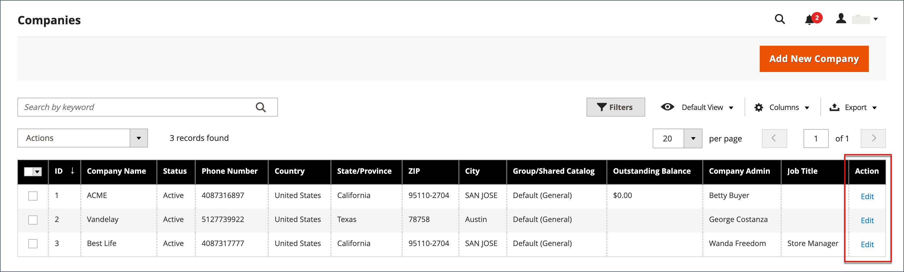

# Een klantengroep toewijzen aan een bedrijf

Het toewijzen van een klantengroep aan een bedrijf is in wezen het zelfde als het toewijzen van een gedeelde catalogus. Indien gedeelde catalogus niet is [ingeschakeld in de configuratie](enable-basic-features.md), wordt een Klantengroep — in plaats van een Gedeelde Catalogus — toegewezen aan een bedrijf.

>[!NOTE]
>
> Er kan slechts één klantengroep of gedeelde catalogus tegelijk aan een bedrijf worden toegewezen. Een klantengroep die is gekoppeld aan een gedeelde catalogus, kan niet worden verwijderd.

1. Op de _Beheerder_ zijbalk, ga naar **[!UICONTROL Customers]** > **[!UICONTROL Companies]**.

1. Zoek het bedrijf in het raster en klik op **[!UICONTROL Edit]** in de _[!UICONTROL Action]_kolom.

   {width="700" zoomable="yes"}

1. Schuif omlaag en vouw op de pagina van het bedrijf uit  de **[!UICONTROL Advanced Settings]** sectie.

1. Stel de juiste **[!UICONTROL Customer Group]**.

   >[!NOTE]
   >
   >De [!UICONTROL Customer Group] bevat alle bestaande gedeelde catalogi, zelfs als Gedeelde catalogi in de configuratie is uitgeschakeld.

   Als u de klantengroep wijzigt die aan het bedrijf is toegewezen, worden de profielen van alle leden van het bedrijf bijgewerkt.

   >[!NOTE]
   >
   >Nadat het veranderen van de bedrijvengroep, moet een bedrijfgebruiker zich afmelden en op Storefront aanmelden om nieuwe prijzen in de catalogus te zien.

   {width="600"}

   >[!NOTE]
   >
   >Als de toewijzing van de klantengroep van een gedeelde catalogus in een regelmatige klantengroep wordt veranderd, verliezen de bedrijfsleden toegang tot de gedeelde catalogus en de primaire catalogus wordt beschikbaar aan hen van de winkel.

1. Klik wanneer u wordt gevraagd om te bevestigen **[!UICONTROL Proceed]**.

1. Klik op **[!UICONTROL Save]**.
