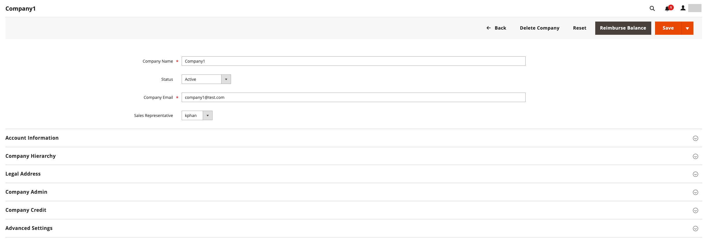

# Bedrijfsaccounts beheren

De _[!UICONTROL Companies]_op de pagina worden alle accounts van het huidige bedrijf weergegeven, ongeacht de status. Eventuele lopende goedkeuringsaanvragen staan boven aan de lijst. De norm [besturingselementen voor werkplek](../getting-started/admin-workspace.md) kan worden gebruikt om de lijst te filteren, de [kolomindeling](../getting-started/admin-grid-controls.md), slaat weergaven op of exporteert gegevens.

De _[!UICONTROL Actions]_de controle boven het net kan worden gebruikt om een actie op veelvoudige bedrijfsverslagen toe te passen. In plaats van bijvoorbeeld elk afzonderlijk bedrijfsverzoek goed te keuren, kunt u meerdere verzoeken selecteren en de accounts in één actie activeren. Welke acties beschikbaar zijn, is afhankelijk van de [machtigingen](../systems/permissions.md) voor de rol die aan uw Admin gebruikersrekening wordt toegewezen.

Gebruik de _[!UICONTROL Search]_functie om bedrijven te vinden in de **Bedrijven**raster op trefwoord. Het bedrijf wordt gevonden door het opgegeven trefwoord te zoeken in het dialoogvenster **Bedrijfsnaam**en **Bovenliggend**kolommen. U kunt filteren op **Bedrijfstype**om moederondernemingen en hun verbonden ondernemingen te tonen, of alleen kinderbedrijven te laten zien.

{width="700" zoomable="yes"}

## Bronnen voor bedrijfsrollen

De [Rolresources](../systems/permissions-user-roles.md#role-resources) de instellingen bepalen de mogelijkheid om:

- Een bedrijf toevoegen
- Een bedrijf verwijderen
- Saldo-terugbetaling toepassen
- Bedrijven weergeven

Deze rollenbronnen moeten worden ingesteld voor de [Gebruikersrol](../systems/permissions-user-roles.md) die is toegewezen voor de Admin-gebruikersaccount.

## Een handeling toepassen

De volgende handelingen kunnen op één of meerdere records worden toegepast.

1. Op de _Beheerder_ zijbalk, ga naar **[!UICONTROL Customers]** > **[!UICONTROL Companies]**.

1. Selecteer in de eerste kolom van het raster het selectievakje van elke record die u wilt bijwerken en volg de instructies voor de actie die u wilt toepassen:

### Bedrijfsaccounts activeren

1. Stel de **[!UICONTROL Actions]** controle op `Set Active`.

1. Klik wanneer u wordt gevraagd om te bevestigen **[!UICONTROL OK]**.

### Actief/inactief instellen

Klanten met inactieve accounts kunnen zich niet aanmelden bij of aankopen doen bij hun accounts. Er zijn twee methoden om een klantenaccount in te stellen als actief of inactief:

Methode 1: **Van het klantennet**

1. Op de _Beheerder_ zijbalk, ga naar [!UICONTROL **Klanten**] > [!UICONTROL **Alle klanten**].

1. Stel de [!UICONTROL **Handelingen**] de controle op een van de volgende punten:

   - `Active`
   - `Inactive`

1. Klik wanneer u wordt gevraagd om te bevestigen **[!UICONTROL OK]**.

Methode 2: **Vanaf de pagina voor accountbewerking**

1. Op de _Beheerder_ zijbalk, ga naar [!UICONTROL **Klanten**] > [!UICONTROL **Alle klanten**].

1. Zoek in het raster het klantrecord dat u wilt bewerken.

1. In de _Handelingen_ kolom uiterst rechts, klik [!UICONTROL **Bewerken**].

1. Selecteer de [!UICONTROL **Accountinformatie**] tab.

1. Set [!UICONTROL **Klant actief**] tot `Yes` of `No`.

1. Klikken [!UICONTROL **Klant opslaan**].

### Zakelijke accounts blokkeren

Gebruikers die zijn gekoppeld aan een geblokkeerd bedrijfsaccount kunnen zich aanmelden en toegang krijgen tot de catalogus, maar kunnen geen aankopen doen. Een bedrijf met een rekening die niet in goede staat is kan tijdelijk worden geblokkeerd totdat de kwestie is opgelost.

1. Stel de **[!UICONTROL Actions]** controle op `Block`.

1. Klik wanneer u wordt gevraagd om te bevestigen **[!UICONTROL OK]**.

### Bedrijfsaccounts verwijderen

Verwijderde bedrijfsaccounts kunnen niet worden hersteld. De status van gebruikersaccounts die aan het bedrijf zijn gekoppeld, is ingesteld op `Inactive` en de bedrijfs-id wordt verwijderd uit de profielen van gebruikersaccounts. Informatie over bedrijfsactiviteiten en transacties wordt in het systeem bewaard.

1. Stel de **[!UICONTROL Actions]** controle op `Delete`.

1. Klik wanneer u wordt gevraagd om te bevestigen **[!UICONTROL OK]**.

### De creditvaluta converteren

Het krediet in de rekeningen van geselecteerde ondernemingen wordt omgezet in de actuele koers van de geselecteerde valuta.

1. Stel de **[!UICONTROL Actions]** controle op `Convert Currency`.

1. Klik wanneer u wordt gevraagd om te bevestigen **[!UICONTROL OK]**.

1. Kies de optie **[!UICONTROL Credit Currency]** te gebruiken voor de geselecteerde bedrijfsrekeningen.

   De bedragen worden herberekend volgens de huidige omrekeningskoersen, indien beschikbaar. Als deze optie niet beschikbaar is, kunt u handmatig aangepaste conversiesnelheden invoeren. Het systeem geeft zoveel conversieberekeningen weer als nodig zijn voor de creditvaluta die door de geselecteerde bedrijven wordt gebruikt.

1. Klikken **[!UICONTROL Proceed]** om de conversie te voltooien.

### Een bedrijfsaccount bewerken

Methode 1: **Snel bewerken**

1. Selecteer in de eerste kolom het selectievakje van de bedrijfsaccount die u wilt bewerken.

1. Stel de **[!UICONTROL Actions]** kolom naar `Edit`.

   Elke waarde die kan worden bijgewerkt, verschijnt in een tekstvak.

   {width="700" zoomable="yes"}

1. Werk een van de volgende waarden naar wens bij:

   - **[!UICONTROL Company Name]**

   - **[!UICONTROL Company Email]**

   - **[!UICONTROL Phone Number]**

1. Klik op **[!UICONTROL Save]**.

Methode 2: **Volledig bewerken**

1. Zoek in het raster het bedrijfsrecord dat moet worden bewerkt.

1. Klikken **[!UICONTROL Edit]** in de _[!UICONTROL Action]_kolom.

1. Breng de benodigde wijzigingen aan in de bedrijfsinformatie.

Zie voor veldbeschrijvingen [Een bedrijfsaccount maken](account-company-create.md).

1. Klik op **[!UICONTROL Save]**.

## Een vertegenwoordiger toewijzen

De verkoper is een [Admin user](../systems/permissions.md) die als contactpunt voor een bedrijfsrekening wordt toegewezen en alle geautomatiseerde [e-mailberichten](../b2b/enable-basic-features.md#configure-company-email-options) verbonden met de onderneming. Per bedrijfsrekening kan slechts één vertegenwoordiger worden aangesteld, maar één enkele vertegenwoordiger kan meerdere bedrijfsrekeningen beheren. De standaardgebruikersaccount voor Admin wordt toegewezen als de vertegenwoordiger van de verkoper, tenzij een andere Admin-gebruiker wordt toegewezen.

De naam en het e-mailadres van de toegewezen vertegenwoordiger zijn voor de leden van het bedrijf zichtbaar vanaf de pagina met bedrijfsaccounts en aanhalingstekens.

1. Op de _Beheerder_ zijbalk, ga naar **[!UICONTROL Customers]** > **[!UICONTROL Companies]**.

1. Zoek het bedrijf in het raster en open de bewerkingsmodus.

1. Set **[!UICONTROL Sales Representative]** aan de Admin-gebruiker die u als contactpunt voor het bedrijf wilt toewijzen.

1. Klik op **[!UICONTROL Save]**.

   De toegewezen verkoper ontvangt een e-mailmelding van de toewijzing.

## Een bedrijfsprofiel bijwerken

Het bedrijfsprofiel kan van de winkel door de bedrijfbeheerder, en ook van Admin door een opslagbeheerder worden gehandhaafd.

{width="700" zoomable="yes"}

1. Op de _Beheerder_ zijbalk, ga naar **[!UICONTROL Customers]** > **[!UICONTROL Companies]**.

1. Zoek het bedrijf in het raster en klik op **[!UICONTROL Edit]** in de _[!UICONTROL Action]_kolom.

1. Werk de veldwaarden in elke sectie zo nodig bij met de veldbeschrijvingen ter referentie.

1. Klik op **[!UICONTROL Save]**.

## Bedrijfsaccountdemo

U kunt meer leren over het beheren van bedrijfsaccounts door naar deze video te kijken:

>[!VIDEO](https://video.tv.adobe.com/v/344447?quality=12)

## Bedrijfsbeheer

[!BADGE 1.5.0-bèta]{type=Informative url="/help/b2b/release-notes.md" tooltip="Alleen beschikbaar voor deelnemers aan het bètaprogramma"}

Nadat een bedrijf is gemaakt, kunnen Admin-gebruikers met de juiste machtigingen de opdracht [!UICONTROL Company Hierarchy] een afdeling om een moederonderneming te bouwen door de aangewezen moedermaatschappij te bewerken en daarmee verbonden ondernemingen toe te wijzen.

Als een bedrijf aan een hiërarchie is toegevoegd, [!UICONTROL Company Hierarchy] het net toont het moederbedrijf en alle toegewezen bedrijven in het net.

Zie [Bedrijfshiërarchie beheren](assign-companies.md) voor meer informatie .

## Bedrijfsopties en -kolommen

In de volgende secties vindt u een verwijzing naar de beschikbare acties, opties en weergegeven informatie die beschikbaar is voor het beheer van bedrijfsaccounts.

### Handelingenbesturingsopties

| Optie | Beschrijving |
|--- |--------------------------------------------------------------------------------------------------------------------------------------------------------------------------------------------------------------------------------------------------------------------------------|
| [!UICONTROL Set Active] | Hiermee wordt de status van alle geselecteerde bedrijfsrecords ingesteld op `Active`. De beheerders van het bedrijf ontvangen instructies om hun wachtwoorden te plaatsen zodat kunnen zij tot hun rekeningen toegang hebben en hun bedrijven van de winkel beheren. |
| [!UICONTROL Block] | Beperkt bedrijfsrekeningen die niet in goede staat zijn, terwijl het bewaren van de rekening. De leden van het bedrijf kunnen login en tot de catalogus toegang hebben, maar zij kunnen geen orden namens het bedrijf plaatsen. |
| [!UICONTROL Delete] | Hiermee verwijdert u geselecteerde bedrijfsaccounts. De status van gebruikersaccounts die aan een verwijderd bedrijf zijn gekoppeld, is ingesteld op `Inactive` en de bedrijfs-id wordt verwijderd uit de profielen van gebruikersaccounts. Informatie over bedrijfsactiviteiten en transacties wordt in het systeem bewaard. |
| [!UICONTROL Edit] | Hiermee kunnen bepaalde waarden van het geselecteerde bedrijfsrecord worden bewerkt in het raster. Standaard zijn de waarden Bedrijfsnaam, E-mail van het bedrijf en Telefoonnummer beschikbaar voor een snelle bewerking. |
| [!UICONTROL Convert Credit] | Hiermee wordt het krediet voor de geselecteerde ondernemingen geconverteerd naar de koers van de opgegeven valuta. |

{style="table-layout:auto"}

### Kolombeschrijvingen

#### Standaardkolomindeling

| Kolom | Beschrijving |
|-----------------------------------|--------------------------------------------------------------------------------------------------------------------------------------------------------------------------------------------------------------------------------------------------------------------------------------------------------------------------------------------------------------------------------------------------------------------------------------------------------------------------|
| [!UICONTROL Select] | Schakel selectievakjes in om bedrijfsrecords te selecteren die het onderwerp van een handeling moeten zijn of gebruik het selectiegereedschap in de kolomkop om alles in of uit te schakelen. |
| [!UICONTROL ID] | Een unieke numerieke id die wordt toegewezen wanneer het verzoek om een bedrijf te maken wordt ingediend. |
| [!UICONTROL Company Name] | De bedrijfsnaam wordt ingevoerd wanneer het bedrijfsaccount voor het eerst wordt gemaakt en kan een verkorte versie van de volledige juridische naam zijn. |
| [!UICONTROL Company Type] | Het type van [bedrijf](manage-companies.md). Opties:  **[!UICONTROL Company]**- Nieuwe ondernemingen worden standaard als afzonderlijke ondernemingen opgericht. **[!UICONTROL Parent]** - De onderneming is een moedermaatschappij van andere ondernemingen.  **[!UICONTROL Child]**- Deze onderneming is verbonden met een moedermaatschappij. |
| [!UICONTROL Parent] | Toont het moederbedrijf voor deze specifieke bedrijfslijn. |
| [!UICONTROL Company Email] | Het e-mailadres dat aan het bedrijfsaccount is gekoppeld. |
| [!UICONTROL Phone Number] | Het primaire telefoonnummer van het bedrijf. |
| [!UICONTROL Country] | Het land waar de onderneming is geregistreerd om zaken te doen. |
| [!UICONTROL State Province] | De staat of provincie waar het bedrijf is geregistreerd om zaken te doen. |
| [!UICONTROL City] | De stad waar de onderneming is geregistreerd om zaken te doen. |
| [!UICONTROL Group/Shared Catalog] | De kolomnaam hangt af van of de Gedeelde Catalogus in de configuratie wordt toegelaten. Opties:  **[!UICONTROL Customer Group]**- Als Gedeelde Catalogus niet in de configuratie wordt toegelaten, specificeert de naam van [klantengroep](../customers/customer-groups.md) waarvan de onderneming deel uitmaakt. **[!UICONTROL Shared Catalog]** - Als Gedeelde Catalogus in de configuratie wordt toegelaten, specificeert de naam van de gedeelde catalogus die aan de klant wordt toegewezen. |
| [!UICONTROL Outstanding Balance] | Het uitstaande saldo op de bedrijfsrekening. de kolom is leeg als de onderneming geen kredietgeschiedenis heeft en haar kredietlimiet nul is. |
| [!UICONTROL Company Admin] | De voornaam en achternaam van de bedrijfsbeheerder. |
| [!UICONTROL Job Title] | De functie van de bedrijfbeheerder. |
| [!UICONTROL Email] | Het e-mailadres van de bedrijfsbeheerder. |
| [!UICONTROL Action] | **[!UICONTROL Edit]** - Opent het bedrijfsaccount in de bewerkingsmodus. |

{style="table-layout:auto"}

#### Aanvullende kolommen

De volgende kolommen zijn beschikbaar door de [kolomindeling](../getting-started/admin-grid-controls.md) van het raster.

| Kolom | Beschrijving |
|---------------------------------|--------------------------------------------------------------------------------------------------------------------------------------------------------------------------------------------------------------------------------------------------------------------------------------------------------------------------------------------------------------------------------------------------------------------------------------------------------------------------------------------------------------------------------------------------------------------------------------------------------------------------------------------------------------------------------------------------------------------------------------------------------------------------------------------------------------------------------------------------------------------------------------------------------------------------------------------------------|
| [!UICONTROL Company Legal Name] | De volledige wettelijke naam van de onderneming. |
| [!UICONTROL Street Address] | Het adres van de straat waar de onderneming is geregistreerd om zaken te doen. |
| [!UICONTROL ZIP] | De postcode of postcode waar de onderneming geregistreerd is om zaken te doen. |
| [!UICONTROL Reseller ID] | Het wederverkoopnummer dat aan de onderneming wordt toegekend voor belastingverslagleggingsdoeleinden. |
| [!UICONTROL VAT/TAX ID] | De [belasting over toegevoegde waarde](../stores-purchase/vat.md) nummer dat door sommige rechtsgebieden aan de onderneming wordt toegekend voor belastingrapportagedoeleinden. Om de klant BTW/BELASTINGidentiteitskaart te vormen om in de winkel te verschijnen, zie [Nieuwe accountopties maken](../configuration-reference/customers/customer-configuration.md). |
| [!UICONTROL Credit Limit] | De kredietlimiet die tot de bedrijfsrekening wordt uitgebreid. |
| [!UICONTROL Credit Currency] | De valuta die door de winkel wordt geaccepteerd voor aankopen op bedrijfskrediet. |
| [!UICONTROL Status] | Hiermee wordt de [status](account-company-approve.md) van de bedrijfsrekening. Opties:  **[!UICONTROL Active]**- De bedrijfsaccount wordt goedgekeurd door de beheerder van de winkel. De bedrijfsbeheerder en geassocieerde leden kunnen zich bij de winkel aanmelden en aankopen doen. **[!UICONTROL Pending Approval]** - Er is een verzoek ingediend om een bedrijfsaccount te openen, maar dit is nog niet goedgekeurd door de beheerder van de winkel.  **[!UICONTROL Rejected]**- Een verzoek om een bedrijfsaccount te openen is ingediend, maar niet goedgekeurd door de beheerder van de winkel. De initiële aanmeldingsgegevens die zijn gebruikt om het verzoek in te dienen, worden geblokkeerd. **[!UICONTROL Blocked]** - Bedrijfsleden kunnen zich aanmelden en toegang krijgen tot de catalogus, maar kunnen geen aankopen doen. De opslagbeheerder zou een bedrijfrekening kunnen blokkeren die niet in goede staat is. Het blok op de rekening kan door de opslagbeheerder op elk ogenblik worden verwijderd. |
| [!UICONTROL Gender] | Het geslacht van de bedrijfsbeheerder. Opties: Mannelijk / Vrouwelijk / Niet opgegeven |
| [!UICONTROL Comment] | Opmerkingen over de bedrijfsaccount ter referentie en zijn alleen zichtbaar vanuit de beheerder. |

{style="table-layout:auto"}

### Knopbalk

| Knop | Beschrijving |
|--------------------------------|---------------------------------------------------------------------------------------------------------------------------------------------------------------------------------------------------------------------------------------------------------------------|
| [!UICONTROL Back] | Hiermee gaat u terug naar de pagina Companies zonder de wijzigingen op te slaan. |
| [!UICONTROL Login as Customer] | Hiermee kan een Admin-gebruiker [aanmelden bij de winkel als klant](../customers/login-as-customer.md) en hulp bij hun bestellingen. |
| [!DNL Delete Company] | Hiermee verwijdert u het bedrijfsaccount. De status van gebruikersaccounts die aan het bedrijf zijn gekoppeld, is ingesteld op `Inactive` en de bedrijfs-id wordt verwijderd uit de profielen van gebruikersaccounts. Informatie over bedrijfsactiviteiten en transacties wordt in het systeem bewaard. |
| [!DNL Reset] | Hiermee herstelt u de oorspronkelijke waarden in alle velden met niet-opgeslagen wijzigingen. |
| [!DNL Reimburse Balance] | Staat de beheerder toe om het saldo van opslagkrediet terug te betalen, dat door het aantal van de PO wordt van verwijzingen voorzien. |
| [!DNL Save] | Hiermee slaat u wijzigingen op in het bedrijf en houdt u het profiel open. |
| [!UICONTROL Save & Close] | Hiermee slaat u wijzigingen op in het bedrijf en sluit u het profiel. |

{style="table-layout:auto"}

### Veldomschrijvingen

| Veld | Beschrijving |
|-----------------------------------|--------------------------------------------------------------------------------------------------------------------------------------------------------------------------------------------------------------------------------------------------------------------------------------------------------------------------------------------------------------------------------------------------------------------------------------------------------------------------------------------------------------------------------------------------------------------------------------------------------------------------------------------------------------------------------------------------------------------------------------------------------------------------------------------------------------------------------------------------------------------------------------------------------------------------------------------------------|
| [!UICONTROL Company Name] | De bedrijfsnaam wordt ingevoerd wanneer het bedrijfsaccount voor het eerst wordt gemaakt en kan een verkorte versie van de volledige juridische naam zijn. |
| [!UICONTROL Status] | Hiermee wordt de [status](account-company-approve.md) van de bedrijfsrekening. Opties:  **[!UICONTROL Active]**- De bedrijfsaccount wordt goedgekeurd door de beheerder van de winkel. De bedrijfsbeheerder en geassocieerde leden kunnen zich bij de winkel aanmelden en aankopen doen. **[!UICONTROL Pending Approval]** - Er is een verzoek ingediend om een bedrijfsaccount te openen, maar dit is nog niet goedgekeurd door de beheerder van de winkel.  **[!UICONTROL Rejected]**- Een verzoek om een bedrijfsaccount te openen is ingediend, maar niet goedgekeurd door de beheerder van de winkel. De initiële aanmeldingsgegevens die zijn gebruikt om het verzoek in te dienen, worden geblokkeerd. **[!UICONTROL Blocked]** - Bedrijfsleden kunnen zich aanmelden en toegang krijgen tot de catalogus, maar kunnen geen aankopen doen. De opslagbeheerder zou een bedrijfrekening kunnen blokkeren die niet in goede staat is. Het blok op de rekening kan door de opslagbeheerder op elk ogenblik worden verwijderd. |
| [!UICONTROL Company Email] | Het e-mailadres dat aan het bedrijfsaccount is gekoppeld. |
| [!UICONTROL Sales Representative] | De Admin-gebruiker die de primaire contactpersoon voor het bedrijfsaccount is. |

{style="table-layout:auto"}

#### [!UICONTROL Account Information]

| Veld | Beschrijving |
|---------------------------------|----------------------------------------------------------------------------------------------------------------------------|
| [!UICONTROL Company Legal Name] | De volledige wettelijke naam van de onderneming. |
| [!UICONTROL VAT / TAX ID] | de belasting of [belasting over toegevoegde waarde](../stores-purchase/vat.md) nummer dat aan de onderneming is toegekend voor belastingrapportagedoeleinden. |
| [!UICONTROL Reseller ID] | Het wederverkoopnummer dat aan de onderneming wordt toegekend voor belastingverslagleggingsdoeleinden. |
| [!UICONTROL Comment] | Deze opmerkingen over de bedrijfsaccount zijn ter referentie en zijn alleen zichtbaar vanuit de beheerder. |
| **[!UICONTROL Legal Address]** |                                                                                                                            |
| [!UICONTROL Street Address] | Het adres van de straat waar de onderneming is geregistreerd om zaken te doen. |
| [!UICONTROL City] | De stad waar de onderneming is geregistreerd om zaken te doen. |
| [!UICONTROL Country] | Het land waar de onderneming is geregistreerd om zaken te doen. |
| [!UICONTROL State/Province] | De staat of provincie waar het bedrijf is geregistreerd om zaken te doen. |
| [!UICONTROL ZIP/Postal Code] | De postcode of postcode waar de onderneming geregistreerd is om zaken te doen. |
| [!UICONTROL Phone Number] | Het primaire telefoonnummer van het bedrijf. |

{style="table-layout:auto"}

#### [!UICONTROL Company Hierarchy]

[!BADGE 1.5.0-bèta]{type=Informative url="/help/b2b/release-notes.md" tooltip="Alleen beschikbaar voor deelnemers aan het bètaprogramma"}

| Kolommen | Beschrijving |
|-----------------------------|------------------------------------------------------------------------------------------------------------------------------------------------------|
| [!UICONTROL Company ID] | Het ID-nummer van het bedrijf. |
| [!UICONTROL Company Name] | De volledige naam van de onderneming.  A `current company indicator` wordt weergegeven in de bedrijfsregel die wordt bewerkt. |
| [!UICONTROL Company Email] | Het e-mailadres dat aan het bedrijfsaccount is gekoppeld. |
| [!UICONTROL Phone Number] | Het primaire telefoonnummer van het bedrijf. |
| [!UICONTROL State/Province] | De staat of provincie waar het bedrijf is geregistreerd om zaken te doen. |
| [!UICONTROL City] | De stad waar de onderneming is geregistreerd om zaken te doen. |
| [!UICONTROL Customer Group] | (Alleen beheerder) Hiermee wordt de instelling [klantengroep](../customers/customer-groups.md) of [gedeelde catalogus](catalog-shared.md) die aan het bedrijf wordt toegewezen. |
| [!UICONTROL Company Admin] | De volledige naam van de bedrijfbeheerder. |
| [!UICONTROL Action] | De lijst van mogelijke acties voor die bedrijfslijn. |

{style="table-layout:auto"}

#### [!UICONTROL Company Admin]

| Veld | Beschrijving |
|----------------------------------|--------------------------------------------------------------------------------------------------------------------------------------------------------------------------------------------------------------------------------------------------|
| [!UICONTROL Job Title] | De titel van de bedrijfsbeheerder die de bedrijfsaccount beheert. |
| [!UICONTROL Email] | Het e-mailadres van de bedrijfsbeheerder kan hetzelfde zijn als het e-mailadres van het bedrijf. Als u een ander e-mailadres opgeeft, wordt naast het bedrijfsaccount een aparte account voor de beheerder van het bedrijf gemaakt. |
| [!UICONTROL Prefix] | Indien van toepassing, het voorvoegsel dat met de naam van de bedrijfbeheerder (zoals `Mr.`, `Ms.`, `Mrs.`, of `Dr.`). Afhankelijk van de configuratie kan het invoerveld een tekstveld of lijst zijn. |
| [!UICONTROL First Name] | De voornaam van de bedrijfbeheerder. |
| [!UICONTROL Middle Name/Initial] | De middelste naam of de aanvankelijke naam van de bedrijfbeheerder. |
| [!UICONTROL Last Name] | De achternaam van de bedrijfsbeheerder. |
| [!UICONTROL Suffix] | Indien van toepassing, het achtervoegsel dat met de naam van de bedrijfbeheerder (zoals `Jr.`, `Sr.`, of `III`). Afhankelijk van de configuratie kan het invoerveld een tekstveld of lijst zijn. |
| [!UICONTROL Gender] | Het geslacht van de bedrijfsbeheerder. Opties: `Male` / `Female` / `Not Specified` |

{style="table-layout:auto"}

#### [!UICONTROL Company Credit]

| Veld | Beschrijving |
|-------------------------------------------|----------------------------------------------------------------------------------------------------------------------------------------------------------------------------|
| [!UICONTROL Credit Currency] | De valuta die door de winkel wordt geaccepteerd voor aankopen op bedrijfskrediet. |
| [!UICONTROL Credit Limit] | De kredietlimiet die tot de bedrijfsrekening wordt uitgebreid. |
| [!UICONTROL Allow to Exceed Credit Limit] | Geeft aan of de onderneming toestemming heeft om de kredietlimiet te overschrijden. Opties: Ja/Nee |
| [!UICONTROL Reason for Change] | Een opmerking die verklaart waarom de onderneming de kredietlimiet mag of mag overschrijden. Dit veld is alleen actief als de toestemming om de kredietlimiet te overschrijden wordt gewijzigd. |

{style="table-layout:auto"}

#### [!UICONTROL Advanced Settings]

| Veld | Beschrijving |
|-----------------------------------------|------------------------------------------------------------------------------------------------------------------------------------------------------------------------------------------------------|
| [!UICONTROL Customer Group] | Hiermee wordt de [klantengroep](../customers/customer-groups.md) of [gedeelde catalogus](catalog-shared.md) die aan het bedrijf wordt toegewezen. |
| [!UICONTROL Allow Quotes] | Hiermee wordt bepaald of leden van het bedrijf namens de onderneming verhandelbare noteringen kunnen opstellen en indienen. |
| [!UICONTROL Enable Purchase Orders] | Hiermee wordt bepaald of inkooporders zijn toegestaan voor het bedrijf. Voor kooporders om voor de rekeningen van het bedrijflid te functioneren, moet de bedrijfbeheerder deze eigenschap op de opslagplaats ook toelaten. |
| [!UICONTROL Applicable Payment Methods] | Geeft de betalingsmethoden aan die beschikbaar zijn voor aankopen door bedrijven. Opties: `B2B Payment Methods` / `All Enabled Payment Methods` / `Specific Payment Methods` |
| [!UICONTROL Payment Methods] | (Alleen beheerder) Wordt actief als specifieke betalingsmethoden worden aangegeven. Als u meerdere betalingsmethoden wilt selecteren, houdt u Ctrl (PC) of Command (Mac) ingedrukt en klikt u op elke optie. |

{style="table-layout:auto"}
