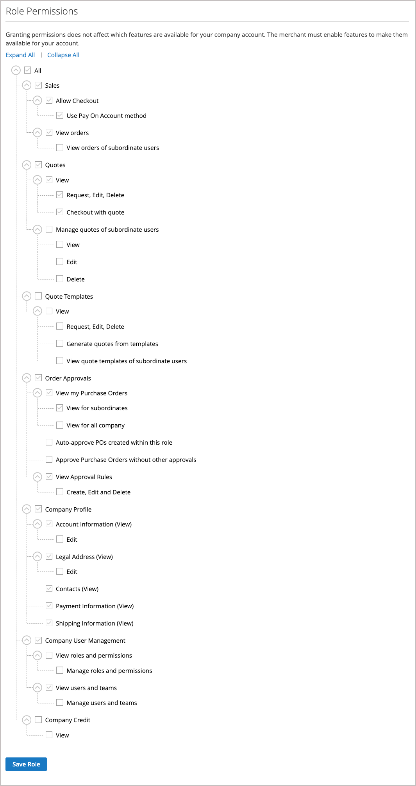

# Company Roles and Permissions

Roles for company users are set up with various levels of permission to access sales information and resources. __ De [ Ontkende Toegang ](../content-design/pages.md#access-denied) pagina verschijnt als de gebruiker geen toestemming heeft om tot de pagina toegang te hebben.

{width="700" zoomable="yes"}

__ You can create as many roles as necessary to match your company structure and organizational responsibilities, such as the following:

- ****

- ****

- ****__

## Rollen en machtigingen beheren

1. De bedrijfbeheerder ondertekent binnen aan hun opslagrekening.

1. Kies **[!UICONTROL Roles and Permissions]** in het linkerdeelvenster.

1. Completes any of the following tasks.

### Create a role

1. Klik op **[!UICONTROL Add New Role]** .

   {width="600" zoomable="yes"} toe

1. Hiermee wordt een beschrijvende waarde **[!UICONTROL Role Name]** ingevoerd.

1. Voer onder _[!UICONTROL Role Permissions]_een van de volgende handelingen uit:

   - Selecteert checkbox van elk middel of activiteit dat de gebruikers de rol toewezen toestemming hebben om tot toegang te hebben.

   - Selecteert checkbox **[!UICONTROL All]** en ontruimt checkbox van elke middel of activiteit dat de gebruikers aan de rol toegewezen geen toestemming hebben om toegang te hebben.

1. **[!UICONTROL Save Role]**

1. Creates as many roles as necessary by repeating these steps.

### Modify a role

1. **[!UICONTROL Edit]**_[!UICONTROL Actions]_

1. Hiermee wijzigt u de benodigde naam- en machtigingsinstellingen.

1. **[!UICONTROL Save Role]**

### Duplicate a role

1. **[!UICONTROL Duplicate]**_[!UICONTROL Actions]_

1. Makes the necessary changes to the name and permission settings.

1. **[!UICONTROL Save Role]**

### Delete a role

1. De bedrijfbeheerder vindt de rol die in de lijst van rollen moet worden geschrapt.

   Alleen rollen zonder toegewezen gebruikers kunnen worden verwijderd.

1. **[!UICONTROL Delete]**_[!UICONTROL Actions]_

1. **[!UICONTROL OK]**

## Actions

| Handeling | Beschrijving |
|-----------| ----------- |
| [!UICONTROL Duplicate] | Hiermee maakt u een kopie van de geselecteerde rol. De naam van de gedupliceerde rol is `- Duplicated` aan het einde toegevoegd. |
| [!UICONTROL Edit] | Wijzig de naam en/of set machtigingen. |
| [!UICONTROL Delete] | Verwijder de rol. Alleen rollen zonder toegewezen gebruikers kunnen worden verwijderd. |

{style="table-layout:auto"}

## Role permissions

[!UICONTROL Edit action]****

{width="700" zoomable="yes"}

## Een rol toewijzen aan een bedrijfsgebruiker

Na het bepalen van de rollen die nodig zijn, wijst de bedrijfbeheerder een rol aan elke bedrijfgebruiker toe.

1. Logs in to their company account as the company administrator.

1. Kies **[!UICONTROL Company Users]** in het linkerdeelvenster.

   {width="700" zoomable="yes"}

1. **[!UICONTROL Edit]**

1. **[!UICONTROL User Role]**

   {width="700" zoomable="yes"}

1. Klik op **[!UICONTROL Save]** .
