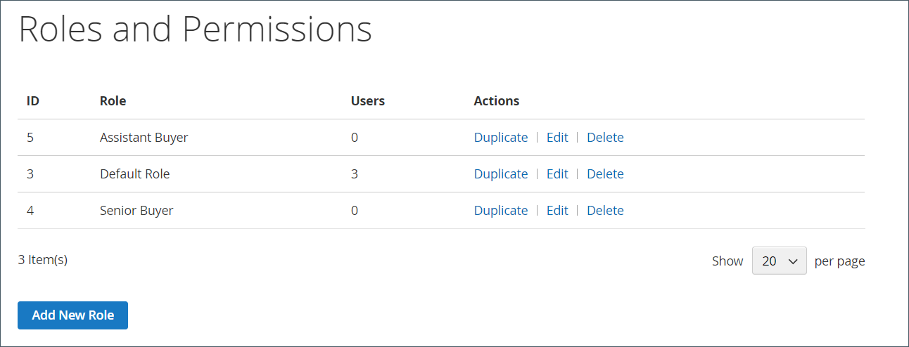

# Bedrijfsrollen en -machtigingen

U plaatst opstellingsrollen voor bedrijfgebruikers met diverse niveaus van toestemming om tot verkoopinformatie en middelen toegang te hebben. Door gebrek, is de bedrijfbeheerder a *super gebruiker* met volledige toestemmingen. De [ Ontkende Toegang ](../content-design/pages.md#access-denied) pagina verschijnt als een gebruiker geen toestemming heeft om tot de pagina toegang te hebben.

{width="700" zoomable="yes"}

Het systeem heeft één vooraf bepaalde rol van de Gebruiker Standaard, die u *kunt gebruiken zoals* is of zich wijzigt om uw behoeften aan te passen. U kunt zo vele rollen tot stand brengen zonodig om uw bedrijfsstructuur en organisatorische verantwoordelijkheden, zoals het volgende aan te passen:

- **StandaardGebruiker** - de standaardgebruiker heeft volledige toegang tot activiteiten met betrekking tot verkoop en citaten, en mening-slechts toegang tot het bedrijfsprofiel en kredietinformatie.

- **Hogere Koper** — Een hogere koper zou toegang tot alle Verkoop en Citaten middelen, en mening-slechts toestemmingen aan het Profiel van het Bedrijf, Gebruikers en Teams, de Informatie van de Betaling, en het Krediet van het Bedrijf kunnen hebben.

- **HulpKoper** - een hulpkoper zou toestemming kunnen hebben om een orde te plaatsen gebruikend **[!UICONTROL Checkout with quote]**, en orden, citaten, en informatie in het bedrijfsprofiel te bekijken.

## Rollen en machtigingen beheren

Beheer bedrijfsrollen van de de opslagrekening van de bedrijfbeheerder.

**om Rollen en Toestemmingen te openen:**

1. Meld u aan bij de winkel als bedrijfsbeheerder.

1. Selecteer **[!UICONTROL Roles and Permissions]** in het linkerdeelvenster.

1. Voer een van de volgende taken uit.

### Een rol maken

1. Klik op **[!UICONTROL Add New Role]**.

   {width="600" zoomable="yes"} toe

1. Voer een beschrijving in **[!UICONTROL Role Name]** .

1. Voer onder **[!UICONTROL Role Permissions]** een van de volgende handelingen uit:

   - Schakel het selectievakje in van elke bron of activiteit waartoe gebruikers die aan de rol zijn toegewezen toegang hebben.

   - Schakel het selectievakje **[!UICONTROL All]** in en schakel het selectievakje uit van elke bron of activiteit waartoe gebruikers die aan de rol zijn toegewezen, geen toegangsrechten hebben.

1. Klik op **[!UICONTROL Save Role]**.

1. Herhaal deze stappen om zoveel rollen te maken als u nodig hebt.

### Een rol wijzigen

1. Zoek de rol die u wilt wijzigen en klik op **[!UICONTROL Edit]** in de kolom **[!UICONTROL Actions]** .

1. Breng de gewenste wijzigingen aan in de instellingen voor naam en machtigingen.

1. Klik op **[!UICONTROL Save Role]** als u klaar bent.

### Een rol dupliceren

1. Zoek de rol die u wilt dupliceren en klik op **[!UICONTROL Duplicate]** in de kolom **[!UICONTROL Actions]** .

1. Breng de gewenste wijzigingen aan in de instellingen voor naam en machtigingen.

1. Klik op **[!UICONTROL Save Role]** als u klaar bent.

### Een rol verwijderen

1. Zoek in de lijst met rollen naar de rol die u wilt verwijderen.

   Alleen rollen zonder toegewezen gebruikers kunnen worden verwijderd.

1. Klik op **[!UICONTROL Delete]** in de kolom **[!UICONTROL Actions]** .

1. Klik op **[!UICONTROL OK]** wanneer u wordt gevraagd om te bevestigen.

## Handelingen in de rollijst {#actions}

| Actie | Beschrijving |
| --- | --- |
| [!UICONTROL Duplicate] | Hiermee maakt u een kopie van de geselecteerde rol. De naam van de gedupliceerde rol is `- Duplicated` aan het einde toegevoegd. |
| [!UICONTROL Edit] | Wijzigt de naam en rechtenset. |
| [!UICONTROL Delete] | Hiermee verwijdert u de rol. Alleen rollen zonder toegewezen gebruikers kunnen worden verwijderd. |

{style="table-layout:auto"}

## Rolmachtigingen

B2B-mogelijkheden worden opgehaald door **toestemmingen** (ACL middelen). Wanneer een bedrijfgebruiker een pagina opent of een actie op de storefront in werking stelt, controleert de toepassing of hun rol de vereiste toestemming omvat.

Bedrijfsbeheerders kunnen de machtigingsconfiguratie voor een rol bijwerken door **[!UICONTROL Edit]** te selecteren en vervolgens machtigingen in de lijst **[!UICONTROL Role Permissions]** te selecteren of te wissen.

{width="700" zoomable="yes"}

Wijs deze middelen toe wanneer u **creeert of een bedrijfrol** in de bedrijfrekening uitgeeft. Gebruikers met toestemming om rollen te beheren, kunnen het rolinform openen en de machtigingsstructuur instellen.

Rolmachtigingen worden geordend in een boomstructuur, met hoofdopties en ondergeschikte opties. Als u een hoofdoptie selecteert, worden automatisch alle onderliggende opties geselecteerd. Als u een hoofdoptie wist, worden alle onderliggende opties automatisch gewist. U kunt onderliggende opties ook afzonderlijk selecteren of wissen.

### Alle machtigingen

| Machtigingslabel | Beschrijving |
| --- | --- |
| Alles | De knoop van de wortel voor **alle** toestemmingen die aan deze storefront rol worden toegewezen. |

### Verkoopmachtigingen

| Machtigingslabel | Beschrijving |
| --- | --- |
| Verkoop | Bovenliggend element voor afhandeling en zichtbaarheid van bestellingen voor zakelijke gebruikers. |
| Afhandeling toestaan | Plaats bestellingen bij de kassa. |
| De methode Betalen op account gebruiken | Het gebruik **betaalt op Rekening** (bedrijfskrediet) bij controle wanneer het beschikbaar is. |
| Bestellingen weergeven | Bekijk de eigen bestellingen van de gebruiker. |
| Bestellingen van ondergeschikte gebruikers weergeven | De orden van de mening die door gebruikers onder deze gebruiker in de hiërarchie worden geplaatst. |

### Aanhalingstekenmachtigingen

De knoop van de ouder in de boom van de bedrijftoestemming: **Citaten**.

| Machtigingslabel | Beschrijving |
| --- | --- |
| Aanhalingen | Bovenliggend element voor archiefront onderhandelbare prijsacties. |
| Weergeven (aanhalingstekens) | Geef verhandelbare aanhalingstekens weer. |
| Aanvragen, bewerken, verwijderen | Nieuwe aanhalingstekens aanvragen, aanhalingstekens bewerken en aanhalingstekens verwijderen volgens de bedrijfsregels. |
| Afhandeling met aanhalingsteken | Voltooi de afhandeling met een goedgekeurd prijsopgave. |
| Aanhalingstekens van onderliggende gebruikers beheren | Bovenliggend element voor handelingen op noteringen van achtergestelde entiteiten. |
| Weergeven (prijsopgaven van achtergestelde instellingen) | Geef de aanhalingstekens van de onderliggende waarden weer. |
| Bewerken (aanhalingstekens van achtergestelde entiteiten) | Aanhalingstekens van onderliggende waarden bewerken. |
| Verwijderen (prijsopgaven van ondergeschikte entiteiten) | Aanhalingstekens van onderliggende waarden verwijderen. |

### Aanbiedingssjablonen

Bovenliggende knoop: **de Malplaatjes van het Citaat** (onder **Citaten** in de bedrijfboom).

| Machtigingslabel | Beschrijving |
| --- | --- |
| Aanbiedingssjablonen | Bovenliggend voor de mogelijkheden van het citaatmalplaatje op de storefront. |
| Weergeven (sjablonen) | Aanhalingstekensjablonen weergeven. |
| Aanvragen, bewerken, verwijderen | Aanhalingssjablonen maken, bijwerken, annuleren en beheren. |
| Aanhalingstekens genereren op basis van sjablonen | Verhandelbare aanhalingstekens genereren op basis van sjablonen. |
| Aanhalingstekensjablonen beheren voor ondergeschikte gebruikers | Bovenliggend element voor onderliggende sjabloonhandelingen. |
| Weergeven (onderliggende sjablonen) | Offertesjablonen van onderliggende items weergeven. |
| Bewerken (onderliggende sjablonen) | Offertesjablonen van onderliggende waarden bewerken. |
| Verwijderen (onderliggende sjablonen) | Offertesjablonen van ondergeschikte verwijderen. |

### Goedkeuringen bestellen

Bovenliggende knoop: **de Goedkeuringen van de Orde**. De machtigingen voor inkooporder en goedkeuringsregels zijn onder deze vertakking in de boomstructuur genest.

### Aankooporders

| Machtigingslabel | Beschrijving |
| --- | --- |
| Goedkeuringen bestellen | Bovenliggend element voor inkooporder en goedkeuringsfuncties. |
| Mijn inkooporders bekijken | Bekijk de inkooporders die deze gebruiker heeft gemaakt. |
| Weergeven voor onderliggende waarden | Aankooporders voor gebruikers onder deze gebruiker weergeven in de hiërarchie. |
| Weergeven voor alle bedrijven | Kooporders in het hele bedrijf bekijken. |
| Automatisch PO&#39;s goedkeuren die binnen deze rol zijn gemaakt | Aankooporders die door gebruikers in deze rol zijn gemaakt, automatisch goedkeuren als de regels dit toestaan. |

### Regels voor inkooporders

| Machtigingslabel | Beschrijving |
| --- | --- |
| Aankooporders goedkeuren zonder andere goedkeuring | Aankooporders goedkeuren, zelfs als andere goedkeuringen normaliter vereist zijn (volgens goedkeuringsregels). |
| Goedkeuringsregels weergeven | Goedkeuringsregels voor inkooporders weergeven. |
| Maken, bewerken en verwijderen | Goedkeuringsregels maken, bewerken en verwijderen. |

### Bedrijfsprofiel en contactpersonen

Storefront-machtigingen voor bedrijfsprofielsecties. De genestelde **geeft** ingangen uit zijn slechts onder de **toestemming van de Mening** boven hen in de rolboom van toepassing.

| Machtigingslabel | Beschrijving |
| --- | --- |
| Bedrijfsprofiel | Toegang tot bedrijfsprofielgebieden als groep. |
| Accountinformatie (Weergave) | Accountgegevens van bedrijf weergeven. |
| Bewerken | Accountgegevens van bedrijf bewerken (onder Accountinformatie). |
| Juridisch adres (weergave) | Bekijk het wettelijke adres van het bedrijf. |
| Bewerken | Bewerk het juridische adres van het bedrijf (onder Juridisch adres). |
| Contacten (weergave) | De bedrijfcontacten van de mening. |
| Betalingsgegevens (Weergave) | Betaalgegevens weergeven in het bedrijfsprofiel. |
| Verzendgegevens (Weergave) | Verzendgegevens bekijken in het bedrijfsprofiel. |

## Gebruikersbeheer voor bedrijven

| Machtigingslabel | Beschrijving |
| --- | --- |
| Gebruikersbeheer van bedrijven | Bovenliggend element voor rollen en voor gebruikers of teams. |
| Rollen en machtigingen weergeven | Bekijk bedrijfrollen en hun toestemmingen. |
| Rollen en machtigingen beheren | Maak of bewerk rollen en wijs machtigingen toe. |
| Gebruikers en teams weergeven | Bekijk bedrijfgebruikers en teams. |
| Gebruikers en teams beheren | Gebruikers en teams toevoegen, bewerken of verwijderen. |

## Bedrijfskrediet

| Machtigingslabel | Beschrijving |
| --- | --- |
| Bedrijfskrediet | Heb toegang tot het gebied van bedrijfskrediet. |
| Weergeven (creditgeschiedenis) | Bekijk de kredietgeschiedenis van het bedrijf en de bijbehorende balansgegevens. |

## Een rol toewijzen aan een bedrijfsgebruiker

Nadat u de rollen bepaalt u wenst, wijs een rol aan elke bedrijfgebruiker toe.

**om een rol toe te wijzen:**

1. Meld u aan bij de winkel als bedrijfsbeheerder.

1. Selecteer **[!UICONTROL Company Users]** in het linkerdeelvenster.

   {width="700" zoomable="yes"}

1. Zoek de gebruiker in de lijst en klik op **[!UICONTROL Edit]** .

1. Selecteer de juiste **[!UICONTROL User Role]** voor de gebruiker.

   {width="700" zoomable="yes"}

1. Klik op **[!UICONTROL Save]**.

>[!MORELIKETHIS]
>
>- [ beheer bedrijfgebruikers ](account-company-users.md)
>- [ de rekeningsstructuur van het Bedrijf ](account-company-structure.md)
>- [ de beheerderrol van 0} Bedrijf](account-company-admin.md)
>- [ leidt bedrijven ](manage-companies.md)
>- [ laat B2B eigenschappen ](enable-basic-features.md) toe
