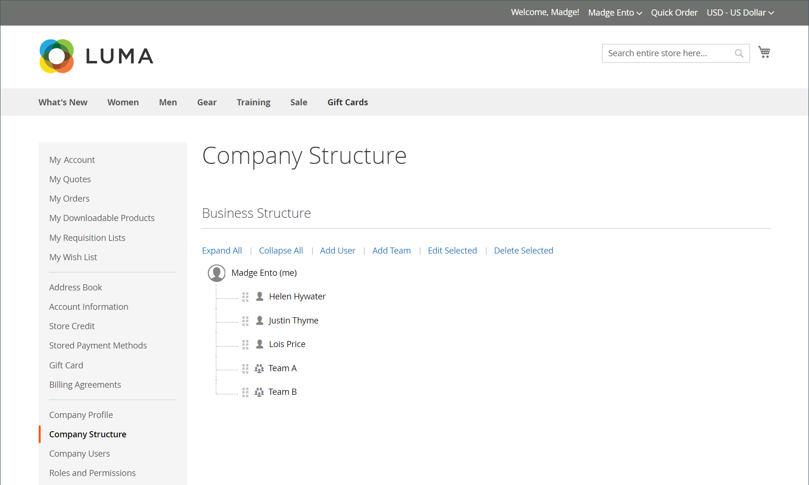

# Bedrijfsrekeningstructuur

Een bedrijfsrekening kan worden opgezet om de structuur van de onderneming te weerspiegelen. Aanvankelijk, omvat de bedrijfsstructuur slechts de bedrijfbeheerder, maar kan worden uitgebreid om teams van gebruikers te omvatten. De gebruikers kunnen met teams worden geassocieerd of binnen een hiërarchie van afdelingen en onderverdelingen binnen het bedrijf worden georganiseerd.

{width="500"}

In het de rekeningsdashboard van de bedrijfbeheerder, wordt de bedrijfstructuur vertegenwoordigd als boom en bestaat aanvankelijk uit slechts de bedrijfbeheerder.

{width="600" zoomable="yes"}

Wanneer de account is gemaakt en goedgekeurd, kan de beheerder van het bedrijf het e-mailadres van het bedrijf gebruiken of een ander e-mailadres krijgen toegewezen.

Het is mogelijk dat de persoon die als bedrijfbeheerder dienst heeft veelvoudige rollen binnen het bedrijf heeft. Als een afzonderlijk e-mailadres voor de bedrijfbeheerder is ingegaan, omvat de aanvankelijke bedrijfstructuur de bedrijfbeheerder plus een individuele gebruikersrekening in de naam van de bedrijfbeheerder. In dat geval kan de beheerder van het bedrijf zich aanmelden bij de account als bedrijf of als individuele gebruiker.

{width="600" zoomable="yes"}

Voor handelaren wordt de volledige structuur van de onderneming weerspiegeld in de _Bedrijven_ en _Klanten_ rasters binnen de beheerder. Het net van Bedrijven maakt een lijst van alle bedrijven ongeacht status. In het volgende voorbeeld worden de accounts van twee bedrijven getoond: _ACME_ en de _Vendelay_ bedrijf.

{width="700" zoomable="yes"}

In het volgende voorbeeld wordt het [!UICONTROL Customers] net met de aanvankelijke rekeningen van de bedrijfbeheerder voor deze ondernemingen.

{width="700" zoomable="yes"}

Na het creëren van de rekening, moet de bedrijfbeheerder de bedrijfstructuur bepalen van [teams](account-company-structure.md)de [bedrijfsgebruikers](account-company-users.md)en [rollen en machtigingen](account-company-roles-permissions.md) voor elk.

## Pictogrammen bedrijfsstructuur

| Pictogram | Beschrijving |
| ---- | ----------------- |
|  | Vertegenwoordigt de bedrijfbeheerder in de bedrijfstructuur. |
|  | Vertegenwoordigt een team in de bedrijfstructuur. |
|  | Vertegenwoordigt een gebruiker in de bedrijfstructuur. |
|  | Verplaatst een team naar een andere positie in de bedrijfsstructuur. |
|  | Breidt een team in de bedrijfstructuur uit. |
|  | Vouwt een team in de bedrijfsstructuur samen. |

{style="table-layout:auto"}

## Bedrijfsteams maken

De structuur van een bedrijfsrekening moet de aankooporganisatie weerspiegelen, of het nu gaat om een eenvoudige en vlakke organisatie of om een complexe organisatie met verschillende teams voor elke afdeling en afdeling van de onderneming.

Als de bewaarder [geconfigureerd](enable-basic-features.md) om bedrijven in staat te stellen hun eigen rekeningen te beheren , is het opzetten van de bedrijfsstructuur een van de eerste taken die een bedrijfsbeheerder moet uitvoeren nadat de rekening is goedgekeurd . In de bedrijfsrekening, wordt de structuur van het bedrijf vertegenwoordigd als boom met de bedrijfbeheerder bij de bovenkant.

{width="450"}

1. De beheerder van het bedrijf ondertekent binnen aan hun rekening.

1. Kies in het linkerdeelvenster de optie **[!UICONTROL Company Structure]**.

1. Onder **[!UICONTROL Business Structure]**, klikken **[!UICONTROL Add Team]** en doet het volgende:

   - Hiermee wordt het dialoogvenster **[!UICONTROL Team Title]** en **[!UICONTROL Description]**.

     De Titel van het Team kan om het even welk zijn die de structuur van het bedrijf, zoals een team, een bureau, of een afdeling binnen het bedrijf vertegenwoordigt

     {width="700" zoomable="yes"}

   - Na voltooiing klikt u op **[!UICONTROL Save]**.

   - Hiermee maakt u zoveel teams als u nodig hebt.

     {width="600" zoomable="yes"}

1. Ga als volgt te werk om een hiërarchie van teams te maken:

   - Selecteert het bovenliggende team en klik op **[!UICONTROL Add Team]**.

     {width="600" zoomable="yes"}

   - Hiermee wordt het dialoogvenster **[!UICONTROL Team Title]** en **[!UICONTROL Description]**.

   - Klikken **[!UICONTROL Save]**.

1. Herhaalt deze stappen om zo vele teams, of afdelingen en onderverdelingen tot stand te brengen zoals nodig.

   {width="600" zoomable="yes"}

## Een team verplaatsen

Aangezien de bedrijfbeheerder met de bedrijfstructuur werkt, kunnen zij teams of afdelingen naar andere plaatsen in de structuur slepen.

1. De bedrijfbeheerder bepaalt de locatie van het team dat moet worden verplaatst.

1. Klik en sleep het team aan een nieuwe positie in de bedrijfstructuur.

## Een team verwijderen

>[!NOTE]
>
>Alvorens een team te schrappen, wordt het geadviseerd om ervoor te zorgen dat het correcte team wordt geselecteerd-geschrapt teams niet kan worden hersteld.

1. De bedrijfbeheerder selecteert het team dat moet worden geschrapt.

1. Klikken **[!UICONTROL Delete Selected]**.

1. Wanneer ertoe aangezet om te bevestigen, klikt **[!UICONTROL Delete]**.

## De teamstructuur uitvouwen of samenvouwen

Aangezien de bedrijfbeheerder met de bedrijfsstructuur werkt, kunnen zij de boom ineenstorten of uitbreiden:

- Klikken **[!UICONTROL Collapse All]** of **[!UICONTROL Expand All]**.

- Klikken  om een team of  om een team uit te vouwen.

## Gebruikers toewijzen aan teams

Wanneer teams en gebruikers voor het eerst worden toegevoegd aan de [bedrijfsstructuur](account-company-structure.md), worden zij geplaatst op het zelfde niveau onder de bedrijfbeheerder.

{width="700" zoomable="yes"}

| Besturing | Beschrijving |
|--- |--- |
| [!UICONTROL Collapse All / Expand All] | Hiermee vouwt u de boomstructuur van de bedrijfsstructuur samen of breidt u deze uit |
| [!UICONTROL Add User] | Maakt een gebruiker onder het huidige team |
| [!UICONTROL Add Team] | Hiermee wordt een team gemaakt |
| [!UICONTROL Edit Selected / Delete Selected] | Hiermee bewerkt of verwijdert u gebruikers uit de boomstructuur van het bedrijf |

{style="table-layout:auto"}

1. In het linkerpaneel, kiest de bedrijfbeheerder **[!UICONTROL Company Structure]**.

1. Om een gebruiker aan een bestaand team toe te wijzen, slepen zij () de gebruiker onder het juiste team.

   {width="700" zoomable="yes"}
