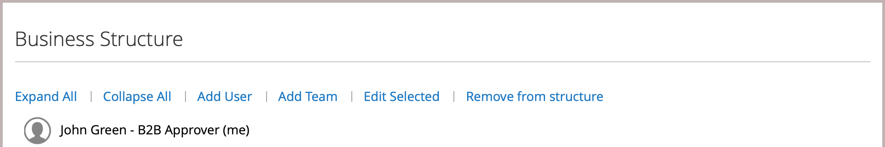

# Bedrijfsrekeningstructuur

Een bedrijfsrekening kan worden opgezet om de structuur van de onderneming te weerspiegelen. Aanvankelijk, omvat de bedrijfsstructuur slechts de bedrijfbeheerder, maar kan worden uitgebreid om teams van gebruikers te omvatten. De gebruikers kunnen met teams worden geassocieerd of binnen een hiërarchie van afdelingen en onderverdelingen binnen het bedrijf worden georganiseerd.

{width="500"}

In het de rekeningsdashboard van de bedrijfbeheerder, wordt de bedrijfstructuur vertegenwoordigd als boom en bestaat aanvankelijk uit slechts de bedrijfbeheerder.

{width="600" zoomable="yes"}

Wanneer de account is gemaakt en goedgekeurd, kan de beheerder van het bedrijf het e-mailadres van het bedrijf gebruiken of een ander e-mailadres krijgen toegewezen.

Het is mogelijk dat de persoon die als bedrijfbeheerder dienst heeft veelvoudige rollen binnen het bedrijf heeft. Als een afzonderlijk e-mailadres voor de bedrijfbeheerder is ingegaan, omvat de aanvankelijke bedrijfstructuur de bedrijfbeheerder plus een individuele gebruikersrekening in de naam van de bedrijfbeheerder. In dat geval kan de beheerder van het bedrijf zich aanmelden bij de account als bedrijf of als individuele gebruiker.

{width="600" zoomable="yes"}

Voor handelaren, wordt de volledige bedrijfstructuur weerspiegeld in de _Bedrijven_ en _Klanten_ netten binnen Admin. Het net van Bedrijven maakt een lijst van alle bedrijven ongeacht status. Het volgende voorbeeld toont rekeningen voor twee bedrijven: het _ACME_ bedrijf en het _Verkoperij_ bedrijf.

{width="700" zoomable="yes"}

In het volgende voorbeeld wordt het [!UICONTROL Customers] -raster weergegeven met de initiële bedrijfsbeheerdersaccounts voor deze bedrijven.

{width="700" zoomable="yes"}

Na het creëren van de rekening, moet de bedrijfbeheerder de bedrijfstructuur van [ teams ](account-company-structure.md) bepalen, opstelling de [ bedrijfgebruikers ](account-company-users.md), en [ rollen en toestemmingen ](account-company-roles-permissions.md) voor elk vestigen.

## Pictogrammen bedrijfsstructuur

| Pictogram | Beschrijving |
| ---- | ----------------- |
|  | Vertegenwoordigt de bedrijfbeheerder in de bedrijfstructuur. |
|  | Vertegenwoordigt een team in de bedrijfstructuur. |
|  | Vertegenwoordigt een gebruiker in de bedrijfstructuur. |
|  | Verplaatst een team naar een andere positie in de bedrijfsstructuur. |
|  | Breidt een team in de bedrijfstructuur uit. |
|  | Vouwt een team in de bedrijfsstructuur samen. |

{style="table-layout:auto"}

## Bedrijfsteams maken

De structuur van een bedrijfsrekening moet de aankooporganisatie weerspiegelen, of het nu gaat om een eenvoudige en vlakke organisatie of om een complexe organisatie met verschillende teams voor elke afdeling en afdeling van de onderneming.

Als de opslag  wordt gevormd om bedrijven toe te staan om hun eigen rekeningen te beheren, is vestiging de bedrijfsstructuur één van de eerste taken voor een bedrijfbeheerder om te voltooien nadat de rekening wordt goedgekeurd. In de bedrijfsrekening, wordt de structuur van het bedrijf vertegenwoordigd als boom met de bedrijfbeheerder bij de bovenkant.

{width="450"}

1. De beheerder van het bedrijf ondertekent binnen aan hun rekening.

1. Kies **[!UICONTROL Company Structure]** in het linkerdeelvenster.

1. Klik onder **[!UICONTROL Business Structure]** op **[!UICONTROL Add Team]** en voer de volgende handelingen uit:

   - Voer **[!UICONTROL Team Title]** en **[!UICONTROL Description]** in.

     De Titel van het Team kan om het even welk zijn die de structuur van het bedrijf, zoals een team, een bureau, of een afdeling binnen het bedrijf vertegenwoordigt

     {width="700" zoomable="yes"} toe

   - Klik op **[!UICONTROL Save]** wanneer dit is voltooid.

   - Hiermee maakt u zoveel teams als u nodig hebt.

     {width="600" zoomable="yes"}

1. Ga als volgt te werk om een hiërarchie van teams te maken:

   - Hiermee selecteert u het bovenliggende team en klikt u op **[!UICONTROL Add Team]** .

     {width="600" zoomable="yes"}

   - Voer **[!UICONTROL Team Title]** en **[!UICONTROL Description]** in.

   - Klik op **[!UICONTROL Save]** .

1. Herhaalt deze stappen om zo vele teams, of afdelingen en onderverdelingen tot stand te brengen zoals nodig.

   {width="600" zoomable="yes"}

## Een team verplaatsen

Aangezien de bedrijfbeheerder met de bedrijfstructuur werkt, kunnen zij teams of afdelingen naar andere plaatsen in de structuur slepen.

1. De bedrijfbeheerder bepaalt de locatie van het team dat moet worden verplaatst.

1. Klik en sleep het team aan een nieuwe positie in de bedrijfstructuur.

## Een team verwijderen

>[!NOTE]
>
>Alvorens een team te schrappen, wordt het geadviseerd om ervoor te zorgen dat het correcte team wordt geselecteerd-geschrapt teams niet kan worden hersteld.

1. De bedrijfbeheerder selecteert het team dat moet worden geschrapt.

1. Klik op **[!UICONTROL Delete Selected]** .

1. Klik op **[!UICONTROL Delete]** wanneer u wordt gevraagd om te bevestigen.

## De teamstructuur uitvouwen of samenvouwen

Aangezien de bedrijfbeheerder met de bedrijfsstructuur werkt, kunnen zij de boom ineenstorten of uitbreiden:

- Klik op **[!UICONTROL Collapse All]** of **[!UICONTROL Expand All]** .

- Klik  om een team samen te vouwen of  om een team uit te breiden.

## Gebruikers toewijzen aan teams

Wanneer de teams en de gebruikers eerst aan de [ bedrijfstructuur ](account-company-structure.md) worden toegevoegd, worden zij geplaatst op het zelfde niveau onder de bedrijfbeheerder.

{width="700" zoomable="yes"}

| Besturing | Beschrijving |
|--- |--- |
| [!UICONTROL Collapse All / Expand All] | Hiermee vouwt u de boomstructuur van de bedrijfsstructuur samen of breidt u deze uit |
| [!UICONTROL Add User] | Maakt een gebruiker onder het huidige team |
| [!UICONTROL Add Team] | Hiermee wordt een team gemaakt |
| [!UICONTROL Edit Selected / Delete Selected] | Hiermee bewerkt of verwijdert u gebruikers uit de boomstructuur van het bedrijf |

{style="table-layout:auto"}

1. In het linkerdeelvenster kiest de bedrijfsbeheerder **[!UICONTROL Company Structure]** .

1. Om een gebruiker aan een bestaand team toe te wijzen, slepen zij () de gebruiker onder het aangewezen team.

   {width="700" zoomable="yes"}
