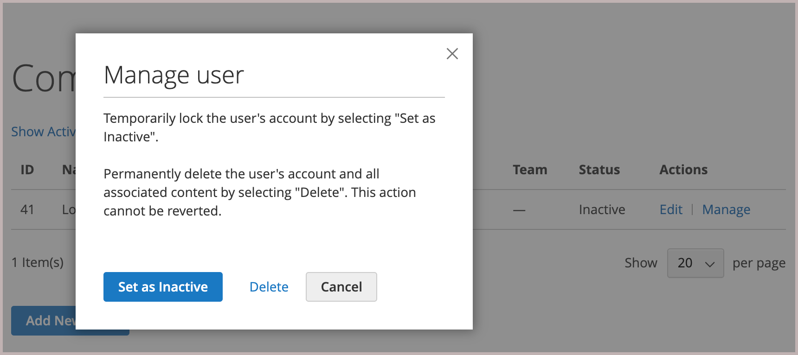

# Manage company user accounts

_[!UICONTROL Company Users]_These individuals are typically buyers with varying levels of permission to access store services and resources.

- Create company users and assign users to teams

- Define roles and permissions, and assign users to roles

Company users can be added, edited, inactivated, or deleted only by the company administrator.

- ** Administrators can still access all content associated with the user. *[!UICONTROL Active]*[!UICONTROL Company Users]

- Wanneer een gebruikersaccount wordt verwijderd, worden het account en de bijbehorende inhoud uit de winkel verwijderd. Deze handeling kan niet worden teruggedraaid.

## Bedrijfsgebruikers toevoegen

1. Vanuit de winkel ondertekent de beheerder van het bedrijf zich aan bij zijn account.

1. Kies **[!UICONTROL Company Users]** in het linkerdeelvenster.

   {width="700" zoomable="yes"}

1. **[!UICONTROL Add New User]**

   - **[!UICONTROL Job Title]**

   - **[!UICONTROL User Role]** Otherwise, they can return later to assign the role.

     {width="700" zoomable="yes"} toe

   - Voegt de gebruikersinformatie in de resterende gebieden toe:
      - **[!UICONTROL First Name]****[!UICONTROL Last Name]**
      - **[!UICONTROL Email]**
      - **[!UICONTROL Phone Number]**

   **[!UICONTROL Status]**`Active`

1. **[!UICONTROL Save]**

1. Repeats the process to create as many company users as needed.

   The new users appear in the Company Users list, along with the Company Administrator.

## [!UICONTROL Company structure]

[!UICONTROL Company Structure]

**
The administrator can reactivate an account by editing the user account information from the Company Users page.

1. From the storefront, the company administrator signs in to their account.

1. Kies **[!UICONTROL Company Structure]** in het linkerdeelvenster.

1. Selecteert de bedrijfgebruiker in de bedrijfstructuur.

1. Klik op **[!UICONTROL Remove from Structure]** .

   {width="600" zoomable="yes"}

1. Klik op **[!UICONTROL Remove]** wanneer u wordt gevraagd om te bevestigen.

   In Admin, blijft de bedrijfgebruiker vermeld in het [ netwerk van Klanten ](../customers/customers-all.md), maar met een `Inactive` status.

## View and manage company user accounts

Bedrijfsbeheerders kunnen bedrijfsgebruikersaccounts weergeven en beheren met de weergavefilters op de pagina [!UICONTROL Company Users] .

{width="700" zoomable="yes"}

- Selecteer **[!UICONTROL Show Inactive Users]** om alleen inactieve gebruikers weer te geven.
- Selecteer **[!UICONTROL Show Active Users]** om alleen actieve gebruikers weer te geven.
- **[!UICONTROL Show All Users]**

*[!UICONTROL Actions]*

### Edit company user account information

Company administrators can update user account profile information and change the account status.

1. [!UICONTROL Company Users] Klik op **[!UICONTROL Edit]**.

1. Make any required changes to the user account information, including changing the account status.

1. Pas de wijzigingen toe door op **[!UICONTROL Save]** te klikken.

>[!NOTE]
>
>Als u een bedrijfsgebruikersaccount bewerkt en u ziet dat in het profiel vereiste accountgegevens ontbreken, zoals de functie en het telefoonnummer, geeft dit aan dat de account is toegevoegd door een Commerce-sitebeheerder. Deze accounts kunnen niet vanuit de opslagruimte worden bewerkt. Neem contact op met uw sitebeheerder om informatie bij te werken of de accountstatus te wijzigen.

### Een actief account deactiveren of verwijderen

1. Zoek op de pagina [!UICONTROL Company Users] naar de gebruikersaccount die u wilt bijwerken. Klik op **[!UICONTROL Manage]**.

   {width="600" zoomable="yes"}

1. When prompted, inactivate or delete the user account as required.

>[!IMPORTANT]
>
>Deleting a company user account removes the account and all associated content from the system. This action cannot be reverted.

## Company user account profile field descriptions

| Field | Description |
|--------------|---------------|
| [!UICONTROL Job Title] | The job title of the company user. |
| [!UICONTROL User Role] |  `Default User` |
| [!UICONTROL First Name] | The first name of the company user. |
| [!UICONTROL Last Name] | The last name of the company user. |
| [!UICONTROL Email] | The email address of the company user. |
| [!UICONTROL Phone Number] | The phone number of the company user. |
| [!UICONTROL Status] | The status of the company user account. `Active``Inactive` |

{style="table-layout:auto"}
