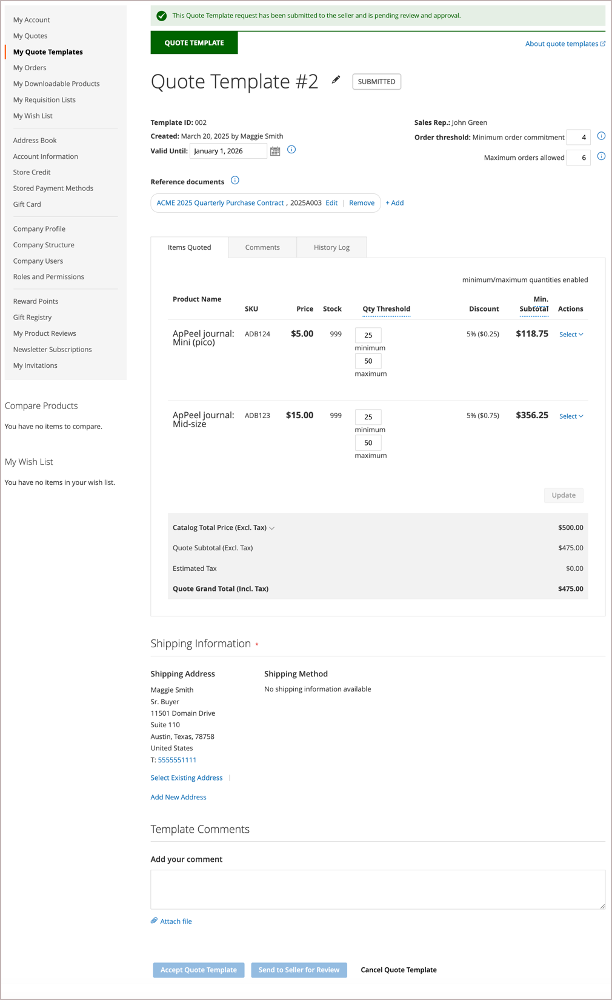

# [!UICONTROL My Quote Templates]

Als offertes zijn ingeschakeld, worden in het gedeelte _[!UICONTROL My Quotes Template]_&#x200B;van het dashboard voor de klantenaccount alle prijsaanhalingstekensjablonen weergegeven die aan de klantenaccount zijn gekoppeld. Afhankelijk van hun machtigingen kunnen alleen kopers die voor rekening van een bedrijf aankopen doen, een prijsopgave aanvragen en prijsopgave en voorwaarden voor terugkerende orders bespreken.

{width="700" zoomable="yes"}

De lijst van het citaatmalplaatje organiseert malplaatjes door status.

- In **[!UICONTROL Active Quote Templates]** worden sjablonen weergegeven die zijn onderhandeld en goedgekeurd voor gebruik. De informatie omvat minimum citaattotaal en geplaatste orden als deze opties tijdens het onderhandelingsproces werden gevormd. Kopers kunnen een gekoppeld aanhalingsteken genereren op basis van de sjabloon voor het verzenden van een bestelling op basis van prijsvoorwaarden.

- **[!UICONTROL In Review]** geeft een lijst van malplaatjes in het onderhandelingsproces die de huidige status tonen en een verbinding verstrekken om het malplaatje te openen.

- In **[!UICONTROL Inactive]** worden sjablonen weergegeven die zijn verlopen, geannuleerd of niet meer geldig zijn omdat een koper het toegestane aantal gecommitteerde orders heeft opgebruikt.

Voor de koper is de pagina *[!UICONTROL My Quotes Templates]* het centrale punt voor alle communicatie tussen koper en verkoper tijdens het onderhandelingsproces.

Een koper die de door de verkoper aangeboden onderhandelingstermijnen accepteert, kan de template accepteren en deze gebruiken om vooraf goedgekeurde gekoppelde koersen te genereren die kunnen worden gebruikt om bestellingen te plaatsen.

- Acties met betrekking tot het beheren van de offertesjabloon:

   - Een sjabloon annuleren
   - Naar de verkoper sturen voor beoordeling
   - Accepteer het offertesjabloon
   - De vervaldatum van de offertesjabloon wijzigen
   - Een verzendadres toevoegen
   - Links naar referentiedocumenten beheren

- Acties voor het bijwerken van de details van de offertesjabloon tijdens het onderhandelingsproces:

   - Bekijk de prijzen en updates van artikelen.
   - Als er hoeveelheidsdrempels zijn geconfigureerd op de prijsopgavesjabloon, past u de minimum- en maximumwaarden aan.
   - Volg het onderhandelingsproces van [!UICONTROL Comments] en [!UICONTROL History] secties.
   - Voor templates die nog steeds worden gecontroleerd, kan de koper de aanbiedingstemplate wijzigen door items te verwijderen.
   - Communiceer en onderhandel met de verkoper door opmerkingen toe te voegen op het niveau van het regelobject en de prijsopgave.
   - Koppelingen naar externe contracten en overeenkomsten toevoegen, bewerken of verwijderen.

  Na het aanbrengen van wijzigingen geeft de koper de template ter controle aan de verkoper.

- Algemene acties tijdens de onderhandelingen:

   - Aanbiedingsjabloon ter controle naar de verkoper sturen
   - Accepteer de prijsverhogingssjabloon
   - Annuleren om de onderhandeling te beëindigen en het aanhalingsteken te sluiten

In het volgende voorbeeld ziet u een prijsopmaaksjabloon die door de koper is bijgewerkt en ter controle naar de verkoper is teruggestuurd.

{width="700" zoomable="yes"}

Sjablonen met de status `Submitted` zijn vergrendeld totdat de verkoper de template bekijkt en bijwerkt en deze naar de koper retourneert.

## Een aanhalingsteken maken

De koper kan het onderhandelingsproces van het citaatmalplaatje beginnen gebruikend één van beiden van de volgende methodes:

- Maak een sjabloon van een bestaand aanhalingsteken door op de handeling **[!UICONTROL Create quote template]** te klikken.

- Verzend een citaatverzoek van de winkel en voeg commentaren toe vragend de verkoopvertegenwoordiger om een citaatmalplaatje van het citaatverzoek tot stand te brengen.

## Een aanhalingsteken weergeven

1. De koper heeft zich aangemeld bij zijn account.

1. Kies **[!UICONTROL My Quote Templates]** in het linkerdeelvenster.

1. Zoekt de aanhalingstekensjabloon in de lijst en klikt op **[!UICONTROL View]** in de kolom _[!UICONTROL Action]_.

## Verzendadres toevoegen

De koper kan pas een aanbiedingstemplate accepteren als hij een verzendadres heeft.

1. De koper heeft zich aangemeld bij zijn account.

1. Kies **[!UICONTROL My Quote Templates]** in het linkerdeelvenster.

1. Selecteert het gewenste citaatmalplaatje.

1. Klik in de sectie **[!UICONTROL Shipping Information]** op **[!UICONTROL Add New Address]** .

1. Vult details voor het nieuwe adres in.

1. Klikken **[!UICONTROL Save Address]**.

Nadat de koper het adres heeft toegevoegd, stuurt hij de template terug naar de verkoper ter controle. De verkoper biedt de verzend- en leveringsopties. Deze updates kunnen van invloed zijn op de prijs van de onderhandelde prijsopgave. De verzendopties zijn vergrendeld bij het afrekenen.

## Een gekoppeld aanhalingsteken genereren

Nadat de koper een aanhalingstekensjabloon heeft geaccepteerd, kunnen ze deze gebruiken om vooraf goedgekeurde, gekoppelde aanhalingstekens te genereren vanuit de *[!UICONTROL My Quote Templates dashboard]* -sjabloon of vanuit de aanhalingstekensjabloon met behulp van de **[!UICONTROL Generate a quote]** -actie.

Het gekoppelde aanhalingsteken bevat een melding die aangeeft dat het is goedgekeurd en gereed voor afhandeling. Het verstrekt ook een verbinding aan het citaatmalplaatje in de kopbalinformatie.

{width="700" zoomable="yes"}

Als het citaatmalplaatje met een ordedrempel werd gevormd, wordt de telling verhoogd wanneer het verbonden citaat wordt geproduceerd.

Kopers kunnen de volgende handelingen uitvoeren vanuit een gekoppeld aanhalingsteken:

- Als het citaat met kwantitatieve drempels wordt gevormd, pas de ordehoeveelheid voor lijnpunten aan.
- Ga door met de kassa om een bestelling te verzenden.
- Verwijder of druk het citaat.
- Open het citaatmalplaatje wordt gebruikt om het citaat te produceren dat.

## Een aanhalingsteken annuleren

Klik op **[!UICONTROL Cancel Quote Template]** op de pagina met de aanhalingstekensjabloon.

De aanhalingstekensjabloon wordt geannuleerd en de status van het aanhalingsteken verandert in `Closed` . De gesloten prijsopgave blijft in uw lijst met *[!UICONTROL Inactive]* koersen staan en blijft in het _[!UICONTROL Quote Templates]_&#x200B;raster in de beheerder staan.

## Referentiedocumentkoppelingen beheren

Met de functie Koppelingen referentiedocument kunnen kopers en verkopers koppelingen naar externe documenten (zoals contracten, overeenkomsten of specificaties) toevoegen, bewerken en beheren tijdens het proces van de prijsopgave.

### Een koppeling naar een referentiedocument toevoegen

1. Open de prijsverhogingssjabloon.

1. Klik in de sectie **[!UICONTROL Reference Documents]** op **[!UICONTROL Add]** .

1. In het dialoogvenster Documentinformatie:
   - Voer een **[!UICONTROL Document Name]** (verplicht)
   - Voer een **[!UICONTROL Document Identifier]** (optioneel)
   - Voer een **[!UICONTROL Reference Document URL]** (verplicht)

1. Klik op **[!UICONTROL Add to Quote Template]**.

   De link naar het referentiedocument wordt in het volgende formaat aan het offertesjabloon toegevoegd:
   `Document Name, Document Identifier https://document-url`

### Een link naar een referentiedocument bewerken

1. Open de offertesjabloon.

1. Klik in de **[!UICONTROL Reference Documents]** sectie naast **[!UICONTROL Edit]** de documentlink die u wilt wijzigen.

1. Werk de documentinformatie bij in het dialoogvenster:
   - Naam van het document
   - Document-ID
   - URL referentiedocument

1. Klik op **[!UICONTROL Add to Quote Template]**.

### Een koppeling naar een referentiedocument verwijderen

1. Open de prijsverhogingssjabloon.

1. Klik in de sectie **[!UICONTROL Reference Documents]** op **[!UICONTROL Remove]** naast de documentkoppeling die u wilt verwijderen.

### Een referentiedocument weergeven

1. Open de prijsverhogingssjabloon.

1. Klik in de sectie **[!UICONTROL Reference Documents]** op de koppeling voor de documentnaam.

   Het document wordt in een nieuw browservenster geopend.

### Beperkingen voor koppelingen naar referentiedocumenten

- Koppelingen naar referentiedocumenten kunnen alleen worden toegevoegd, bewerkt of verwijderd als de aanhalingstekensjabloon bewerkbaar is.
- Zodra het citaatmalplaatje voor overzicht wordt verzonden of wordt goedgekeurd, worden de verbindingen van het verwijzingsdocument read-only.
- Het veld Documentnaam is vereist wanneer u een koppeling naar een referentiedocument toevoegt of bewerkt.
- Koppelingen naar referentiedocumenten blijven toegankelijk, zelfs nadat de conceptsjabloon is geaccepteerd of voltooid.
