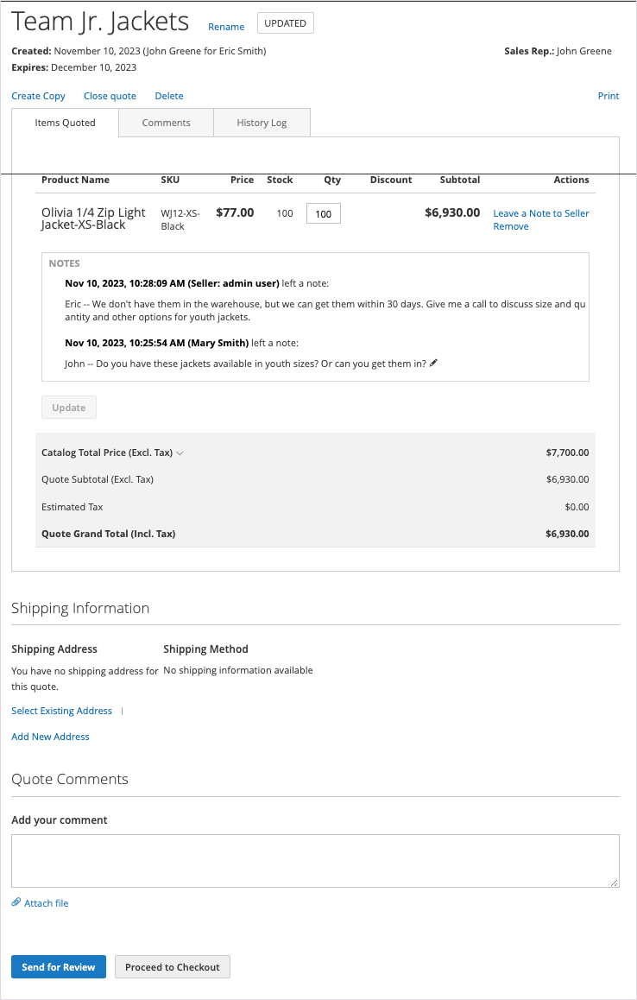

# [!UICONTROL My Quotes]

Als offertes zijn ingeschakeld, worden in het gedeelte _[!UICONTROL My Quotes]_van het dashboard voor de klantenaccount alle aanhalingstekens weergegeven die door de klant zijn ingediend. Afhankelijk van hun machtigingen kunnen alleen kopers die namens een bedrijf aankopen doen, verzoeken om over de prijs van een aankoop te onderhandelen.

{width="700" zoomable="yes"}

De koper begint het proces door [ een verzoek ](quote-request.md) voor een citaat van het het winkelwagentje voor te leggen voor te leggen. E-mail wordt geruild tussen de koper en de verkoper tijdens het [ onderhandelingsproces ](quote-price-negotiation.md). Voor de koper is de pagina [!UICONTROL My Quotes] het centrale punt voor alle communicatie tussen koper en verkoper tijdens het onderhandelingsproces. Een koper die de door de verkoper geboden onderhandelingsprijs accepteert, kan direct vanaf de prijsopgave naar de betalingspagina gaan. Er kunnen geen extra kortingen aan het onderhandelde prijsopgave worden toegevoegd.

Een koper kan de volgende handelingen uitvoeren bij het onderhandelen over een prijsopgave:

* Prijsbepaling en updates van objecten controleren
* Houd het onderhandelingsproces bij vanuit de secties [!UICONTROL Comments] en [!UICONTROL History] .
* Het aanhalingsteken wijzigen om items te verwijderen
* Communiceren en onderhandelen met de verkoper door opmerkingen toe te voegen op het niveau van het regelobject en de prijsopgave
* Aanhalingsteken ter controle naar verkoper sturen
* Zet het citaat in een orde om als de termijnen aanvaardbaar zijn
* Het aanhalingsteken sluiten
* Het aanhalingsteken verwijderen
* [!BADGE  1.5.0-bètamogelijkheden ]{type=Informative url="/help/b2b/release-notes.md" tooltip="Alleen beschikbaar voor Beta-programmadeelnemers"}

In het volgende voorbeeld wordt een prijsopgave getoond die door de koper is bijgewerkt en ter controle naar de verkoper is teruggestuurd.

{width="700" zoomable="yes"}

Aanhalingstekens met de status `Updated` worden vergrendeld totdat de verkoper het aanhalingsteken retourneert.

## Aanhalingstekens tonen

Met de vereiste [ toestemmingen voor hun rol ](account-company-roles-permissions.md), kunnen de klanten verbonden aan een bedrijfrekening citaten zien die door [ worden gevraagd ondergeschikte gebruikers ](account-company-structure.md). De beheerders van het bedrijf kunnen alle citaten voor de bedrijfrekening zien.

1. De klant meldt zich aan bij zijn account op de winkel.

1. Klik op **[!UICONTROL My Quotes]** in de linkernavigatie.

1. Als u alle aanhalingstekens wilt zien die ze hebben gemaakt, klikt u op de koppeling **[!UICONTROL Show My Quotes]** (wordt alleen weergegeven voor de systeembeheerder van het bedrijf of de account met onderliggende gebruikers).

1. Als u alle aanhalingstekens van alle gebruikers van het bedrijf wilt zien, klikt u op **[!UICONTROL Show All Quotes]** .

## Een aanhalingsteken weergeven

1. De klant meldt zich aan bij zijn account.

1. Kies **[!UICONTROL My Quotes]** in het linkerdeelvenster.

1. Zoekt het aanhalingsteken in de lijst en klikt op **[!UICONTROL View]** in de kolom _[!UICONTROL Action]_.

## Een aanhalingsteken afdrukken

1. In het open citaat rechts van de _[!UICONTROL Items Quoted]_sectie, klikt de klant **[!UICONTROL Print]**.

1. Controleert **[!UICONTROL Destination]** als of printer of PDF.

1. Klik op **[!UICONTROL Print]** .

## Een prijsaanvraag annuleren

1. Klik in het open aanhalingsteken net boven de sectie Items genoemd op **[!UICONTROL Close quote]** .

   De aanvraag wordt geannuleerd en de status van het aanhalingsteken verandert in `Closed` . Het gesloten citaat blijft in uw lijst van citaten, en vermeld in het _[!UICONTROL Quotes]_net van Admin.

1. Als u het geannuleerde aanhalingsteken uit de lijst met aanhalingstekens wilt verwijderen, klikt u op **[!UICONTROL Delete]** .

1. Klik op **[!UICONTROL OK]** wanneer u wordt gevraagd om te bevestigen.

   Het gesloten citaat wordt verwijderd uit hun lijst van citaten. De naam blijft echter in de beheerderslijst op het _[!UICONTROL Quotes]_-raster staan, met de status `Closed` .

## Offertehandelingen

| Handeling | Beschrijving |
|---------------|------------------------------------------------------------------------------------------------------------------------------------------------------------------------------------------------------------------------------|
| Naam wijzigen | [!BADGE  1.5.0-bètamogelijkheden ] {type=Informative url=&quot;/help/b2b/release-notes.md&quot;tooltip=&quot;Beschikbaar slechts voor Beta programmadeelnemers&quot;} Verandering de naam van het citaat |
| Een kopie maken | [!BADGE  1.5.0-bètamogelijkheden ] {type=Informative url=&quot;/help/b2b/release-notes.md&quot;tooltip=&quot;Beschikbaar slechts voor Beta programmadeelnemers&quot;} Een koper kan een nieuw citaat van het huidige citaat tot stand brengen door het te kopiëren en anders te noemen. |
| Aanhalingsteken sluiten | Nadat een koper een prijsopgave heeft gesloten, kan deze niet opnieuw worden geopend. Indien nodig kan de koper het opnieuw maken met de handeling [!UICONTROL Create Copy] . Deze optie is niet beschikbaar als de status van het citaat `Draft` is. |
| Aanhalingsteken verwijderen | Wanneer een koper een prijsopgave verwijdert, wordt deze uit het systeem verwijderd en is deze niet meer beschikbaar. |
| Afdrukken | Hiermee opent u een afdrukformulier waarin u het aanhalingsteken kunt opslaan als een PDF, bestand of afdrukbestand naar een geconfigureerde printer. |

## Kolombeschrijvingen

| Kolom | Beschrijving |
|-------------------------|-------------------------------------------------------------------------------------------------------------------------------------------------------------------------------------------------------------------------------------------------------------------------------------------------------------------------------------------------------------------------------------------------------------------------------------------------------------------------------------------------------------------------------------------------------------------------------------------------------------------------------------------------------------------------------------------------------------------------------------------------------------------------------------------------------------------------------------------------------------------------------------------------------------------------------------------------------------------------------------------------------------------------------------------------------------------------------------------------------------------------------------------------------------------------------------------------------------------------------------------------------------------------------------------------------------------------------------------------------------------------------------------------------------------------------------------------------------------------------------------------------------------------------------------------------------------------------------------------------------------------------------------------------------------------------------------------------------------------------------------------------------------------------------------------------------------------------------------------------------------------------------------------------------------------------------------------------------------------------------------------------------------------------------------------------------------------------------------------------------------------------------------------------------------------------------------------------------------------------------------------------------------------------------------------------------------------------------------------------------------------------------------------------------------------------------------------------------------------------------------------------------------------------------------|
| [!UICONTROL Quote Name] | De naam die door de koper is toegewezen aan de prijsaanvraag. |
| [!UICONTROL Created] | De datum waarop de prijsaanvraag voor het eerst is ingediend. |
| [!UICONTROL Created By] | De voornaam en achternaam van de koper die de prijsaanvraag heeft ingediend. |
| [!UICONTROL Status] | Geeft de status van het aanhalingsteken aan. De status van een prijsopgave kan alleen worden gewijzigd door actie van de koper of de verkoper.  **[!UICONTROL Submitted]**- De aanvraag van de koper voor een prijsopgave is nog niet geopend door de verkoper. In deze status kan de koper nog steeds de aanvraag voor een prijsopgave wijzigen. Beschikbare acties: `View` / `Close` / `Edit Quantity` / `Delete SKU` / `Add Comments` / `Edit Shipping Address` **[!UICONTROL Pending]** - De verkoper heeft het verzoek geopend en is bezig het te bekijken en een reactie voor te bereiden. Beschikbare acties: `View` / `Close`  **[!UICONTROL Updated]**- De verkoper heeft een reactie verzonden naar de koper en de knop _[!UICONTROL Proceed to Checkout]_is ingeschakeld. In deze status kan de koper doorgaan met het wijzigen van de prijsopgave. Beschikbare handelingen: `View` / `Send for Review` / `Proceed to Checkout` / `Delete Quote` / `Close` / `Edit Quantity` / `Delete SKU` / `Add comments` / `Edit Shipping Address` **[!UICONTROL Open]**- De koper werkt het aanhalingsteken nog steeds bij en de knop_[!UICONTROL Proceed to Checkout]_ is uitgeschakeld. Beschikbare handelingen: `View` / `Send for Review` / `Delete Quote` / `Edit quantity` / `Delete SKU` / `Add Comments` / `Edit Shipping Address`  **[!UICONTROL Ordered]**- De koper heeft een bestelling verzonden op basis van het onderhandelde aanhalingsteken. Het aanhalingsteken is vergrendeld en kan niet worden bewerkt. Beschikbare actie: Beeld **[!UICONTROL Closed]** - De koper heeft de onderhandeling beëindigd en annuleert de prijsopgave. De prijsopgave is vergrendeld en kan niet door de koper of de verkoper worden bewerkt. Beschikbare acties: `View` / `Delete`  **[!UICONTROL Declined]**- De verkoper heeft het verzoek om een prijsopgave afgewezen of heeft tijdens het onderhandelingsproces een voorgestelde wijziging voorgesteld. Een citaat kan in om het even welk stadium van het werkschema worden verworpen. Eventuele aangepaste prijzen worden uit de prijsopgave verwijderd. De koper kan de prijsopgave blijven bewerken en opnieuw indienen, of de aanschaf uitvoeren met standaardcatalogusprijzen. Beschikbare handelingen: `View` / `Send for Review` / `Delete Quote` / `Edit Quantity` / `Delete SKU` / `Add Comments` / `Edit Shipping Address` **[!UICONTROL Expired]** - De levensduur van het citaat is verlopen. Alle voorgestelde prijzen worden opnieuw vastgesteld. De koper kan de aankoop voltooien op basis van standaardcatalogusprijzen of een andere onderhandelingsronde starten. Beschikbare acties: `View` / `Send for Review` / `Delete Quote` / `Edit Quantity` / `Delete SKU` / `Add Comments` / `Edit Shipping Address` |

{style="table-layout:auto"}
