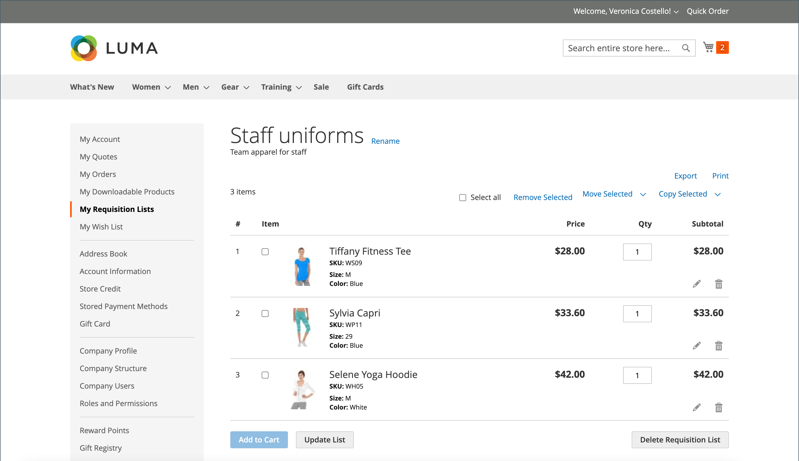

# [!UICONTROL My Requisition Lists]

De belangrijkste reden om een aanvraaglijst te handhaven is het gemakkelijk te maken om producten opnieuw in orde te brengen. Geautoriseerde klanten kunnen de volgorde van items in een aanvraaglijst eenvoudig wijzigen door ze aan het winkelwagentje toe te voegen en items van de ene lijst naar de andere te verplaatsen of te kopiëren.

{width="700" zoomable="yes"}

## Een aanvraaglijst openen

1. De klant kiest **[!UICONTROL My Requisition Lists]** vanaf het dashboard van zijn account.

1. Hiermee wordt de lijst met aanvragen gezocht die ze willen openen, en wordt op **[!UICONTROL View]** geklikt en wordt een van de volgende handelingen uitgevoerd:

### Producten aan winkelwagentje toevoegen

1. De klant voert een van de volgende handelingen uit om de producten te selecteren die moeten worden toegevoegd:

   - Selecteert checkbox van elk punt.
   - Klik op **[!UICONTROL Select All]** .

1. Voert de **[!UICONTROL Qty]** in die aan het winkelwagentje moet worden toegevoegd.

1. Ga als volgt te werk om de productopties te wijzigen:

   - In het lijnpunt, klikt _uitgeven_ () pictogram.
   - Hiermee wijzigt u de benodigde opties.
   - Klik op **[!UICONTROL Update Requisition List]** .

1. Klik op **[!UICONTROL Add to Cart]** .

   {width="700" zoomable="yes"}

### Items naar een andere lijst kopiëren

1. De klant selecteert het selectievakje van elk item dat moet worden verplaatst.

1. Klik op **[!UICONTROL Copy Selected]** en voer een van de volgende handelingen uit:

   - Kies een bestaande aanvraaglijst.
   - Klik op **[!UICONTROL Create New Requisition List]** .

### Een lijst exporteren

1. De klant opent de aanvraaglijst die u wilt exporteren.

1. Klik op de koppeling **[!UICONTROL Export]** .

Adobe Commerce genereert en downloadt een CSV-lijst met `sku` - en `qty` -waarden.

### Items naar een andere lijst verplaatsen

1. De klant selecteert het selectievakje van elk item dat moet worden verplaatst.

1. Klik op **[!UICONTROL Move Selected]** en voer een van de volgende handelingen uit:

   - Kies een bestaande aanvraaglijst.
   - Klik op **[!UICONTROL Create New Requisition List]** .

### Een lijst afdrukken

1. In de rechterbovenhoek van de lijst klikt de klant op **[!UICONTROL Print]** .

1. Controleert het uitvoerapparaat en klikt op **[!UICONTROL Print]** .

   {width="500" zoomable="yes"}

### Productopties bewerken

De klant doet het volgende om de productopties in de lijst te bewerken:

1. Klik het _Potlood_ () pictogram om de productpagina te openen.

1. Hiermee wijzigt u de benodigde opties.

1. Klik op **[!UICONTROL Update Requisition List]** .

   {width="700" zoomable="yes"}

Een product in de aanvraaglijst kan worden bewerkt als:

- Het product heeft **[!UICONTROL all options set]** (wanneer het a [&#x200B; gevormd product &#x200B;](../catalog/product-create-configurable.md) in de Lijst van de Vereiste is).

  Het product is **[!UICONTROL added to this Requisition List]** .

- Het product is [&#x200B; een eenvoudig product met opties &#x200B;](../catalog/settings-advanced-custom-options.md)

- Bewerken is toegestaan voor het producttype.

### Items verwijderen

1. De klant selecteert het selectievakje van elk item dat moet worden verwijderd.

1. Klik op **[!UICONTROL Remove Selected]** .

1. Klik op **[!UICONTROL Delete]** wanneer u wordt gevraagd om te bevestigen.

### De naam van een lijst wijzigen

1. Na de lijsttitel, klikt de klant **[!UICONTROL Rename]**.

1. Voer een andere **[!UICONTROL Requisition List Name]** in.

1. Klik op **[!UICONTROL Save]** .

   {width="300"}

### Een aanvraaglijst verwijderen

1. De klant opent de aanvraaglijst die moet worden verwijderd.

1. Klik op **[!UICONTROL Delete Requisition List]** .

1. Klik op **[!UICONTROL Delete]** wanneer u wordt gevraagd om te bevestigen.

>[!NOTE]
>
>Deze handeling kan niet ongedaan worden gemaakt.

## Handelingen

| Handeling | Beschrijving |
|--- |--- |
| [!UICONTROL Rename] | Hiermee kunt u de naam van de aanvraaglijst wijzigen en de beschrijving bijwerken. |
| [!UICONTROL Export] | Exporteert de aanvraaglijst naar een CSV-bestand. |
| [!UICONTROL Print] | Hiermee wordt de huidige aanvraaglijst afgedrukt. |
| [!UICONTROL Select] | Beheert de itemselecties die het onderwerp van een handeling moeten zijn.  **[!UICONTROL Select All]**- Hiermee selecteert u alle items in de aanvraaglijst. **[!UICONTROL Remove Selected]** - Hiermee verwijdert u alle geselecteerde items uit de aanvraaglijst.  **[!UICONTROL Copy Selected]**- Hiermee worden alle geselecteerde items naar een andere aanvraaglijst gekopieerd. |
| [!UICONTROL Add to Cart] | Hiermee voegt u geselecteerde items toe aan het winkelwagentje. |
| [!UICONTROL Update List] | Hiermee herberekent u het subtotaal aan de hand van een wijziging in de hoeveelheid. |
| [!UICONTROL Delete Requisition List] | Verwijdert de aanvraaglijst uit de account van de bedrijfsgebruiker. |

{style="table-layout:auto"}
