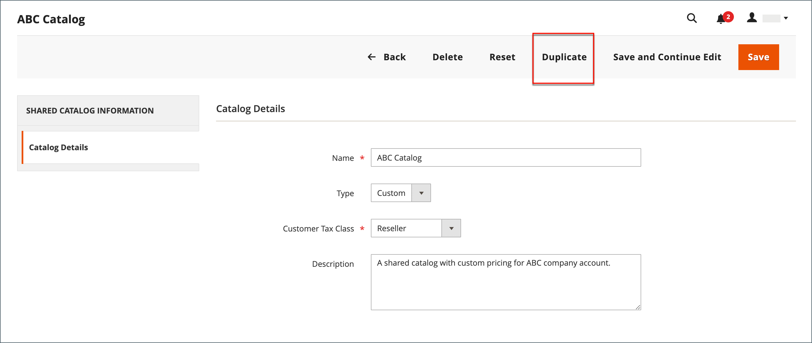

# Een gedeelde catalogus maken

Wanneer a [&#x200B; gedeelde catalogus &#x200B;](catalog-shared.md) wordt gecreeerd, leidt het systeem automatisch tot de groep van de a [&#x200B; klant &#x200B;](account-company-customer-group.md) door de zelfde naam. Bijvoorbeeld, als u een gedeelde catalogus genoemd _ABC Catalogus_ creeert, leidt het systeem ook tot een overeenkomstige _ABC Catalogus_ klantengroep. Het toewijzen van een bedrijf aan de gedeelde douanecatalogus is hoofdzakelijk het zelfde als het toewijzen van hen aan een klantengroep.

Een nieuwe gedeelde catalogus bevat geen producten, aangepaste prijzen of bedrijfskoppelingen. Een openbare catalogus, de standaard gedeelde catalogus die wordt gemaakt wanneer gedeelde catalogi worden ingeschakeld, wordt automatisch toegewezen aan gasten en aan klanten die niet aan een bedrijf zijn gekoppeld.

{width="700" zoomable="yes"}

Voordat een gedeelde catalogus kan worden gebruikt, moet u de volgende aspecten instellen:

- Catalogusbereik
- Productselectie
- Aangepaste prijzen
- Bedrijfstoewijzingen

## Prijsbereik

Als u een installatie met meerdere sites hebt, moet u het prijsbereik configureren voordat u gedeelde catalogi maakt. Het [&#x200B; prijswerkingsgebied &#x200B;](../catalog/catalog-price-scope.md) kan aan `Global` of `Website` worden geplaatst. Deze kan echter alleen aan het begin van het installatieproces worden ingesteld. De website verkiest verschijnt tijdens stap 2 van de [&#x200B; gedeelde catalogusopstelling &#x200B;](catalog-shared-pricing-structure.md).

{width="600" zoomable="yes"}

1. Voor _Admin_ sidebar, ga **[!UICONTROL Stores]** > _[!UICONTROL Settings]_>**[!UICONTROL Configuration]**.

1. In het linkerpaneel, breid **Catalogus** uit en kies **Catalogus** onderaan.

1. Breid  uit de **sectie van de Prijs**.

1. Plaats **het Toepassingsgebied van de Prijs van de Catalogus** aan `Website`.

   {width="600" zoomable="yes"}

1. Klik op **[!UICONTROL Save Config]**.

## Stap 1: De gedeelde catalogus maken

Er zijn twee manieren om een gedeelde catalogus te maken. U kunt een gedeelde catalogus van elk type maken of een bestaande gedeelde catalogus dupliceren. Een nieuwe gedeelde catalogus bevat geen producten en is nog niet toegewezen aan een bedrijf.

### Methode 1: Een nieuwe gedeelde catalogus toevoegen

1. Voor _Admin_ sidebar, ga **[!UICONTROL Catalog]** > **[!UICONTROL Shared Catalogs]**.

1. Klik in de rechterbovenhoek op **[!UICONTROL Add Shared Catalog]** en voer de volgende handelingen uit:

   - Voer een **[!UICONTROL Name]** in voor de gedeelde catalogus.

     De naam die u toewijst, wordt in het hele dashboard voor beheerders en klanten gebruikt, indien van toepassing, om naar de gedeelde catalogus te verwijzen. Het wordt ook de naam van de overeenkomstige klantengroep.

   - Selecteer **[!UICONTROL Type]** : `Custom` of `Public` .

   - Kies de juiste **[!UICONTROL Customer Tax Class]** die van toepassing is op aankopen die vanuit de gedeelde catalogus worden gedaan.

     Voor meer informatie over de opstelling en de definitie van de belastingklasse, zie [&#x200B; de klassen van de Belasting &#x200B;](../stores-purchase/tax-class.md).

     Het volgende voorbeeld toont een nieuwe douanecatalogus voor een specifieke groothandelsklant.

     {width="600" zoomable="yes"}

   - Enter **[!UICONTROL Description]**

1. Klik op **[!UICONTROL Save]** als de bewerking is voltooid.

   De nieuwe catalogus wordt weergegeven in het raster van _[!UICONTROL Shared Catalogs]_.

### Methode 2: Een bestaande gedeelde catalogus dupliceren

In een dubbele aangepaste catalogus blijven het prijsmodel en de structuur van het origineel behouden, maar niet die van de bedrijfsverenigingen. Er wordt ook een overeenkomende klantengroep gemaakt met dezelfde naam als de gedupliceerde catalogus. Door gebrek, wordt een dubbele catalogus genoemd _Duplicaat van_ de originele catalogus.

Als een openbare gedeelde catalogus wordt gedupliceerd, verandert het type van de gedupliceerde catalogus in `custom` .

1. Voor _Admin_ sidebar, ga **[!UICONTROL Catalog]** > **[!UICONTROL Shared Catalogs]**.

1. Ga voor de gedeelde catalogus in het raster die u wilt dupliceren naar de kolom **[!UICONTROL Action]** en selecteer **[!UICONTROL General Settings]** .

1. Klik op **[!UICONTROL Duplicate]** in de opties boven aan de pagina.

   {width="600" zoomable="yes"}

1. Werk de volgende velden voor de nieuwe catalogus bij:

   - **[!UICONTROL Name]**
   - **[!UICONTROL Type]**
   - **[!UICONTROL Customer Tax Class]**
   - **[!UICONTROL Description]**

1. Klik op **[!UICONTROL Save]** als de bewerking is voltooid.

   Het duplicaat wordt in het raster van _[!UICONTROL Shared Catalogs]_&#x200B;weergegeven met een unieke id.

## Stap 2: De installatie voltooien

Na het creëren van een nieuwe gedeelde catalogus, moet het met de aangewezen productselectie worden gevormd, [&#x200B; bedrijftaken &#x200B;](catalog-shared-assign-companies.md), en [&#x200B; categorietoestemmingen &#x200B;](../catalog/category-permissions.md). Om verder te gaan, zie [&#x200B; Vastgestelde tarifering en structuur &#x200B;](catalog-shared-pricing-structure.md).

>[!NOTE]
>
>**[B2B versie 1.3.0 &#x200B;](release-notes.md#b2b-v130) en later** - wanneer u een gedeelde catalogus creeert, wordt elk [&#x200B; categorietoestemming &#x200B;](../catalog/category-permissions.md) voor de catalogus geplaatst aan _[!UICONTROL Allow for the Display Product Prices]_&#x200B;en&#x200B;_[!UICONTROL Add to Cart]_ voor klantengroepen die deze toegang in de montages van de catalogustoestemming worden toegewezen. Eerder werden deze instellingen automatisch ingesteld op `Deny` , zelfs als catalogusmachtigingen waren ingesteld op `Allow` .

## Demo van gedeelde catalogus

Bekijk deze video voor een demonstratie van gedeeld catalogusbeheer:

>[!VIDEO](https://video.tv.adobe.com/v/344446?quality=12&learn=on)

## Verwijzing naar gedeelde cataloguspagina

### Knopbalk

| Knop | Beschrijving |
|--- |--- |
| [!UICONTROL Back] | Hiermee gaat u terug naar de pagina Gedeelde catalogi zonder de nieuwe gedeelde catalogus op te slaan. |
| [!UICONTROL Reset] | Hiermee wist u de vorm van niet-opgeslagen wijzigingen en herstelt u de oorspronkelijke details van de catalogus. |
| [!UICONTROL Save and Continue Edit] | Hiermee slaat u alle wijzigingen op en het formulier blijft geopend in de bewerkingsmodus. |
| [!UICONTROL Save] | Hiermee slaat u wijzigingen op, sluit u het formulier en keert u terug naar de pagina Gedeelde catalogi. |

{style="table-layout:auto"}

### Catalogusdetails

| Veld | Beschrijving |
|--- |--- |
| [!UICONTROL Name] | Identificeert de gedeelde catalogus door Admin, en in de klantenrekeningen waar het beschikbaar is. De catalogusnaam moet beschrijvend zijn en mag niet langer zijn dan 32 tekens. U kunt geen twee gedeelde catalogi met dezelfde naam hebben. Maximum aantal tekens: 32 |
| [!UICONTROL Type] | **[!UICONTROL Custom]** - Identificeert een catalogus met aangepaste prijzen die alleen beschikbaar is voor de specifieke bedrijven waaraan deze is toegewezen. **[!UICONTROL Public]**- Identificeert de gedeelde catalogus die beschikbaar is voor alle gastbezoekers en voor aangemelde klanten die niet aan een bedrijf zijn gekoppeld. Er wordt een standaard openbare gedeelde catalogus gemaakt wanneer [!DNL Adobe Commerce B2B] wordt geïnstalleerd, maar deze moet door een beheerder van de winkel worden geconfigureerd. Er kan slechts één openbare gedeelde catalogus tegelijk bestaan. |
| [!UICONTROL Customer Tax Class] | Bepaalt de belastingklasse die wordt gebruikt voor aankopen uit de catalogus. De opties omvatten alle beschikbare belastingklassen. |
| [!UICONTROL Description] | Een korte uitleg van de manier waarop de catalogus moet worden gebruikt. |

{style="table-layout:auto"}

### Rasterkolommen

| Veld | Beschrijving |
|--- |--- |
| [!UICONTROL ID] | Een unieke numerieke id die is toegewezen aan een gedeelde catalogusentiteit. |
| [!UICONTROL Name] | De naam van de gedeelde catalogus. |
| [!UICONTROL Type] | Geeft het type gedeelde catalogus aan. Kan `Public` of `Custom` zijn. |
| [!UICONTROL Created At] | De datum waarop de gedeelde catalogus in het systeem is gemaakt. |
| [!UICONTROL Created By] | De naam van de beheerder die een gedeelde catalogus heeft gemaakt. |
| [!UICONTROL Action] | De lijst met handelingen. Opties: `Set Pricing and Structure`, `Assign Companies`, `General Settings`, `Delete`. |

{style="table-layout:auto"}
