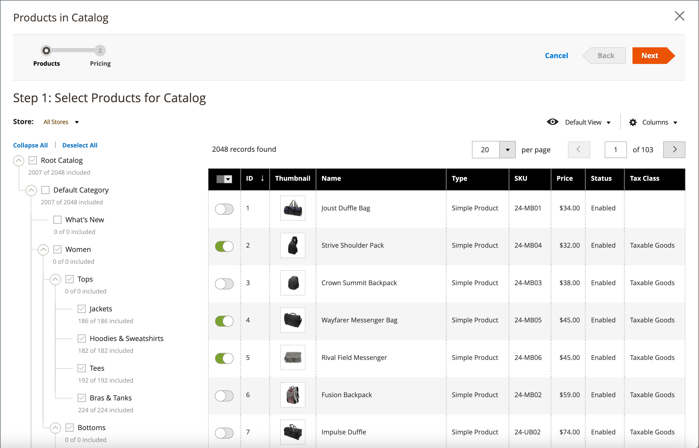
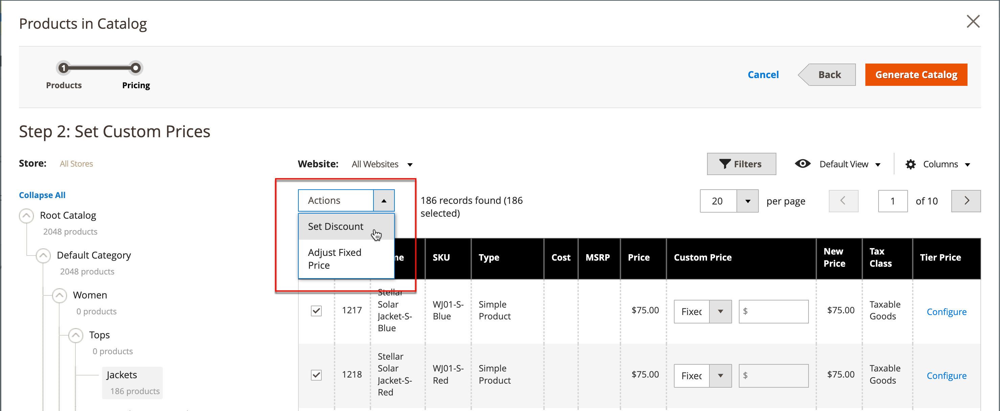

# Prijsbepaling en structuur van gedeelde catalogus instellen

Het instellen van de prijs en de structuur van een gedeelde catalogus bestaat uit twee stappen. De huidige plaats in het proces wordt gemarkeerd met een getal in de voortgangsbalk boven aan de pagina. U kunt de andere stap in het proces op elk gewenst moment weergeven door op de voortgangsbalk te klikken. Als u bijvoorbeeld werkt aan aangepaste prijzen, kunt u ter referentie terugkeren naar de pagina met productselectie. Eenvoudig klikken **[!UICONTROL Products]** in de voortgangsbalk boven aan de pagina en klik vervolgens op **[!UICONTROL Pricing]** om terug te keren naar de aangepaste prijspagina. Uw werk gaat hierbij niet verloren.

{width="700" zoomable="yes"}

In de standaardcategorieboom is de wortelcategorie de hoogste container en wordt bedoeld als _Standaardcategorie_ in de voorbeeldgegevens. Wanneer gedeelde catalogi echter zijn ingeschakeld, heeft de categoriestructuur een buitencontainer genaamd _Basiscatalogus_. De basiscatalogus omvat alle andere categoriefstructuren die in het systeem bestaan. Zie voor meer informatie [Bereik van catalogus](../catalog/introduction.md#catalog-scope).

## Stap 1: Open de gedeelde catalogusprijs en structuurconfiguratie

1. Op de _Beheerder_ zijbalk, ga naar **[!UICONTROL Catalog]** > **[!UICONTROL Shared Catalogs]**

1. Ga voor de gedeelde catalogus in het raster naar _[!UICONTROL Action]_kolom en klik op **[!UICONTROL Set Pricing and Structure]**.

   {width="700" zoomable="yes"}

1. De eerste keer dat de gedeelde catalogus wordt geconfigureerd, klikt u op **[!UICONTROL Configure]** om door te gaan met de volgende stappen.

## Stap 2: Kies de producten

De eerste stap in het proces is de producten te kiezen die u in de gedeelde catalogus wilt omvatten. De pagina met productselecties bevat de [categoriestructuur](../catalog/category-create.md) aan de linkerkant, en een gesynchroniseerd productnet op het recht. Als u op een categorie in de boomstructuur klikt, worden de producten in de categorie in het raster weergegeven.

Alleen categorieën met geselecteerde producten worden weergegeven in de [topnavigatie](../catalog/navigation-top.md) wanneer de gedeelde catalogus vanuit de storefront wordt bekeken. Standaard worden alleen de eerste drie categorieniveaus opgenomen in de storefront-navigatie, exclusief de hoofdcategorie.

1. Gebruik de **Winkel** kiezen om de [bereik](../catalog/introduction.md#product-scope) van de configuratie.

   Het bereik van de configuratie kan alleen worden ingesteld voordat de gedeelde catalogus voor het eerst wordt opgeslagen. Als u de productselectie later bewerkt, is de winkelkiezer niet beschikbaar.

   {width="600" zoomable="yes"}

1. Voer in de categoriestructuur een van de volgende handelingen uit:

   - Klik op **[!UICONTROL Select all]** of selecteer het selectievakje van de bovenliggende categorie.
   - Als u bepaalde productcategorieën wilt opnemen, schakelt u het selectievakje in van elke categorie die u wilt opnemen.
   - Als u een afzonderlijk product wilt opnemen of uitsluiten, schakelt u het selectievakje van het product in of uit.

   De notatie onder elke categorie in de structuur geeft het aantal producten van de categorie weer dat momenteel is opgenomen in de gedeelde catalogus. De notatie onder de [hoofdcategorie](../catalog/category-root.md) Hier wordt het totale aantal producten uit alle categorieën weergegeven die momenteel zijn geselecteerd voor de gedeelde catalogus.

1. Als u categorieproducten in het raster wilt weergeven, klikt u op de naam van de categorie in de boomstructuur. Wanneer een categorie wordt geselecteerd, komt het volgende voor:

   - De schakeloptie in de eerste kolom van het raster wordt ingesteld op groen _Aan_ positie voor elk geselecteerd product.
   - Als een product aan meerdere categorieën is toegewezen en niet in een van deze categorieën is geselecteerd, blijft het beschikbaar via de andere categorieën en ook bij het gebruik [cataloguszoekopdracht](../catalog/search.md).
   - Het systeem wordt automatisch ingesteld [Categoriemachtigingen](../catalog/category-permissions.md) tot `Allow` voor de geselecteerde producten.

1. Gebruik indien nodig de filters en andere rasterbesturingselementen om de producten te zoeken die u wilt opnemen in de gedeelde catalogus.

   U kunt afzonderlijke producten afzonderlijk selecteren of weglaten door op de schakeloptie in de eerste kolom te klikken.

   Als u een categorie selecteert die geen producten heeft, maar die is gekoppeld aan CMS-inhoud of een externe koppeling, wordt deze weergegeven in de bovenste navigatie in de winkel.

   De categoriemontages die u maakt worden niet permanent geregistreerd in het gegevensbestand tot de configuratie wordt bewaard. Ze worden echter tijdelijk opgeslagen terwijl u werkt aan de structuur en de prijs.

1. Klik op **[!UICONTROL Next]**.

   {width="600" zoomable="yes"}

## Stap 3: Aangepaste prijzen instellen

U kunt aangepaste prijzen voor elk product afzonderlijk instellen of de _[!UICONTROL Action]_controle om de aangepaste prijzen vast te stellen als een vast bedrag of percentage voor meerdere productdossiers.

- **[!UICONTROL Fixed]**: Geeft de uiteindelijke productprijs aan. Als u bijvoorbeeld een vaste prijs van € 10,00 invoert, is de prijs in de winkel voor het desbetreffende bedrijf $10,00.

  >[!NOTE]
  >
  >De minimumwaarde tussen de basisprijs en de ingevoerde vaste waarde wordt gebruikt als de uiteindelijke productprijs.

  >[!NOTE]
  >
  >**_Vaste prijs_** Aanpasbare opties voor producten zijn _niet_ worden beïnvloed door de regels voor groepsprijs, Tier-prijs, Speciale prijs of Catalogusprijs.

- **[!UICONTROL Percentage]**: Hiermee bepaalt u de aangepaste prijs op basis van het kortingspercentage. Als u bijvoorbeeld een korting van 10 procent wilt aanbieden, stelt u het aangepaste prijstype in op `Percentage` en betreden `10`. De verdisconteerde aangepaste prijs is 90 procent van de oorspronkelijke productprijs.

Als u de korting wilt instellen op een vast bedrag of op een percentage voor de volgende productsoorten, gebruikt u de optie _[!UICONTROL Custom Price]_kolom in het raster:

- [eenvoudig](../catalog/product-create-simple.md) (inclusief configureerbare productvariaties)
- [Bundel](../catalog/product-create-bundle.md)
- [Downloadbaar](../catalog/product-create-downloadable.md)
- [Virtueel](../catalog/product-create-virtual.md)

De kolom Aangepaste prijs is leeg voor [configureerbaar](../catalog/product-create-configurable.md) en [gegroepeerd](../catalog/product-create-grouped.md) productsoorten en voor [cadeaukaarten](../catalog/product-gift-card-create.md).

De selectie van producten in het raster kan niet worden gewijzigd ten opzichte van de _Aangepaste prijzen_ pagina. U kunt echter de voortgangsindicator boven aan de pagina gebruiken om terug te keren naar de vorige stap en de selectie van producten te wijzigen.

{width="600" zoomable="yes"}

### Een aangepaste prijs toepassen

1. Voor een installatie op meerdere locaties stelt u **[!UICONTROL Website]** op de website waarop de aangepaste prijzen van toepassing zijn.

   {width="600" zoomable="yes"}

1. Gebruik een van de volgende methoden om de producten te selecteren waarop de aangepaste prijs van toepassing is.

   - Gebruik de categoriestructuur om alle producten in een specifieke categorie te selecteren.
   - Stel de _[!UICONTROL Mass Actions]_besturingselement in de koptekst voor `Select All`.
   - Schakel het selectievakje voor afzonderlijke producten in.

   In het raster worden de producten in de momenteel geselecteerde categorieën weergegeven en u kunt de standaardbesturingselementen gebruiken om producten te zoeken en de lijst te filteren.

   {width="600" zoomable="yes"}

1. Set **[!UICONTROL Actions]** op een van de volgende wijzen:

   - `Set Discount` - Hiermee past u een korting toe op alle geselecteerde producten. Elke betrokken productprijs wordt weergegeven als een **_gedisconteerd_** prijs.
   - `Adjust Fixed Price` - Hiermee past u een korting op een vaste prijs toe op alle geselecteerde producten. Elke betrokken productprijs wordt weergegeven als een **_gecorrigeerd, vast_** prijs.

   {width="600" zoomable="yes"}

1. Voer desgevraagd de korting of de prijsaanpassing in en klik op **[!UICONTROL Apply]**.

   {width="400"} 

   {width="400"}

   De korting wordt toegepast op alle geselecteerde producten en de _Aangepaste prijs_ geeft het type korting en het toegepaste bedrag weer.

   {width="600" zoomable="yes"}

### Laagprijs toepassen

[Tier-prijsstelling](../catalog/product-price-tier.md) Hiermee kunt u een korting op het aantal producten in de gedeelde catalogus aanbieden. De _Tier-prijs_ bevat een koppeling naar de _Geavanceerde prijzen_ opties die specifiek van toepassing zijn op de gedeelde catalogus. Als het product reeds rijtarifering omvat, verschijnt het aantal bestaande rijen tussen haakjes na de verbinding.

De volgende instructies laten zien hoe u de prijzen op lagen kunt toepassen op één product. Als u laagprijzen wilt toepassen op meerdere producten, raadpleegt u [Invoerprijzen](../systems/data-import-price-tier.md).

1. Ga voor het product in het raster naar de _Tier-prijs_ kolom en klik op **[!UICONTROL Configure]**.

   {width="600" zoomable="yes"}

1. Op de _Geavanceerde prijzen_ pagina, klikt u **[!UICONTROL Add Price]** en voer de volgende handelingen uit:

   {width="600" zoomable="yes"}

   - Set **[!UICONTROL Website]** op de website waarop de tier-prijs van toepassing is.
   - Voer de hoeveelheid product in die u moet kopen om de korting te ontvangen.
   - Set **[!UICONTROL Price]** op een van de volgende kortingstypen:
      - `Fixed`
      - `Discount`
   - Voer het bedrag van de korting in.
   - Als u een andere laag wilt invoeren, klikt u op **Prijs toevoegen** en herhaal het proces om de volgende laag te definiëren.

   {width="600" zoomable="yes"}

1. Klik op **[!UICONTROL Done]**.

   In het raster wordt het aantal lagen tussen haakjes weergegeven in het dialoogvenster _[!UICONTROL Tier Price]_kolom.

   {width="600" zoomable="yes"}

## Structuur en prijzen opslaan

Wanneer de aangepaste prijs is voltooid, klikt u op **[!UICONTROL Generate Catalog]** dan **[!UICONTROL Save]**.

De gedeelde catalogus wordt nu opgeslagen in de database. De naam ervan wordt weergegeven in het dialoogvenster _[!UICONTROL Shared Catalog]_kolom van de_[!UICONTROL Products]_ raster. De volgende stap is: [de gedeelde catalogus toewijzen aan een bedrijf](./catalog-shared-assign-companies.md).
