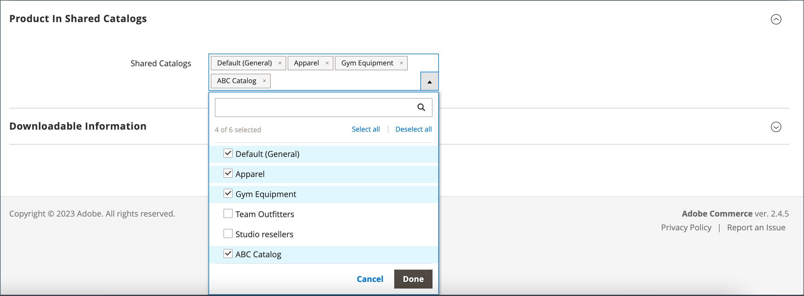

# Producten toevoegen aan een gedeelde catalogus

Producten kunnen afzonderlijk of in groepen van meerdere producten per categorie worden toegevoegd aan een gedeelde catalogus.

Een complex product (zoals bundel, gegroepeerd of configureerbaar) kan alleen zichtbaar zijn vanuit de winkel in een gedeelde catalogus als aan de volgende vereisten is voldaan:

- Alle [ bijbehorende producten ](../catalog/product-configurations.md) en de opties moeten aan de zelfde gedeelde catalogus worden toegewezen en in de primaire catalogus worden toegelaten.
- Voor [ configureerbare ](../catalog/product-create-configurable.md) en [ gegroepeerde ](../catalog/product-create-grouped.md) producten, slechts zijn de toegelaten bijbehorende producten zichtbaar.
- Voor a [ bundel ](../catalog/product-create-bundle.md) product, moeten alle opties in de gedeelde catalogus worden omvat.

  {width="600" zoomable="yes"}

## Methode 1: Eén product toevoegen

1. Voor _Admin_ sidebar, ga **[!UICONTROL Catalog]** > **[!UICONTROL Products]**.

1. Ga voor het product in het raster dat u wilt toevoegen naar de kolom _[!UICONTROL Action]_&#x200B;en klik op **[!UICONTROL Edit]**.

1. De rol neer, breidt  de _[!UICONTROL Product in Shared Catalogs]_&#x200B;sectie uit, en doet het volgende:

   - Schakel het selectievakje in van elke gedeelde catalogus waarin het product moet worden weergegeven. Klik op **[!UICONTROL Select all]** om alle catalogi te kiezen.

     {width="600" zoomable="yes"}

     De naam van elke geselecteerde catalogus wordt weergegeven in het veld _[!UICONTROL Shared Catalogs]_.

     {width="600" zoomable="yes"}

   - Klik op **[!UICONTROL Done]** om de instellingen op te slaan.

1. Klik op **[!UICONTROL Save]** als de bewerking is voltooid.

## Methode 2: Meerdere producten toevoegen

1. Voor _Admin_ sidebar, ga **[!UICONTROL Catalog]** > **[!UICONTROL Shared Catalogs]**.

1. Ga voor de gedeelde catalogus in het raster naar de kolom _[!UICONTROL Action]_&#x200B;en selecteer **[!UICONTROL Set Pricing and Structure]**.

1. Voer in de categoriestructuur een van de volgende handelingen uit:

   - Als u alle producten wilt opnemen, klikt u op **[!UICONTROL Select all]** of selecteert u het selectievakje van de bovenliggende categorie.
   - Als u bepaalde productcategorieën wilt opnemen, schakelt u het selectievakje in van elke categorie die u wilt opnemen.
   - Als u een afzonderlijk product wilt opnemen of uitsluiten, schakelt u het selectievakje van het product in of uit.

   De notatie onder elke categorie in de structuur geeft het aantal producten van de categorie weer dat momenteel is opgenomen in de gedeelde catalogus. De aantekening onder de [ wortelcategorie ](../catalog/category-root.md) toont het totale aantal producten van alle categorieën die momenteel voor de gedeelde catalogus worden geselecteerd.

1. Als u categorieproducten in het raster wilt weergeven, klikt u op de naam van de categorie in de boomstructuur.

   Wanneer een categorie wordt geselecteerd, komt het volgende voor:

   - De schakeloptie in de eerste kolom van het raster wordt ingesteld op `On` voor elk geselecteerd product.
   - Als een product aan veelvoudige categorieën wordt toegewezen en in één van hen weggelaten, blijft het beschikbaar door de andere categorieën en door [ catalogusonderzoek ](../catalog/search.md).
   - Het systeem plaatst automatisch [ Toestemmingen van de Categorie ](../catalog/category-permissions.md) aan `Allow` voor de geselecteerde producten.
