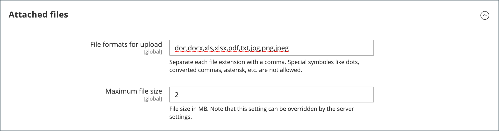

# Aanhalingstekens configureren

Als offertes zijn ingeschakeld in het algemene gedeelte [B2B-functies](enable-basic-features.md)kunt u ondersteuning voor aanhalingstekens configureren in de beheerfunctie. De configuratie met aanhalingstekens bepaalt de minimale vereiste volgordehoeveelheid voor aanhalingsverzoeken, de levensduur van de aanhalingstekens en de ondersteunde bestandsindelingen voor bijgevoegde bestanden.

>[!NOTE]
>
>De configuratieopties van het citaat en de capaciteit om de functies van de citaatonderhandeling te gebruiken worden gecontroleerd gebruikend [rolbronnen](../systems/permissions-user-roles.md#role-resources). Deze rolmiddelen moeten voor de Admin gebruikersrol worden geselecteerd die aan de Admin gebruikersrekening wordt toegewezen. Ga naar **[!UICONTROL System]** > _[!UICONTROL Permissions]_>**[!UICONTROL User Roles]**, selecteert u de rol en navigeert u naar [!UICONTROL Sales] > [!UICONTROL Operations] > [!UICONTROL Quotes] in de_ Rolresources _boom.

1. Op de _Beheerder_ zijbalk, ga naar **[!UICONTROL Stores]** > _[!UICONTROL Settings]_>**[!UICONTROL Configuration]**.

1. Vouw in het linkerdeelvenster uit **[!UICONTROL Sales]** en kiest u **[!UICONTROL Quotes]**.

1. Uitbreiden  de **[!UICONTROL General]** en voer de volgende handelingen uit:

   {width="700" zoomable="yes"}

   Zie [Aanhalingen](../configuration-reference/sales/quotes.md) in de _Configuratieverwijzing_ voor een volledige lijst van de eigenschapopties van Citaten en hun functies.

   - Voer de **[!UICONTROL Minimum Amount]** in het winkelwagentje waaraan moet worden voldaan voordat een prijsaanvraag kan worden ingediend.

   - Voor **[!UICONTROL Minimum Amount Message]** Voer het bericht in dat u wilt weergeven wanneer het totaal van de winkelwagentjes niet aan de vereiste minimumhoeveelheid voldoet.

   - Voor **[!UICONTROL Default Expiration Period]**, voert u het aantal **[!UICONTROL days]**, **[!UICONTROL weeks]**, of **[!UICONTROL months]** dat een prijsopgave geldig moet blijven.

1. Uitbreiden  de **[!UICONTROL Attached files]** en voer de volgende handelingen uit:

   - Voor **[!UICONTROL File formats for upload]** Voer het achtervoegsel in van elk bestandstype dat u ondersteunt voor bestanden die aan een aanhalingsteken zijn gekoppeld.

     Voer elk achtervoegsel in kleine letters in, gescheiden door een komma.

     Standaard worden de volgende indelingen ondersteund: `doc`, `docx`, `xls`, `xlsx`, `pdf`, `txt`, `jpg`, `png`, en `jpeg`

   - Voor **[!UICONTROL Maximum file size]**, voert u de maximale grootte van een bijgevoegd bestand in megabytes in.

     De waarde die u invoert, wordt mogelijk overschreven door de serverinstelling.

     {width="600" zoomable="yes"}

1. Klik op **[!UICONTROL Save Config]**.
