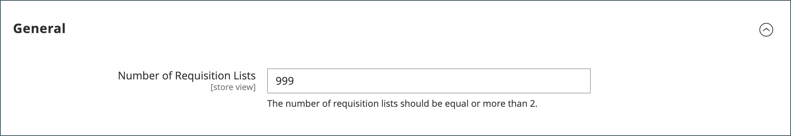

# Maximale lijst met aanvragen configureren

Wanneer de functie voor de lijst met aanvragen is ingeschakeld, kunnen klanten meerdere lijsten met vaak aangeschafte items maken en deze lijsten gebruiken voor plaatsing van bestellingen. Het is beschikbaar voor zowel aangemelde gebruikers als gasten. U kunt vraaglijsten toelaten wanneer u [&#x200B; de eigenschappen B2B &#x200B;](enable-basic-features.md) vormt.

Een klant kan meerdere lijsten hebben die zich richten op producten van verschillende leveranciers, kopers, teams, campagnes of iets anders dat algemene workflows stroomlijnt. [&#x200B; de lijstfunctionaliteit van de Verzoek &#x200B;](requisition-lists.md) is gelijkaardig aan wensenlijsten, met de volgende verschillen:

- Een aanvraaglijst wordt niet gewist nadat artikelen naar het winkelwagentje zijn verzonden. Het kan meerdere keren worden gebruikt.
- De gebruikersinterface voor aanvraaglijsten gebruikt een compacte weergave om veel items weer te geven.

Standaard kunnen klanten voor hun account maximaal 999 aanvraaglijsten bijhouden. Maar u kunt de configuratie wijzigen en een lager aantal specificeren om de lading op uw opslag te verminderen.

1. Voor _Admin_ sidebar, ga **[!UICONTROL Stores]** > _[!UICONTROL Settings]_>**[!UICONTROL Configuration]**.

1. Vouw in het linkerdeelvenster **[!UICONTROL Customers]** uit en kies **[!UICONTROL Requisition Lists]** .

   {width="600" zoomable="yes"}

1. Voer bij **[!UICONTROL Number of Requisition Lists]** het maximumaantal aanvraaglijsten in dat voor elke klantenaccount kan worden gehandhaafd.

   Het minimale getal is `2` en het maximale getal is `999` .

1. Klik op **[!UICONTROL Save Config]** als de bewerking is voltooid.
