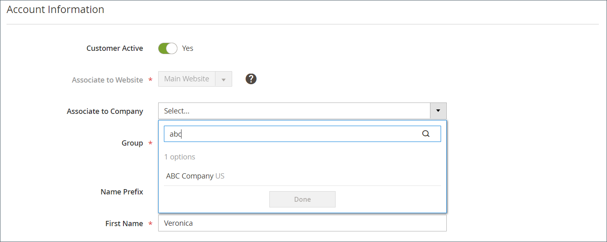

# Gebruikers toevoegen aan een bedrijfsaccount

Wanneer toegelaten in de configuratie, voegt de bedrijfbeheerder en beheert bedrijfgebruikers van de storefront toe. De accounts van bedrijfsgebruikers kunnen echter ook worden toegevoegd en beheerd via de beheerder.

Indien nodig, kunt u een gebruiker aan meer dan één bedrijf toewijzen. Als B2B-kopers bijvoorbeeld meerdere bedrijven ondersteunen, kunt u hun gebruikersaccounts toevoegen aan alle bedrijven waarmee ze zaken doen. In de winkel kunnen kopers die aan meerdere bedrijven zijn toegewezen, schakelen tussen bedrijfsaccounts door een keuze te maken uit de beschikbare bedrijven in het menu *[!UICONTROL Company]* .

{width="700"}

>[!NOTE]
>
>Als een persoon al een persoonlijke account bij uw winkel heeft en later voor een bedrijf gaat werken, moet u de individuele account van die persoon niet aan het bedrijf toewijzen. Maak in plaats daarvan een gebruikersaccount voor het bedrijf voor de persoon met een e-mailadres van het bedrijf.

## Een bedrijfsgebruiker toevoegen

Wanneer u een bedrijfgebruiker toevoegt, is het eerste bedrijf u met de gebruikersrekening associeert het standaardbedrijf.

1. Ga op de zijbalk Beheerder naar **[!UICONTROL Customers > All Customers]** .

1. Klik op **[!UICONTROL Add new customer]**.

1. Configureer de nieuwe account.

   1. Geef de status van het beginaccount op door de schakeloptie **[!UICONTROL Customer Active]** in te stellen.

      Schakel deze optie in om de account direct te activeren of schakel deze uit om een inactief account te maken.

   1. Selecteer het websitebereik in de lijst **[!UICONTROL Associate to Website]** .

   1. Klik op **[!UICONTROL Associate to Company]** om de beschikbare bedrijven weer te geven.

      {width="675"}

      Indien nodig, filtert u de lijst door de eerste paar letters van de bedrijfsnaam in het invoervak te typen.

   1. Selecteer in de lijst een of meer bedrijven waaraan u de klant wilt toewijzen en klik op **[!UICONTROL Done]** .

      De gebruikers van het bedrijf worden automatisch toegevoegd aan de klantengroep (of [ gedeelde catalogus ](catalog-shared.md)) voor elk bedrijf verbonden aan hun rekening.

   1. Voer de vereiste gegevens van de gebruikersaccount in: **[!UICONTROL First Name]**, **[!UICONTROL Last Name]** en **[!UICONTROL Email]** .

   1. Laat verkoopvertegenwoordigers zich namens de klant aanmelden bij de winkel door **[!UICONTROL Allow remote shopping assistance]** in te schakelen.

   1. Pas de wijzigingen toe door op **[!UICONTROL Save Customer]** te klikken.

      {width="675"}

In [!UICONTROL Customers grid] wordt een aparte rij weergegeven voor elk bedrijf waaraan de gebruiker is toegewezen. De volgende kolommen worden bijgewerkt.

- De kolom _[!UICONTROL Customer Type]_&#x200B;wordt bijgewerkt om de rol te tonen die aan de gebruiker wordt toegewezen.

  Als dit de eerste keer is dat de klant aan een bedrijf is toegewezen, wordt de kolom _[!UICONTROL Customer Type]_&#x200B;bijgewerkt van&#x200B;_[!UICONTROL Individual user]_ tot _[!UICONTROL Company User]_.

- De kolom _[!UICONTROL Group]_&#x200B;verandert in de naam van de klantengroep (of gedeelde catalogus) die aan het bedrijf wordt toegewezen.

- In de kolom _[!UICONTROL Company]_&#x200B;wordt de naam weergegeven van het bedrijf waaraan het klantprofiel nu is gekoppeld.

## Een gebruiker toewijzen aan een of meer bedrijfsaccounts

Wanneer u een nieuwe gebruiker toewijst, is het eerste bedrijf u met de gebruikersrekening associeert het standaardbedrijf.

1. Voor _Admin_ sidebar, ga **[!UICONTROL Customers]** > **[!UICONTROL All Customers]**.

1. Zoek de klant in het raster en klik op **[!UICONTROL Edit]** in de kolom _[!UICONTROL Action]_.

1. Kies **[!UICONTROL Account Information]** in het linkerdeelvenster.

1. Selecteer in de lijst **[!UICONTROL Associate to Company]** een of meer bedrijven die u aan de gebruiker wilt toewijzen en klik op **[!UICONTROL Done]** .

1. Pas de wijzigingen toe door op **[!UICONTROL Save Customer]** te klikken.

## De bedrijfstoewijzing van een gebruikersaccount verwijderen

Als u een bedrijf uit een gebruikersprofiel verwijdert, wordt de gebruikerstoegang tot dat bedrijf ingetrokken. Gebruikersgegevens blijven beschikbaar in de Admin. Als u alle bedrijfstoewijzingen verwijdert, verandert _[!UICONTROL Customer Type]_&#x200B;in *[!UICONTROL Individual user]*&#x200B;het uitschakelen van B2B-mogelijkheden voor de account.

1. Bewerk het klantprofiel dat u wilt bijwerken via het raster van de klant in de beheerder.

1. In de sectie * [!UICONTROL Account Information], verwijder een toegewezen bedrijf uit het **[!UICONTROL Associate to Company]** gebied door **[!UICONTROL X]** in het etiket van de bedrijfnaam te klikken.

1. Pas de wijzigingen toe door op **[!UICONTROL Save Customer]** te klikken.

>[!NOTE]
>
>Als een bedrijfgebruiker als bedrijfbeheerder wordt toegewezen, kunt u niet de bedrijfvereniging van deze gebruiker tot u de rekening van het Bedrijf bijwerkt om een nieuwe bedrijfbeheerder toe te wijzen.
