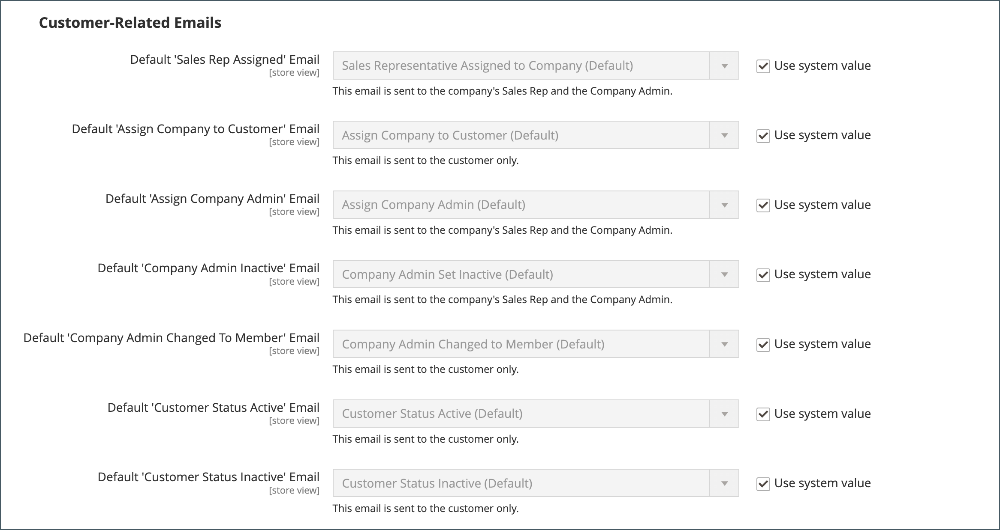

# E-mailopties voor bedrijven configureren

De [ verkoopvertegenwoordiger ](account-company-manage.md) die als primair contact voor een bedrijf wordt toegewezen wordt gevormd door gebrek als afzender van vele geautomatiseerde e-mailberichten die naar het bedrijf worden verzonden.

1. Voor _Admin_ sidebar, ga **[!UICONTROL Stores]** > _[!UICONTROL Settings]_>**[!UICONTROL Configuration]**.

1. Vouw in het linkerdeelvenster **[!UICONTROL Customers]** uit en kies **[!UICONTROL Company Configuration]** .

1. Indien nodig, plaats **[!UICONTROL Store View]** aan de opslagmening om het [ werkingsgebied ](../getting-started/websites-stores-views.md#scope-settings) van de configuratie te bepalen.

1. Voltooi de sectie **[!UICONTROL Company Registration]** :

   >[!NOTE]
   >
   >Schakel het selectievakje **[!UICONTROL Use system value]** uit om het veld bewerkbaar te maken.

   - Plaats **[!UICONTROL Company Registration Email Recipient]** aan het [ opslagcontact ](../getting-started/store-details.md#store-email-addresses) dat moet worden op de hoogte gebracht wanneer een nieuw verzoek van de bedrijfregistratie wordt ontvangen.

   - Voer in het veld **[!UICONTROL Send Company Registration Email Copy To]** het e-mailadres in van elke persoon die een kopie van het registratiebericht moet ontvangen. Scheid meerdere e-mailadressen met een komma.

   - Als u wilt bepalen hoe de kopie van het bericht wordt verzonden, stelt u **[!UICONTROL Send Email Copy Method]** in op een van de volgende opties:

      - `Bcc` - verzendt a _blinde beleefdheidsexemplaar_ door de ontvanger in de kopbal van zelfde e-mail te omvatten die naar de klant wordt verzonden. De ontvanger BCC is niet zichtbaar aan de klant.
      - `Separate Email` - Verzendt de kopie als een aparte e-mail.

   - Als u een e-mailsjabloon hebt voorbereid voor gebruik in plaats van de standaardsjabloon, stelt u **[!UICONTROL Default Company Registration Email]** in op de naam van de sjabloon. Standaard wordt de sjabloon `Company Registration Request` gebruikt.

     {width="600" zoomable="yes"}

1. Voltooi de sectie **[!UICONTROL Customer-Related Emails]** :

   Als u alternatieve e-mailsjablonen hebt voorbereid voor gebruik in plaats van de standaardinstellingen, kiest u de sjabloon die u wilt gebruiken voor elk van de volgende opties:

   - **[!UICONTROL Default 'Sales Rep Assigned' Email]**
   - **[!UICONTROL Default 'Assign Company to Customer' Email]**
   - **[!UICONTROL Default 'Assign Company Admin' Email]**
   - **[!UICONTROL Default 'Company Admin Inactive' Email]**
   - **[!UICONTROL Default 'Company Admin Changed to Member' Email]**
   - **[!UICONTROL Default 'Customer Status Active' Email]**
   - **[!UICONTROL Default 'Customer Status Inactive' Email]**

   {width="600" zoomable="yes"}

1. Voltooi de sectie **[!UICONTROL Company Status Change]** :

   - Plaats **[!UICONTROL Company Status Change for Email Recipient]** aan het [ opslagcontact ](../getting-started/store-details.md#store-email-addresses) dat moet worden op de hoogte gebracht wanneer het statuut van een bedrijf verandert.

   - Voer in het veld **[!UICONTROL Send Company Status Change Email Copy To]** het e-mailadres in van elke persoon die een kopie van het bericht over de statuswijziging moet ontvangen. Scheid meerdere e-mailadressen met een komma.

   - Als u wilt bepalen hoe de kopie van het bericht wordt verzonden, stelt u **[!UICONTROL Send Email Copy Method]** in op een van de volgende opties:

      - `Bcc` - verzendt a _blinde beleefdheidsexemplaar_ door de ontvanger in de kopbal van zelfde e-mail te omvatten die naar de klant wordt verzonden. De ontvanger BCC is niet zichtbaar aan de klant.
      - `Separate Email` - Verzendt de kopie als een aparte e-mail.

   - Als u een voorbereide e-mailsjabloon hebt die in plaats van de standaardsjabloon moet worden gebruikt wanneer de bedrijfsstatus verandert van `Pending Approval` in `Active` , stelt u **[!UICONTROL Default 'Company Status Change to Active 1' Email]** in op die sjabloon. Standaard wordt de sjabloon `Company Status Active 1` gebruikt.

   - Als u een voorbereide e-mailsjabloon hebt die in plaats van de standaardsjabloon moet worden gebruikt wanneer de bedrijfsstatus verandert van `Rejected` of `Blocked` in `Active` , stelt u **[!UICONTROL Default 'Company Status Change to Active 2' Email]** in op die sjabloon. Standaard wordt de sjabloon `Company Status Active 2` gebruikt.

   - Als u een voorbereide e-mailsjabloon hebt die in plaats van de standaardsjabloon moet worden gebruikt wanneer de bedrijfsstatus verandert in `Rejected` , stelt u **[!UICONTROL Default 'Company Status Change to Rejected' Email]** in op die sjabloon. Standaard wordt de sjabloon `Company Status Rejected` gebruikt.

   - Als u een voorbereide e-mailsjabloon hebt die in plaats van de standaardsjabloon moet worden gebruikt wanneer de bedrijfsstatus verandert in `Blocked` , stelt u **[!UICONTROL Default 'Company Status Change to Blocked' Email]** in op die sjabloon. Standaard wordt de sjabloon `Company Status Blocked` gebruikt.

   - Als u een voorbereide e-mailsjabloon hebt die in plaats van de standaardsjabloon moet worden gebruikt wanneer de bedrijfsstatus verandert in `Pending Approval` , stelt u **[!UICONTROL Default 'Company Status Change to Pending Approval' Email]** in op die sjabloon. Standaard wordt de sjabloon `Company Status Pending Approval` gebruikt.

     {width="600" zoomable="yes"}

1. Voltooi de sectie **[!UICONTROL Company Credit Emails]** :

   - Plaats **[!UICONTROL Company Credit Change Email Sender]** aan het [ opslagcontact ](../getting-started/store-details.md#store-email-addresses) dat moet worden op de hoogte gebracht wanneer een verandering aan de kredietgrens wordt aangebracht die aan een bedrijf wordt toegewezen. Door gebrek, wordt het bericht verzonden naar _Vertegenwoordiger van de Verkoop_.

   - Voer in het veld **[!UICONTROL Send Company Credit Change Email Copy To]** het e-mailadres in van elke persoon die een kopie van het bericht over de wijziging van het bedrag moet ontvangen. Scheid meerdere e-mailadressen met een komma.

   - Als u wilt bepalen hoe de kopie van het bericht wordt verzonden, stelt u **[!UICONTROL Send Email Copy Method]** in op een van de volgende opties:

      - `Bcc` - verzendt a _blinde beleefdheidsexemplaar_ door de ontvanger in de kopbal van zelfde e-mail te omvatten die naar de klant wordt verzonden. De ontvanger BCC is niet zichtbaar aan de klant.
      - `Separate Email` - Verzendt de kopie als een aparte e-mail.

   - Als u e-mailsjablonen hebt voorbereid voor gebruik in plaats van de standaardwaarden, kiest u de sjabloon voor elk van de volgende meldingen die naar de bedrijfsbeheerder worden verzonden.

      - **[!UICONTROL Allocated Email Template]**
      - **[!UICONTROL Updated Email Template]**
      - **[!UICONTROL Reimbursed Email Template]**
      - **[!UICONTROL Refunded Email Template]**
      - **[!UICONTROL Reverted Email Template]**

   {width="600" zoomable="yes"}

1. Klik op **[!UICONTROL Save Config]** als de bewerking is voltooid.
