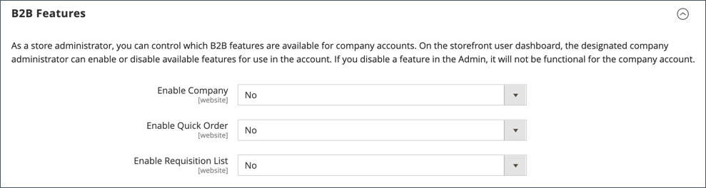

# B2B-functies inschakelen

Standaard zijn alle B2B-functies in eerste instantie uitgeschakeld. Een opslagbeheerder kan de B2B-functies naar behoefte voor de winkels van de Handel in- of uitschakelen. Voor een volledige lijst van B2B configuratiemontages, zie [B2B-configuratiereferentie Functies](../configuration-reference/general/b2b-features.md).

Wanneer u ondersteuning voor klantbedrijven inschakelt, worden automatisch extra B2B-functies ingeschakeld:

- [!DNL Shared Catalog]

  Ondersteunt aangepaste prijsconfiguratie voor verschillende bedrijven en schakelt ook categorietoestemmingen voor alle winkels in.

- [!DNL Enable Shared Catalog direct products price assigning]

  Verbetert plaatsprestaties door slechts producten op te slaan die aan een gedeelde catalogus in de prijsindex worden toegewezen. Het toelaten van deze eigenschap is een beste praktijk voor Merchants die vele gedeelde catalogi hebben om douaneprijzen voor verschillende bedrijven te beheren.

- [!DNL B2B Quotes]

  Verkopers en bedrijven krijgen de mogelijkheid om prijzen te onderhandelen.

- [!DNL B2B default payment and shipping methods]

  Hiermee bepaalt u de keuze van de betalings- en verzendopties die beschikbaar zijn voor B2B-kopers in de winkel.

De configuratie-instellingen voor deze functies zijn alleen zichtbaar wanneer [!DNL Enable Company] is ingesteld op `Yes`.

B2B [!DNL Quick Order] en [!DNL Requisition List] functies kunnen onafhankelijk van elkaar worden in- en uitgeschakeld.

## B2B-functies configureren

1. Op de _Beheerder_ zijbalk, ga naar **[!UICONTROL Stores]** > _[!UICONTROL Settings]_>**[!UICONTROL Configuration]**.

   Als u een installatie met meerdere sites hebt, stelt u de **[!UICONTROL Store View]** in de linkerbovenhoek van de website waarop de configuratie van toepassing is.

1. In het linkerdeelvenster onder _[!UICONTROL General]_, kiest u **[!UICONTROL B2B Features]**:

   {width="600"}

   - Klanten toestaan hun eigen bedrijfsaccounts te beheren en ondersteuning voor extra B2B-functies mogelijk te maken door **[!UICONTROL Enable Company]**  tot `Yes`.

     Wanneer u bedrijfssteun toelaat, worden de Gedeelde Catalogus, de Citaat B2B, de Methoden van de Betaling B2B, en de methodes van de Verzending B2B automatisch toegelaten.

   - Als u klanten en gasten wilt toestaan snel bestellingen te plaatsen op basis van SKU of productnaam, stelt u **[!UICONTROL Enable Quick Order]** tot `Yes`.

   - Als u klanten wilt toestaan om aanvraaglijsten te maken en te beheren vanaf hun accountdashboard, stelt u **[!UICONTROL Enable Requisition List]** tot `Yes`.

     U kunt [vorm het maximumaantal lijsten](configure-requisition-lists.md) een klant kan over een account beschikken.

1. Klik op **[!UICONTROL Save Config]**.

## Standaard B2B-betalings- en verzendmethoden configureren

1. Uitbreiden  de **[!UICONTROL Default B2B Payment Methods]** sectie.

1. Om de betalingsmethoden voor wanbetaling voor B2B-orders vast te stellen, stelt u **[!UICONTROL Applicable Payment Methods]** op een van de volgende wijzen:

   - `All Payment Methods`

   - `Selected Payment Methods`

     Selecteer voor de specifieke optie de optie **[!UICONTROL Payment Methods]** die u aan uw klanten beschikbaar wilt maken door de sleutel van CTRL (PC) of van het Bevel (Mac) te onderdrukken aangezien u elke optie klikt.

   De lijst van [betalingsmethoden](../configuration-reference/sales/payment-methods.md) toont welke opties momenteel in uw opslag worden toegelaten of worden onbruikbaar gemaakt. Naast de standaardbetalingsmethoden bevat de lijst ook het volgende:

   - Geen betalingsgegevens vereist
   - [Betaling op rekening](#configure-payment-on-account)
   - Opgeslagen accounts
   - Opgeslagen kaarten

   {width="600"}

1. Uitbreiden  de **[!UICONTROL Default B2B Shipping Methods]** sectie.

1. Als u de standaardverzendmethoden voor B2B-bestellingen wilt opgeven, stelt u **[!UICONTROL Applicable Shipping Methods]** op een van de volgende wijzen:

   - `All Shipping Methods`
   - `Selected Shipping Methods`

     Selecteer voor de specifieke optie de optie **[!UICONTROL Shipping Methods]** die u aan uw klanten beschikbaar wilt maken door de sleutel van CTRL (PC) of van het Bevel (Mac) te onderdrukken aangezien u elke optie klikt.

     De lijst met verzendmethoden toont welke momenteel zijn [ingeschakeld of uitgeschakeld](../configuration-reference/sales/delivery-methods.md).

   {width="600"}

1. Klik op **[!UICONTROL Save Config]**.

## E-mailopties voor bedrijven configureren

De [verkoopvertegenwoordiger](account-company-manage.md#assign-a-sales-representative) dat als primair contact voor een bedrijf wordt toegewezen wordt gevormd door gebrek als afzender van vele geautomatiseerde e-mailberichten die naar het bedrijf worden verzonden.

1. Op de _Beheerder_ zijbalk, ga naar **[!UICONTROL Stores]** > _[!UICONTROL Settings]_>**[!UICONTROL Configuration]**.

1. Vouw in het linkerdeelvenster uit **[!UICONTROL Customers]** en kiest u **[!UICONTROL Company Configuration]**.

1. Indien nodig, instellen **[!UICONTROL Store View]** in de winkelweergave om de [bereik](../getting-started/websites-stores-views.md#scope-settings) van de configuratie.

1. Voltooi de **[!UICONTROL Company Registration]** sectie:

   >[!NOTE]
   >
   >Wis de **[!UICONTROL Use system value]** Schakel het selectievakje in om het veld bewerkbaar te maken.

   - Set **[!UICONTROL Company Registration Email Recipient]** aan de [contactpersoon voor winkel](../getting-started/store-details.md#store-email-addresses) wie op de hoogte moet worden gesteld wanneer een nieuw registratieverzoek van een vennootschap wordt ontvangen.

   - Voor **[!UICONTROL Send Company Registration Email Copy To]** Voer het e-mailadres in van elke persoon die een kopie van de registratiekennisgeving moet ontvangen. Scheid meerdere e-mailadressen met een komma.

   - Als u wilt bepalen hoe de kopie van het bericht wordt verzonden, stelt u **E-mailkopieermethode verzenden** op een van de volgende wijzen:

      - `Bcc` - verzendt een _blinde, hoffelijke kopie_ door de ontvanger op te nemen in de koptekst van dezelfde e-mail die naar de klant is verzonden. De ontvanger BCC is niet zichtbaar aan de klant.
      - `Separate Email` - Hiermee verzendt u de kopie als een aparte e-mail.

   - Als u een e-mailsjabloon hebt voorbereid voor gebruik in plaats van de standaardsjabloon, stelt u **[!UICONTROL Default Company Registration Email]** op de naam van de sjabloon. Standaard worden de `Company Registration Request` sjabloon wordt gebruikt.

     {width="600"}

1. Voltooi de **[!UICONTROL Customer-Related Emails]** sectie:

   Als u alternatieve e-mailsjablonen hebt voorbereid voor gebruik in plaats van de standaardinstellingen, kiest u de sjabloon die u wilt gebruiken voor elk van de volgende opties:

   - **[!UICONTROL Default 'Sales Rep Assigned' Email]**
   - **[!UICONTROL Default 'Assign Company to Customer' Email]**
   - **[!UICONTROL Default 'Assign Company Admin' Email]**
   - **[!UICONTROL Default 'Company Admin Inactive' Email]**
   - **[!UICONTROL Default 'Company Admin Changed to Member' Email]**
   - **[!UICONTROL Default 'Customer Status Active' Email]**
   - **[!UICONTROL Default 'Customer Status Inactive' Email]**

   {width="600"}

1. Voltooi de **[!UICONTROL Company Status Change]** sectie:

   - Voor **[!UICONTROL Send Company Status Change Email Copy To]**, voert u het e-mailadres in van elke persoon die een kopie van het bericht voor statuswijziging moet ontvangen. Scheid meerdere e-mailadressen met een komma.

   - Als u wilt bepalen hoe de kopie van het bericht wordt verzonden, stelt u **E-mailkopieermethode verzenden** op een van de volgende wijzen:

      - `Bcc` - verzendt een _blinde, hoffelijke kopie_ door de ontvanger op te nemen in de koptekst van dezelfde e-mail die naar de klant is verzonden. De ontvanger BCC is niet zichtbaar aan de klant.
      - `Separate Email` - Hiermee verzendt u de kopie als een aparte e-mail.

   - Als u een e-mailsjabloon hebt voorbereid die moet worden gebruikt wanneer de bedrijfsstatus verandert van `Pending Approval` tot `Active`, set **[!UICONTROL Default 'Company Status Change to Active 1' Email]** op de naam van de sjabloon. Standaard worden de `Company Status Active 1` sjabloon wordt gebruikt.

   - Als u een e-mailsjabloon hebt voorbereid die moet worden gebruikt wanneer de bedrijfsstatus verandert van `Rejected` of `Blocked` tot `Active`, set **[!UICONTROL Default 'Company Status Change to Active 2' Email]** op de naam van de sjabloon. Standaard worden de `Company Status Active 2` sjabloon wordt gebruikt.

   - Als u een e-mailsjabloon hebt voorbereid die moet worden gebruikt wanneer de bedrijfsstatus verandert in `Rejected`, set **[!UICONTROL Default 'Company Status Change to Rejected' Email]** op de naam van de sjabloon. Standaard worden de `Company Status Rejected` sjabloon wordt gebruikt.

   - Als u een e-mailsjabloon hebt voorbereid die moet worden gebruikt wanneer de bedrijfsstatus verandert in `Blocked`, set **[!UICONTROL Default 'Company Status Change to Blocked' Email]** op de naam van de sjabloon. Standaard worden de `Company Status Blocked` sjabloon wordt gebruikt.

   - Als u een e-mailsjabloon hebt voorbereid die moet worden gebruikt wanneer de bedrijfsstatus verandert in `Pending Approval`, set **[!UICONTROL Default 'Company Status Change to Pending Approval' Email]** op de naam van de sjabloon. Standaard worden de `Company Status Pending Approval` sjabloon wordt gebruikt.

   {width="600"}

1. Voltooi de **[!UICONTROL Company Credit Emails]** sectie:

   - Set **[!UICONTROL Company Credit Change Email Sender]** aan de [contactpersoon voor winkel](../getting-started/store-details.md#store-email-addresses) wie op de hoogte moet worden gebracht wanneer de kredietlimiet die aan een onderneming is toegekend, wordt gewijzigd. Standaard wordt het bericht verzonden naar _Verkoopvertegenwoordiger_.

   - Voor **[!UICONTROL Send Company Credit Change Email Copy To]** Voer het e-mailadres in van elke persoon die een kopie van de kennisgeving van kredietwijziging moet ontvangen. Scheid meerdere e-mailadressen met een komma.

   - Als u wilt bepalen hoe de kopie van het bericht wordt verzonden, stelt u **E-mailkopieermethode verzenden** op een van de volgende wijzen:

      - `Bcc` - verzendt een _blinde, hoffelijke kopie_ door de ontvanger op te nemen in de koptekst van dezelfde e-mail die naar de klant is verzonden. De ontvanger BCC is niet zichtbaar aan de klant.
      - `Separate Email` - Hiermee verzendt u de kopie als een aparte e-mail.

   - Als u e-mailsjablonen hebt voorbereid voor gebruik in plaats van de standaardwaarden, kiest u de sjabloon voor elk van de volgende meldingen die naar de bedrijfsbeheerder worden verzonden.

      - **[!UICONTROL Allocated Email Template]**
      - **[!UICONTROL Updated Email Template]**
      - **[!UICONTROL Reimbursed Email Template]**
      - **[!UICONTROL Refunded Email Template]**
      - **[!UICONTROL Reverted Email Template]**

   {width="600"}

1. Klik op **[!UICONTROL Save Config]**.

## Goedkeuring van bestellingen configureren

Door de mogelijkheid om bestellingen te verwerken en aan te schaffen, kunnen bedrijfsbeheerders de handelingen van de kopers van het bedrijf controleren. De functionaliteit voor het goedkeuren van bestellingen is beschikbaar wanneer de functie voor inkooporders is ingeschakeld door een beheerder van de winkel.

1. Op de _Beheerder_ zijbalk, ga naar **[!UICONTROL Stores]** > _[!UICONTROL Settings]_>**[!UICONTROL Configuration]**.

1. Vouw in het linkerdeelvenster uit **[!UICONTROL General]** en kiest u **[!UICONTROL B2B Features]**.

1. Uitbreiden  de **[!UICONTROL Order Approval Configuration]** sectie.

   {width="600"}

1. Om bedrijven toe te staan om hun eigen inkooporders te creëren, plaats **[!UICONTROL Enable Purchase Orders]** tot `Yes`.

1. Klik op **[!UICONTROL Save Config]**.

   De functie voor inkooporders is ingeschakeld op websiteniveau. Om dit type orde voor een bedrijf toe te laten, doe het zelfde met de aangewezen montages in elk [bedrijfsprofiel](account-company-manage.md).

## Aankooporders configureren

1. Op de _Beheerder_ zijbalk, ga naar **[!UICONTROL Customers]** > **[!UICONTROL Companies]**.

1. Zoek het bedrijf in de lijst en klik op **[!UICONTROL Edit]**.

1. Uitbreiden  de **[!UICONTROL Advanced Settings]** sectie.

1. Set **[!UICONTROL Enable Purchase Orders]** tot `Yes`.

1. Klik op **[!UICONTROL Save]**.

Na activering **[!UICONTROL Approval Rules]** sectie wordt weergegeven in de winkel [Accountdashboard](../customers/account-dashboard.md) voor een bedrijfsbeheerder.

>[!NOTE]
>
>De beheerder van het bedrijf moet toegang tot de inkooporder op de winkel verlenen op basis van [gebruikersrolmachtigingen van het bedrijf](account-company-roles-permissions.md).

## Betaling op account configureren

Betaling op rekening is een methode voor offlinebetalingen waarmee bedrijven aankopen kunnen doen tot de kredietlimiet die in hun profiel is opgegeven. Betaling op account kan globaal of per bedrijf worden ingeschakeld en wordt alleen tijdens het afrekenen weergegeven als dit is ingeschakeld. Wanneer _Betaling op rekening_ als betalingsmethode wordt gebruikt, verschijnt boven aan de bestelling een bericht dat de status van de rekening aangeeft. Om deze betalingsmethode voor een specifiek bedrijf te vormen, zie [Bedrijfsaccounts beheren](account-company-manage.md).

>[!NOTE]
>
>Betaling op account wordt niet ondersteund voor bestellingen met [meerdere verzendadressen](../stores-purchase/shipping-settings.md#multiple-addresses) en niet als een van de betalingsopties voor deze bestellingen wordt weergegeven.

Betaling op account inschakelen voor je winkel:

1. Op de _Beheerder_ zijbalk, ga naar **[!UICONTROL Stores]** > _[!UICONTROL Settings]_>**[!UICONTROL Configuration]**.

1. Vouw in het linkerdeelvenster uit **[!UICONTROL Sales]** en kiest u **[!UICONTROL Payment Methods]**.

1. Uitbreiden  de **[!UICONTROL Payment on Account]** sectie.

   {width="600"}

   >[!NOTE]
   >
   >Schakel indien nodig eerst de optie **[!UICONTROL Use system value]** Schakel het selectievakje in om deze instellingen te wijzigen.

1. Als je vooruitbetaling wilt toestaan, stelt u **[!UICONTROL Enabled]** tot `Yes`.

1. Voer een **[!UICONTROL Title]** die de betalingsmethode identificeert tijdens de afhandeling, of u kunt de `Payment on Account` standaardtitel.

1. Als de orden typisch op goedkeuring wachten, keur het gebrek goed **[!UICONTROL New Order Status]** als `Pending` totdat het is goedgekeurd.

   U kunt desgewenst de opdracht `Processing` of `Suspected Fraud` status voor nieuwe orders met deze betalingsmethode.

1. Set **[!UICONTROL Payment from Applicable Countries]** op een van de volgende wijzen:

   - `All Allowed Countries` - Klanten van iedereen [landen](../getting-started/store-details.md#country-options) Deze betalingsmethode kan worden gebruikt.
   - `Specific Countries` - Nadat u deze optie hebt gekozen, _[!UICONTROL Payment from Specific Countries]_wordt weergegeven. Als u meerdere landen wilt selecteren, houdt u Ctrl (PC) of Command (Mac) ingedrukt en klikt u op elke optie.

1. Set **[!UICONTROL Minimum Order Total]** en **[!UICONTROL Maximum Order Total]** de bedragen van de bestelling die nodig zijn om voor deze betalingsmethode in aanmerking te komen.

   >[!NOTE]
   >
   >Een orde komt in aanmerking als het totaal tussen, of precies aanpast, de minimum of maximumtotale waarden valt.

1. Voer een **[!UICONTROL Sort Order]** getal dat de positie van dit object instelt in de lijst met betalingsmethoden die tijdens het afrekenen wordt weergegeven.

   De waarde is relatief ten opzichte van de andere betalingsmethoden. (`0` = eerst, `1` = seconde, `2` = derde, enzovoort.)

1. Klik op **[!UICONTROL Save Config]**.
