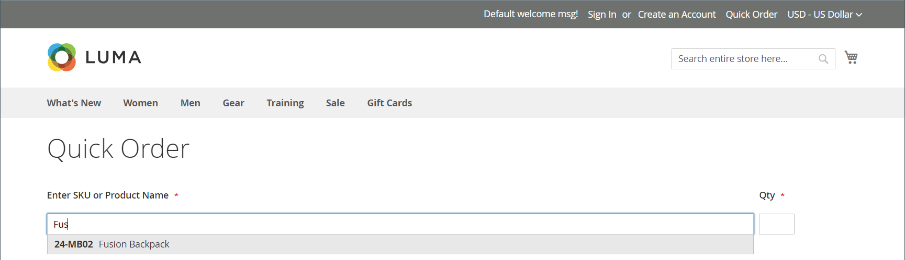
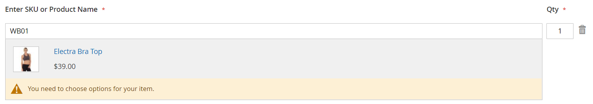

# Snelle bestellingen

De _Snelle bestelling_ De eigenschap vermindert het ordeproces tot verscheidene kliks voor klanten die de productnaam of SKU van de producten kennen die zij tot opdracht willen geven. Orders met meerdere SKU&#39;s kunnen handmatig worden ingevoerd of in het formulier Snelle volgorde worden ingevoerd. De snelle orde kan door klanten worden gebruikt die aan hun rekeningen, en door gasten worden het programma geopend. Als deze optie is ingeschakeld, wordt _Snelle bestelling_ de koppeling wordt boven aan de pagina weergegeven, naast de naam van de klant.

{width="700" zoomable="yes"}

## Snelle bestellingen inschakelen voor uw winkel

1. Op de _Beheerder_ zijbalk, ga naar **[!UICONTROL Stores]** > _[!UICONTROL Settings]_>**[!UICONTROL Configuration]**.

1. In de _[!UICONTROL General]_in het linkerdeelvenster kiest u **[!UICONTROL B2B Features]**.

1. Set **[!UICONTROL Enable Quick Order]** tot `Yes`.

   {width="600" zoomable="yes"}

1. Klik op **[!UICONTROL Save Config]**.

1. Klik op [Cachebeheer](../systems/cache-management.md) en vernieuw eventuele ongeldige caches.

## Workflows voor snelle volgorde

Klanten kunnen producten voor snelle bestellingen opgeven met een van de volgende methoden.

### Methode 1: afzonderlijke producten invoeren

1. De klant klikt op de knop **[!UICONTROL Quick Order]** koppeling.

1. Selecteert het product op SKU of productnaam:

   Een **snelle bestelling door SKU**, doet de klant het volgende:

   - Hiermee wordt het dialoogvenster **[!UICONTROL SKU]**.

   - Klikken **[!UICONTROL Add to List]**.

     De SKU verschijnt in de inputlijn, met de productdetails hieronder.

     {width="600" zoomable="yes"}

   Een **snelle bestelling met de productnaam**, doet de klant het volgende:

   - Voert de eerste paar tekens van het dialoogvenster in **[!UICONTROL Product Name]**.

     >[!NOTE]
     >
     >Gebruik de _Enter_ om de naam van het product te kiezen.

   - Wanneer de lijst met mogelijke overeenkomsten wordt weergegeven, klikt de klant op het product dat hij of zij wil bestellen.

     {width="700" zoomable="yes"}

1. Hiermee wordt het dialoogvenster **[!UICONTROL Qty]**.

1. Gebruikend de volgende inputlijn, herhaalt dit proces zo vaak als noodzakelijk.

1. Klikken **[!UICONTROL Add to Cart]**.

### Methode 2: meerdere producten invoeren

1. In de **[!UICONTROL Enter Multiple SKUs]** voert de klant een van de volgende handelingen uit:

   - voert één SKU per regel in

   - Hiermee voert u alle SKU&#39;s op dezelfde regel in, gescheiden door komma&#39;s en zonder spaties.

     {width="600" zoomable="yes"}

1. Als u de producten aan de lijst wilt toevoegen, klikt u op **[!UICONTROL Add to List]**.

1. Hiermee wordt het dialoogvenster **[!UICONTROL Qty]** te bestellen voor elk item in de lijst.

   {width="600" zoomable="yes"}

   >[!NOTE]
   >
   >Als het product de vereiste opties heeft, wordt de klant gevraagd om de opties te kiezen. Ze kunnen wachten tot ze het winkelwagentje bereiken om productopties toe te voegen.

   {width="600" zoomable="yes"}

### Methode 3: Een lijst met producten uploaden

1. In de _[!UICONTROL Add from File]_sectie, klikken **[!UICONTROL Download Sample]**om een ordersjabloon te downloaden.

   {width="600" zoomable="yes"}

1. Hiermee opent u het gedownloade bestand.

1. Gebruikt de sjabloon om de product-SKU&#39;s toe te voegen die u wilt uploaden voor de lijst Snelle volgorde.

1. Na voltooiing klikt u op **[!UICONTROL Save]**.

   {width="400" zoomable="yes"}

1. Klik op **[!UICONTROL Choose]** en selecteert het bestand van hun systeem.

   De items worden toegevoegd aan de lijst Snelle volgorde.

1. Klik wanneer u klaar bent op **[!UICONTROL Add to Cart]**.

Nadat de klant de snelle bestelling heeft gemaakt, kan hij of zij op de gebruikelijke wijze de afhandeling voltooien.

{width="700" zoomable="yes"}
