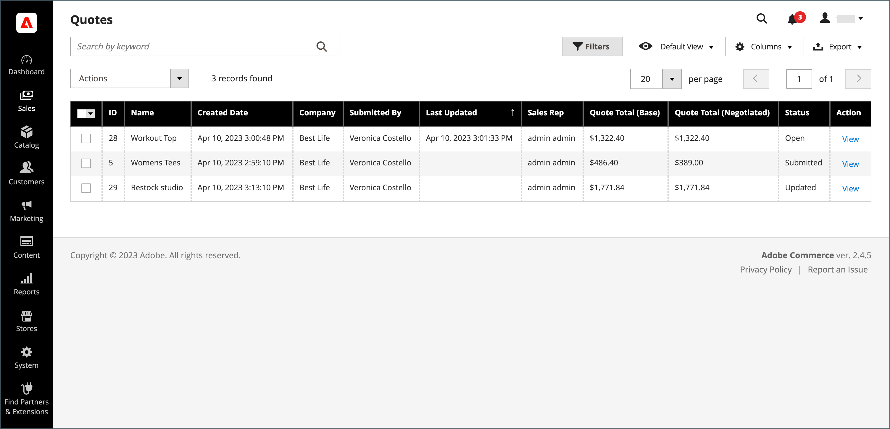

# Onderhandelingen over een offerte

Indien [B2B-aanhalingstekens zijn ingeschakeld](configure-quotes.md) in de configuratie kan een geautoriseerde koper van een onderneming of een verkoopvertegenwoordiger prijsonderhandelingen openen .

Kopers starten het prijsonderhandelingsproces door [aanhalingsteken aanvragen](quote-request.md) uit de winkelwagentje. Verkoopvertegenwoordigers kunnen onderhandelingen beginnen door [een conceptprijsopgave voor een koper maken](sales-rep-initiates-quote.md), door het aanhalingsteken bij te werken met de eerste bestelling en de prijzen, en het aan de koper te sturen.

Wanneer de prijsonderhandeling begint, worden de citaten vermeld in [Aanhalingen](quotes.md) raster. Alle onderhandelingen tussen de koper en de verkoper vinden plaats per e-mail en worden gestart en bijgehouden vanuit de gedetailleerde weergave van de prijsopgave.

Tijdens het onderhandelingsproces kan de verkoper het volgende doen via de beheerder:

- Producten toevoegen of verwijderen
- Het aantal wijzigen
- Een korting toepassen op regelobjecten of op de totale prijs
- Verzendmethode toevoegen of wijzigen
- Opmerkingen toevoegen
- De bijgewerkte prijsopgave naar de koper sturen of opslaan als concept

Kopers beheren het onderhandelingsproces voor aanhalingstekens vanuit de winkel met [[!UICONTROL My Quotes]](account-dashboard-my-quotes.md). Terwijl de prijsopgave kan worden gecontroleerd, wordt de status op de rekening van de koper ingesteld op `Pending`. De koper kan de prijsopgave wijzigen en opnieuw verzenden, zelfs als deze is afgewezen of verlopen is.

## Stap 1: De aanvraag weergeven

1. Ga op de zijbalk Beheerder naar **[!UICONTROL Sales]** > **[!UICONTROL Quotes]**.

   Het nieuwe verzoek wordt weergegeven in het dialoogvenster _[!UICONTROL Quotes]_raster.

1. In de _Handelingen_ kolom, klik **[!UICONTROL View]**.

   {width="700" zoomable="yes"}

## Stap 2: Het aanhalingsteken wijzigen

1. Onder _[!UICONTROL Quote & Account Information]_klikt u op de knop_ Kalender _().

   {width="575" zoomable="yes"}

1. Kies een **[!UICONTROL Expiration Date]** voor het citaat.

1. Omlaag schuiven naar de _[!UICONTROL Quote Totals]_en werkt de **[!UICONTROL Negotiated Price]**indien nodig.

   {width="600" zoomable="yes"}

   Als de koper de hoeveelheid in de prijsopgave vermelde items wijzigt, wordt boven aan de prijsopgave een bericht weergegeven waarin wordt aangegeven dat de lijst met artikelen is gewijzigd en dat de prijs van de overeenkomst moet worden bijgewerkt.

   {width="600" zoomable="yes"}

### Nieuwe producten aan de prijsopgave toevoegen

1. Klik op **[!UICONTROL Add Products by SKU]**.

1. Voer de **[!UICONTROL SKU]** en **[!UICONTROL Qty]** toe te voegen.

   {width="600" zoomable="yes"}

### Regelitemupdates toepassen

Wijzigingen voor regelitems toepassen in het dialoogvenster _[!UICONTROL Items Quoted]_indien nodig.

{width="600" zoomable="yes"}

- Wijzig de **[!UICONTROL Quantity]** die tegen de voorgestelde prijs moeten worden gekocht.

- Selecteren **[!UICONTROL Configure]** en wijzigt u de productopties.

  De [!UICONTROL Configure] optie is beschikbaar slechts op een lijnpunt voor een configureerbaar product

- In de **[!UICONTROL Action]** selecteert u een handeling om het item bij te werken:
   - **Korting op item** om een korting toe te passen als een percentage, vast bedrag, of aangewezen prijs.
U kunt desgewenst het kortingsbedrag vergrendelen om verdere kortingen te voorkomen. Als de korting niet vergrendeld is, worden zowel de korting op het regelitem als de korting op het prijsniveau toegepast op de productprijs.
   - **Een opmerking aan de koper geven** om de koper aanvullende informatie over een object te geven
   - **Verwijderen** om een item uit het citaat te verwijderen.

### Wijzigingen toepassen en bijwerken

- Als u wijzigingen wilt toepassen, klikt u op **[!UICONTROL Add to Quote]**.

- Als u het citaat wilt bijwerken, klikt u op **[!UICONTROL Recalculate the Quote]**.

- Klik op **[!UICONTROL Update Prices]** en klik vervolgens op **[!UICONTROL Proceed]** om de update te bevestigen.

  {width="600" zoomable="yes"}

### Verzendgegevens bijwerken

1. Als de koper een _Verzenden naar_ adres in het citaat, klik **[!UICONTROL Get shipping methods and rates]**.

1. Kies een verzendmethode uit de beschikbare opties.

1. Voer een **[!UICONTROL Proposed Shipping Price]**.

   De _[!UICONTROL Quote Totals]_worden aangepast aan de voorgestelde verzendprijs.

### Voeg een ondersteunend document bij

1. Onder de _Opmerking toevoegen_ vak, klikt u op **[!UICONTROL Attach file]**.

   Standaard, [bijgevoegde bestanden](../configuration-reference/sales/quotes.md) U kunt maximaal 2 MB in een van de volgende bestandsindelingen gebruiken: DOC, DOCX, XLS, XLSX, PDF, TXT, JPG of JPEG, PNG.

1. Kies het bestand in de map.

## Stap 3: Werk citaat-vlakke informatie bij, en verzend uw antwoord

1. In de _[!UICONTROL Negotiation]_de_[!UICONTROL Comments]_ -tabblad, voert u uw antwoord in in het dialoogvenster **[!UICONTROL Add your comment]** sectie.

1. Als u een ondersteunend document wilt opnemen, klikt u op **[!UICONTROL Attach file]** en selecteer het bestand in de map.

   De maximale bestandsgrootte voor bijlagen is 2 MB.

1. Een korting toepassen op het volledige citaat:

   - Onder _[!UICONTROL Quote Totals]_in de_[!UICONTROL Negotiated Price]_ kiest u een van de volgende kortingstypen:

      - `Percentage Discount`
      - `Amount Discount`
      - `Proposed Price`

   - Voer het bedrag in als een percentage of een vaste prijs.

     {width="600" zoomable="yes"}

1. De offerte verzenden of opslaan:

   - Als de prijsopgave klaar is om naar de koper te worden teruggestuurd, klikt u op **[!UICONTROL Send]**.

   - Als u het aanhalingsteken later wilt blijven gebruiken, klikt u op **[!UICONTROL Save as Draft]**.

## Stap 4: Follow-up van een prijsopgave

Wanneer u een prijsopgave verzendt, brengt het systeem zowel de koper als de verkoper op de hoogte die het bedrijfsaccount beheren. Het e-mailbericht bevat een koppeling naar de prijsopgave op de rekening van de koper en de vervaldatum van de prijsopgave. Op elk moment in de onderhandeling kan de koper het volgende doen:

- Accepteer de onderhandelde prijsopgave en voltooi de aankoop.
- Stuur een antwoord met een tegenaanbod en ga verder met de onderhandelingen.
- Beëindig de onderhandelingen.

Controleer uw e-mail en de status van het aanhalingsteken in het raster om de positie in de workflow te controleren. U kunt het onderhandelingsproces zo lang als nodig voortzetten.

## Knopbalk

| Knop | Beschrijving |
|----------------------------|---------------------------------------------------------------------------------------------------------------------------------------------------------------------------------------------------------------------------------------------------------------------------------------------------------------------------------------------------------------|
| [!UICONTROL Back] | Hiermee wordt de _[!UICONTROL Quotes]_pagina zonder wijzigingen op te slaan. |
| [!UICONTROL Print] | Verzendt het aanhalingsteken naar een printer of slaat het op als een PDF-bestand. |
| [!UICONTROL Create Copy] | [!BADGE 1.5.0 bètamogelijkheden]{type=Informative url="/help/b2b/release-notes.md" tooltip="Alleen beschikbaar voor deelnemers aan het bètaprogramma"}`(copy)` toegevoegd aan de oorspronkelijke naam. Wijzig de naam van het nieuwe aanhalingsteken door het [!UICONTROL Name] veld. Verwerk het nieuwe aanhalingsteken door het als concept op te slaan of te verzenden naar de klant. |
| [!UICONTROL Save as Draft] | Sla eventuele wijzigingen in de prijsopgave op, maar verzend deze niet naar de koper. |
| [!UICONTROL Decline] | Het verzoek om over prijzen te onderhandelen wordt afgewezen, hetzij op het eerste onderzoek, hetzij tijdens lopende onderhandelingen. Wanneer een prijsopgave wordt afgewezen, moet de verkoper een opmerking toevoegen om de beslissing toe te lichten. Wanneer een prijsopgave wordt afgewezen, worden alle onderhandelde prijzen weer op de oorspronkelijke waarden ingesteld. Deze knop is uitgeschakeld terwijl de verkoper wacht op een antwoord van de koper. |
| [!UICONTROL Send] | Verstuurt het bijgewerkte prijsopgave als antwoord op de vraag van de koper. Deze knop is uitgeschakeld als de verkoper wacht op een antwoord van de koper. |

{style="table-layout:auto"}

## Veldomschrijvingen

De informatie van het citaat en de functies in Admin worden georganiseerd in de volgende secties.

### [!UICONTROL Quote & Account Information]

| Veld | Beschrijving |
|-------------------------------------------------|------------------------------------------------------------------------------------------------------------------------------------------------------------------------------------------------------------------------------------------------------------------------------------------------------------------------------------------------------------------------------------------------------------------------------------------------------------------------------------------------------------------------------------------------------------------------------------------------------------------------------------------------------------------------------------------------------------------------------------------------------------------------------------------------------------------------------------------------------------------------------------------------------------------------------------------------------------------------------------------------------------------------------------------------------------------------------------------------------------|
| [!UICONTROL Name] | De naam die door de [koper](account-company-roles-permissions.md). |
| [!UICONTROL Status] | Geeft de huidige status van het aanhalingsteken aan. De status van een prijsopgave kan alleen worden gewijzigd door actie van de koper of de verkoper. Zie ook de [Statusinstellingen](quotes.md) van de beheerder en de [kopersaccount](account-dashboard-my-quotes.md). |
| [!UICONTROL Created] | De datum en het tijdstip waarop de koper de aanvraag voor een prijsopgave voor het eerst heeft ingediend. |
| [!UICONTROL Created By] | De voornaam en achternaam van de koper van de onderneming die het prijsverzoek heeft ingediend. |
| [!UICONTROL Expiration Date] | Geeft de laatste dag aan dat het huidige aanhalingsteken geldig is. De standaardvervaldatum wordt in de configuratie ingesteld op 30 dagen nadat een koper een aanvraag voor een prijsopgave heeft ingediend.   De verkoper kan de standaardvervaldatum overschrijven door een andere datum (DD MMM YYYY) in te voeren of de datum in de kalender te kiezen. Het aanhalingsteken verloopt nooit als het veld leeg blijft.   Voor open aanhalingstekens ontvangt de verkoper een [e-mailmelding](../systems/email-templates.md) 48 uur voordat de prijsopgave volgens de planning verloopt. Kopers krijgen een melding 24 uur vóór de vervaldatum.   De status van het aanhalingsteken verandert in _Verlopen_ en de koper kan de prijsopgave niet verder wijzigen. De voorgestelde prijzen in het citaat keren terug naar de oorspronkelijke waarden uit de catalogus.   Als een prijsopgave open is voor controle door de verkoper wanneer de prijsopgave is ingesteld op verlopen, wordt de vervaldatum opnieuw ingesteld op basis van het bereik dat in de configuratie is ingesteld.   De vervaldatum is het enige veld in het dialoogvenster _Offerte en account_ die tijdens het revisieproces kunnen worden bewerkt. |
| [!UICONTROL Company] | De wettelijke naam van de [bedrijf](account-companies.md) die de koper vertegenwoordigt. |
| [!UICONTROL Company Admin Email] | Het e-mailadres van de [bedrijfsbeheerder](account-company-admin.md). |
| [!UICONTROL Sales Rep] | De [verkoopvertegenwoordiger](account-company-manage.md) die voor de verkoper werkt en de primaire contactpersoon is die aan de bedrijfsaccount is toegewezen. |
| [!UICONTROL Shared Catalog (or Customer Group)] | De [gedeelde catalogus](catalog-shared.md) of [klantengroep](account-company-customer-group.md) waaraan de vennootschap is toegewezen. Het citaat zou douaneprijzen van de gedeelde catalogus kunnen omvatten die aan het bedrijf wordt toegewezen. |

{style="table-layout:auto"}

### [!UICONTROL Add to Quote by SKU]

| Veld | Beschrijving |
|---------------------------|-----------------------------------------------------------|
| [!UICONTROL Enter SKU] | De SKU van het product dat aan het citaat moet worden toegevoegd. |
| [!UICONTROL Qty] | Het aantal punten van dit SKU dat aan het citaat moet worden toegevoegd. |
| [!UICONTROL Add to Quote] | Hiermee voegt u de hoeveelheid van het opgegeven product toe aan de prijsopgave. |

{style="table-layout:auto"}

### [!UICONTROL Items Quoted]

| Veld | Beschrijving |
|-----------------------------------------|---------------------------------------------------------------------------------------------------------------------------------------------------------------------------------------------------------------------------|
| [!UICONTROL Name & SKU] | De gekoppelde productnaam en de voorraadeenheid (SKU). |
| [!UICONTROL Stock] | Het aantal producten onder deze SKU die momenteel voor verkoop beschikbaar zijn. |
| [!UICONTROL Cost] | Het bedrag dat de verkoper heeft betaald om het product te kopen. |
| [!UICONTROL Catalog Price] | De prijs van het product in de catalogus van de koper, op basis van de klantengroep of gedeelde catalogus die aan het bedrijf van de koper is toegewezen. |
| [!UICONTROL Cart Price] | De oorspronkelijke prijs van het artikel in het winkelwagentje, na aftrek van eventuele kortingen op het winkelwagentje. De prijs van het winkelwagentje kan afwijken van de catalogusprijs als er kortingen of winkelregels gelden voor de klantengroep van de koper. |
| [!UICONTROL Discount] | De korting op regelitems die op het item wordt toegepast. De waarde kan een percentage, een vast bedrag of een voorgestelde prijs zijn. |
| [!UICONTROL Qty] | Het aantal eenheden in deze SKU dat de basis vormt voor de genoteerde prijs. Er kan alleen een positief getal worden ingevoerd dat groter is dan nul. Als u het aantal wilt veranderen in nul, schrap het lijnpunt van het citaat. |
| [!UICONTROL Subtotal] | De voorgestelde prijs vermenigvuldigd met de hoeveelheid bestelde artikelen. |
| [!UICONTROL Estimated Tax] | Het bedrag aan belasting dat voor dit lijnpunt, volgens de configuratie wordt geschat. Afhankelijk van de instellingen voor belastingberekening kan de geschatte belasting worden gebaseerd op een van de volgende elementen: Eenheidsprijs / Totaal rij / Totaal |
| [!UICONTROL Subtotal (Incl./Excl. Tax)] | Afhankelijk van de configuratie, kan deze kolom subtotal met of zonder geschatte belastingen tonen. |
| [!UICONTROL Action] | Selectiemenu van bewerkingen die op een lijstitem kunnen worden toegepast:<ul><li>**[!UICONTROL Discount item]**</li><li>**[!UICONTROL Leave a note to Buyer]**</li><li>**[!UICONTROL Remove an item from the quote]**</li></ul>. |
| [!UICONTROL Configure] | Hiermee kunt u de productopties voor een configureerbaar product wijzigen. |
| [!UICONTROL Update Prices] | Werkt het citaat met de recentste veranderingen van de gedeelde catalogus en prijsregels bij. |
| [!UICONTROL Recalculate Quote] | Hiermee herberekent u alle prijsopgaven, de regels voor de winkelwagenprijs en de belasting om de wijzigingen in de prijsopgave te weerspiegelen. |

{style="table-layout:auto"}

### [!UICONTROL Shipping Information]

| Veld | Beschrijving |
|--------------------------------------|------------------------------------------------------------------------------------------------------------------------------------------------------------------------------|
| [!UICONTROL Shipping Address] | Hier wordt het verzendadres weergegeven dat is opgegeven in de account van de koper. Het verzendadres is leeg als de koper geen adres heeft opgegeven voordat hij de aanvraag indient. |
| [!UICONTROL Shipping Method & Price] | De link Verzendmethoden en tarieven ophalen wordt weergegeven als de koper een _Verzenden naar_ adres in het citaat. |

{style="table-layout:auto"}

### [!UICONTROL Negotiation]

| Veld | Beschrijving |
|--------------------------|----------------------------------------------------------------------------------------------------------------------------------------------------------------------------------------------------------------------------------------------------------------------------------------------------------------------------------------------------------------------------------------------------------------------------------------------------------------------------------------------------------------------------------------------------------------------------------------------------------------------------------------------------------|
| [!UICONTROL Comments] | Het tabblad Opmerkingen van de sectie Onderhandeling wordt gebruikt om een bericht aan de koper over de prijsopgave in te voeren.  **[!UICONTROL Add your comment]**- De opmerkingen worden gebruikt om tijdens het onderhandelingsproces met de koper te communiceren. Gebruik de opmerkingen om eventuele kortingen in het citaat uit te leggen, of de reden waarom een prijsaanvraag wordt afgewezen. **[!UICONTROL Attach file]** - De maximale bestandsgrootte en ondersteunde bestandstypen voor [bijgevoegde bestanden](configure-quotes.md) worden bepaald door de configuratie. Een bijgevoegd bestand kan standaard maximaal 2 MB en een van de volgende bestandstypen hebben: DOC, DOCX, XLS, XLSX, PDF, TXT, JPG of JPEG, PNG. |
| [!UICONTROL History Log] | Op dit tabblad wordt een volledige historie van het aanhalingsteken weergegeven met datums, aanhalingstekenstatus en opmerkingen. |

{style="table-layout:auto"}

### [!UICONTROL Quote Totals]

| Veld | Beschrijving |
|-----------------------------------------------------|-----------------------------------------------------------------------------------------------------------------------------------------------------------------------------------------------------------------------------------------------------------------------------------------------------------------------------------------------------------------------------------------------------------------------------------------------------------------------------------------------------------------------------------------------------------------------------------------------------------------------------------------------------------------------|
| [!UICONTROL Total Cost] | De totale kosten voor de verkoper van de objecten die in de prijsopgave zijn opgenomen. |
| [!UICONTROL Catalog Total Price  (Incl./Excl. Tax)] | De totale prijs van de items in het citaat zonder belasting, volgens de prijzen in de gedeelde catalogus of de primaire catalogus die als basis voor het citaat wordt gebruikt. Breid de sectie uit om de waarden weer te geven die in de berekening worden gebruikt, afhankelijk van de [Subtotaal weergeven](../configuration-reference/sales/tax.md) het plaatsen in de configuratie. Opties:  **[!UICONTROL Subtotal (Excl. Tax)]**- De totale catalogusprijs zonder geschatte belasting. **[!UICONTROL Subtotal (Incl. Tax)]** - De totale catalogusprijs zonder geschatte belasting.  **[!UICONTROL Estimated Tax]**- Het belastingbedrag dat naar schatting van toepassing is op de totale catalogusprijs. |
| Onderhandelde prijs | De korting die aan de koper wordt aangeboden, kan op een van de volgende manieren worden gebaseerd:  **[!UICONTROL Percentage Discount]**- De korting als percentage. **[!UICONTROL Amount Discount]** - De korting als vast bedrag.  **[!UICONTROL Proposed Price]**- De door de verkoper voorgestelde prijs.
Als voor alle items in de offerte een korting op een vergrendeld item geldt, wordt de optie [!UICONTROL Negotiated Price] is uitgeschakeld omdat er geen verdere korting kan worden toegepast.

Als een product een korting op regelitems heeft die niet is vergrendeld, worden zowel de korting op regelitem als de korting op het prijsniveau toegepast op de productprijs.
 |
| [!UICONTROL Quote Subtotal (Incl./Excl. Tax)] | De totale voorgestelde prijs van elke post van de regel in het citaat, met of zonder belasting, afhankelijk van [belastingberekening](../configuration-reference/sales/tax.md) instellingen in de configuratie. |
| [!UICONTROL Shipping & Handling] | Het bedrag dat de verkoper heeft ingevoerd in het veld Voorgestelde verzendprijs in het gedeelte Verzendgegevens van de prijsopgave. Als dat veld leeg is, wordt het bedrag gebaseerd op de geselecteerde verzendmethode. |
| [!UICONTROL Estimated Tax] | Het bedrag van de verschuldigde belasting, zoals gespecificeerd in de configuratie [weergave-instellingen](../configuration-reference/sales/tax.md). |
| [!UICONTROL Quote Grand Total (Incl. Tax)] | Het uiteindelijke totaal onder aan de prijsopgave, inclusief de onderhandelingsprijs, de geschatte belasting en de voorgestelde verzending. |

{style="table-layout:auto"}
