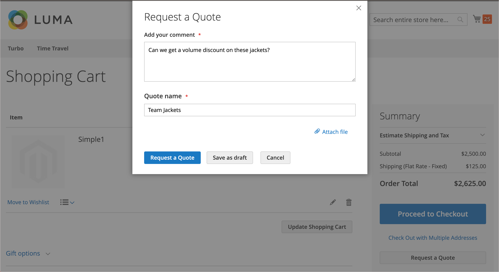

# Negotiable Quotes

Buyers and sellers use Quotes to manage the negotiation process for an order–adding items, updating quantities, requesting and applying discounts, and so on—until they reach agreement. The quote negotiation process can be initiated by an authorized company buyer, or by a company sales representative.

{width="700" zoomable="yes"}

After the quote is created, the negotiation process begins when the buyer or seller submits the quote for review. __ [&#128279;](../getting-started/admin-workspace.md)

- [&#128279;](quote-price-negotiation.md) When creating the quote request, a buyer can save the quote as a draft, or submit it directly to the seller.

- In the Admin, Sales representatives can create quotes on behalf of company buyer. When creating the quote, a seller can save the quote as a draft, or submit it directly to the buyer to initiate the negotiation process.

Tijdens het onderhandelingsproces kan het citaat alleen worden bijgewerkt door de persoon die de voorwaarden voor verdere onderhandelingen herziet en voorstelt.

## Vereisten

Negotiable quotes zijn beschikbaar slechts als Adobe Commerce de volgende configuratiemontages heeft:

- [De Adobe Commerce B2B-extensie is geïnstalleerd](install.md)
- [Vormde B2B-functies](enable-basic-features.md)
   - Bedrijfsaccounts inschakelen
   - B2B-aanhalingsteken inschakelen

## Offerteworkflow

Aanbiedingen kunnen worden geïnitieerd door de koper of de verkoper.

In dit diagram worden de prijsstatussen voor kopers en verkopers (Admin) in de verschillende stappen weergegeven wanneer u een prijsopgave start.

{width="700" zoomable="yes"}

**Stap 1: De creatie van het citaat (Nieuw)**

- **de verzoeken van de Koper citeren** - de koper [&#x200B; vraagt een citaat &#x200B;](quote-request.md) van het winkelwagentje. Het verzoek verschijnt in de _Mijn Citaten_ lijst in het rekeningsdashboard van de koper en e-mailbericht wordt verzonden naar de verkoopvertegenwoordiger die aan de bedrijfrekening wordt toegewezen. In Admin, verschijnt het verzoek in het _Citaten_ net, met een status van `New`. Een prijsaanvraag kan door de koper worden gewijzigd totdat de verkoper het heeft geopend.

  {width="700" zoomable="yes"}

- **de vertegenwoordiger van de Verkoop** — Een Vertegenwoordiger kan [&#x200B; een citaat &#x200B;](sales-rep-initiates-quote.md) van Admin namens een specifieke bedrijfkoper tot stand brengen. De verkoper moet de prijsopgave bijwerken om producten en andere informatie zoals kortingen en opmerkingen aan de koper toe te voegen. De Vertegenwoordiging van de Verkoop kan het citaat als `draft` bewaren of het verzenden naar de koper om de onderhandeling te beginnen. In de conceptversie is de prijsopgave alleen zichtbaar voor de verkoper. Nadat het aanhalingsteken is verzonden, is de status `Submitted` . Deze kan pas door de verkoper worden gewijzigd nadat de koper de transactie heeft teruggestuurd.

  {width="700" zoomable="yes"}

**Stap 2: De overzicht en de onderhandeling van het citaat (Overzicht)**

Als je een prijsopgave bekijkt of onderhandelt, kun je onder andere hoeveelheden wijzigen, objecten verwijderen, commentaren op regelobjecten toevoegen, regelobjecten of prijskortingen (verkoper) toepassen en een verzendadres (koper) toevoegen.

- **&#x200B;**&#x200B;`Pending` [&#128279;](quote-price-negotiation.md) The buyer and sales representative are notified by email that the seller has responded.

- **&#x200B;**&#x200B;__ The buyer can leave notes to the seller at the line item or quote level, change quantities, and remove items.

The buyer and seller can continue the negotiation process until an agreement is reached, or the seller declines the quote. If the buyer makes changes to the quote—adding or removing products or changing product quantities—the quote must be returned to the seller for review.

- **Koper voegt een het verschepen adres** toe - de koper kan een het verschepen adres aan het citaat toevoegen. Nadat de koper het adres heeft toegevoegd, kan de verkoper verzend- en leveringsopties opgeven. The shipping methods shown depend on the Storefront configuration.

If the buyer adds a shipping address, the negotiation agreement has to be reviewed, and the seller can continue the negotiation process until an agreement is reached, or the seller declines the quote.

**&#x200B;**

The buyer accepts the proposed price and proceeds to checkout. Additional discounts cannot be added to the negotiated quote.

Shipping options are locked on checkout.

## Quote Status

Quote status provides information about the current state of the quote in the quote workflow. The status of a quote changes only when a buyer or seller takes an action on the quote. [!UICONTROL Proceed to Checkout]

- *[!UICONTROL New]** - De koper heeft een prijsaanvraag ingediend, maar deze is niet door de verkoper bekeken. De aanvraag kan door de koper worden bijgewerkt totdat de verkoper het heeft geopend.

- **[!UICONTROL Draft]** The quote is not visible to the buyer until the seller adds the offer details (items, quantity, discount, and so on) and submits the quote to the buyer.

- **[!UICONTROL Open]**

- **[!UICONTROL Submitted]** The quote record cannot be edited during the negotiation process.

- **[!UICONTROL Client Reviewed]**

- **[!UICONTROL Updated]** - De koper heeft een reactie verzonden, maar deze is niet door de verkoper bekeken.

- **[!UICONTROL Ordered]** - De koper heeft de bestelling ingediend op basis van de onderhandelde prijsopgave.

- **[!UICONTROL Closed]** - De koper heeft de prijsaanvraag geannuleerd.

- **[!UICONTROL Declined]** Aangepaste prijzen worden uit het aanhalingsteken verwijderd en de record is vergrendeld voor verdere bewerkingen.

- **[!UICONTROL Expired]**

## B2B role resources for store quotes

[&#128279;](../systems/permissions-user-roles.md#role-resources) These role resources must be set for the Admin user role that is assigned to the store administrator.

**[!UICONTROL System]**&#x200B;_[!UICONTROL Permissions]_&#x200B;**[!UICONTROL User Roles]**&#x200B;[!UICONTROL Sales][!UICONTROL Operations][!UICONTROL Quotes]__

{width="700" zoomable="yes"}

## Een handeling toepassen

[!UICONTROL Actions]

{width="700" zoomable="yes"}

1. __&#x200B;**[!UICONTROL Sales]**&#x200B;**[!UICONTROL Quotes]**

1. In the first column of the grid, select the checkbox for each record that you want to apply the action to.

1. **[!UICONTROL Actions]**

### View a quote

1. Klik in de kolom **[!UICONTROL Actions]** voor een record op **[!UICONTROL View]** .

1. Om aan het klantenverzoek te antwoorden, volg de instructies en begin het [&#x200B; proces van de prijsonderhandeling &#x200B;](quote-price-negotiation.md).

### Aanhalingsactiviteit weergeven

Bekijk de onderhandelingstijdlijn, de communicatie, en andere citaatactiviteit van [!UICONTROL Comments] en [!UICONTROL History Log] - de informatie omvat statusveranderingen, updates aan klant en verschepende informatie, punt en prijsupdates, en andere belangrijke informatie.

1. Open een offerte.

1. Opmerkingen bij de onderhandeling en de geschiedenis van aanhalingstekens weergeven door naar **[!UICONTROL Negotiation]** te schuiven en **[!UICONTROL Comments]** en **[!UICONTROL History Log]** te selecteren.

   {width="400"}

1. De geschiedenis wordt ook bijgehouden op het niveau van het lijnpunt.

   {width="400"}

### Een aanvraag voor een prijsopgave afwijzen

Alleen aanhalingsaanvragen met de status `Open` kunnen worden afgewezen.

1. Selecteer elk open citaatverzoek dat u wilt verwerpen.

1. Stel het besturingselement _[!UICONTROL Actions]_&#x200B;in op `Declined` .

1. Voer de reden in waarom het aanhalingsteken is afgewezen en klik op **[!UICONTROL Confirm]** .

   {width="400"}
