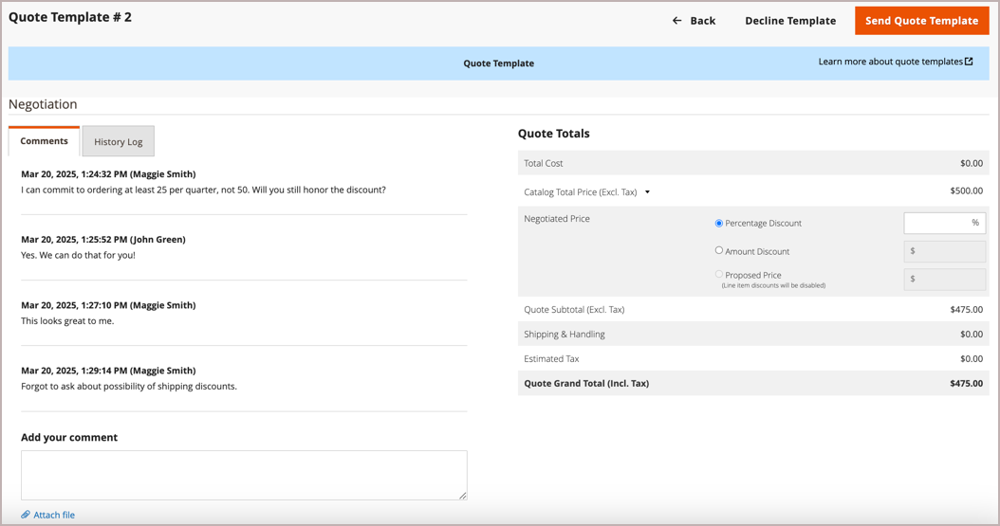

# Onderhandelbare aanhalingstekens

Kopers en verkopers gebruiken Aanhalingstekens om het onderhandelingsproces voor een orde-toevoegende punten te beheren, hoeveelheden bij te werken, om kortingen te verzoeken en toe te passen, etc.-tot zij overeenstemming bereiken. Het onderhandelingsproces voor de prijsopgave kan worden geïnitieerd door een geautoriseerde koper van een onderneming of door een vertegenwoordiger van een onderneming.

Aanhalingstekens kunnen worden geopend door een erkende koper van een onderneming of door een vertegenwoordiger van een verkoopmaatschappij. Nadat de prijsopgave is gemaakt, begint het onderhandelingsproces wanneer de koper of verkoper de prijsopgave ter controle indient. De _Aanhalingen_ een raster waarin elke ontvangen offerte wordt vermeld en waarin de communicatie tussen koper en verkoper is vastgelegd. De standaard gebruiken [besturingselementen voor werkplek](../getting-started/admin-workspace.md) om de lijst te filteren, de kolomlay-out te wijzigen, weergaven op te slaan en gegevens te exporteren.

- In de winkel sturen kopers het aanhalingsteken als een [verzoek om onderhandelingen](quote-price-negotiation.md) de prijs van het winkelwagentje . Bij het maken van de prijsaanvraag kan een koper de prijsopgave opslaan als concept of deze rechtstreeks naar de verkoper verzenden.

- In Admin, kunnen de Vertegenwoordigers van de Verkoop prijsnoteringen namens de bedrijfkoper tot stand brengen. Bij het maken van de prijsopgave kan de verkoper de prijsopgave opslaan als concept of deze rechtstreeks naar de koper verzenden om het onderhandelingsproces te starten.

Tijdens het onderhandelingsproces kan het citaat alleen worden bijgewerkt door de persoon die de voorwaarden voor verdere onderhandelingen herziet en voorstelt.

## Vereisten

Negotiable quotes zijn beschikbaar slechts als Adobe Commerce de volgende configuratiemontages heeft:

- [De B2B-extensie voor Adobe Commerce is geïnstalleerd](install.md)
- [Vormde B2B-functies](enable-basic-features.md)
   - Bedrijfsaccounts inschakelen
   - B2B-aanhalingsteken inschakelen

## Offerteworkflow

Aanbiedingen kunnen worden geïnitieerd door de koper of de verkoper.

**Stap 1: Aanbieding maken**

- **Aanhalingsteken koper** - De koper [vraagt om een prijsopgave](quote-request.md) uit de winkelwagentje. Het verzoek wordt weergegeven in het dialoogvenster _Mijn aanhalingstekens_ de lijst in het rekeningdashboard van de koper en de e-mailkennisgeving wordt verzonden naar de verkoper die aan het bedrijfsaccount is toegewezen. In Admin verschijnt het verzoek in _Aanhalingen_ raster, met de status `New`. Een prijsaanvraag kan door de koper worden gewijzigd totdat de verkoper het heeft geopend.

  {width="700" zoomable="yes"}

- **Verkoopvertegenwoordiger** — Een verkoper kan [een offerte maken](sales-rep-initiates-quote.md) van de Admin namens een specifieke koper van het bedrijf. De verkoper moet de prijsopgave bijwerken om producten en andere informatie zoals kortingen en opmerkingen aan de koper toe te voegen. De vertegenwoordiging van de Verkoop kan het citaat als a bewaren `draft` of stuur het naar de koper om de onderhandelingen te starten. In de conceptversie is de prijsopgave alleen zichtbaar voor de verkoper. Zodra het citaat wordt verzonden, is de status `Submitted`. Deze kan pas door de verkoper worden gewijzigd nadat de koper de transactie heeft teruggestuurd.

  {width="700" zoomable="yes"}

**Stap 2: Overzicht van offertes en onderhandelingen**

**Weergaveaanvraag van verkoper en verzendt antwoord** - In Admin geeft de verkoper de aanvraag voor een prijsopgave weer. De status van het aanhalingsteken verandert in `Pending`en de koper kan geen wijzigingen aanbrengen. De [verkoper reageert](quote-price-negotiation.md) door de producten in de prijsopgave met korting aan te bieden, voert u een opmerking in en stuurt u de prijsopgave terug naar de koper. De koper en de verkoper worden per e-mail op de hoogte gesteld dat de verkoper heeft gereageerd.

**Koper bekijkt prijsopgave van verkoper en verzendt antwoord** - De koper klikt op de koppeling in het e-mailbericht om het citaat te openen, of opent het citaat van het _Mijn aanhalingstekens_ pagina van het accountdashboard. De koper kan opmerkingen aan de verkoper op het regel- of prijsniveau laten en objecten verwijderen.

De koper en verkoper kunnen het onderhandelingsproces voortzetten totdat een overeenkomst is bereikt of de verkoper de prijsopgave afwijst. Als de koper wijzigingen aanbrengt in de prijsopgave (door producten toe te voegen of te verwijderen of door producthoeveelheden te wijzigen), moet de prijsopgave ter controle worden teruggestuurd naar de verkoper.

**Stap 4: Koper accepteert offerte** - De koper accepteert de voorgestelde prijs en blijft afrekenen. Er kunnen geen extra kortingen aan het onderhandelde prijsopgave worden toegevoegd.

## B2B-rolbronnen voor winkeloffertes

De configuratieopties voor aanhalingstekens worden beheerd met de [rolbronnen](../systems/permissions-user-roles.md#role-resources). Deze rolmiddelen moeten voor de Admin gebruikersrol worden geplaatst die aan de opslagbeheerder wordt toegewezen.

Ga naar **[!UICONTROL System]** > _[!UICONTROL Permissions]_>**[!UICONTROL User Roles]**, selecteert u de rol en navigeert u naar [!UICONTROL Sales] > [!UICONTROL Operations] > [!UICONTROL Quotes] in de_ Rolresources _boom.

## Een handeling toepassen

In Admin, kunnen de Beheerders B2B en de Verkopers citaten van het Net van het Citaat beheren door te gebruiken [!UICONTROL Actions] -menu.

{width="700" zoomable="yes"}

1. Op de _Beheerder_ zijbalk, ga naar **[!UICONTROL Sales]** > **[!UICONTROL Quotes]**.

1. Selecteer in de eerste kolom van het raster het selectievakje voor elke record waarop u de handeling wilt toepassen.

1. In de **[!UICONTROL Actions]** Selecteer de actie die u wilt toepassen.

### Een aanhalingsteken weergeven

1. In de **[!UICONTROL Actions]** kolom voor een record, klikt u op **[!UICONTROL View]**.

1. Om op het klantenverzoek te antwoorden, volg de instructies en begin [prijsonderhandeling](quote-price-negotiation.md) proces.

### Aanhalingsactiviteit weergeven

Bekijk de onderhandelingstijdlijn, de mededeling, en andere citaatactiviteit van [!UICONTROL Comments] en [!UICONTROL History Log]—De informatie omvat statusveranderingen, updates aan klant en verschepende informatie, punt en prijsupdates, en andere belangrijke informatie.

1. Open een offerte.

1. Commentaar van de citaatonderhandeling en geschiedenis van de mening door te scrollen aan **[!UICONTROL Negotiation]** en selecteert u **[!UICONTROL Comments]** en **[!UICONTROL History Log]**.

   {width="400"}

1. De geschiedenis wordt ook bijgehouden op het niveau van het lijnpunt.

   {width="400"}

### Een aanvraag voor een prijsopgave afwijzen

Alleen aanvragen met een `Open` status kan worden geweigerd.

1. Selecteer elk open citaatverzoek dat u wilt verwerpen.

1. Stel de _[!UICONTROL Actions]_controle op `Declined`.

1. Voer bij de aanwijzing de reden in waarom het aanhalingsteken is afgewezen en klik op **[!UICONTROL Confirm]**.

   {width="400"}

## Kolombeschrijvingen

| Kolom | Beschrijving |
|---------------------------------------|------------------------------------------------------------------------------------------------------------------------------------------------------------------------------------------------------------------------------------------------------------------------------------------------------------------------------------------------------------------------------------------------------------------------------------------------------------------------------------------------------------------------------------------------------------------------------------------------------------------------------------------------------------------------------------------------------------------------------------------------------------------------------------------------------------------------------------------------------------------------------------------------------------------------------------------------------------------------------------------------------------------------------------------------------------------------------------------------------------------------------------------------------------------------------------------------------------------------------------------------------------------------------------------------------------------------------------------------------------------------------------------------------------------------------------------------------------------------------------------------------------------------------------------------------------------------------------------------------------------------------------------------------------------------------------------------------------------------------------|
| [!UICONTROL Select] | Als u de aanhalingstekens wilt selecteren waarop een handeling moet worden uitgevoerd, schakelt u het selectievakje in of gebruikt u het selectiegereedschap in de kolomkop. Opties: Alles selecteren / Alles deselecteren |
| [!UICONTROL ID] | Een unieke numerieke id die wordt toegewezen wanneer een prijsaanvraag wordt ingediend via het winkelwagentje van een koper. Wanneer het bekijken van het citaatdetail verschijnt identiteitskaart bij de bovenkant van de pagina, in plaats van de citaatnaam. |
| [!UICONTROL Name] | De naam die door de koper aan een prijsaanvraag is toegewezen. |
| [!UICONTROL Created Date] | De datum en het tijdstip waarop de koper de aanvraag voor een prijsopgave voor het eerst heeft ingediend. |
| [!UICONTROL Company] | De naam van de onderneming waarvoor een koper een prijsaanvraag indient. |
| [!UICONTROL Submitted By] | De voornaam en achternaam van de koper van de onderneming die een prijsaanvraag indient. |
| [!UICONTROL Last Updated] | De datum en het tijdstip van de laatste communicatie tussen koper en verkoper over de prijsopgave. |
| [!UICONTROL Sales Rep] | De voornaam en achternaam van de verkoper die de rekening van de koper beheert. |
| [!UICONTROL Quote Total (Base)] | De totale prijs van de te kopen producten op basis van de oorspronkelijke offerte. Het totale bedrag wordt weergegeven in de basisvaluta van de website en in de valuta van de opslagplaats. |
| [!UICONTROL Quote Total (Negotiated)] | De totale prijs van de te kopen producten op basis van de overeengekomen prijsopgave. Dit totaal wordt automatisch berekend door het systeem en omvat alle kortingen op regelniveau of op prijsniveau die door de verkoper worden toegepast. Het totale bedrag wordt weergegeven in de basisvaluta van de website en in de valuta van de opslagplaats. |
| [!UICONTROL Status] | Geeft de huidige status van een aanhalingsverzoek aan. De status van een prijsopgave kan alleen worden gewijzigd door actie van de koper of de verkoper. Zie ook de statusinstellingen van de [kopersaccount](account-dashboard-my-quotes.md).<ul><li>**[!UICONTROL New]** - De koper heeft een prijsaanvraag ingediend, maar deze is niet door de verkoper bekeken. De aanvraag kan door de koper worden bijgewerkt totdat de verkoper het heeft geopend.</li><li>**[!UICONTROL Draft]** - De verkoper maakt een conceptprijsopgave voor een koper. De prijsopgave is pas zichtbaar voor de koper nadat de verkoper de aanbiedingsgegevens (objecten, aantal, korting, enzovoort) heeft toegevoegd en de prijsopgave bij de koper heeft ingediend.</li> <li>**[!UICONTROL Open]** - De verkoper heeft het verzoek geopend en is bezig het te bekijken en een reactie voor te bereiden. </li><li>**[!UICONTROL Submitted]** - De verkoper heeft een reactie gestuurd naar de koper. Het citaatrecord kan niet worden bewerkt tijdens het onderhandelingsproces.</li><li>**[!UICONTROL Client Reviewed]** - De koper heeft de reactie van de verkoper bekeken en bereidt een antwoord voor.</li><li>**[!UICONTROL Updated]** - De koper heeft een reactie verzonden, maar deze is niet door de verkoper bekeken.</li><li>**[!UICONTROL Ordered]** - De koper heeft de bestelling ingediend op basis van de onderhandelde prijsopgave.</li><li>**[!UICONTROL Closed]** - De koper heeft de prijsaanvraag geannuleerd.</li><li>**[!UICONTROL Declined]** - De verkoper heeft de aanvraag voor een prijsopgave afgewezen. Aangepaste prijzen worden uit het aanhalingsteken verwijderd en de record is vergrendeld voor verdere bewerkingen.</li><li>**[!UICONTROL Expired]** - De koper heeft niet binnen de vastgestelde termijn op het antwoord van de verkoper gereageerd en de prijsopgave is niet langer geldig.</li></ul> |
| [!UICONTROL Actions] | **[!UICONTROL View]** - Opent het prijsverzoek en houdt een overzicht bij van de onderhandelingen tussen koper en verkoper. |

{style="table-layout:auto"}

## Knopbalk

| Knop | Beschrijving |
|----------------------------|----------------------------------------------------------------------------------------------------------------------------------------------------------------------------------------------------------------------------------------------------------------------------------------------------------------------------------------------------------------------------------------------------|
| [!UICONTROL Send] | Verstuurt het bijgewerkte prijsopgave als antwoord op de vraag van de koper. Deze knop is uitgeschakeld als de verkoper wacht op een antwoord van de koper. |
| [!UICONTROL Back] | Hiermee wordt de _Aanhalingen_ pagina zonder wijzigingen op te slaan. |
| [!UICONTROL Create Copy] | [!BADGE 1.5.0 bètamogelijkheden]{type=Informative url="/help/b2b/release-notes.md" tooltip="Alleen beschikbaar voor deelnemers aan het bètaprogramma"}`<original quote name> (copy)`. Wijzig de naam door de waarde in het dialoogvenster [!UICONTROL Name] veld en het aanhalingsteken opslaan als concept. |
| [!UICONTROL Print] | Verzendt het aanhalingsteken naar een printer of slaat het op als een PDF-bestand. |
| [!UICONTROL Create a copy] | Hiermee maakt u een kopie van het benoemde citaat `<original quote name> (copy)` en opent. Wijzig de naam van het nieuwe aanhalingsteken en werk het bij voordat u het opslaat als concept of naar de koper verzendt. |
| [!UICONTROL Save as Draft] | Hiermee slaat u eventuele wijzigingen in de prijsopgave op, maar niet terugsturen naar de koper. |
| [!UICONTROL Decline] | Het verzoek om over prijzen te onderhandelen wordt afgewezen, hetzij op het eerste onderzoek, hetzij tijdens lopende onderhandelingen. Wanneer een prijsopgave wordt afgewezen, moet de verkoper een opmerking toevoegen om de beslissing toe te lichten. Wanneer een prijsopgave wordt afgewezen, worden alle onderhandelde prijzen weer op de oorspronkelijke waarden ingesteld. Deze knop is uitgeschakeld terwijl de verkoper wacht op een antwoord van de koper. |

{style="table-layout:auto"}

## Voorbeeld van citaat

In de volgende afbeelding ziet u een voorbeeld van de weergave met citaatdetails in de beheerfunctie waarvoor bepaalde instellingen zijn geconfigureerd.

{width="700" zoomable="yes"}

>[!NOTE]
>
>[!BADGE 1.5.0 bètamogelijkheden]{type=Informative url="/help/b2b/release-notes.md" tooltip="Alleen beschikbaar voor deelnemers aan het bètaprogramma"}
