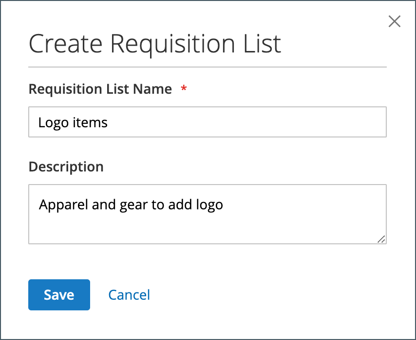
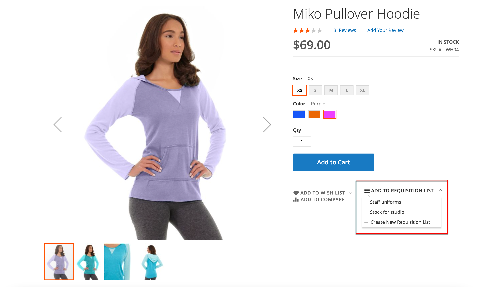

# Aanvraaglijsten

Als u een aanvraaglijst gebruikt, bespaart u tijd bij het aanschaffen van vaak bestelde producten, omdat artikelen rechtstreeks vanuit de lijst aan het winkelwagentje worden toegevoegd. Kopers kunnen meerdere lijsten bijhouden die zich richten op producten van verschillende leveranciers, kopers, teams, campagnes of iets anders dat hun workflow stroomlijnt. Het is beschikbaar voor zowel aangemelde gebruikers als gasten.

>[!NOTE]
>
>Om aanvraaglijsten voor uw opslag toe te laten, zie [ Eigenschappen B2B ](enable-basic-features.md) toelaten. Tot 999 verzoeklijsten kunnen voor elke kopersrekening, afhankelijk van de [ configuratie ](configure-requisition-lists.md) worden gehandhaafd.

De functionaliteit van de lijst met aanvragen is vergelijkbaar met die van lijsten met wensen, met de volgende verschillen:

- Een aanvraaglijst wordt niet gewist nadat artikelen naar het winkelwagentje zijn verzonden. Het kan meerdere keren worden gebruikt.
- De gebruikersinterface voor aanvraaglijsten gebruikt een compacte weergave om veel items weer te geven.

{width="600" zoomable="yes"} worden getoond

## Een aanvraaglijst maken via het dashboard van de account

Een aangemelde koper die is gekoppeld aan een bedrijfsaccount, kan een aanvraaglijst maken op basis van het dashboard van zijn account.

1. Kies **[!UICONTROL My Requisition Lists]** in de zijbalk van hun account.

1. Klik op de pagina _[!UICONTROL Requisition Lists]_op **[!UICONTROL Create New Requisition List]**.

1. Voer **[!UICONTROL Requisition List Name]** en **[!UICONTROL Description]** in.

   {width="300"}

1. Klik op **[!UICONTROL Save]** wanneer dit is voltooid.

## Een aanvraaglijst maken op basis van een productpagina

Een aangemelde koper die aan een bedrijfsaccount is gekoppeld, kan een aanvraaglijst maken op basis van een productpagina. Deze methode biedt een eenvoudige sneltoets voor het maken van de lijst en het toevoegen van het product.

1. Op de pagina met productdetails klikt de koper op **[!UICONTROL Add to Requisition List]** .

1. Klik op **[!UICONTROL Create New Requisition List]** .

1. Voer **[!UICONTROL Requisition List Name]** en **[!UICONTROL Description]** in.

1. Klik op **[!UICONTROL Save]** wanneer dit is voltooid.

## Producten toevoegen aan een aanvraaglijst

Kopers kunnen producten toevoegen aan een aanvraaglijst via:

- Productpagina&#39;s
- Een cataloguspagina
- Het winkelwagentje
- Bestaande orders
- Bestaande aanhalingstekens

### Van een productdetailpagina

1. Vanuit de winkel gaat de koper naar de detailpagina van het product die aan de aanvraaglijst moet worden toegevoegd.

1. Klik op **[!UICONTROL Add to Requisition List]** en voer een van de volgende handelingen uit:

   - Kies een bestaande aanvraaglijst.
   - Hiermee maakt u een aanvraaglijst.

   {width="700" zoomable="yes"}

### Van een cataloguspagina

1. Vanuit de winkel gaat de koper naar de cataloguspagina die het product bevat dat aan de aanvraaglijst moet worden toegevoegd.

1. Beweegt over het product.

1. Klik op **[!UICONTROL Add to Requisition List]** en voer een van de volgende handelingen uit:

   - Kies een bestaande aanvraaglijst.
   - Hiermee maakt u een aanvraaglijst.

   {width="700" zoomable="yes"}

### Van een bestaande bestelling

1. In de zijbalk van het accountdashboard kiest de koper **[!UICONTROL My Orders]** .

1. Klik boven aan de volgorde op **[!UICONTROL Add to Requisition List]** en voer een van de volgende handelingen uit:

   - Kies een bestaande aanvraaglijst.
   - Hiermee maakt u een aanvraaglijst.

   {width="700" zoomable="yes"}

### Van een bestaand prijsopgave

Vanuit een verhandelbaar aanhalingsteken kunnen kopers de optie [!UICONTROL Move to Requisition List] gebruiken om producten van het aanhalingsteken naar een bestaande aanvraaglijst te verplaatsen. Als er geen aanvraaglijsten zijn, is de optie [!UICONTROL Move to Requisition List] niet beschikbaar.

1. In de zijbalk van het accountdashboard selecteert de koper **[!UICONTROL My Quotes]** .

1. Zoek en open het gewenste citaat in de lijst.

1. Selecteer op het tabblad [!UICONTROL Items Quoted] het product dat u wilt verplaatsen.

1. Kies **[!UICONTROL Move to Requisition list]** met het vervolgkeuzemenu [!UICONTROL Select] in de kolom [!UICONTROL Actions] voor het item van de productregel.

1. Selecteer de aanvraaglijst voor de geselecteerde items.

1. Klik op **[!UICONTROL Move item to Requisition List]**.

Zie [ Mijn citaten ](account-dashboard-my-quotes.md) onderwerp voor meer informatie over B2B Citaten.

### Vanaf de wagen

1. Onder het item klikt de koper op het menu **[!UICONTROL Add to Requisition List]** en voert een van de volgende handelingen uit:

   - Kies een bestaande aanvraaglijst.
   - Hiermee maakt u een aanvraaglijst.

   {width="700" zoomable="yes"}

## De bijgewerkte aanvraaglijst weergeven

Als een koper zich bij zijn account heeft aangemeld, kan hij of zij een van de volgende methoden gebruiken om een aanvraag in zijn of haar lijst weer te geven.

{width="700" zoomable="yes"}

### Van het rekeningdashboard

1. Kies **[!UICONTROL My Requisition Lists]** in de zijbalk van het accountdashboard.

1. In de lijst van verzoeklijsten, klikt **[!UICONTROL View]** in de _2} kolom van Acties {._

### Van een willekeurige winkelpagina

1. Klik op de snelkoppelingenbalk boven aan de pagina op de gebruikersnaam.

1. Kies in het menu de optie **[!UICONTROL My Requisition Lists]** .
