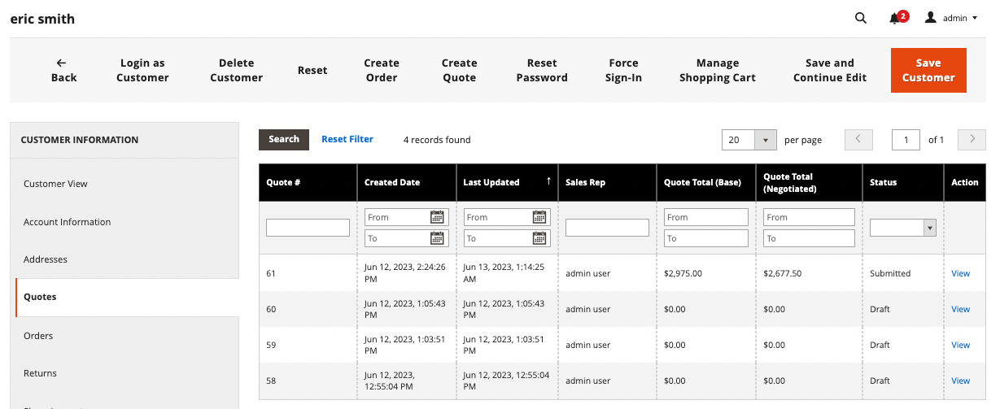

# Een prijsopgave voor een koper starten

Als aanhalingstekens zijn ingeschakeld in het dialoogvenster [Configuratie van verkoopfuncties](configure-quotes.md), kan een verkoopvertegenwoordiger het onderhandelingsproces met een bedrijfkoper beginnen door een citaat van Admin te creëren.

- Concepten zijn alleen zichtbaar voor de verkoper.
- Conceptprijsopgaven kunnen pas worden ingediend nadat de verkoper items, relevante kortingen en opmerkingen heeft toegevoegd om de oorspronkelijke aanbieding voor de koper te maken.
- Een verkoper kan een aanhalingsteken maken op basis van de offertes of het klantenraster.

De verkoper stuurt de prijsopgave naar de koper om het onderhandelingsproces in gang te zetten. Zie [Een offerte bespreken](quote-price-negotiation.md).

## Door een vertegenwoordiger aangehaalde prijsontwerp

Een verkoper kan een citaat van de Citaten of het Net van de Klant tot stand brengen.

>[!NOTE]
>
>Voor een video-uitleg van een verkoper waarin een prijsopgave voor een koper wordt gemaakt, raadpleegt u [De vertegenwoordiger van de verkoop stelt het citaat in werking](https://experienceleague.adobe.com/docs/commerce-learn/tutorials/b2b/b2b-quote/sales-rep-initiates-quote.html) in _Commerciële video&#39;s en Tutorials_.

### Een aanhalingsteken maken op het raster Offerte

1. De vertegenwoordiger van de verkoop meldt zich aan bij Admin als beheerder met [Machtigingen voor verkooptransacties](../systems/permissions.md) om offertes te beheren.

1. Ga in de Admin naar de [!UICONTROL Quotes] raster selecteren **[!UICONTROL Sales]** en selecteer vervolgens **[!UICONTROL Quotes]**.

1. Maak een prijsopgave voor een koper.

   - Selecteer in het raster Aanhalingstekens de optie **[!UICONTROL Create New Quote]**.

     {width="700" zoomable="yes"}

   - Op de [!UICONTROL Create New Quote] Selecteer de klant (de koper van het Bedrijf) om het citaat te creëren.

     {width="700" zoomable="yes"}

     Een nieuw citaat wordt weergegeven in `Draft` status.

     {width="700" zoomable="yes"}

   - Werk de citaatnaam bij en wijzig zo nodig de vervaldatum.

   - Sla het aanhalingsteken op als concept.

## De prijsopgave voor de koper voorbereiden

Nadat u het concept-aanhalingsteken hebt gemaakt, voegt u productitems toe, past u kortingen toe en communiceert u met de koper door opmerkingen en verwante bestanden aan het aanhalingsteken toe te voegen. Vervolgens stuurt u het aanhalingsteken ter controle naar de koper of slaat u het op als concept.

1. Items aan het aanhalingsteken toevoegen door **[!UICONTROL Add Product By SKU]**. Voer het SKU-nummer en -aantal in en selecteer **[!UICONTROL Add Product]**.

   {width="675" zoomable="yes"}

1. Pas indien nodig kortingen voor regelobjecten toe op producten.

   - Van de [!UICONTROL Select] actiemenu, kies **[!UICONTROL Discount Item]**.

   - Op de [!UICONTROL Discount Line item] formulier, selecteert u de **[!UICONTROL Discount Type]**.

     {width="675" zoomable="yes"}

   - In de [!UICONTROL Discount] Voer de waarde voor het kortingstype in. Als u bijvoorbeeld een percentagekorting hebt geselecteerd, voert u 10 in om een korting van 10% toe te passen op het regelitem.

   - [!BADGE 1.5.0 bètamogelijkheden]{type=Informative url="/help/b2b/release-notes.md" tooltip="Alleen beschikbaar voor deelnemers aan het bètaprogramma"}

     Nadat de wijziging is bevestigd, worden de kenmerken van het regelitem in het productraster bijgewerkt om het toegepaste kortingsbedrag weer te geven. Als de korting is vergrendeld, wordt een vergrendelingspictogram weergegeven.

1. Pas zo nodig een korting op prijsniveau toe:

   - In de [!UICONTROL Quote Totals - Negotiated Price] selecteert u het kortingstype en voert u vervolgens de waarde in die u wilt toepassen.

     {width="700" zoomable="yes"}

   Het productraster wordt bijgewerkt om de korting weer te geven.

1. Voeg aanvullende informatie voor de koper toe.

   Op de **[!UICONTROL Negotiation - Comments]** , voegt u een notitie toe en voegt u eventuele ondersteunende bestanden die nodig zijn voor de koper.

   {width="700" zoomable="yes"}

   Standaard kunt u een [bijgevoegd bestand](configure-quotes.md) kan maximaal 2 MB zijn, in een van de volgende bestandsindelingen: DOC, DOCX, XLS, XLSX, PDF, TXT, JPG of JPEG, PNG.

1. Het aanhalingsteken verwerken.

   Sla het aanhalingsteken op als concept of verzend het naar de koper.

   - Als u het aanhalingsteken opslaat als concept, wordt de status bijgewerkt naar `Draft` en er wordt een bevestigingsbericht weergegeven.

   - Als je het aanhalingsteken naar de koper stuurt, verandert de status in `Submitted`. De koper ontvangt een e-mailbericht om de prijsopgave te bekijken. De prijsopgave is vergrendeld totdat de koper deze voor verdere onderhandelingen retourneert. De verkoper kan de prijsopgave bekijken in het Offertennet of het klantenraster.

## Aanhalingstekens weergeven en maken via het raster van de klant

1. Ga in de Admin naar de [!UICONTROL Customer] raster selecteren **[!UICONTROL Customers]** en selecteer vervolgens **[!UICONTROL All Customers]**.

1. Selecteer de klant-id voor een bedrijfkoper.

   {width="700" zoomable="yes"}

1. Selecteren **[!UICONTROL Edit]** om de klantgegevens te bekijken.

1. Maak een prijsopgave voor de klant door deze te selecteren, **[!UICONTROL Create Quote]** en na het proces om het conceptcitaat bij te werken en het naar de klant te verzenden.

1. Bestaande prijsopgaven van klanten weergeven door **[!UICONTROL Quotes]**.

   {width="700" zoomable="yes"}

1. Een offerte openen door **[!UICONTROL View]**.

Voor details over het beheren van het proces van de citaatonderhandeling, zie [Onderhandelingen over een offerte](quote-price-negotiation.md)
