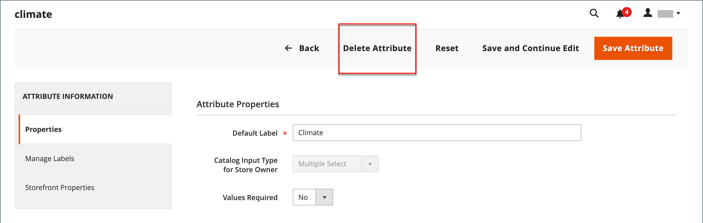

# Productkenmerken maken en verwijderen

U kunt kenmerken maken terwijl u aan een product werkt of op de pagina _[!UICONTROL Product Attributes]_. De volgende stappen tonen hoe u kenmerken kunt maken in het menu&#x200B;_[!UICONTROL Stores]_ .

## Stap 1: Beschrijf de eigenschappen van de basiskenmerken

1. Voor _Admin_ sidebar, ga **[!UICONTROL Stores]** > _[!UICONTROL Attributes]_>**[!UICONTROL Product]**.

1. Klik op **[!UICONTROL Add New Attribute]**.

   {width="600" zoomable="yes"}

1. Voer bij **[!UICONTROL Default Label]** een label in dat het kenmerk identificeert.

1. Stel **[!UICONTROL Catalog Input Type for Store Owner]** in op een van de volgende opties om het type invoerbesturingselement te bepalen dat wordt gebruikt voor gegevensinvoer:

   | Eigenschap | Beschrijving |
   |--- |--- |
   | `Text Field` | Een invoerveld bestaande uit één regel voor tekst. |
   | `Text Area` | Een invoerveld met meerdere regels voor het invoeren van tekstalinea&#39;s, zoals een productbeschrijving. U kunt de WYSIWYG Editor gebruiken om de tekst op te maken met HTML-tags of u kunt de tags rechtstreeks in de tekst invoeren. |
   | `Text Editor` | Een volledig werkende tekstredacteur bij de attributenplaats. |
   | Datum | Toont een datumwaarde in het [&#x200B; aangewezen formaat &#x200B;](attributes-input-types.md#date-and-time-options) en [&#x200B; tijdzone &#x200B;](../getting-started/store-details.md#locale-options). De waarden van de datum kunnen van een lijst of een kalender (  worden geselecteerd).   **_Note:_** Afhankelijk van uw systeemconfiguratie, _Admin_ kunnen de gebruikers data in een gebied direct ingaan of een datum van de kalender of de lijst selecteren. Voor informatie over het specificeren van datum en tijdwaarden, zie [&#x200B; Datum en tijdopties &#x200B;](attributes-input-types.md#date-and-time-options). |
   | `Yes/No` | Hiermee geeft u een vervolgkeuzelijst weer met vooraf gedefinieerde opties `Yes` en `No` . |
   | `Dropdown` | Hiermee wordt een vervolgkeuzelijst met waarden weergegeven waarin slechts één selectie wordt geaccepteerd. Het Dropdown inputtype is een zeer belangrijke component van [&#x200B; configureerbare producten &#x200B;](product-create-configurable.md). |
   | `Multiple Select` | Hiermee geeft u een vervolgkeuzelijst weer met waarden die meerdere selecties accepteren. |
   | `Price` | Dit inputtype wordt gebruikt om prijsgebieden tot stand te brengen die naast de vooraf bepaalde attributen zijn: Prijs, Speciale Prijs, de Prijs van de Rij, en Kosten. De gebruikte valuta wordt bepaald door uw systeemconfiguratie. |
   | `Media Image` | Hiermee wordt een extra afbeelding aan een product gekoppeld, zoals een productlogo, zorginstructies of ingrediënten uit een voedseletiket. Wanneer u een kenmerk van een mediaafbeelding toevoegt aan de kenmerkset van een product, wordt dit een extra afbeeldingstype, samen met Basis, Klein en Miniatuur. Het media beeldattribuut kan van [&#x200B; storefront media browser &#x200B;](catalog-images-video.md#storefront-media-browser) worden uitgesloten. |
   | `Fixed Product Tax` | Laat u [&#x200B; tarieven van FPT &#x200B;](../stores-purchase/fixed-product-tax.md) bepalen die op de vereisten van uw scène worden gebaseerd. |
   | `Visual Swatch` | Hiermee geeft u een staal weer met de kleur, structuur of patroon van een configureerbaar product. A [&#x200B; het visuele monster &#x200B;](swatches.md) kan met een hexadecimale kleurenwaarde worden gevuld, of een geupload beeld tonen dat de kleur, het materiaal, de textuur, of het patroon van de optie vertegenwoordigt. |
   | `Text Swatch` | Een op tekst gebaseerde representatie van een configureerbare productoptie die vaak voor de grootte wordt gebruikt. [&#x200B; de stalen van de Tekst &#x200B;](swatches.md#text-based-swatches) kunnen hexadecimale kleurenwaarden ook omvatten. |
   | `Page Builder` | Een volledig werkende [&#x200B; werkruimte van de Bouwer van de Pagina 1&rbrace; bij de attributenplaats die het gemakkelijk maakt om het in dienst nemen van inhoud aan de productpagina toe te voegen.](../page-builder/introduction.md) |

   {style="table-layout:auto"}

1. Stel **[!UICONTROL Values Required]** in op `Yes` als u een optie wilt selecteren voordat de klant het product kan aanschaffen.

1. Ga als volgt te werk voor invoertypen [!UICONTROL Dropdown] en [!UICONTROL Multiple Select] :

   - Klik onder _[!UICONTROL Manage Options]_&#x200B;op **[!UICONTROL Add Option]**.

   - Voer de eerste waarde in die u in de lijst wilt weergeven.

     U kunt één waarde voor Admin, en een vertaling van de waarde voor elke archiefmening ingaan. Als u slechts één winkelweergave hebt, kunt u alleen de Admin-waarde invoeren en deze wordt ook voor de winkel gebruikt.

   - Klik op **[!UICONTROL Add Option]** en herhaal de vorige stap voor elke optie die u in de lijst wilt opnemen.

   - Selecteer **[!UICONTROL Is Default]** om de optie als standaardwaarde te gebruiken.

   {width="600" zoomable="yes"}

## Stap 2: Beschrijf de geavanceerde eigenschappen (indien nodig)

1. Voer een unieke **[!UICONTROL Attribute Code]** in in kleine letters en zonder spaties.

   >[!NOTE]
   >
   >Het wordt afgeraden de waarde `type` in het veld [!UICONTROL Attribute Code] te gebruiken. Dit kan fouten veroorzaken omdat de waarde `type` gereserveerd is voor systeemgebruik.

   {width="600" zoomable="yes"}

   Welke opties beschikbaar zijn, is afhankelijk van de instelling _[!UICONTROL Catalog Input Type for Store Owner]_.

1. Plaats **[!UICONTROL Scope]** om erop te wijzen waar in uw [&#x200B; opslaghiërarchie &#x200B;](../getting-started/websites-stores-views.md) dat de attributen kunnen worden gebruikt.

1. Stel **[!UICONTROL Unique Value]** in op `Yes` als u dubbele waarden wilt voorkomen.

1. Voer voor invoertypen die waarden invoeren, een geldigheidstest uit van gegevens die in een tekstveld worden ingevoerd door **[!UICONTROL Input Validation for Store Owner]** in te stellen op het type gegevens dat het veld moet bevatten.

   Dit veld is niet beschikbaar voor invoertypen met geselecteerde waarden. De test kan elk van de volgende valideringen uitvoeren:

   - `Decimal Number`
   - `Integer Number`
   - `Email`
   - `URL`
   - `Letters`
   - `Letters (a-z, A-Z) or Numbers (0-9)`

   {width="400"}

1. Om dit attribuut aan de [&#x200B; lijst van Producten &#x200B;](products-list.md) toe te voegen, plaats de volgende opties aan `Yes`.

   - **voeg aan de Opties van de Kolom toe** - omvat de attributen als kolom in de _[!UICONTROL Products]_&#x200B;lijst.
   - **Gebruik in de Opties van de Filter** - voegt een filtercontrole aan de kolomkopbal in de _[!UICONTROL Products]_&#x200B;lijst toe.

## Stap 3: Voer het veldlabel in

1. Kies **[!UICONTROL Manage Labels]** in de navigatie aan de linkerkant.

1. Voer een **[!UICONTROL Title]** in die als label voor het veld moet worden gebruikt.

   Als uw winkel in verschillende talen beschikbaar is, kunt u voor elke weergave een vertaalde titel invoeren.

   {width="600" zoomable="yes"}

   >[!NOTE]
   >
   > Als u dit kenmerk als facet wilt gebruiken in Live zoeken, moet u een archiefspecifiek label opgeven. Zonder dit, kan de attributennaam niet correct op de pagina van de facetconfiguratie tonen. Om de configuratie bij te werken, geef manueel het etiket uit gebruikend [&#x200B; uitgeeft optie in de Levende lijst van het Onderzoek facet &#x200B;](https://experienceleague.adobe.com/nl/docs/commerce/live-search/live-search-admin/facets/facets-add#step-2-edit-facet-properties-optional) in de _Levende Gids van het Onderzoek_.

## Stap 4: Beschrijf de storefront-eigenschappen

1. Kies **[!UICONTROL Storefront Properties]** in de navigatie aan de linkerkant.

   {width="600" zoomable="yes"}

   Welke opties beschikbaar zijn, is afhankelijk van de instelling _[!UICONTROL Catalog Input Type for Store Owner]_.

1. Stel **[!UICONTROL Use in Search]** in op `Yes` als het kenmerk beschikbaar moet zijn voor zoeken.

   - Stel de waarde **[!UICONTROL Search Weight]** in om te bepalen waar het item wordt weergegeven in de zoekresultaten: 1 (laagste gewicht) tot 10 (hoogste gewicht).

   - Stel de **[!UICONTROL Visible in Advanced Search]** naar wens in. Leer meer in [&#x200B; Geavanceerd Onderzoek &#x200B;](search.md#advanced-search).

1. Als u het kenmerk in Product vergelijken wilt opnemen, stelt u **[!UICONTROL Comparable on Storefront]** in op `Yes` .

1. Ga als volgt te werk voor vervolgkeuzelijsten, meerdere velden voor selecteren en prijzen:

   - Stel **[!UICONTROL Use in Layered Navigation]** in op `Yes` als u het kenmerk als filter in gelaagde navigatie wilt gebruiken.

   - Stel **[!UICONTROL Use in Search Results Layered Navigation]** in op `Yes` als u het kenmerk in gelaagde navigatie wilt gebruiken op pagina&#39;s met zoekresultaten.

   - Voer bij **[!UICONTROL Position]** een getal in om de relatieve positie van het kenmerk in het gelaagde navigatieblok aan te geven.

1. Stel **[!UICONTROL Use for Promo Rule Conditions]** in op `Yes` als u het kenmerk in prijsregels wilt gebruiken.

1. Als u wilt dat de tekst kan worden opgemaakt met HTML, stelt u **[!UICONTROL Allow HTML Tags on Frontend]** in op `Yes` .

   Met deze instelling maakt u de WYSIWYG-editor beschikbaar voor het veld.

1. Stel **[!UICONTROL Visible on Catalog Pages on Storefront]** in op `Yes` om het kenmerk op de productpagina op te nemen.

1. Vul de volgende instellingen in als dit door uw thema wordt ondersteund:

   - Als u het kenmerk wilt opnemen in productlijsten, stelt u **[!UICONTROL Used in Product Listing]** in op `Yes` .

   - Als u kenmerk wilt gebruiken als een sorteerparameter voor productlijsten, stelt u **[!UICONTROL Used for Sorting in Product Listing]** in op `Yes` .

1. Klik op **[!UICONTROL Save Attribute]** als de bewerking is voltooid.

## Stap 5: Wijs het gemaakte kenmerk toe aan de kenmerkset

Als u wilt dat een kenmerk zichtbaar is op de pagina voor het maken van het product, voegt u het toe aan een specifieke kenmerkset.

1. Ga na het voltooien van de vorige stappen naar **[!UICONTROL Stores]** > _[!UICONTROL Attributes]_>**[!UICONTROL Attribute Set]**.

1. Selecteer de kenmerkset die u nodig hebt in de lijst en open deze in de bewerkingsmodus.

1. Sleep de gecreeerde attributen van de **[!UICONTROL Unassigned Attributes]** lijst aan de aangewezen omslag in de **Groepen** kolom.

1. Klik op **[!UICONTROL Save]** als de bewerking is voltooid.

## Attributen voor configureerbare producten

Om het even welk attribuut dat als drop-down lijst van opties voor a [&#x200B; configureerbaar product &#x200B;](product-create-configurable.md) wordt gebruikt moet de volgende eigenschappen hebben:

| Eigenschap | Waarde |
|----------|------ |
| Invoertype catalogus voor winkeleigenaar | Vervolgkeuzelijst |
| Toepassingsgebied | Algemeen |

{style="table-layout:auto"}

## Een kenmerk verwijderen

Wanneer een attribuut wordt geschrapt, wordt het verwijderd uit om het even welke verwante producten en attributenreeksen. Systeemkenmerken maken deel uit van de kernfunctionaliteit van uw winkel en kunnen niet worden verwijderd.

Voordat u een kenmerk verwijdert, moet u ervoor zorgen dat dit momenteel niet wordt gebruikt door een product in de catalogus. Een gemakkelijke manier om te bepalen als een attribuut in gebruik is moet het [&#x200B; hulpmiddel van de Uitvoer &#x200B;](../systems/data-export.md) gebruiken om de lijst van de Attributen van de Entiteit van het product te controleren. Als het kenmerk niet in de lijst staat, wordt het niet gebruikt door producten in de catalogus.

**_Een kenmerk verwijderen:_**

1. Voor _Admin_ sidebar, ga **[!UICONTROL Stores]** > _[!UICONTROL Attributes]_>**[!UICONTROL Product]**.

1. Zoek het kenmerk in de lijst en open de bewerkingsmodus.

1. Klik op **[!UICONTROL Delete Attribute]**.

   {width="600" zoomable="yes"}

1. Klik op **[!UICONTROL OK]** wanneer u wordt gevraagd om te bevestigen.
