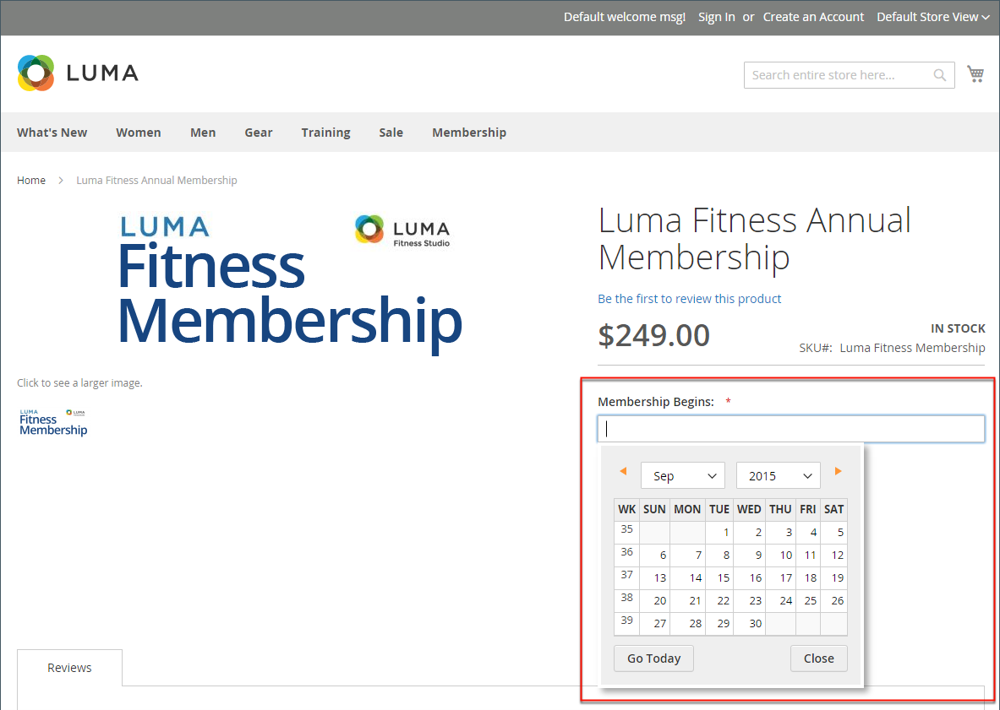

# Kenmerkinvoertypen

Wanneer u kenmerken weergeeft vanuit de beheerfunctie, zijn deze de velden die u invult wanneer u een product maakt. Het invoertype dat aan een attribuut wordt toegewezen bepaalt het type van gegevens dat kan worden ingegaan en het formaat van het gebied of de inputcontrole. Vanuit het standpunt van de klant, verstrekken de attributen informatie over het product, en zijn de opties en de gebieden van de gegevensingang die moeten worden voltooid om een product te kopen.

## Invoertypen

| Eigenschap | Beschrijving |
|--- |--- |
| [!UICONTROL Text Field] | Een invoerveld bestaande uit één regel voor tekst. |
| [!UICONTROL Text Area] | Een invoerveld met meerdere regels voor het invoeren van tekstalinea&#39;s, zoals een productbeschrijving. Met de WYSIWYG Editor kunt u de tekst opmaken met HTML-tags of de tags rechtstreeks in de tekst invoeren. |
| [!UICONTROL Text Editor] | Een volledig werkende tekstredacteur bij de attributenplaats. |
| [!UICONTROL Date] | Hiermee wordt een datumwaarde weergegeven in het dialoogvenster [voorkeursindeling](#date-and-time-options) en [tijdzone](../getting-started/store-details.md#locale-options). Datumwaarden kunnen worden geselecteerd in een lijst of kalender (  ).   **_Opmerking:_**Afhankelijk van uw systeemconfiguratie,_Beheerder _gebruikers kunnen rechtstreeks datums in een veld invoeren of een datum in de kalender of lijst selecteren. Voor informatie over het specificeren van datum en tijdwaarden, zie [Datum- en tijdopties](#date-and-time-options). |
| [!UICONTROL Date and Time] | Hiermee geeft u een datum- en tijdwaarde weer in het dialoogvenster [voorkeursindeling](#date-and-time-options) en [tijdzone](../getting-started/store-details.md#locale-options). De datum en tijd kunnen handmatig worden ingevoerd of vanuit een kalender worden geselecteerd. Voorbeeld: MM/DD/YYYY HH:MM |
| [!UICONTROL Yes/No] | Hiermee geeft u een vervolgkeuzelijst weer met vooraf gedefinieerde opties voor `Yes` en `No`. |
| Vervolgkeuzelijst | Hiermee wordt een vervolgkeuzelijst met waarden weergegeven waarin slechts één selectie wordt geaccepteerd. Het invoertype Vervolgkeuzelijst is een sleutelcomponent van [configureerbare producten](../catalog/product-create-configurable.md). |
| [!UICONTROL Multiple Select] | Hiermee geeft u een vervolgkeuzelijst weer met waarden die meerdere selecties accepteren. |
| [!UICONTROL Price] | Dit invoertype wordt gebruikt om prijsvelden te maken die naast de vooraf gedefinieerde kenmerken staan: `Price`, `Special Price`, `Tier Price`, en `Cost`. De gebruikte valuta wordt bepaald door uw systeemconfiguratie. |
| [!UICONTROL Media Image] | Hiermee wordt een extra afbeelding aan een product gekoppeld, zoals een productlogo, zorginstructies of ingrediënten uit een voedseletiket. Wanneer u een kenmerk van een mediaafbeelding toevoegt aan de kenmerkset van een product, wordt dit een extra afbeeldingstype, samen met Basis, Klein en Miniatuur. Het kenmerk Media image kan worden uitgesloten van het dialoogvenster [storefront media browser](catalog-images-video.md#storefront-media-browser). |
| [!UICONTROL Fixed Product Tax] | Hiermee kunt u definiëren [FPT-snelheden](../stores-purchase/fixed-product-tax.md) op basis van de vereisten van uw landinstelling. |
| [!UICONTROL Visual Swatch] | Hiermee geeft u een staal weer met de kleur, structuur of patroon van een configureerbaar product. A [visueel staal](swatches.md) kan worden gevuld met een hexadecimale kleurwaarde of een geüploade afbeelding weergeven die de kleur, het materiaal, de structuur of het patroon van de optie vertegenwoordigt. |
| [!UICONTROL Text Swatch] | Een op tekst gebaseerde representatie van een configureerbare productoptie die vaak voor de grootte wordt gebruikt. [Tekststalen](swatches.md) kan ook hexadecimale kleurwaarden bevatten. |
| [!UICONTROL Page Builder] | A [[!DNL Page Builder]](../page-builder/workspace.md) werkruimte op de kenmerklocatie, zodat u gemakkelijk aansprekende inhoud aan de productpagina kunt toevoegen. |

{style="table-layout:auto"}

## Datum- en tijdopties

U kunt de opmaak van datum- en tijdvelden aanpassen en het invoerbesturingselement selecteren dat wordt gebruikt voor gegevensinvoer. Datumwaarden kunnen worden geselecteerd in een vervolgkeuzelijst of in een pop-upkalender.

{width="700" zoomable="yes"}

**_Datum-/tijdvelden opmaken:_**

1. Op de _Beheerder_ zijbalk, ga naar **[!UICONTROL Stores]** > _[!UICONTROL Settings]_>**[!UICONTROL Configuration]**.

1. Vouw in het deelvenster aan de linkerkant uit **[!UICONTROL Catalog]** en klik op de knop **[!UICONTROL Catalog]** subitem.

1. Vouw de sectie **[!UICONTROL Date & Time Custom Options]** uit.

   {width="600" zoomable="yes"}

   Zie voor een gedetailleerd overzicht van deze opties [_Aangepaste datum- en tijdopties_](../configuration-reference/catalog/catalog.md) in de _Configuratieverwijzing_.

1. Als u een pop-upkalender wilt gebruiken als het invoerbesturingselement voor datumvelden, stelt u **[!UICONTROL Use JavaScript Calendar]** tot `Yes`.

1. Om de **[!UICONTROL Date Fields Order]** stelt u de volgorde van elk deel van het datumveld zo nodig in:

   - Maand
   - Dag
   - Jaar

1. Stel de gewenste tijdnotatie in door **Tijdnotatie** op een van de volgende wijzen:

   - `12h AM/PM`
   - `24h`

1. Om de **[!UICONTROL Year Range]** Voer voor de vervolgkeuzelijsten het jaar (YYYY) in waarin u de **[!UICONTROL from]** en **[!UICONTROL to]** datums.

   Indien leeg, wordt het veld standaard ingesteld op het huidige jaar.

1. Klik op **[!UICONTROL Save Config]**.
