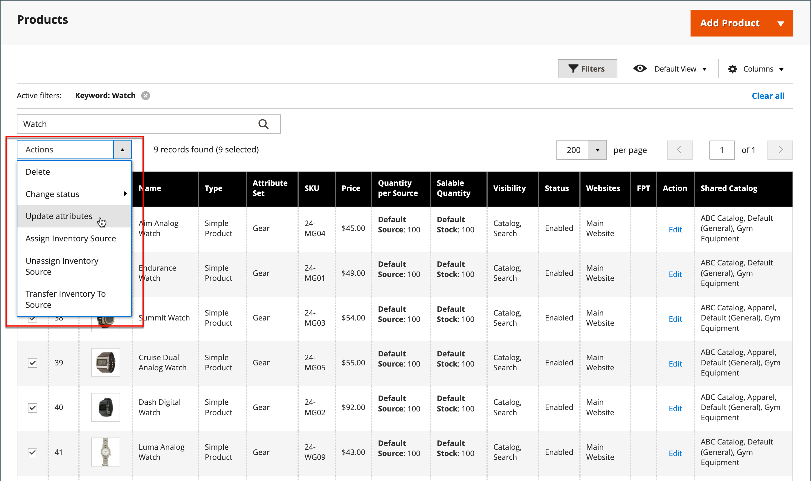

# Bulkupdates voor productkenmerken

Gebruik de _[!UICONTROL Update Attributes]_om een of meer kenmerken in uw producten te wijzigen. Met dit gereedschap kunt u belangrijke wijzigingen toepassen op een grote groep producten.

1. Op de _Beheerder_ zijbalk, ga naar **[!UICONTROL Catalog]** > **[!UICONTROL Products]**.

1. Selecteer de producten waarvoor u bronnen wilt wijzigen.

   Blader of zoek naar de producten en selecteer de selectievakjes.

1. Klik op de knop **[!UICONTROL Actions]** bovenaan en kies **[!UICONTROL Update Attributes]**.

   {width="600" zoomable="yes"}

1. Werk het kenmerk, de geavanceerde inventaris of de websitegegevens voor de geselecteerde producten bij naar wens.

   {width="600" zoomable="yes"}

1. Klik op **[!UICONTROL Save]**.
