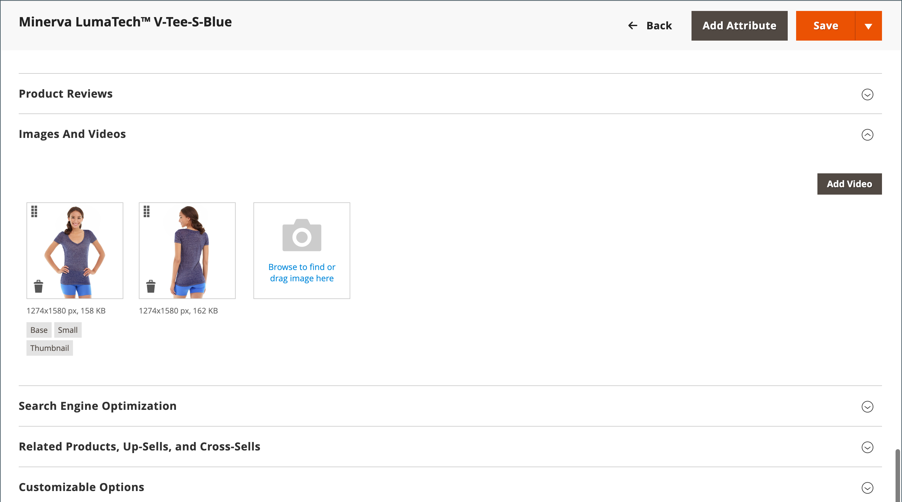

# Afbeeldingen en video in catalogus

Als u afbeeldingen van hoge kwaliteit van consistente verhoudingen gebruikt, krijgt uw catalogus een professionele uitstraling met een professionele uitstraling. Als u een grote catalogus hebt met meerdere afbeeldingen per product, kunt u eenvoudig honderden, zo niet duizenden productafbeeldingen beheren. Voordat u aan de slag gaat, stelt u een naamgevingsconventie voor de afbeeldingsbestanden in en ordent u deze zo dat u de originelen kunt vinden als u ze ooit nodig hebt.

{width="600" zoomable="yes"}

Eén productafbeelding wordt in verschillende formaten gerenderd in de catalogus. De weergavegrootte van de afbeeldingscontainer op de pagina wordt gedefinieerd in het stijlblad van uw thema. De plaats waar de afbeelding in de winkel wordt weergegeven, wordt echter bepaald door de rol die aan de afbeelding is toegewezen. Het belangrijkste productbeeld, of _basis_ beeld, moet groot genoeg zijn om de vergroting te veroorzaken die voor gezoem nodig is. Naast de hoofdafbeelding kan een kleinere versie van dezelfde afbeelding voorkomen in productaanbiedingen of als miniatuur in het winkelwagentje. U kunt een beeld in de grootste grootte uploaden die nodig is of een [&#x200B; Adobe Stock &#x200B;](../content-design/adobe-stock.md) beeld gebruiken, en Commerce laten de grootte nodig voor elk gebruik teruggeven. Dezelfde afbeelding kan voor alle rollen worden gebruikt, anders kan aan elke rol een andere afbeelding worden toegewezen. Standaard wordt de eerste afbeelding die wordt geüpload, toegewezen aan alle drie de rollen.

## Storefront-mediabrowser

In de mediabrowser op de productpagina worden meerdere afbeeldingen, video of stalen weergegeven die betrekking hebben op het product. Elke miniatuur kan een andere weergave of een andere variatie van het product weergeven. De winkelier kan op een miniatuur klikken om door de media-elementen te bladeren. Hoewel de positie van de mediabrowser per thema varieert, bevindt de standaardpositie zich net onder de hoofdafbeelding op de productpagina. Voor toegankelijkheidscontroles, zie [&#x200B; de toegankelijkheid van de Navigatie &#x200B;](../getting-started/navigation-accessibility.md).

{width="700" zoomable="yes"}

### Zoomen op afbeelding

Als het [&#x200B; basisbeeld &#x200B;](product-image.md) groot genoeg is om het gezoemeffect tot stand te brengen, kunnen de klanten een vergroot gedeelte van het beeld op mouseover bekijken. Wanneer het gezoem wordt geactiveerd, kunnen de klanten het belangrijkste beeld klikken en de curseur bewegen rond om verschillende delen van het beeld te vergroten. De vergrote selectie wordt rechts van de afbeelding weergegeven.

{width="700" zoomable="yes"}

### Lichte vakken en schuifregelaars

Er zijn veel andere lichte vakken en schuifregelaars waarmee u de presentatie van uw productafbeeldingen kunt verbeteren. Zoek uitbreidingen in [&#x200B; Commerce Marketplace &#x200B;](../getting-started/commerce-marketplace.md).

## Bronnen voor probleemoplossing

Raadpleeg de volgende artikelen in de Commerce Support Knowledge Base voor hulp bij het oplossen van problemen met afbeeldingen en video&#39;s:

- [&#x200B; de beelden van het Product tonen niet ondanks Product geeft beeldrollen uit &#x200B;](https://experienceleague.adobe.com/docs/commerce-knowledge-base/kb/troubleshooting/storefront/product-images-do-not-display-despite-product-edit-image-roles.html)
- [&#x200B; beelden van de opslag niet getoond na plaatsing &#x200B;](https://experienceleague.adobe.com/docs/commerce-knowledge-base/kb/troubleshooting/storefront/store-images-not-displayed-after-deployment.html)
