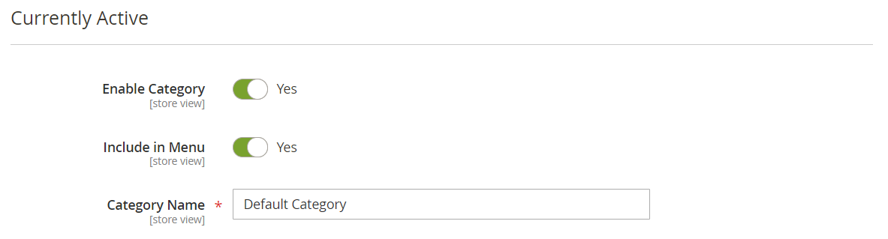

# Categorieën maken

De categoriestructuur van de catalogus is vergelijkbaar met een ondersteboven liggende structuur, met bovenaan het basiselement. Elke sectie van de boomstructuur kan worden uitgevouwen en samengevouwen. Alle uitgeschakelde of verborgen categorieën worden grijs weergegeven. De categorieën op het eerste niveau (onder de [&#x200B; wortel &#x200B;](category-root.md)) verschijnen typisch als opties in het [&#x200B; belangrijkste menu &#x200B;](navigation-top.md). U kunt zo veel extra subcategorieën tot stand brengen zoals nodig, volgens de maximummenudiepte die in de configuratie wordt geplaatst. Categorieën kunnen naar andere locaties in de boomstructuur worden gesleept en neergezet. Het categorie-id-nummer staat tussen haakjes achter de categorienaam boven aan de pagina.

Voor een website met veelvoudige [&#x200B; opslag &#x200B;](../stores-purchase/stores.md#add-stores), kunt u een verschillende wortelcategorie voor elke opslag tot stand brengen die de reeks categorieën bepaalt die voor de [&#x200B; hoogste navigatie &#x200B;](navigation-top.md) wordt gebruikt.

{width="700" zoomable="yes"}

## Aanbevolen procedures

Gebruik deze beste werkwijzen wanneer u categorieën plant en creeert.

### Categoriestructuur

De structuur van de categorieën in het hoofdmenu kan van invloed zijn op de gebruikerservaring en -prestaties. Als beste praktijken, zou u één over-arching top-level categorie moeten identificeren, en vermijden hebbend andere categorieën met de zelfde naam. In plaats van bijvoorbeeld meerdere categorieën voor &#39;Kinderen&#39; te hebben die onder verschillende afdelingen zijn ingedeeld, zoals `Clothing/Kids`, `Shoes/Kids`, `Accessories/Kids` . Het kan efficiënter zijn om de hoofdcategorie op hoofdniveau `Kids` te maken, en dan subcategorieën zoals hieronder nodig tot stand te brengen. Zorg voor consistentie met de categoriestructuur en gebruik dezelfde aanpak voor alle producttypen in uw catalogus.

### Bedrijfsregels en automatisering

Houd rekening met de categoriestructuur en beschikbare kenmerkwaarden wanneer u bedrijfslogica gebruikt om vergelijkbare items op een cataloguspagina weer te geven of om een gepersonaliseerde promotie, geautomatiseerd proces of zoekcriteria in te stellen. Als u bijvoorbeeld &quot;polo&quot; opgeeft als een bovenliggende categorie, kunnen de resultaten betrekking hebben op producten die niet geschikt zijn voor mannen en vrouwen en die niet ouder zijn. Als u echter een specifieke subcategorie van polo-overhemden aanpast, zijn de resultaten beperkter en kunnen ze waarschijnlijk een beroep doen op een bepaalde klant. De resultaten kunnen zelfs specifieker zijn wanneer gecombineerd met andere attributenwaarden die een specifieke klant richten. Houd rekening met het aantal producten dat moet worden doorgefilterd en opgehaald wanneer u naar een bepaald categoriepad verwijst. Het verschil in resultaten kan dramatisch zijn. Bekijk de verschillende resultaten die door de volgende categoriepaden worden geretourneerd:

- `[Category:  All Products/Shirts/Father's Day/Polos/Sale]`
- `[Category Path: Men/Shirts/Polos]`
- `[Child Category: Polos]`

Het is van belang om categoriale relaties duidelijk te definiëren, zoals:

- bovenliggende categorie
- subcategorie
- categoriepad

Definieer ook de bijbehorende trefwoorden en kenmerken, zoals:

- beschikbaarheid
- verkoopprijs
- merk
- size
- kleur

## Stap 1: Een categorie maken

1. Voor _Admin_ sidebar, ga **[!UICONTROL Catalog]** > **[!UICONTROL Categories]**.

1. Stel **[!UICONTROL Store View]** in om te bepalen waar de nieuwe categorie beschikbaar moet zijn.

1. Selecteer in de categoriestructuur de bovenliggende categorie van de nieuwe categorie.

   Het bovenliggende element bevindt zich op één niveau boven de nieuwe categorie.

   Als u van het begin zonder om het even welk gegeven begint, zouden er slechts twee categorieën in de lijst kunnen zijn: _Standaard Categorie_, die de wortel, en een _categorie van het Voorbeeld_ is

1. Klik op **[!UICONTROL Add Subcategory]**.

## Stap 2: De basisgegevens invullen

1. Stel **[!UICONTROL Enable Category]** in op `Yes` als u wilt dat de categorie direct beschikbaar is in de winkel.

1. Om de categorie in de [&#x200B; hoogste navigatie &#x200B;](navigation-top.md) te omvatten, plaats **[!UICONTROL Include in Menu]** aan `Yes`.

1. Voer de **[!UICONTROL Category Name]** in.

   {width="500" zoomable="yes"}

1. Klik op **[!UICONTROL Save]** en ga verder.

## Stap 3: De inhoud van de categorie voltooien

1. Breid  de **[!UICONTROL Content]** sectie uit.

   {width="600" zoomable="yes"}

1. Om a **[!UICONTROL Category Image]** bij de bovenkant van de pagina te tonen, kunt u of uw eigen beeld uploaden of een beeld gebruiken dat in de [&#x200B; Opslag van Media &#x200B;](../content-design/media-storage.md) bestaat.

   - Als u uw eigen afbeelding wilt uploaden, klikt u op **[!UICONTROL Upload]** en kiest u de afbeelding die u wilt weergeven in de categorie.

   - Als u afbeeldingen van Media Storage wilt gebruiken, klikt u op **[!UICONTROL Select from Gallery]** en selecteert u de afbeelding die u voor de categorie wilt weergeven.

   Binnen de Galerij van Media, kunt u de [&#x200B; Integratie van Adobe Stock &#x200B;](../content-design/adobe-stock.md) ook gebruiken om een aangewezen beeld te vinden door **[!UICONTROL Search Adobe Stock]** te klikken.

   >[!NOTE]
   >
   > Als u AEM Assets hebt toegelaten, zie [&#x200B; categorieën &#x200B;](../content-design/aem-assets-manage.md) voor meer informatie leiden.

1. Voer bij **[!UICONTROL Description]** de tekst of andere inhoud in die u wilt weergeven op de bestemmingspagina van de categorie.

   Voor meer informatie, zie [&#x200B; Inhoud van de Categorie &#x200B;](categories-content-settings.md).

1. Als u een inhoudsblok wilt opnemen op de bestemmingspagina van de categorie, kiest u de **[!UICONTROL CMS Block]** die u wilt weergeven.

1. Klik op **[!UICONTROL Save]** en ga verder.

## Stap 4: De weergave-instellingen voltooien

1. Breid  de **[!UICONTROL Display Setting]** sectie uit.

   {width="600" zoomable="yes"}

   Voor meer informatie over deze opties, zie voor meer informatie over deze opties, [&#x200B; montages van de Vertoning &#x200B;](categories-display-settings.md) zien.

1. Stel **[!UICONTROL Display Mode]** in op een van de volgende opties:

   - `Products Only`
   - `Static Block Only`
   - `Static Block and Products`

1. Als u wilt dat de categoriepagina de sectie _`Filter by Attribute`_van gelaagde navigatie bevat, stelt u **[!UICONTROL Anchor]**&#x200B;in op `Yes` .

1. Selecteer voor de opties van **[!UICONTROL Available Product Listing Sort By]** een of meer van de beschikbare waarden die beschikbaar zijn voor klanten om de lijst te sorteren. Dit het plaatsen is niet van toepassing op [!DNL Live Search] [&#x200B; Van de Lijst van het Product de Widget van de Pagina &#x200B;](https://experienceleague.adobe.com/nl/docs/commerce/live-search/live-search-storefront/plp-styling).

   Standaard worden alle beschikbare waarden opgenomen. Schakel het selectievakje **[!UICONTROL Use All]** uit om de selecties te wijzigen. De waarden kunnen bijvoorbeeld het volgende zijn:

   - `Position`
   - `Product Name`
   - `Price`

1. Als u de standaardsorteervolgorde voor de categorie wilt instellen, kiest u de waarde **[!UICONTROL Default Product Listing Sort By]** . Dit het plaatsen is niet van toepassing op [!DNL Live Search] [&#x200B; Van de Lijst van het Product de Widget van de Pagina &#x200B;](https://experienceleague.adobe.com/nl/docs/commerce/live-search/live-search-storefront/plp-styling).

1. Om de standaard gelaagde navigatie [&#x200B; prijsstap &#x200B;](navigation-layered.md#configure-price-navigation) het plaatsen te veranderen, doe het volgende:

   - Schakel het selectievakje **[!UICONTROL Use Config Settings]** uit.

   - Voer de waarde in die u als een incrementele prijsstap voor gelaagde navigatie wilt gebruiken.

1. Klik op **[!UICONTROL Save]** en ga verder.

## Stap 5: De optimalisatie-instellingen voor zoekprogramma&#39;s voltooien

1. Breid  de **[!UICONTROL Search Engine Optimization Settings]** sectie uit.

   {width="600" zoomable="yes"}

   Voor meer informatie over deze opties, zie [&#x200B; de motoroptimalisering van het Onderzoek &#x200B;](categories-search-engine-optimization.md).

1. Voltooi de volgende [&#x200B; meta- gegevens &#x200B;](../merchandising-promotions/meta-data.md) voor de categorie:

   - [!UICONTROL Meta Title]
   - [!UICONTROL Meta Keywords]
   - [!UICONTROL Meta Description]

1. Klik op **[!UICONTROL Save]** en ga verder.

## Stap 6: kies de producten in categorie

1. Breid  de **[!UICONTROL Products in Category]** sectie uit.

   {width="600" zoomable="yes"}

   Voor meer informatie over deze opties, zie [&#x200B; Producten in categorie &#x200B;](categories-product-assignments.md).

1. Indien nodig, gebruik de [&#x200B; filters &#x200B;](../getting-started/admin-grid-controls.md) om de producten te vinden.

   Als u alle records wilt weergeven die nog niet in de categorie zijn opgenomen, stelt u de recordkiezer in de eerste kolom in op `No` en klikt u op **[!UICONTROL Search]** .

1. Selecteer in de eerste kolom het selectievakje voor elk product dat u in de categorie wilt opnemen.

1. Klik op **[!UICONTROL Save]** en ga verder.

## Stap 7: De categorierechten instellen

{{ee-feature}}

1. Breid  de **[!UICONTROL Category Permissions]** sectie uit.

1. Kies voor een installatie op meerdere locaties de **[!UICONTROL Website]** locatie waar de categorierechten van toepassing zijn.

1. Kies **[!UICONTROL Customer Group]** waar de categorierechten van toepassing zijn.

    ([&#x200B; Adobe Commerce B2B &#x200B;](../b2b/introduction.md) slechts) indien nodig, kunt u a **[!UICONTROL Shared Catalog]** in plaats daarvan kiezen.

1. Stel de volgende machtigingen naar wens in:

   - [!UICONTROL Browsing Category]
   - [!UICONTROL Display Product Prices]
   - [!UICONTROL Add to Cart]

1. Als u nog een machtigingsregel wilt toevoegen, klikt u op **[!UICONTROL New Permission]** en herhaalt u het proces.

   {width="600" zoomable="yes"}

## Stap 8: Voltooi de ontwerpinstellingen

1. Breid  de **[!UICONTROL Design]** sectie uit.

1. Stel de ontwerpinstellingen naar wens in:

   - ([&#x200B; Adobe Commerce B2B &#x200B;](../b2b/introduction.md) slechts) om de montages van het oudercategorieontwerp op deze categorie toe te passen, reeks **[!UICONTROL Use Parent Category Settings]** aan `Yes`.

   - Als u het ontwerp van de categoriepagina&#39;s wilt wijzigen, kiest u de **[!UICONTROL Theme]** die u wilt toepassen.

   - Als u de kolomlay-out van de categoriepagina&#39;s wilt wijzigen, kiest u de **[!UICONTROL Layout]** die u wilt toepassen.

   - Voer in het vak **[!UICONTROL Layout Update XML]** een geldige XML-code in om aangepaste code in te voeren.

   - Als u hetzelfde ontwerp wilt gebruiken voor productpagina&#39;s, stelt u **[!UICONTROL Apply Design to Products]** in op `Yes` .

   {width="600" zoomable="yes"}

1.  (Magento Open Source slechts) om de ontwerpupdate voor een specifieke tijdspanne te plannen, doe het volgende:

   - Vouw de sectie _[!UICONTROL Schedule Design Update]_&#x200B;uit.

   - Gebruik de kalender () om de Update van het Programma **[!UICONTROL from]** en **[!UICONTROL to]** data te kiezen.

   {width="600" zoomable="yes"}

1. Klik op **[!UICONTROL Save]** als de bewerking is voltooid.
