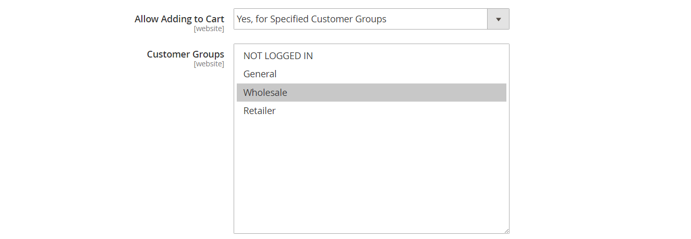
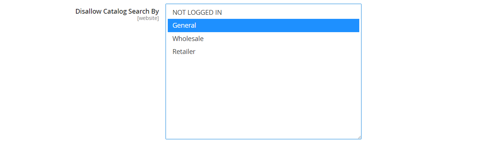

# Categoriemachtigingen

{{ee-feature}}

De toegang van de categorie kan tot specifieke klantengroepen worden beperkt, of volledig beperkt. U kunt de weergave van de productprijzen bepalen, bepalen welke klantengroepen producten aan het winkelwagentje kunnen toevoegen en de bestemmingspagina opgeven.

>[!NOTE]
>
>De Toestemmingen van de categorie hebben een globaal werkingsgebied en wanneer toegelaten, beperkt toegang tot elke categorie volgens zijn individuele toestemmingen. Categoriemachtigingen zijn standaard niet ingeschakeld.

Bijvoorbeeld, als u slechts aan groothandelsklanten verkoopt, kunt u iedereen toestaan om de catalogus te doorbladeren, maar vertoningsprijzen en aankopen slechts voor kopers in de _Groothandel_ klantengroep toe te staan. In het volgende voorbeeld hebben alleen aangemelde gebruikers toegang tot de categorie &quot;Verzamelingen&quot;. Voor gasten verschijnt de optie &quot;Verzamelingen&quot; niet in het hoofdmenu.

{width="600" zoomable="yes"}

Als deze optie is ingeschakeld, wordt op de pagina Categorie een nieuwe sectie _[!UICONTROL Category Permissions]_&#x200B;weergegeven waarmee u de benodigde toegang voor elke categorie kunt toepassen. U kunt veelvoudige toestemmingsregels aan elke categorie voor verschillende websites en klantengroepen toevoegen.

## Stap 1: Categoriemachtigingen configureren

>[!IMPORTANT]
>
>Alle bestaande [&#x200B; montages van de groepstoestemming &#x200B;](../configuration-reference/catalog/catalog.md#category-permissions) worden genegeerd door **_alle_** categorieën in de catalogus wanneer de **_[!UICONTROL Shared Catalog]_** eigenschap wordt toegelaten. [!UICONTROL Shared Catalog] beheert alle categorierechten in de catalogus volledig wanneer deze is ingeschakeld.

1. Voor _Admin_ sidebar, ga **[!UICONTROL Stores]** > _[!UICONTROL Settings]_>**[!UICONTROL Configuration]**.

1. Vouw in het linkerdeelvenster **[!UICONTROL Catalog]** uit en kies **[!UICONTROL Catalog]** eronder.

1. Breid  de **[!UICONTROL Category Permissions]** sectie uit.

   {width="600" zoomable="yes"}

   Voor een gedetailleerde lijst van deze opties, zie [&#x200B; Toestemmingen van de Categorie &#x200B;](../configuration-reference/catalog/catalog.md#category-permissions) in de _Verwijzing van de Configuratie_.

1. Stel **[!UICONTROL Enable]** in op `Yes` .

1. Vul de overige opties in op basis van wat u in uw winkel wilt toestaan of beperken (zie de volgende secties).

1. Klik op **[!UICONTROL Save Config]** als de bewerking is voltooid.

1. Wanneer u wordt gevraagd de cache bij te werken, klikt u op de koppeling **[!UICONTROL Cache Management]** in het systeembericht en volgt u de instructies om de cache te vernieuwen.

### [!UICONTROL Allow Browsing Category]

Deze optie is op alle categorieën in de [&#x200B; website &#x200B;](../getting-started/websites-stores-views.md) van toepassing.

Om leden van a **_specifieke klantengroep_** toe te staan om door categorieproducten te doorbladeren, doe het volgende:

1. Stel **[!UICONTROL Allow Browsing Category]** in op `Specified Customer Groups` .

1. Selecteer in het vak **[!UICONTROL Customer Groups]** elke groep die door producten in de categorie mag bladeren.

   Als u meerdere groepen wilt selecteren, houdt u Ctrl (PC) of Command (Mac) ingedrukt terwijl u op elke groep klikt.

   {width="600" zoomable="yes"}

Om **_toegang te beperken en aan een het landen pagina_** om te leiden, doe het volgende:

1. Stel **[!UICONTROL Allow Browsing Category]** in op `No, Redirect to Landing Page` .

1. Kies de **[!UICONTROL Landing Page]** waar bezoekers worden omgeleid.

   {width="600" zoomable="yes"}

   >[!NOTE]
   >
   >Hoewel de instelling _[!UICONTROL Allow Browsing Category]_&#x200B;van toepassing is op alle categorieën in de website, kunt u voor elke winkelweergave een andere bestemmingspagina configureren.

### [!UICONTROL Display Product Prices]

Deze optie is op alle categorieën in de [&#x200B; website &#x200B;](../getting-started/websites-stores-views.md) van toepassing.

Om slechts leden van **_specifieke klantengroepen_** toe te staan om de prijs van producten in de categorie te zien, doe het volgende:

1. Stel **[!UICONTROL Display Product Prices]** in op `Yes, for Specified Customer Groups` .

1. Selecteer in het vak **[!UICONTROL Customer Groups]** elke groep die de prijs van de producten in de categorie mag zien.

   Als u meerdere groepen wilt selecteren, houdt u Ctrl (PC) of Command (Mac) ingedrukt terwijl u op elke groep klikt.)

   {width="600" zoomable="yes"}

### [!UICONTROL Allow Adding to Cart]

Deze optie is op alle categorieën in de [&#x200B; website &#x200B;](../getting-started/websites-stores-views.md) van toepassing.

Om slechts leden van **_specifieke klantengroepen_** toe te staan om categorieproducten in het winkelwagentje te zetten, doe het volgende:

1. Stel **[!UICONTROL Allow Adding to Cart]** in op `Yes, for Specified Customer Groups` .

1. Selecteer in het vak **[!UICONTROL Customer Groups]** elke groep die producten uit de categorie aan het winkelwagentje mag toevoegen.

   Als u meerdere groepen wilt selecteren, houdt u Ctrl (PC) of Command (Mac) ingedrukt terwijl u op elke groep klikt.

   {width="600" zoomable="yes"}

### [!UICONTROL Disallow Catalog Search]

Stel deze optie in om te voorkomen dat leden van een specifieke klantengroep de functie Zoeken in catalogi gebruiken. Het is op alle categorieën in de [&#x200B; website &#x200B;](../getting-started/websites-stores-views.md) van toepassing.

- Om **_slechts het programma geopende klanten_** toe te staan om het Onderzoek van de Catalogus te gebruiken, uitgezochte `NOT LOGGED IN`.

- Om **_slechts specifieke klantengroepen_** toe te staan om het Onderzoek van de Catalogus te gebruiken, elke groep te selecteren om van het gebruiken van het Onderzoek van de Categorie worden uitgesloten.

  Als u meerdere groepen wilt selecteren, houdt u Ctrl (PC) of Command (Mac) ingedrukt terwijl u op elke groep klikt.

  {width="600" zoomable="yes"}

## Stap 2: Categoriemachtigingen toepassen

1. Voor _Admin_ sidebar, ga **[!UICONTROL Catalog]** > **[!UICONTROL Categories]**.

1. Selecteer de doelcategorie in de categoriestructuur.

1. Breid  **[!UICONTROL Category Permissions]** op de pagina uit en doe het volgende:

   - Klik op **[!UICONTROL New Permission]** om een machtigingsregel te maken.

     {width="600" zoomable="yes"}

   - Kies de toepasselijke **[!UICONTROL Website]** en **[!UICONTROL Customer Group]** .

   - Stel de individuele machtigingen zo nodig in.

   >[!NOTE]
   >
   >Wanneer `Browsing Category` = `Deny` toestemming voor om het even welke oudercategorie wordt geplaatst, wordt het niet getoond op het [&#x200B; BreadcrumbSpoor &#x200B;](navigation-breadcrumb-trail.md) op de pagina van de kindcategorie.

1. Klik op **[!UICONTROL Save]** als de bewerking is voltooid.

>[!NOTE]
>
>Als om het even welk **_toestaat_** toestemmingen voor `Root Category` worden geplaatst, dan worden deze toestemmingen automatisch toegepast op alle subcategorieën en alle producten binnen `Catalog`. Als om het even welk product aan veelvoudige categorieën wordt toegewezen, en het heeft om het even welke **__** toestemmingen voor minstens één categorie toestaan, heeft het automatisch de zelfde **__** toestemmingen voor alle toegewezen categorieën toestaan.
