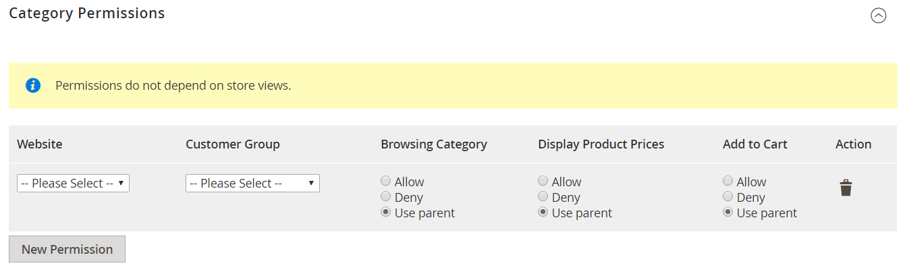

# Categoriemachtigingen

{{ee-feature}}

De toegang van de categorie kan tot specifieke klantengroepen worden beperkt, of volledig beperkt. U kunt de weergave van de productprijzen bepalen, bepalen welke klantengroepen producten aan het winkelwagentje kunnen toevoegen en de bestemmingspagina opgeven.

>[!NOTE]
>
>De Toestemmingen van de categorie hebben een globaal werkingsgebied en wanneer toegelaten, beperkt toegang tot elke categorie volgens zijn individuele toestemmingen. Categoriemachtigingen zijn standaard niet ingeschakeld.

Als u bijvoorbeeld alleen verkoopt aan klanten in de groothandel, kunt u iedereen toestaan door de catalogus te bladeren, maar prijzen weer te geven en aankopen alleen toe te staan aan kopers in de _Groothandel_ klantgroep. In het volgende voorbeeld hebben alleen aangemelde gebruikers toegang tot de categorie &quot;Verzamelingen&quot;. Voor gasten verschijnt de optie &quot;Verzamelingen&quot; niet in het hoofdmenu.

{width="600" zoomable="yes"}

Als deze optie is ingeschakeld, wordt een nieuwe _[!UICONTROL Category Permissions]_wordt weergegeven op de pagina Categorie, zodat u de vereiste toegang voor elke categorie kunt toepassen. U kunt veelvoudige toestemmingsregels aan elke categorie voor verschillende websites en klantengroepen toevoegen.

## Stap 1: Categoriemachtigingen configureren

>[!IMPORTANT]
>
>Alle bestaande [machtigingen voor groep instellen](../configuration-reference/catalog/catalog.md#category-permissions) worden genegeerd door **_alles_** categorieën in de catalogus als de **_[!UICONTROL Shared Catalog]_** -functie is ingeschakeld. [!UICONTROL Shared Catalog] beheert volledig alle categorierechten in de catalogus wanneer deze is ingeschakeld.

1. Op de _Beheerder_ zijbalk, ga naar **[!UICONTROL Stores]** > _[!UICONTROL Settings]_>**[!UICONTROL Configuration]**.

1. Vouw in het linkerdeelvenster uit **[!UICONTROL Catalog]** en kiest u **[!UICONTROL Catalog]** onder.

1. Uitbreiden  de **[!UICONTROL Category Permissions]** sectie.

   {width="600" zoomable="yes"}

   Voor een gedetailleerde lijst van deze opties, zie [Categoriemachtigingen](../configuration-reference/catalog/catalog.md#category-permissions) in de _Configuratieverwijzing_.

1. Set **[!UICONTROL Enable]** tot `Yes`.

1. Vul de overige opties in op basis van wat u in uw winkel wilt toestaan of beperken (zie de volgende secties).

1. Klik op **[!UICONTROL Save Config]**.

1. Klik op de knop **[!UICONTROL Cache Management]** koppeling in het systeembericht en volg de instructies om de cache te vernieuwen.

### [!UICONTROL Allow Browsing Category]

Deze optie is van toepassing op alle categorieën in de [website](../getting-started/websites-stores-views.md).

Om leden van een **_specifieke klantengroep_** Ga als volgt te werk om door categorieproducten te bladeren:

1. Set **[!UICONTROL Allow Browsing Category]** tot `Specified Customer Groups`.

1. In de **[!UICONTROL Customer Groups]** selecteert u elke groep die mag bladeren door producten in de categorie.

   Als u meerdere groepen wilt selecteren, houdt u Ctrl (PC) of Command (Mac) ingedrukt terwijl u op elke groep klikt.

   {width="600" zoomable="yes"}

Naar **_toegang tot en omleiding naar een bestemmingspagina beperken_** Ga als volgt te werk:

1. Set **[!UICONTROL Allow Browsing Category]** tot `No, Redirect to Landing Page`.

1. Kies de optie **[!UICONTROL Landing Page]** waar bezoekers worden omgeleid.

   {width="600" zoomable="yes"}

   >[!NOTE]
   >
   >Hoewel de _[!UICONTROL Allow Browsing Category]_de instelling geldt voor alle categorieën in de website. U kunt voor elke winkelweergave een andere bestemmingspagina configureren.

### [!UICONTROL Display Product Prices]

Deze optie is van toepassing op alle categorieën in de [website](../getting-started/websites-stores-views.md).

Alleen leden van **_specifieke klantengroepen_** om de prijs van de producten in de categorie te zien , gaat u als volgt te werk :

1. Set **[!UICONTROL Display Product Prices]** tot `Yes, for Specified Customer Groups`.

1. In de **[!UICONTROL Customer Groups]** selecteert u elke groep die de prijs van de producten in de categorie mag zien.

   Als u meerdere groepen wilt selecteren, houdt u Ctrl (PC) of Command (Mac) ingedrukt terwijl u op elke groep klikt.)

   {width="600" zoomable="yes"}

### [!UICONTROL Allow Adding to Cart]

Deze optie is van toepassing op alle categorieën in de [website](../getting-started/websites-stores-views.md).

Alleen leden van **_specifieke klantengroepen_** om categorieproducten in het winkelwagentje te plaatsen , doet u het volgende :

1. Set **[!UICONTROL Allow Adding to Cart]** tot `Yes, for Specified Customer Groups`.

1. In de **[!UICONTROL Customer Groups]** selecteert u elke groep die producten uit de categorie aan het winkelwagentje mag toevoegen.

   Als u meerdere groepen wilt selecteren, houdt u Ctrl (PC) of Command (Mac) ingedrukt terwijl u op elke groep klikt.

   {width="600" zoomable="yes"}

### [!UICONTROL Disallow Catalog Search]

Stel deze optie in om te voorkomen dat leden van een specifieke klantengroep de functie Zoeken in catalogi gebruiken. Het is van toepassing op alle categorieën in de [website](../getting-started/websites-stores-views.md).

- Toestaan **_alleen aangemelde klanten_** Als u Catalog Search wilt gebruiken, selecteert u `NOT LOGGED IN`.

- Toestaan **_alleen specifieke klantgroepen_** als u Cataloguszoekopdracht wilt gebruiken, selecteert u elke groep die u wilt uitsluiten van het gebruik van Zoeken in categorieën.

  Als u meerdere groepen wilt selecteren, houdt u Ctrl (PC) of Command (Mac) ingedrukt terwijl u op elke groep klikt.

  {width="600" zoomable="yes"}

## Stap 2: Categoriemachtigingen toepassen

1. Op de _Beheerder_ zijbalk, ga naar **[!UICONTROL Catalog]** > **[!UICONTROL Categories]**.

1. Selecteer de doelcategorie in de categoriestructuur.

1. Uitbreiden  **[!UICONTROL Category Permissions]** op de pagina en voer de volgende handelingen uit:

   - Als u een machtigingsregel wilt maken, klikt u op **[!UICONTROL New Permission]**.

     {width="600" zoomable="yes"}

   - Kies de toepasselijke **[!UICONTROL Website]** en **[!UICONTROL Customer Group]**.

   - Stel de individuele machtigingen zo nodig in.

   >[!NOTE]
   >
   >Wanneer `Browsing Category` = `Deny` bevoegdheden zijn ingesteld voor een bovenliggende categorie; deze wordt niet weergegeven op de [BreadcrumbTrail](navigation-breadcrumb-trail.md) op de pagina met onderliggende categorieën.

1. Klik op **[!UICONTROL Save]**.

>[!NOTE]
>
>Indien **_Toestaan_** rechten worden ingesteld voor de `Root Category`, dan worden deze toestemmingen automatisch toegepast op alle subcategorieën en alle producten binnen `Catalog`. Als een product aan meerdere categorieën is toegewezen en er een **_Toestaan_** machtigingen voor ten minste één categorie, deze heeft automatisch dezelfde **_Toestaan_** machtigingen voor alle toegewezen categorieën.
