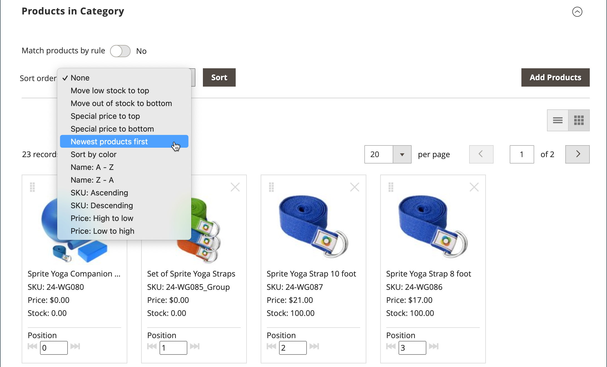

# Producten in categorieën sorteren

{{ee-feature}}

De positie van producten in een categorie kan handmatig worden opgegeven door producten naar de juiste positie te slepen of door een vooraf gedefinieerde sorteervolgorde toe te passen. Standaard kunnen producten worden gesorteerd op voorraadniveau, leeftijd, kleur, naam, SKU en prijs. Met Automatisch sorteren wordt de huidige sorteervolgorde genegeerd en worden eventuele handmatig ingestelde posities voor slepen en neerzetten opnieuw ingesteld. De sorteervolgorde en het minimale voorraadniveau die nodig zijn om de producten in de lijst op te nemen, worden vastgesteld in de [Visual Merchandiser](../configuration-reference/catalog/visual-merchandiser.md) configuratie.

>[!NOTE]
>
>Op de categoriepagina&#39;s: `Out of stock` producten worden altijd weergegeven **_na_** `In Stock` producten in de productlijst met alle sorteertypen.

U kunt de categorieopties voor elke categorie afzonderlijk instellen [winkelweergave](../stores-purchase/stores.md#add-stores) om de selectie van producten, hun relatieve positie in de lijst en de kenmerken te bepalen die beschikbaar zijn voor categorieregels. Er is echter één enkele, **_globaal_** sorteervolgorde en productpositie in de catalogus en deze worden door alle gebruikers gedeeld [winkelweergaven](../stores-purchase/store-views.md)en websites.

## Stap 1: Plaats het werkingsgebied van de configuratie

1. Op de _Beheerder_ zijbalk, ga naar **[!UICONTROL Catalog]** > **[!UICONTROL Categories]**.

1. Kies zo nodig de optie **[!UICONTROL Store View]** waar de instellingen gelden.

   Voor een multi-store installatie, _[!UICONTROL Store View]_met de instelling wordt de sorteervolgorde toegepast op alle beschikbare weergaven in de winkel.

1. Kies in de categoriestructuur aan de linkerkant de categorie die u wilt bewerken.

   {width="700" zoomable="yes"}

## Stap 2: De producten sorteren

>[!NOTE]
>
>Wanneer u een categorie sorteert op een productkenmerk, worden producten met dezelfde kenmerkwaarden ook gesorteerd op hun _[!UICONTROL Product ID]_in oplopende volgorde.

In de _[!UICONTROL Products in Category]_op de tegels (  ) om de producttegels in een raster weer te geven. Gebruik de handmatige of automatische methode om de producten te sorteren.

{width="600" zoomable="yes"}

### Methode 1: Handmatig sorteren

1. Set **[!UICONTROL Sort Order]** naar uw voorkeur.

   {width="600" zoomable="yes"}

1. Klik op **[!UICONTROL Sort]**.

1. Klik op **[!UICONTROL Save Category]**.

1. Wanneer daarom wordt gevraagd, werkt u eventuele ongeldige indexen bij.

### Methode 2: Automatisch sorteren

1. Set **[!UICONTROL Match products by rule]** () naar `Yes`.

1. Set **[!UICONTROL Automatic Sorting]** naar uw voorkeur.

1. Volg de instructies in de volgende stap om een categorieregel te maken.

## Stap 3: Een categorieregel maken

1. Set **[!UICONTROL Match products by rule]** () naar `Yes`.

1. Klik op **[!UICONTROL Add Condition]**.

1. Kies de optie **[!UICONTROL Attribute]** dat is de basis van de voorwaarde .

1. Set **[!UICONTROL Operator]** op een van de volgende wijzen:

   - `Equal`
   - `Not equal`
   - `Greater than`
   - `Greater than or equal to`
   - `Less than`
   - `Less than or equal to`
   - `Contains`

1. Voer de juiste gegevens in **[!UICONTROL Value]**.

   {width="600" zoomable="yes"}

1. Als u nog een voorwaarde wilt toevoegen, klikt u op **[!UICONTROL Add Condition]** en herhaal het proces.

## Stap 4: Opslaan, vernieuwen en verifiëren

1. Klik op **[!UICONTROL Save Category]**.

1. Klik wanneer u wordt gevraagd de cache te vernieuwen op **[!UICONTROL Cache Management]** en vernieuw elke ongeldige cache.

1. Controleer in de winkel of de regels voor productselectie, sorteren en categorie correct werken.

   Als u aanpassingen moet aanbrengen, wijzigt u de instellingen en probeert u het opnieuw.
