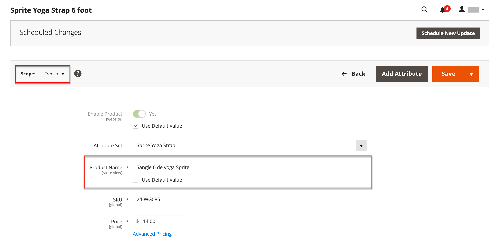

# Inleiding tot catalogusbeheer

Adobe Commerce en de Magento Open Source gebruiken de term _catalogus_ om naar het productgegevensbestand als geheel te verwijzen.

Een van de belangrijkste gebieden bij het maken en beheren van uw winkel is het maken van producten en categorieën. Admin verstrekt verscheidene hulpmiddelen die u voor de aanvankelijke opstelling van uw opslag, en voor het handhaven van uw opslag en het optimaliseren van uw zaken gebruikt.

>[!TIP]
>
>Inventory management for Adobe Commerce en Magento Open Source bieden u de tools om uw productvoorraad te beheren. Handelaars met één winkel kunnen deze functies gebruiken om de verkoop en de verzending van goederen te voltooien. Voor meer informatie over deze eigenschappen en hoe u hen kunt gebruiken om voorraad in veelvoudige plaatsen te beheren, zie de [&#x200B; Gids van de Gebruiker van Inventory management &#x200B;](../inventory-management/introduction.md).

## Catalogusbereik

De toegang tot catalogusgegevens wordt bepaald door verscheidene factoren, met inbegrip van het [&#x200B; werkingsgebied &#x200B;](../getting-started/websites-stores-views.md#scope-settings) plaatsen, de catalogusconfiguratie, en de [&#x200B; wortelcategorie &#x200B;](category-root.md) die aan de opslag wordt toegewezen. De catalogus bevat producten die zijn ingeschakeld en te koop zijn, en producten die momenteel niet te koop worden aangeboden.

In verkoop, verwijst de term _catalogus_ gewoonlijk naar een gekromde selectie van producten die voor verkoop beschikbaar is. Een winkel kan bijvoorbeeld een &#39;Veringscatalogus&#39; en een &#39;Catalogus hervallen&#39; hebben.

Als de inhoudstafel van een gedrukte catalogus, organiseert het belangrijkste menu van uw opslag - of _hoogste navigatie_ - producten door categorie om het voor klanten gemakkelijk te maken om te vinden wat zij willen. Het belangrijkste menu is gebaseerd op a _wortelcategorie_, die een container voor het menu is dat aan de opslag wordt toegewezen. Omdat de specifieke menuopties op het niveau van de archiefmening worden bepaald, kan elke mening een verschillend hoofdmenu hebben dat op de zelfde wortelcategorie wordt gebaseerd. In elk menu kunt u een gekromde selectie van producten aanbieden die geschikt is voor de winkel.

{width="550"}

## Productbereik

Voor installaties met veelvoudige websites, opslag, en meningen, bepaalt het [&#x200B; werkingsgebied &#x200B;](../getting-started/websites-stores-views.md#scope-settings) plaatsen waar de producten voor verkoop beschikbaar zijn, en de productinformatie die voor elke archiefmening beschikbaar is. In eerste instantie worden alle producten die u maakt, gepubliceerd naar de standaardwebsite, in de winkel en in de winkelweergave.

{width="550"}

Als u slechts één enkele opslag met de standaardmening hebt, kunt u uw opslag in [&#x200B; in werking stellen enige opslagwijze &#x200B;](../getting-started/websites-stores-views.md#single-store-mode) om de werkingsgebiedmontages te verbergen. Als uw winkel echter meerdere weergaven heeft, wordt onder de naam van elk veld een bereikindicator weergegeven.

- Om productinformatie voor een specifieke mening uit te geven, gebruik de _controle van de Mening van de Opslag_ in de upper-left hoek om de mening te kiezen. Aanvullende besturingselementen zijn beschikbaar voor elk veld dat op het niveau van de winkelweergave kan worden bewerkt.

- Om het werkingsgebied van een product in een multisite installatie te bepalen, zie het [&#x200B; Product in Websites &#x200B;](settings-basic-websites.md) sectie van productinformatie.

Het bewerken van een product voor een winkelweergave is vergelijkbaar met het toevoegen van een laag met productinformatie die specifiek is voor de weergave.

U kunt alleen producten bewerken of toewijzen voor de site waarvoor u machtigingen hebt, niet voor alle sites waarvoor het product is toegewezen.

Hoewel de _Spaanse_ opslagmening in het volgende voorbeeld wordt geselecteerd, verschijnt de productinformatie nog in de originele taal van de standaard opslagmening. Om de productinformatie te vertalen, moet u aan de _Spaanse_ opslagmening schakelen en de tekstgebieden vertalen - zoals producttitel, beschrijving, en de meta- gegevens. Voor meer informatie, zie [&#x200B; producten &#x200B;](../stores-purchase/store-localize.md#localize-products) lokaliseren.

## Een product bewerken voor een andere weergave

>[!NOTE]
>
>Het _Al werkingsgebied van de Mening van de Opslag_ wordt onbruikbaar gemaakt voor Admin gebruikers die tot een specifiek werkingsgebied beperkt zijn wanneer het product ook buiten het toegestane werkingsgebied wordt gepubliceerd. Het eerste werkingsgebied beschikbaar voor geeft wordt geselecteerd door gebrek omdat de beperkte gebruikers _globale_ geen acties of acties kunnen uitvoeren die werkingsgebied beïnvloeden waar zij geen toegang hebben.

1. Stel in de linkerbovenhoek **[!UICONTROL Store View]** in op de weergave die u wilt bewerken.

1. Klik op **[!UICONTROL OK]** om de bereikwijziging te bevestigen.

1. Werk het veld bij met de nieuwe waarde voor de winkelweergave.

   Onder elk veld dat voor de winkelweergave kan worden bewerkt, wordt een selectievakje weergegeven. Om de standaardwaarde met voeten te treden, schrap **checkbox Standaardwaarde van het Gebruik**.

   {width="600" zoomable="yes"}

1. Klik op **[!UICONTROL Save]** als de bewerking is voltooid.

1. Stel in de linkerbovenhoek de **[!UICONTROL Store View]** -kiezer weer in op de standaardwaarden.

1. Ga als volgt te werk om de wijziging in uw winkel te controleren:

   - In de hoger-juiste hoek, klik de _Admin_ menupijl en kies **[!UICONTROL Customer View]**.

     {width="600" zoomable="yes"}

   - Stel in de rechterbovenhoek van de winkel de **[!UICONTROL Language Chooser]** in op de winkelweergave van het product dat u hebt bewerkt en zoek het product dat u voor de weergave hebt bewerkt.

     {width="700" zoomable="yes"}
