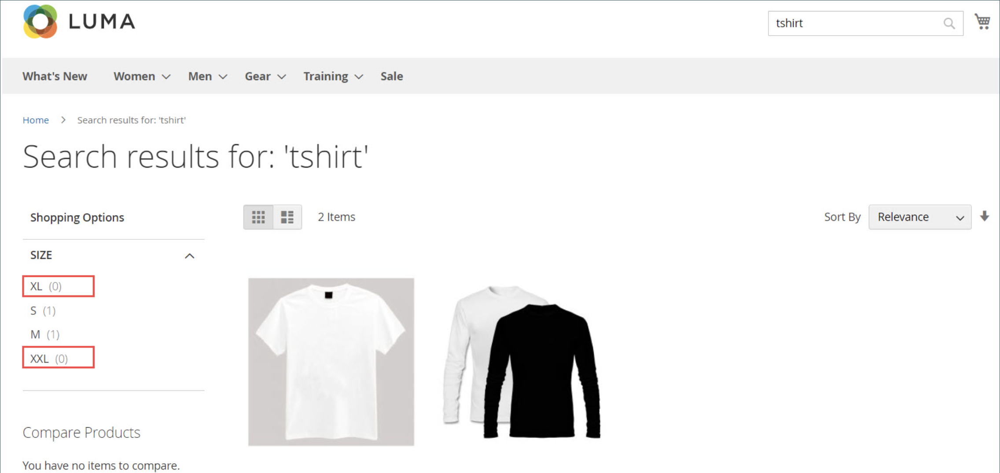

# Gelaagde navigatie

>[!NOTE]
>
>De standaard gelaagde navigatie die in deze sectie wordt beschreven verschilt van Levend Onderzoek gefilterde navigatie met [&#x200B; facetten &#x200B;](https://experienceleague.adobe.com/nl/docs/commerce/live-search/live-search-admin/facets/facets).

Met gelaagde navigatie kunt u gemakkelijk producten zoeken op basis van categorie, prijsbereik of andere beschikbare kenmerken. De gelaagde navigatie toont gewoonlijk in de linkerkolom van onderzoeksresultaten en categoriepagina&#39;s en soms op de homepage. De standaardnavigatie omvat a _Winkel door_ lijst van categorieën en prijswaaier. U kunt de weergave van gelaagde navigatie configureren, inclusief het aantal producten en het prijsbereik.

{width="700" zoomable="yes"}

## Filterbare kenmerken

>[!NOTE]
>
>De filterbare kenmerkvereisten die in dit onderwerp worden beschreven verschillen voor [&#x200B; Levende Onderzoek &#x200B;](https://experienceleague.adobe.com/nl/docs/commerce/live-search/overview). Meer leren, zie [&#x200B; Facetten &#x200B;](https://experienceleague.adobe.com/nl/docs/commerce/live-search/live-search-admin/facets/facets).

Gelaagde navigatie kan worden gebruikt om naar producten door categorie of door attribuut te zoeken. Als een winkelier bijvoorbeeld de categorie Mens/Shorts kiest in de bovenste navigatie, worden in de eerste resultaten alle producten in de categorie opgenomen. De lijst kan verder worden gefilterd door een specifieke stijl, een specifiek klimaat, een bepaalde kleur, een bepaald materiaal, een bepaald patroon of een bepaalde prijs (of een combinatie van waarden) te kiezen. Filterbare kenmerken worden weergegeven in een uitbreidende sectie waarin elke kenmerkwaarde wordt vermeld. Als optie, kan de lijst van producten met passende resultaten worden gevormd om producten met, of zonder, een gelijke te omvatten.

De kenmerkeigenschappen, in combinatie met het type van productinput, bepalen welke attributen voor gelaagde navigatie kunnen worden gebruikt. De gelaagde navigatie is beschikbaar slechts voor [_anker_](categories-display-settings.md) categorieën, maar kan ook aan de pagina&#39;s van onderzoeksresultaten worden toegevoegd. Het **Type van Invoer van de Catalogus voor het bezit van de Eigenaar van de Opslag** van elk attribuut moet aan `Yes/No`, `Dropdown`, `Multiple Select`, of `Price` worden geplaatst. Om de attributen filterbaar te maken, moet het **Gebruik in Gelaagd bezit van de Navigatie** van elk aan of `Filterable (with results)` of `Filterable (no results)` worden geplaatst.

_Voorbeeld: Filterbare attributen met resultaten_

{width="700" zoomable="yes"}

_Voorbeeld: Filterbare die staalwaarden zonder resultaat_ worden getoond

{width="700" zoomable="yes"}

De volgende instructies tonen hoe u elementaire gelaagde navigatie met filterbare kenmerken instelt. Voor geavanceerde gelaagde navigatie met prijsstappen, zie [&#x200B; Navigatie van de Prijs &#x200B;](navigation-layered.md#configure-price-navigation).

## Stap 1: Opstelling de attributeneigenschappen

1. Voor _Admin_ sidebar, ga **[!UICONTROL Stores]** > _[!UICONTROL Attributes]_>**[!UICONTROL Product]**.

1. Blader naar of gebruik de gefilterde zoekopdracht om een kenmerk in de lijst te zoeken en open het in de bewerkingsmodus.

   {width="700" zoomable="yes"} te gebruiken

1. Kies **[!UICONTROL Storefront Properties]** in het linkerdeelvenster en stel **[!UICONTROL Use In Layered Navigation]** in op een van de volgende opties:

   - `Filterable (with results)` - Gelaagde navigatie omvat slechts die filters waarvoor de passende producten kunnen worden gevonden. Om het even welke kenmerkwaarde die reeds op alle producten van toepassing is die in de lijst worden getoond zou nog als beschikbare filter moeten tonen. Kenmerkwaarden met een aantal van nul (0) overeenkomende producten worden weggelaten uit de lijst met beschikbare filters. De gefilterde lijst bevat alleen de producten die overeenkomen met het filter. De lijst met producten wordt alleen bijgewerkt als de geselecteerde filters wijzigen wat wordt weergegeven.

   - `Filterable (no results)` - Bij gelaagde navigatie worden filters weergegeven voor alle beschikbare kenmerkwaarden en het aantal producten ervan, zelfs wanneer producten met nul (0) overeenkomen. Als de kenmerkwaarde een staal is, wordt het filter weergegeven maar uitgestreept. Deze optie biedt geen ondersteuning voor filteren op basis van prijslagen en heeft geen invloed op prijsfilters.

1. Stel **[!UICONTROL Use In Search Results Layered Navigation]** in op `Yes` .

   {width="600" zoomable="yes"}

1. Herhaal deze stappen voor elk kenmerk dat u in gelaagde navigatie wilt opnemen.

>[!NOTE]
>
>- Als de instelling _[!UICONTROL Use in Search]_&#x200B;is ingesteld op `No` , wordt de instelling&#x200B;_[!UICONTROL Use in Search Results Layered Navigation]_ in dit geval niet weergegeven. In dat geval wordt het kenmerk product niet gebruikt in de zoekopdracht, ongeacht de instelling [!UICONTROL Use in Layered Navigation] .
>
>- Het veld [!UICONTROL Position] wordt standaard grijs weergegeven. U moet het kenmerk opslaan voordat u deze instelling kunt wijzigen.

## Stap 2: Maak van de categorie een anker

1. Voor _Admin_ sidebar, ga **[!UICONTROL Catalog]** > **[!UICONTROL Categories]**.

1. Selecteer in de categoriestructuur de categorie waarin u gelaagde navigatie wilt gebruiken.

1. Breid  de **[!UICONTROL Display Settings]** sectie uit en reeks **[!UICONTROL Anchor]** aan `Yes`.

   {width="600" zoomable="yes"}

1. Klik op **[!UICONTROL Save]**.

## Stap 3: Test de resultaten

Als u de instelling wilt testen, gaat u naar uw winkel en gaat u vanuit het hoofdmenu naar de categorie. De selectie van filterbare kenmerken wordt weergegeven in de gelaagde navigatie van de categoriepagina.

Zoek, filter, en herzie de getoonde producten.

## Filtreerbare kenmerkwaarden verwijderen uit gelaagde navigatie

Gelaagde navigatie omvat filters voor alle beschikbare attributenwaarden en hun productaantallen, met inbegrip van producten met nul (0) productgelijken (zoals aangetoond in het volgende beeld).

{width="700" zoomable="yes"} tonen

Dit resultaat kan het voor klanten moeilijk maken om een voorkeursproduct te selecteren en het is niet nodig om kenmerkwaarden weer te geven &#x200B; &#x200B; met 0 producten aan de voorzijde.

U kunt de volgende stappen gebruiken om filterbare kenmerkwaarden met 0 Producten uit de gelaagde navigatie te verwijderen:

1. Voor _Admin_ sidebar, ga **[!UICONTROL Stores]** > _[!UICONTROL Attributes]_>**[!UICONTROL Product]**.

1. Blader naar of gebruik de gefilterde zoekopdracht om een kenmerk in de lijst te zoeken en open het in de bewerkingsmodus.

1. Klik onder _[!UICONTROL Attribute Information]_&#x200B;op **[!UICONTROL Storefront Properties]**.

1. Kies **[!UICONTROL Layered Navigation]** bij `Filterable (with results)` .

   {width="600" zoomable="yes"}

1. Klik op **[!UICONTROL Save Attribute]**.

## Prijsnavigatie

>[!NOTE]
>
>De configuratie van de prijsnavigatie die in deze sectie wordt beschreven verschilt van Levend Onderzoek gefilterde navigatie met [&#x200B; facetten &#x200B;](https://experienceleague.adobe.com/nl/docs/commerce/live-search/live-search-admin/facets/facets).

De navigatie van de prijs kan worden gebruikt om producten door prijswaaier in gelaagde navigatie te verdelen. U kunt elk bereik ook in intervallen splitsen. Er zijn een paar manieren om prijsnavigatie te berekenen:

- Automatisch (prijsbereiken egaliseren)
- Automatisch (productaftellingen egaliseren)
- Handmatig

>[!BEGINSHADEBOX]

Wanneer het filtreren door prijs in gelaagde navigatie, gebruikt Adobe Commerce de laagste prijs van de kindpunten van een configureerbaar product. Als gevolg hiervan komt een configureerbaar product alleen voor in het laagste prijsbereik van zijn onderliggende producten, zelfs als sommige onderliggende producten hogere prijzen hebben.

>[!ENDSHADEBOX]

Bij de eerste twee methoden worden de navigatiestappen automatisch berekend. Met de handmatige methode kunt u een scheidingsgrens voor prijsintervallen opgeven. In het volgende voorbeeld wordt het verschil getoond tussen prijsnavigatiestappen 10 en 100.

Iteratieve splitsing zorgt voor de beste verdeling van de producten over de prijsklassen. Na het kiezen van het bereik van $0,00-$99 kan de klant door verschillende prijssubbereiken omlaag gaan. De splitsingen van het prijsbereik worden beëindigd wanneer het aantal producten de drempel bereikt die door de grens van de Afdeling van het Interval wordt bepaald.

## Voorbeeld: Prijsnavigatiestappen

| Prijs stap voor 10 | Prijs stap voor 100 |
|----------|--------|
| $ 20,00 - $ 29,99 (1) | $ 0,00 - $ 99,99 (4) |
| $ 30,00 - $ 39,99 (2) | $ 100 - $ 199,99 (5) |
| $ 70,00 - $ 79,99 (1) | $ 400,00 - $ 499,99 (2) |
| $ 100,00 - $ 109,99 (1) | $ 700,00 en hoger (1) |
| $ 120,00 - $ 129,99 (2) |   |
| $ 150,00 - $ 159,99 (1) |   |
| $ 180,00 - $ 189,99 (1) |   |
| $ 420,00 - $ 429,99 (1) |   |
| $ 440,00 - $ 449,99 (1) |   |
| $ 710,00 en hoger (1) |   |

{style="table-layout:auto"}

## Prijsnavigatie configureren

>[!IMPORTANT]
>
>Om producten en hun prijzen correct te tonen volgens _prijsfilters_ in de gelaagde navigatie, zorg ervoor dat de montages voor de prijsvertoning in de [&#x200B; configuratie van de BTW van de Verkoop &#x200B;](../configuration-reference/sales/tax.md) de zelfde waarde hebben (`Excluding Tax` **of** `Including Tax`). Controleer de waarde _[!UICONTROL Calculation Settings]_&#x200B;voor **[!UICONTROL Catalog Prices]**. Controleer voor&#x200B;_[!UICONTROL Price Display Settings]_ de waarde **[!UICONTROL Display Product Prices in Catalog]** . Als deze verschillende waarden hebben, kunnen prijsfilters in de gelaagde navigatie producten niet correct filteren en sorteren op prijs.

1. Voor _Admin_ sidebar, ga **[!UICONTROL Stores]** > _[!UICONTROL Settings]_>**[!UICONTROL Configuration]**.

1. Vouw in het linkerdeelvenster **[!UICONTROL Catalog]** uit en kies **[!UICONTROL Catalog]** eronder.

1. Breid  uit de _Gelaagde sectie van de Navigatie_.

   Standaard is **[!UICONTROL Display Product Count]** ingesteld op `Yes` . Schakel indien nodig het selectievakje **[!UICONTROL Use system value]** uit om deze instelling te wijzigen.

   {width="600" zoomable="yes"}

   Voor een gedetailleerde lijst van deze configuratieopties, zie [&#x200B; Gelaagde Navigatie &#x200B;](../configuration-reference/catalog/catalog.md#layered-navigation) in de _Verwijzing van de Configuratie_.

1. Stel **[!UICONTROL Price Navigation Steps Calculation]** in voor een van de methoden in de volgende secties.

1. Klik op **[!UICONTROL Save Config]** als de bewerking is voltooid.

### Methode 1: Automatisch (prijsbereiken egaliseren)

Laat **[!UICONTROL Price Navigation Steps Calculation]** ingesteld staan op `Automatic (Equalize Price Ranges)` (standaardwaarde). Deze instelling gebruikt het standaardalgoritme voor prijsnavigatie.

### Methode 2: Automatisch (het aantal producten gelijkstellen)

>[!TIP]
>
>Schakel indien nodig eerst het selectievakje **[!UICONTROL Use system value]** uit om deze instellingen te wijzigen.

1. Stel **[!UICONTROL Price Navigation Steps Calculation]** in op `Automatic (equalize product counts)` .

1. Stel **[!UICONTROL Display Price Interval as One Price]** in op `Yes` als u één prijs wilt weergeven voor meerdere producten met dezelfde prijs.

1. Voer bij **[!UICONTROL Interval Division Limit]** de drempel in voor het aantal producten binnen een prijsbereik.

   Het bereik kan niet verder worden opgesplitst dan deze limiet. De standaardwaarde is `9` .

   {width="600" zoomable="yes"}

### Methode 3: Handmatig

>[!NOTE]
>
>Schakel indien nodig eerst het selectievakje **[!UICONTROL Use system value]** uit om deze instellingen te wijzigen.

1. Stel **[!UICONTROL Price Navigation Steps Calculation]** in op `Manual` .

1. Voer een waarde in die de **[!UICONTROL Default Price Navigation Step]** bepaalt.

1. Voer de toegestane **[!UICONTROL Maximum Number of Price Intervals]** in (maximaal `100` ).

   {width="600" zoomable="yes"}

## Gelaagde navigatie configureren

>[!NOTE]
>
>De standaard gelaagde navigatie die in deze sectie wordt beschreven verschilt van Levend Onderzoek gefilterde navigatie met [&#x200B; facetten &#x200B;](https://experienceleague.adobe.com/nl/docs/commerce/live-search/live-search-admin/facets/facets).

De gelaagde navigatieconfiguratie bepaalt als een producttelling tussen haakjes na elk attribuut, en de grootte van de stapberekening toont die in prijsnavigatie wordt gebruikt.

1. Voor _Admin_ sidebar, ga **[!UICONTROL Stores]** > _[!UICONTROL Settings]_>**[!UICONTROL Configuration]**.

1. Vouw in het linkerdeelvenster de sectie _[!UICONTROL Catalog]_&#x200B;uit en kies **[!UICONTROL Catalog]**&#x200B;eronder.

1. Vouw de sectie _[!UICONTROL Layered Navigation]_&#x200B;uit.

   >[!NOTE]
   >
   >Schakel indien nodig eerst het selectievakje **[!UICONTROL Use system value]** uit om deze instellingen te wijzigen.

1. Stel **[!UICONTROL Display Product Count]** in op `Yes` om het aantal producten weer te geven dat voor elk kenmerk wordt gevonden.

1. Stel **[!UICONTROL Price Navigation Step Calculation]** in op `Automatic (equalize price ranges)` .

1. Klik op **[!UICONTROL Save Config]** als de bewerking is voltooid.
