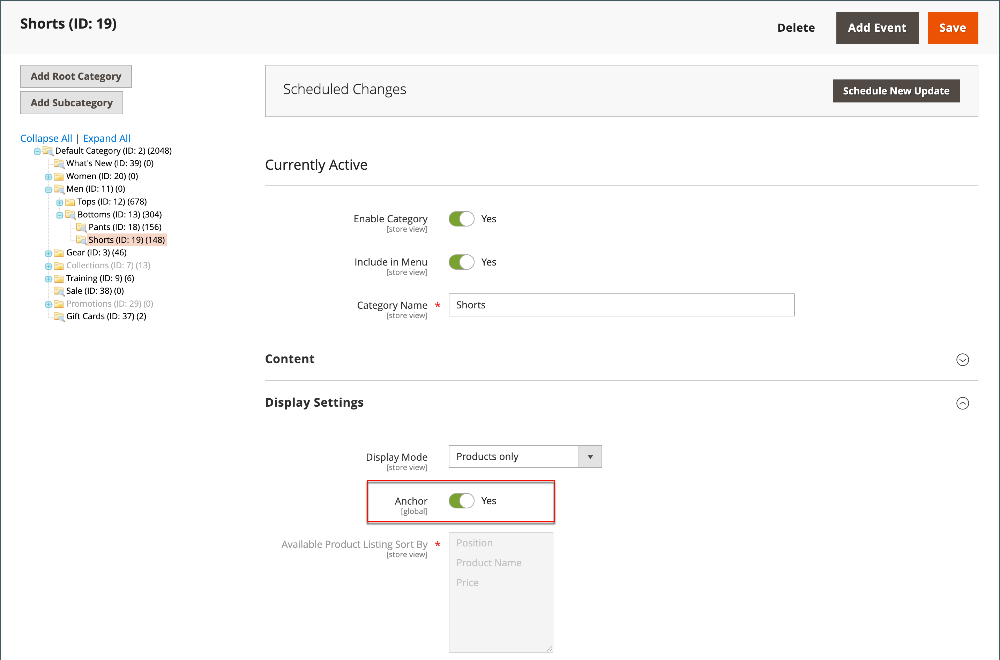

# Gelaagde navigatie

>[!NOTE]
>
>De standaard gelaagde navigatie die in deze sectie wordt beschreven verschilt van Live zoeken gefilterde navigatie met [facetten](https://experienceleague.adobe.com/docs/commerce-merchant-services/live-search/live-search-admin/facets/facets.html).

Met gelaagde navigatie kunt u gemakkelijk producten zoeken op basis van categorie, prijsbereik of andere beschikbare kenmerken. Gelaagde navigatie verschijnt gewoonlijk in de linkerkolom van onderzoeksresultaten en categoriepagina&#39;s en soms op de homepage. De standaardnavigatie omvat een _Winkelen op_ lijst van categorieën en prijsbereik. U kunt de weergave van gelaagde navigatie configureren, inclusief het aantal producten en het prijsbereik.

{width="700" zoomable="yes"}

## Filterbare kenmerken

>[!NOTE]
>
>De filterbare kenmerkvereisten die in dit onderwerp worden beschreven verschillen voor [Live zoeken](https://experienceleague.adobe.com/docs/commerce-merchant-services/live-search/overview.html). Zie voor meer informatie [Facetten](https://experienceleague.adobe.com/docs/commerce-merchant-services/live-search/live-search-admin/facets/facets.html).

Gelaagde navigatie kan worden gebruikt om naar producten door categorie of door attribuut te zoeken. Als een winkelier bijvoorbeeld de categorie Mens/Shorts kiest in de bovenste navigatie, worden in de eerste resultaten alle producten in de categorie opgenomen. De lijst kan verder worden gefilterd door een specifieke stijl, een specifiek klimaat, een bepaalde kleur, een bepaald materiaal, een bepaald patroon of een bepaalde prijs, of een combinatie van waarden te kiezen. Filterbare kenmerken worden weergegeven in een uitbreidende sectie waarin elke kenmerkwaarde wordt vermeld. Als optie, kan de lijst van producten met passende resultaten worden gevormd om producten met, of zonder, een gelijke te omvatten.

De kenmerkeigenschappen, in combinatie met het type van productinput, bepalen welke attributen voor gelaagde navigatie kunnen worden gebruikt. Gelaagde navigatie is alleen beschikbaar voor [_anker_](categories-display-settings.md) categorieën, maar kan ook worden toegevoegd aan pagina&#39;s met zoekresultaten. De **Invoertype catalogus voor winkeleigenaar** eigenschap van elk kenmerk moet worden ingesteld op `Yes/No`, `Dropdown`, `Multiple Select`, of `Price`. Als u de kenmerken filterbaar wilt maken, **Gebruiken in gelaagde navigatie** eigenschap van elke eigenschap moet op een van beide worden ingesteld `Filterable (with results)` of `Filterable (no results)`.

_Voorbeeld: Te filteren kenmerken met resultaten_

{width="700" zoomable="yes"}

_Voorbeeld: filterbare staalwaarden weergegeven zonder resultaat_

{width="700" zoomable="yes"}

De volgende instructies tonen hoe u elementaire gelaagde navigatie met filterbare kenmerken instelt. Voor geavanceerde gelaagde navigatie met prijsstappen raadpleegt u [Prijsnavigatie](navigation-layered.md#configure-price-navigation).

## Stap 1: Opstelling de attributeneigenschappen

1. Op de _Beheerder_ zijbalk, ga naar **[!UICONTROL Stores]** > _[!UICONTROL Attributes]_>**[!UICONTROL Product]**.

1. Blader naar of gebruik de gefilterde zoekopdracht om een kenmerk in de lijst te zoeken en open het in de bewerkingsmodus.

   {width="700" zoomable="yes"}

1. Kies in het linkerdeelvenster de optie **[!UICONTROL Storefront Properties]** en instellen **[!UICONTROL Use In Layered Navigation]** op een van de volgende wijzen:

   - `Filterable (with results)` - Gelaagde navigatie omvat slechts die filters waarvoor de passende producten kunnen worden gevonden. Elke kenmerkwaarde die al van toepassing is op alle producten in de lijst, moet nog steeds als een beschikbaar filter worden weergegeven. Kenmerkwaarden met een aantal van nul (0) overeenkomende producten worden weggelaten uit de lijst met beschikbare filters. De gefilterde lijst bevat alleen de producten die overeenkomen met het filter. De lijst met producten wordt alleen bijgewerkt als de geselecteerde filters wijzigen wat wordt weergegeven.

   - `Filterable (no results)` - Gelaagde navigatie omvat filters voor alle beschikbare attributenwaarden en hun productaantallen, met inbegrip van producten met nul (0) productgelijken. Als de kenmerkwaarde een staal is, wordt de waarde weergegeven als een filter, maar uitgestreept. Filteren met prijslagen wordt niet ondersteund door deze optie en heeft geen invloed op Prijsfilters.

1. Set **[!UICONTROL Use In Search Results Layered Navigation]** tot `Yes`.

   {width="600" zoomable="yes"}

1. Herhaal deze stappen voor elk kenmerk dat u in gelaagde navigatie wilt opnemen.

>[!NOTE]
>
>De [!UICONTROL Position] Het veld wordt standaard gedimd weergegeven, dus u moet het kenmerk opslaan voordat u deze instelling kunt wijzigen.

## Stap 2: Maak van de categorie een anker

1. Op de _Beheerder_ zijbalk, ga naar **[!UICONTROL Catalog]** > **[!UICONTROL Categories]**.

1. Selecteer in de categoriestructuur de categorie waarin u gelaagde navigatie wilt gebruiken.

1. Uitbreiden  de **[!UICONTROL Display Settings]** sectie en set **[!UICONTROL Anchor]** tot `Yes`.

   {width="600" zoomable="yes"}

1. Klik op **[!UICONTROL Save]**.

## Stap 3: Test de resultaten

Als u de instelling wilt testen, gaat u naar uw winkel en gaat u vanuit het hoofdmenu naar de categorie. De selectie van filterbare kenmerken wordt weergegeven in de gelaagde navigatie van de categoriepagina.

Zoek, filter, en herzie de getoonde producten.

## Filtreerbare kenmerkwaarden verwijderen uit gelaagde navigatie

Gelaagde navigatie omvat filters voor alle beschikbare attributenwaarden en hun productaantallen, met inbegrip van producten met nul (0) productgelijken (zoals aangetoond in het volgende beeld).

{width="700" zoomable="yes"}

Dit resultaat kan het voor klanten moeilijk maken om een voorkeursproduct te selecteren en het is niet nodig om kenmerkwaarden weer te geven &#x200B; &#x200B; met 0 producten aan de voorzijde.

U kunt de volgende stappen gebruiken om filterbare kenmerkwaarden met 0 Producten uit de gelaagde navigatie te verwijderen:

1. Op de _Beheerder_ zijbalk, ga naar **[!UICONTROL Stores]** > _[!UICONTROL Attributes]_>**[!UICONTROL Product]**.

1. Blader naar of gebruik de gefilterde zoekopdracht om een kenmerk in de lijst te zoeken en open het in de bewerkingsmodus.

1. Onder _[!UICONTROL Attribute Information]_, klikt u op **[!UICONTROL Storefront Properties]**.

1. Voor **[!UICONTROL Layered Navigation]**, kiest u `Filterable (with results)`.

   {width="600" zoomable="yes"}

1. Klik op **[!UICONTROL Save Attribute]**.

## Prijsnavigatie

>[!NOTE]
>
>De configuratie van de prijsnavigatie die in dit onderwerp wordt beschreven verschilt voor [Live zoeken](https://experienceleague.adobe.com/docs/commerce-merchant-services/live-search/overview.html).

De navigatie van de prijs kan worden gebruikt om producten door prijswaaier in gelaagde navigatie te verdelen. U kunt elk bereik ook in intervallen splitsen. Er zijn een paar manieren om prijsnavigatie te berekenen:

- Automatisch (prijsbereiken egaliseren)
- Automatisch (productaftellingen egaliseren)
- Handmatig

Bij de eerste twee methoden worden de navigatiestappen automatisch berekend. Met de handmatige methode kunt u een scheidingsgrens voor prijsintervallen opgeven. In het volgende voorbeeld wordt het verschil getoond tussen prijsnavigatiestappen 10 en 100.

Iteratieve splitsing zorgt voor de beste verdeling van de producten over de prijsklassen. Na het kiezen van het bereik van $0,00-$99 kan de klant door verschillende prijssubbereiken omlaag gaan. De splitsingen van het prijsbereik worden beëindigd wanneer het aantal producten de drempel bereikt die door de grens van de Afdeling van het Interval wordt bepaald.

## Voorbeeld: Prijsnavigatiestappen

| Prijs stap voor 10 | Prijs stap voor 100 |
|----------|--------|
| $20.00 - $29.99 (1) | $0.00 - $99.99 (4) |
| $30.00 - $39.99 (2) | $100 - $199.99 (5) |
| $70.00 - $79.99 (1) | $400.00 - $499.99 (2) |
| $100.00 - $109.99 (1) | $ 700,00 en hoger (1) |
| $120.00 - $129.99 (2) |   |
| $150.00 - $159.99 (1) |   |
| $180.00 - $189.99 (1) |   |
| $420.00 - $429.99 (1) |   |
| $440.00 - $449.99 (1) |   |
| $ 710,00 en hoger (1) |   |

{style="table-layout:auto"}

## Prijsnavigatie configureren

>[!IMPORTANT]
>
>De producten correct weergeven en de prijzen ervan afstemmen op _prijsfilters_ in de gelaagde navigatie, zorg ervoor dat de montages voor de prijsvertoning in [BTW-configuratie](../configuration-reference/sales/tax.md) hebben dezelfde waarde (`Excluding Tax` **of** `Including Tax`). Voor de _[!UICONTROL Calculation Settings]_, controleert u de **[!UICONTROL Catalog Prices]**waarde. En for_[!UICONTROL Price Display Settings]_, controleert u de **[!UICONTROL Display Product Prices in Catalog]** waarde. Als deze verschillende waarden hebben, kunnen prijsfilters in de gelaagde navigatie producten niet correct filteren en sorteren op prijs.

1. Op de _Beheerder_ zijbalk, ga naar **[!UICONTROL Stores]** > _[!UICONTROL Settings]_>**[!UICONTROL Configuration]**.

1. Vouw in het linkerdeelvenster uit **[!UICONTROL Catalog]** en kiest u **[!UICONTROL Catalog]** onder.

1. Uitbreiden  de _Gelaagde navigatie_ sectie.

   Standaard, **[!UICONTROL Display Product Count]** is ingesteld op `Yes`. Schakel indien nodig de optie **[!UICONTROL Use system value]** Schakel dit selectievakje in om deze instelling te wijzigen.

   {width="600" zoomable="yes"}

   Voor een gedetailleerde lijst van deze configuratieopties, zie [Gelaagde navigatie](../configuration-reference/catalog/catalog.md#layered-navigation) in de _Configuratieverwijzing_.

1. Set **[!UICONTROL Price Navigation Steps Calculation]** voor een van de methoden in de volgende secties.

1. Klik op **[!UICONTROL Save Config]**.

### Methode 1: Automatisch (prijsbereiken egaliseren)

Verlaten **[!UICONTROL Price Navigation Steps Calculation]** instellen op `Automatic (Equalize Price Ranges)` (standaard). Deze instelling gebruikt het standaardalgoritme voor prijsnavigatie.

### Methode 2: Automatisch (het aantal producten gelijkstellen)

>[!TIP]
>
>Schakel indien nodig eerst de optie **[!UICONTROL Use system value]** Schakel het selectievakje in om deze instellingen te wijzigen.

1. Set **[!UICONTROL Price Navigation Steps Calculation]** tot `Automatic (equalize product counts)`.

1. Eén prijs weergeven wanneer meerdere producten met dezelfde prijs zijn ingesteld **[!UICONTROL Display Price Interval as One Price]** tot `Yes`.

1. Voor **[!UICONTROL Interval Division Limit]** de drempel voor het aantal producten binnen een prijsbereik invullen.

   Het bereik kan niet verder worden opgesplitst dan deze limiet. De standaardwaarde is `9`.

   {width="600" zoomable="yes"}

### Methode 3: Handmatig

>[!NOTE]
>
>Schakel indien nodig eerst de optie **[!UICONTROL Use system value]** Schakel het selectievakje in om deze instellingen te wijzigen.

1. Set **[!UICONTROL Price Navigation Steps Calculation]** tot `Manual`.

1. Voer een waarde in die het **[!UICONTROL Default Price Navigation Step]**.

1. Voer de **[!UICONTROL Maximum Number of Price Intervals]** toegestaan, tot `100`.

   {width="600" zoomable="yes"}

## Gelaagde navigatie configureren

>[!NOTE]
>
>De standaardconfiguratie die in deze pagina wordt beschreven, verschilt voor [Live zoeken](https://experienceleague.adobe.com/docs/commerce-merchant-services/live-search/overview.html).

De gelaagde navigatieconfiguratie bepaalt als een producttelling tussen haakjes na elk attribuut verschijnt, en de grootte van de stapberekening die in prijsnavigatie wordt gebruikt.

1. Op de _Beheerder_ zijbalk, ga naar **[!UICONTROL Stores]** > _[!UICONTROL Settings]_>**[!UICONTROL Configuration]**.

1. Vouw in het linkerdeelvenster de _[!UICONTROL Catalog]_en kiest u **[!UICONTROL Catalog]**onder.

1. Vouw de sectie _[!UICONTROL Layered Navigation]_uit.

   >[!NOTE]
   >
   >Schakel indien nodig eerst de optie **[!UICONTROL Use system value]** Schakel het selectievakje in om deze instellingen te wijzigen.

1. Als u het aantal producten wilt weergeven dat voor elk kenmerk wordt gevonden, stelt u **[!UICONTROL Display Product Count]** tot `Yes`.

1. Set **[!UICONTROL Price Navigation Step Calculation]** tot `Automatic (equalize price ranges)`.

1. Klik op **[!UICONTROL Save Config]**.
