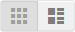

# Productaanbiedingen

Productlijsten kunnen standaard als een lijst of raster worden weergegeven. U kunt ook bepalen hoeveel producten er per pagina worden weergegeven en welk kenmerk wordt gebruikt om de lijst te sorteren. De productlijst bevat een set besturingselementen waarmee u de producten kunt sorteren, de indeling van de lijst kunt wijzigen, kunt sorteren op kenmerk en van de ene pagina naar de andere kunt gaan.

>[!NOTE]
>
>Wanneer u een categorie sorteert op een productkenmerk, worden producten met dezelfde kenmerkwaarden ook in oplopende volgorde gesorteerd op _[!UICONTROL Product ID]_.

{width="700" zoomable="yes"} worden getoond

## Productaanbiedingen configureren

1. Voor _Admin_ sidebar, ga **[!UICONTROL Stores]** > _[!UICONTROL Settings]_>**[!UICONTROL Configuration]**.

1. Vouw in het linkerdeelvenster **[!UICONTROL Catalog]** uit en kies **[!UICONTROL Catalog]** eronder.

1. Breid  de **[!UICONTROL Storefront]** sectie uit.

   {width="600" zoomable="yes"}

   Voor een gedetailleerde lijst van deze opties, zie [ Storefront ](../configuration-reference/catalog/catalog.md#storefront) in de _Verwijzing van de Configuratie_.

   >[!NOTE]
   >
   >Om producten en hun prijzen correct te tonen volgens _product sorterend door prijs_, zorg ervoor dat de montages voor de prijsvertoning in de [ configuratie van de BTW van de Verkoop ](../configuration-reference/sales/tax.md) de zelfde waarde hebben (`Excluding Tax` **of** `Including Tax`). Controleer de waarde **[!UICONTROL Catalog Prices]** voor _[!UICONTROL Calculation Settings]_. Controleer voor&#x200B;_[!UICONTROL Price Display Settings]_ de waarde **[!UICONTROL Display Product Prices in Catalog]** . Als deze verschillende waarden hebben, kunnen prijsfilters in de gelaagde navigatie producten niet correct filteren en sorteren op prijs.

1. Stel de standaardwaarde **[!UICONTROL List Mode]** in op een van de volgende opties:

   - `Grid Only`
   - `List Only`
   - `Grid (default) / List`
   - `List (default / Grid`

1. Voer bij **[!UICONTROL Products per Page on Grid Allowed Values]** het aantal producten in dat u per pagina wilt weergeven wanneer deze in rasterindeling wordt weergegeven.

   Als u een selectie van waarden wilt invoeren, scheidt u elk getal met een komma.

1. Voer bij **[!UICONTROL Products per Page on Grid Default Value]** het standaardaantal producten in dat per pagina in het raster moet worden weergegeven.

1. Voer bij **[!UICONTROL Products per Page on List Allowed Values]** het aantal producten in dat u per pagina wilt weergeven wanneer deze in de lijstindeling worden weergegeven.

   Als u een selectie van waarden wilt invoeren, scheidt u elk getal met een komma.

1. Voer bij **[!UICONTROL Products per page on List Default Value]** het standaardaantal producten in dat per pagina in de lijst wordt weergegeven.

1. Stel **[!UICONTROL Product Listing Sorted by]** in op het standaardkenmerk waarmee de lijst eerst wordt gesorteerd.

1. Als u klanten de optie wilt geven om alle producten weer te geven, stelt u **[!UICONTROL Allow All Products on Page]** in op `Yes` .

1. Als u alle pagineringsinstellingen wilt behouden terwijl klanten door cataloguslijsten bladeren, stelt u **[!UICONTROL Remember Category Pagination]** in op `Yes` .

   Als u deze instelling inschakelt, blijft het aantal producten dat in een lijst of raster wordt weergegeven behouden wanneer kopers van de ene categorie naar de andere bladeren. Dit veld is standaard ingesteld op `No` omdat het meer cache-opslag gebruikt en invloed kan hebben op de manier waarop pagina&#39;s door zoekmachines worden geïndexeerd.

1. Als het gebruiken van a [ vlakke catalogus ](catalog-flat.md) (**geadviseerd niet**), doe het volgende:

   - Stel **[!UICONTROL Use Flat Catalog Category]** in op `Yes` als u een lijst met één categorie producten wilt weergeven.

   - Stel **[!UICONTROL Use Flat Catalog Product]** in op `Yes` als u een platte productlijst wilt weergeven.

1. Als u dynamische verwijzingen naar media-elementen in categorie- en product-URL&#39;s wilt toestaan, stelt u **[!UICONTROL Allow Dynamic Media URLs in Products and Categories]** in op `Yes` .

1. Klik op **[!UICONTROL Save Config]** als de bewerking is voltooid.

## Paginabesturingselementen

| Besturing | Beschrijving |
|--- |--- |
| [!UICONTROL View As] | Geeft de producten weer in een raster- of lijstindeling. |
| [!UICONTROL Sort By] | Hiermee wijzigt u de sorteervolgorde van de lijst. |
| [!UICONTROL Show Per Page] | Hiermee bepaalt u hoeveel producten er per pagina worden weergegeven. |
| Pagineringskoppelingen | Navigatiekoppelingen naar andere pagina&#39;s. |

{style="table-layout:auto"}

## Besturingselementen voor paginering

De pagineringsinstellingen worden boven en onder aan de lijst weergegeven en bepalen de indeling van de pagineringskoppelingen voor productaanbiedingen. U kunt het aantal verbindingen plaatsen die in de controle verschijnen, en de Volgende en Vorige verbindingen vormen. De pagineringskoppelingen worden alleen weergegeven als de lijst meer producten bevat dan per pagina is toegestaan in de configuratie van de productlijst.

{width="700" zoomable="yes"}

### Besturingselementen voor paginering in Storefront

| Besturing | Beschrijving |
|--- |--- |
|  | [!UICONTROL View As] - Geeft de lijst weer in de indeling Raster of Lijst. |
|  | [!UICONTROL Sort By] - Hiermee wijzigt u de sorteervolgorde van de lijst. Het _[!UICONTROL Used for Sorting in Product Listing]_&#x200B;storefront bezit bepaalt welke [ productattributen ](../catalog/product-attributes.md) kunnen worden gebruikt om de lijst te sorteren. |
|  | [!UICONTROL Show Per Page] - Hiermee bepaalt u hoeveel producten er per pagina worden weergegeven. |
|  | Pagineringskoppelingen - Navigatiekoppelingen naar andere pagina&#39;s. |

{style="table-layout:auto"}

### De pagineringsbesturingselementen configureren

1. Voor _Admin_ sidebar, ga **[!UICONTROL Content]** > _[!UICONTROL Design]_>**[!UICONTROL Configuration]**.

1. Zoek de archiefweergave die u wilt configureren en klik in de kolom **[!UICONTROL Action]** op **[!UICONTROL Edit]** .

1. Onder **[!UICONTROL Other Settings]**, breid  uit de **[!UICONTROL Pagination]** sectie.

   {width="600" zoomable="yes"}

   Voor meer informatie over deze montages, zie {de Configuratie van het 0} Ontwerp [&#128279;](../content-design/configuration.md).

1. Voer bij **[!UICONTROL Pagination Frame]** het aantal koppelingen in dat u wilt weergeven in het pagineringsbesturingselement.

1. Voer bij **[!UICONTROL Pagination Frame Skip]** het aantal koppelingen in dat u wilt overslaan voordat u de volgende set koppelingen in het pagineringsbesturingselement weergeeft.

   Als het pagineringskader bijvoorbeeld vijf koppelingen heeft en u naar de volgende vijf koppelingen wilt gaan, hoeveel koppelingen wilt u dan overslaan? Als u de waarde op vier (`4`) plaatst, is de laatste verbinding van de vorige reeks de eerste verbinding in de volgende reeks.

1. Voer bij **[!UICONTROL Anchor Text for Previous]** de tekst in die u voor de koppeling Vorige wilt weergeven.

   Laat leeg om de standaardpijl te gebruiken.

1. Voer bij **[!UICONTROL Anchor Text for Next]** de tekst in die u voor de koppeling Volgende wilt weergeven. Laat leeg om de standaardpijl te gebruiken.

1. Klik op **[!UICONTROL Save Configuration]** als de bewerking is voltooid.
