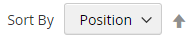

# Productaanbiedingen

Productlijsten kunnen standaard als een lijst of raster worden weergegeven. U kunt ook bepalen hoeveel producten er per pagina worden weergegeven en welk kenmerk wordt gebruikt om de lijst te sorteren. De productlijst bevat een set besturingselementen waarmee u de producten kunt sorteren, de indeling van de lijst kunt wijzigen, kunt sorteren op kenmerk en van de ene pagina naar de andere kunt gaan.

>[!NOTE]
>
>Wanneer u een categorie sorteert op een productkenmerk, worden producten met dezelfde kenmerkwaarden ook gesorteerd op hun _[!UICONTROL Product ID]_in oplopende volgorde.

{width="700" zoomable="yes"}

## Productaanbiedingen configureren

1. Op de _Beheerder_ zijbalk, ga naar **[!UICONTROL Stores]** > _[!UICONTROL Settings]_>**[!UICONTROL Configuration]**.

1. Vouw in het linkerdeelvenster uit **[!UICONTROL Catalog]** en kiest u **[!UICONTROL Catalog]** onder.

1. Uitbreiden  de **[!UICONTROL Storefront]** sectie.

   {width="600" zoomable="yes"}

   Voor een gedetailleerde lijst van deze opties, zie [Storefront](../configuration-reference/catalog/catalog.md#storefront) in de _Configuratieverwijzing_.

   >[!NOTE]
   >
   >De producten correct weergeven en de prijzen ervan afstemmen op _productsortering op prijs_ zorgt u ervoor dat de instellingen voor de prijs in het dialoogvenster [BTW-configuratie](../configuration-reference/sales/tax.md) hebben dezelfde waarde (`Excluding Tax` **of** `Including Tax`). Voor de _[!UICONTROL Calculation Settings]_, controleert u de **[!UICONTROL Catalog Prices]**waarde. En for_[!UICONTROL Price Display Settings]_, controleert u de **[!UICONTROL Display Product Prices in Catalog]** waarde. Als deze verschillende waarden hebben, kunnen prijsfilters in de gelaagde navigatie producten niet correct filteren en sorteren op prijs.

1. De standaardinstelling instellen **[!UICONTROL List Mode]** op een van de volgende wijzen:

   - `Grid Only`
   - `List Only`
   - `Grid (default) / List`
   - `List (default / Grid`

1. Voor **[!UICONTROL Products per Page on Grid Allowed Values]**, voert u het aantal producten in dat u per pagina wilt weergeven wanneer deze in de rasterindeling worden weergegeven.

   Als u een selectie van waarden wilt invoeren, scheidt u elk getal met een komma.

1. Voor **[!UICONTROL Products per Page on Grid Default Value]** voert u het standaardaantal producten in dat per pagina in het raster moet worden weergegeven.

1. Voor **[!UICONTROL Products per Page on List Allowed Values]**, voert u het aantal producten in dat u per pagina wilt weergeven wanneer deze in de lijstindeling worden weergegeven.

   Als u een selectie van waarden wilt invoeren, scheidt u elk getal met een komma.

1. Voor **[!UICONTROL Products per page on List Default Value]**, voert u het standaardaantal producten in dat in de lijst per pagina wordt weergegeven.

1. Set **[!UICONTROL Product Listing Sorted by]** aan het standaardattribuut dat aanvankelijk wordt gebruikt om de lijst te sorteren.

1. Als u klanten de optie wilt geven om alle producten weer te geven, stelt u **[!UICONTROL Allow All Products on Page]** tot `Yes`.

1. Als u alle pagineringsinstellingen wilt behouden terwijl klanten door cataloguslijsten bladeren, stelt u **[!UICONTROL Remember Category Pagination]** tot `Yes`.

   Als u deze instelling inschakelt, blijft het aantal producten dat in een lijst of raster wordt weergegeven behouden wanneer kopers van de ene categorie naar de andere bladeren. Dit veld is standaard ingesteld op `No` omdat het meer geheim voorgeheugenopslag gebruikt en de manier kan beïnvloeden de pagina&#39;s door onderzoeksmotoren worden geïndexeerd.

1. Als u een [platte catalogus](catalog-flat.md) (**niet aanbevolen**), doet u het volgende:

   - Als je een lijst met een vaste categorie wilt weergeven, moet je **[!UICONTROL Use Flat Catalog Category]** tot `Yes`.

   - Als u een enkele productaanbieding wilt weergeven, stelt u **[!UICONTROL Use Flat Catalog Product]** tot `Yes`.

1. Als u dynamische verwijzingen naar media-elementen in categorie- en product-URL&#39;s wilt toestaan, stelt u **[!UICONTROL Allow Dynamic Media URLs in Products and Categories]** tot `Yes`.

1. Klik op **[!UICONTROL Save Config]**.

## Paginabesturingselementen

| Besturing | Beschrijving |
|--- |--- |
| [!UICONTROL View As] | Geeft de producten weer in een raster- of lijstindeling. |
| [!UICONTROL Sort By] | Hiermee wijzigt u de sorteervolgorde van de lijst. |
| [!UICONTROL Show Per Page] | Hiermee bepaalt u hoeveel producten er per pagina worden weergegeven. |
| Pagineringskoppelingen | Navigatiekoppelingen naar andere pagina&#39;s. |

{style="table-layout:auto"}

## Besturingselementen voor paginering

De pagineringsinstellingen worden boven en onder aan de lijst weergegeven en bepalen de indeling van de pagineringskoppelingen voor productaanbiedingen. U kunt het aantal verbindingen plaatsen die in de controle verschijnen, en de Volgende en Vorige verbindingen vormen. De pagineringskoppelingen worden alleen weergegeven als de lijst meer producten bevat dan per pagina is toegestaan in de configuratie van de productlijst.

{width="700" zoomable="yes"}

### Besturingselementen voor paginering in Storefront

| Besturing | Beschrijving |
|--- |--- |
|  | [!UICONTROL View As] - Hiermee geeft u de lijst weer in de indeling Raster of Lijst. |
|  | [!UICONTROL Sort By] - Hiermee wijzigt u de sorteervolgorde van de lijst. De _[!UICONTROL Used for Sorting in Product Listing]_storefront, eigenschap bepaalt welke [productkenmerken](../catalog/product-attributes.md) kan worden gebruikt om de lijst te sorteren. |
|  | [!UICONTROL Show Per Page] - Hiermee bepaalt u hoeveel producten er per pagina worden weergegeven. |
|  | Pagineringskoppelingen - Navigatiekoppelingen naar andere pagina&#39;s. |

{:style=&quot;table-layout:auto&quot;}

### De pagineringsbesturingselementen configureren

1. Op de _Beheerder_ zijbalk, ga naar **[!UICONTROL Content]** > _[!UICONTROL Design]_>**[!UICONTROL Configuration]**.

1. Zoek de archiefweergave die u wilt configureren en, in het dialoogvenster **[!UICONTROL Action]** kolom, klik **[!UICONTROL Edit]**.

1. Onder **[!UICONTROL Other Settings]**, uitbreiden  de **[!UICONTROL Pagination]** sectie.

   {width="600" zoomable="yes"}

   Zie voor meer informatie over deze instellingen [Ontwerpconfiguratie](../content-design/configuration.md).

1. Voor **[!UICONTROL Pagination Frame]**, ga het aantal verbindingen in dat u in de pagineringscontrole wilt verschijnen.

1. Voor **[!UICONTROL Pagination Frame Skip]**, ga het aantal verbindingen in dat u vooruit wilt overslaan alvorens de volgende reeks verbindingen in de pagineringscontrole te tonen.

   Als het pagineringskader bijvoorbeeld vijf koppelingen heeft en u naar de volgende vijf koppelingen wilt gaan, hoeveel koppelingen wilt u dan overslaan? Als u de waarde instelt op vier (`4`), is de laatste koppeling van de vorige set de eerste koppeling in de volgende set.

1. Voor **[!UICONTROL Anchor Text for Previous]**, voert u de tekst in die u voor de koppeling Vorige wilt weergeven.

   Laat leeg om de standaardpijl te gebruiken.

1. Voor **[!UICONTROL Anchor Text for Next]** Voer de tekst in die u voor de koppeling Volgende wilt weergeven. Laat leeg om de standaardpijl te gebruiken.

1. Klik op **[!UICONTROL Save Configuration]**.
