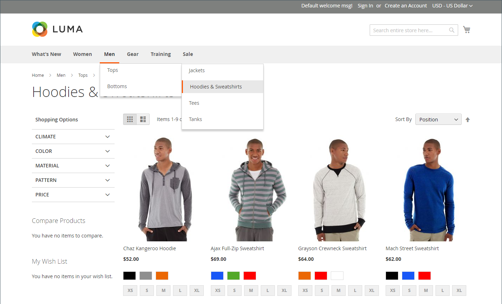

# Catalogusnavigatie

De term _navigatie_ verwijst naar de methoden die kopers gebruiken om door de winkel heen van pagina naar pagina te gaan. Het hoofdmenu, of de hoogste navigatie, van uw opslag is eigenlijk een lijst van categorieverbindingen en verleent gemakkelijke toegang tot de producten in uw catalogus. Er zijn ook categorieën in het broodkruimelspoor dat over de bovenkant van de meeste pagina&#39;s en in de gelaagde navigatie verschijnt die op de linkerkant van ongeveer twee of drie-kolompagina&#39;s verschijnt. Zie voor meer informatie over de opties voor categorieweergave [Weergave-instellingen](categories-display-settings.md).

Een product kan alleen zichtbaar zijn in uw winkel als het aan ten minste één categorie is toegewezen (zie [Bovenste navigatie instellen](navigation-top.md)). Elke categorie kan een specifieke landingspagina hebben met een afbeelding, een statisch blok, een beschrijving en een lijst met producten in de categorie. U kunt ook speciale ontwerpen maken voor rubriekpagina&#39;s die alleen gedurende een bepaalde periode actief zijn, zoals voor een vakantie of speciale actie.

{width="700" zoomable="yes"}
