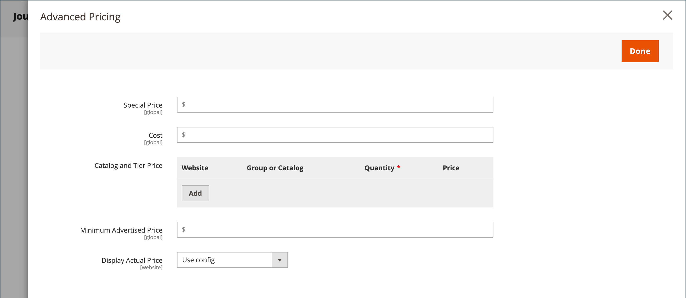

# Geavanceerde prijzen

Adobe Commerce en Magento Open Source bieden ondersteuning voor verschillende prijsopties die u kunt gebruiken voor promoties of om te voldoen aan de minimale geadverteerde prijsvereisten van de fabrikant. Wijzigingen in de productprijzen kunnen op schema worden aangebracht, of op basis van een prijsregel die op productniveau of in het winkelwagentje wordt toegepast.

Beheer de prijzen voor uw producten met geavanceerde prijzen om klanten betere tarieven te bieden die consumenten aanmoedigen om meer uit te geven, het verkeer naar uw plaats te drijven, en oude voorraad te ontruimen.

De _[!UICONTROL Advanced Pricing]_de montages bepalen de voorwaarden die voor speciale tarifering worden vereist die voor een specifieke klantengroep of een gedeelde catalogus beschikbaar is. Geavanceerde prijzen kunnen worden toegepast op eenvoudige, virtuele, downloadbare en bundelproducten. Als u een verdisconteerde prijs wilt toepassen op andere productsoorten, gebruikt u een [catalogusprijsregel](../merchandising-promotions/price-rules-catalog.md). Zie voor meer informatie [Prijsbereik](catalog-price-scope.md).

Geavanceerde prijsgegevens worden gesynchroniseerd met productpagina&#39;s. Als u bijvoorbeeld een lagere prijshoeveelheid bijwerkt, werkt het systeem de waarde op de productpagina bij.

 (Beschikbaar met [Adobe Commerce B2B](./b2b/../introduction.md) alleen) Als u gedeelde catalogi gebruikt, worden geavanceerde prijsgegevens gesynchroniseerd met zowel productpagina&#39;s als gedeelde catalogi. Als u bijvoorbeeld een lagere prijshoeveelheid bijwerkt, werkt het systeem de waarde in de gedeelde catalogus en op de productpagina bij. Om het even welke douaneprijs die in de gedeelde catalogus wordt vermeld heeft prioriteit over de prijs van de klantengroep. Zie ook [Prijsbepaling en structuur van gedeelde catalogus instellen](https://experienceleague.adobe.com/docs/commerce-admin/b2b/shared-catalogs/define/catalog-shared-pricing-structure.html) in de _Adobe Commerce B2B-gids_.

{width="600" zoomable="yes"}

## Toegang tot de geavanceerde prijsopties

1. Open het product in de bewerkingsmodus.

1. Onder **[!UICONTROL Price]**, klikt u op **[!UICONTROL Advanced Pricing]**.

1. Volg de instructies voor het type geavanceerde prijs dat nodig is.

   - [Groepsprijs](product-price-group.md)

   - [Speciale prijs](product-price-special.md)

   - [Tier-prijs](product-price-tier.md)

   - [Minimale geadverteerde prijs](product-price-minimum-advertised.md)

## Paginaverwijzing

### [!UICONTROL Special Price]

Voer de speciale prijs in als je een gedisconteerde prijs wilt aanbieden tijdens een bepaalde periode of een geplande campagne. Wanneer een speciale prijs beschikbaar is, wordt de detailhandelsprijs doorgehaald en wordt de speciale prijs hieronder in grote, vette tekst weergegeven.

#### [!UICONTROL Special Price From] datums

{{ce-feature}}

| Veld | Beschrijving |
| ---- | ----------- |
| [!UICONTROL From] | Hiermee stelt u de eerste datum in waarop de speciale prijs beschikbaar is. U kunt de datum invoeren of deze selecteren in de kalender. |
| [!UICONTROL To] | Hiermee stelt u de laatste datum in waarop de speciale prijs beschikbaar is. U kunt de datum invoeren of deze selecteren in de kalender. |

{style="table-layout:auto"}

### [!UICONTROL Cost]

Voer de werkelijke kosten van het object in.

### [!UICONTROL Customer Group Price]

{width="600" zoomable="yes"}

Stelt promotionele en laagprijzen voor specifieke klantengroepen in.

| Item | Beschrijving |
| ---- | ----------- |
| [!UICONTROL Website] | Identificeert de website waarop de groepsprijsregel van toepassing is. Deze optie wordt alleen weergegeven als de installatie meerdere websites heeft. |
| [!UICONTROL Customer Group] | (Vereist) Identificeert de klantengroep die in aanmerking komt om de kortingsprijs te ontvangen. Wanneer een waarde in een groep- of catalogusveld wordt gewijzigd, wordt de bijbehorende rij met aangepaste prijzen die overeenkomt met de vorige instelling, verwijderd uit de gedeelde catalogus.  **[!UICONTROL ALL GROUPS]**- Past de regel toe op alle klantengroepen. **[!UICONTROL NOT LOGGED IN]** - Hiermee past u de regel toe voor gasten en klanten die niet zijn aangemeld bij hun accounts. |
| [!UICONTROL Quantity] | Hier geeft u de hoeveelheid op die nodig is om een prijs op laag te ontvangen. |
| [!UICONTROL Price] | (Vereist) Geeft een vaste prijs of een korting op de productprijs voor leden van de klantengroep op de specifieke website. Opties:  **[!UICONTROL Fixed]**- (Standaardinstelling) De kortingsprijs wordt opgegeven als een vaste decimale waarde. Voer bijvoorbeeld `9.99` als de kortingsprijs. **[!UICONTROL Discount]** - De kortingsprijs wordt opgegeven als een percentage (%) van de basisproductprijs. Voer bijvoorbeeld `10` voor een korting van 10%. |
|  | Hiermee verwijdert u de huidige regel. |
| **[!UICONTROL Add]** | Hiermee voegt u een nieuwe rij in voor een nieuwe regel. |

{style="table-layout:auto"}

### [!UICONTROL Catalog and Tier Price]

Stelt promotionele en laagprijzen in voor specifieke gedeelde catalogi en klantgroepen.

{{b2b-feature}}

{width="600" zoomable="yes"}

| Item | Beschrijving |
|----|-----------|
| [!UICONTROL Website] | Identificeert de website waarop de groepsprijsregel van toepassing is. Deze optie wordt alleen weergegeven als de installatie meerdere websites heeft.  **_Belangrijk:_**ALso selecteren_Website _in de [Bereik catalogusprijs](catalog-price-scope.md) configuratie, anders worden de vastgestelde geavanceerde prijzen getoond voor**alles **websites. |
| [!UICONTROL Group or Catalog] | (Vereist) Identificeert de klantengroep of gedeelde catalogus die in aanmerking komt om de kortingsprijs te ontvangen. Wanneer een waarde in een groep- of catalogusveld wordt gewijzigd, wordt de bijbehorende rij met aangepaste prijzen die overeenkomt met de vorige instelling, verwijderd uit de gedeelde catalogus.  **[!UICONTROL ALL GROUPS]**- Past de regel toe op alle klantengroepen. De waarde wordt niet toegepast op de gedeelde catalogus en wijzigingen in geavanceerde prijsgegevens worden niet gesynchroniseerd met de gedeelde catalogus. **[!UICONTROL NOT LOGGED IN]** - Hiermee past u de regel toe voor gasten en klanten die niet zijn aangemeld bij hun accounts. **[!UICONTROL Shared Catalogs]**- Past de regel toe op een specifieke gedeelde catalogus. |
| Aantal | Hier geeft u de hoeveelheid op die nodig is om een prijs op laag te ontvangen. |
| [!UICONTROL Price] | (Vereist) Geeft een vaste prijs of een korting op de productprijs voor leden van de klantengroep op de specifieke website. Opties:  **[!UICONTROL Fixed]**- (Standaardinstelling) De kortingsprijs wordt opgegeven als een vaste decimale waarde. Voer bijvoorbeeld `9.99` als de kortingsprijs. **[!UICONTROL Discount]** - De kortingsprijs wordt opgegeven als een percentage (%) van de basisproductprijs. Voer bijvoorbeeld `10` voor een korting van 10%. |
|  | Hiermee verwijdert u de huidige regel. |
| **[!UICONTROL Add]** | Hiermee voegt u een nieuwe rij in voor een nieuwe regel. |

{style="table-layout:auto"}

### [!UICONTROL Minimum Advertised Price]

De minimale geadverteerde prijs (MAP) voor het product.

### [!UICONTROL Display Actual Price]

Hiermee bepaalt u waar de werkelijke prijs van het product zichtbaar is voor de klant.

| Item | Beschrijving |
|----|-----------|
| [!UICONTROL Use Config] | Gebruikt de huidige configuratie die voor de prijsvertoning plaatst. |
| [!UICONTROL On Gesture] | Geeft de werkelijke productprijs weer in een pop-up, in reactie op de _Klik voor prijs_ of _Wat is dit?_ koppeling. |
| [!UICONTROL In Cart] | Geeft de werkelijke productprijs weer in het winkelwagentje. |
| [!UICONTROL Before Order Confirmation] | Geeft de werkelijke productprijs weer aan het einde van het afrekenproces, vlak voordat de bestelling wordt verzonden. |

{style="table-layout:auto"}
