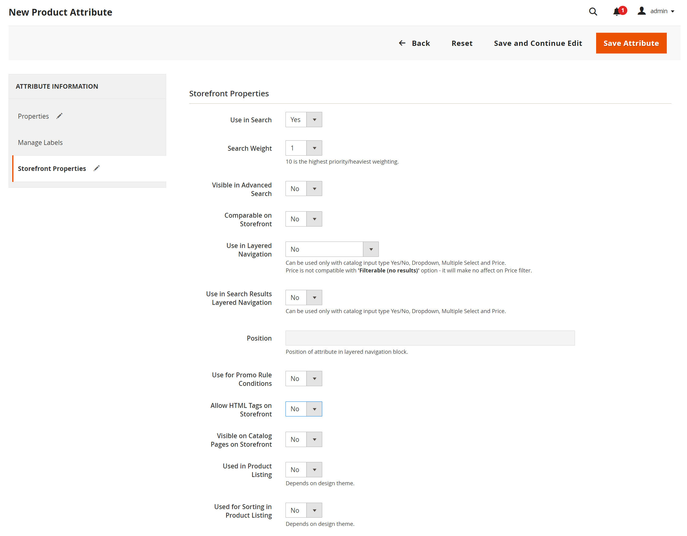

# Kenmerken toevoegen aan een product

Hoewel attributen hoofdzakelijk van worden beheerd [Winkels](../stores-purchase/stores-menu.md) kunt u ook nieuwe kenmerken toevoegen _op de vlucht_ terwijl u aan een product werkt. U kunt een keuze maken in de lijst met bestaande kenmerken of een kenmerk maken. Het nieuwe kenmerk wordt toegevoegd aan de [kenmerkset](../catalog/attribute-sets.md) waarop het product is gebaseerd.

## Stap 1: Een kenmerk toevoegen

1. Open het product in de bewerkingsmodus.

1. Klik in de rechterbovenhoek op **[!UICONTROL Add Attribute]**.

   {width="600" zoomable="yes"}

1. Als u een bestaand kenmerk aan het product wilt toevoegen, gebruikt u de opdracht [filterbesturingselementen](../getting-started/admin-grid-controls.md) om het kenmerk in het raster te zoeken en ga als volgt te werk:

   - Schakel het selectievakje in de eerste kolom van elk kenmerk dat u wilt toevoegen in.

   - Klik op **[!UICONTROL Add Selected]**.

   {width="600" zoomable="yes"}

1. Als u een nieuw kenmerk wilt definiëren, klikt u op **[!UICONTROL Create New Attribute]** en voltooi de items in Stap 2.

## Stap 2: Beschrijf de eigenschappen van het basiskenmerk

{width="600" zoomable="yes"}

1. Onder _[!UICONTROL Attribute Properties]_, voert u een **[!UICONTROL Attribute Label]**om het kenmerk te identificeren.

1. Set **[!UICONTROL Catalog Input Type for Store Owner]** op het type [invoerbesturingselement](attributes-input-types.md) te gebruiken voor de gegevensinvoer.

   Als het kenmerk voor een [configureerbaar product](product-create-configurable.md), kiest u `Dropdown`. Vervolgens stelt u **[!UICONTROL Required]** tot `Yes`.

1. Voor `Dropdown` en `Multiple Select` Voer de volgende handelingen uit voor invoertypen:

   - Onder **[!UICONTROL Values]**, klikt u op **[!UICONTROL Add Value]**.

   - Voer de eerste waarde in die u in de lijst wilt weergeven.

     U kunt één waarde voor Admin en een vertaling van de waarde voor elke archiefmening ingaan. Als u slechts één winkelweergave hebt, kunt u alleen de Admin-waarde invoeren en deze wordt ook voor de winkel gebruikt.

   - Klikken **[!UICONTROL Add Value]** en herhaal de vorige stap voor elke optie die u in de lijst wilt opnemen.

   - Selecteren **[!UICONTROL Is Default]** om de optie als standaardwaarde te gebruiken.

   {width="600" zoomable="yes"}

1. Als u de klant een optie wilt laten kiezen voordat het product kan worden aangeschaft, stelt u **[!UICONTROL Required]** tot `Yes`.

## Stap 3: Beschrijf de geavanceerde eigenschappen (optioneel)

{width="600" zoomable="yes"}

1. Voer een unieke waarde in **[!UICONTROL Attribute Code]** in kleine letters en zonder spaties.

1. Set **[!UICONTROL Scope]** om aan te geven waar in uw winkelhiërarchie het kenmerk kan worden gebruikt.

   Als het kenmerk voor een [configureerbaar product](product-create-configurable.md), kiest u `Global`.

1. Als dit kenmerk alleen van toepassing is op dit product, stelt u **[!UICONTROL Unique Value]** tot `Yes`.

1. Als u een geldigheidstest wilt uitvoeren voor gegevens die in een tekstveld zijn ingevoerd, stelt u **[!UICONTROL Input Validation for Store Owner]** op het type gegevens dat het veld moet bevatten.

   Dit veld is niet beschikbaar voor invoertypen met geselecteerde waarden. Invoervalidatie kan worden gebruikt voor:

   - `Decimal Number`
   - `Integer Number`
   - `Email`
   - `URL`
   - `Letters`
   - `Letters (a-z, A-Z) or Numbers (0-9)`

   {width="500"}

1. Als u het kenmerk als kolom wilt kunnen opnemen in het raster Producten, stelt u **[!UICONTROL Add to Column Options]** tot `Yes`.

1. Als u het filter _[!UICONTROL Products]_raster op deze kolom instellen **[!UICONTROL Use in Filter Options]**tot `Yes`.

## Stap 4: Voer het veldlabel in

1. Uitbreiden  de **[!UICONTROL Manage titles]** sectie.

1. Voer een **[!UICONTROL Title]** te gebruiken als label voor het veld.

   Als uw winkel in verschillende talen beschikbaar is, kunt u voor elke weergave een vertaalde titel invoeren.

   {width="600" zoomable="yes"}

## Stap 5: Beschrijf de storefront-eigenschappen

1. Uitbreiden  de **[!UICONTROL Storefront Properties]** sectie.

   {width="600" zoomable="yes"}

1. Als u het kenmerk beschikbaar wilt maken voor zoeken, stelt u **[!UICONTROL Use in Search]** tot `Yes`.

1. Als u het kenmerk in Product vergelijken wilt opnemen, stelt u **[!UICONTROL Comparable on Storefront]** tot `Yes`.

1. Als u vervolgkeuzelijsten, meerdere selecties of prijskenmerken wilt opnemen in gelaagde navigatie, stelt u **[!UICONTROL Use in Search Results Layered Navigation]** op een van de volgende wijzen:

   - `Filterable (with results)` - Gelaagde navigatie omvat slechts die filters waarvoor de passende producten kunnen worden gevonden. Kenmerkwaarde die al van toepassing is op alle producten in de lijst, wordt niet weergegeven als een beschikbaar filter. Kenmerkwaarden met een aantal van nul (0) overeenkomende producten worden ook weggelaten uit de lijst met beschikbare filters.  De gefilterde lijst met producten bevat alleen de producten die overeenkomen met het filter. De lijst met producten wordt alleen bijgewerkt als de geselecteerde filters wijzigen wat wordt weergegeven.

   - `Filterable (no results)` - Gelaagde navigatie omvat filters voor alle beschikbare attributenwaarden en hun productaantallen, met inbegrip van de producten met nul (0) productgelijken. Als de kenmerkwaarde een staal is, wordt de waarde weergegeven als een filter, maar uitgestreept.

1. Als u wilt gebruiken in gelaagde navigatie op pagina&#39;s met zoekresultaten, stelt u **[!UICONTROL Use in Search Results Navigation]** tot `Yes` en voert u een getal in in het dialoogvenster **[!UICONTROL Position]** veld.

   Het positienummer geeft de relatieve positie van het kenmerk binnen het gelaagde navigatieblok aan.

1. Als u het kenmerk wilt gebruiken in prijsregels, stelt u **[!UICONTROL Use for Promo Rule Conditions]** tot `Yes`.

1. Als u wilt toestaan dat de tekst wordt opgemaakt met HTML, stelt u **[!UICONTROL Allow HTML Tags on Storefront]** tot `Yes`.

   Deze instelling maakt de WYSIWYG-editor beschikbaar wanneer u het veld bewerkt.

1. Als u het kenmerk op de productpagina wilt opnemen, stelt u **[!UICONTROL Visible on Catalog Pages on Storefront]** tot `Yes`.

1. Vul de volgende instellingen in zoals deze worden ondersteund door uw thema:

   - Als u het kenmerk wilt opnemen in productaanbiedingen, stelt u **[!UICONTROL Used in Product Listing]** tot `Yes`.

   - Als u kenmerk wilt gebruiken als een sorteerparameter voor productaanbiedingen, stelt u **[!UICONTROL Used for Sorting in Product Listing]** tot `Yes`.

1. Klik op **[!UICONTROL Save Attribute]**.
