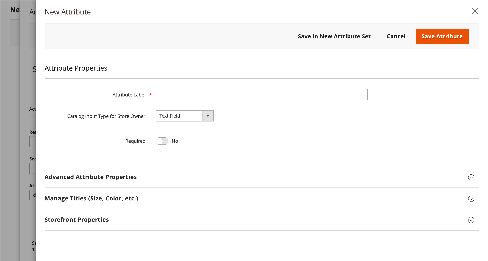

# Overzicht van productkenmerken

Kenmerken zijn de bouwstenen van uw productcatalogus en beschrijven specifieke kenmerken van een product. Productkenmerken kunnen worden ingedeeld in [kenmerksets](attribute-sets.md), die vervolgens worden gebruikt als sjablonen voor het maken van producten.

De attributen bepalen het type van inputcontrole dat voor productopties wordt gebruikt, en verstrekken extra informatie voor productpagina&#39;s. Ze worden ook gebruikt als zoekparameters en criteria voor gelaagde navigatie, productvergelijkingsrapporten en promoties. U kunt zoveel kenmerken en kenmerksets maken als nodig zijn om de producten in uw catalogus te beschrijven. Naast de kenmerken die u kunt maken, worden systeemkenmerken, zoals de prijs, ingebouwd in het centrale handelsplatform en kunnen deze niet worden gewijzigd.

{width="600" zoomable="yes"}

Gebruik de beste werkwijzen die in de volgende secties worden beschreven wanneer u productkenmerken plant en creeert.

## Kenmerknamen

Stel consistente conventies voor kenmerknaamgeving vast, inclusief lettertype en leestekens. Bijvoorbeeld: `Color:Green` en `Color:green` kunnen door verschillende systemen worden beschouwd als twee verschillende kenmerkwaarden. Dergelijke lawaai in de gegevens kan bedrijfsregels, onderzoeksresultaten, en gegevensfilters voor toepassingen beïnvloeden die producten aan regels aanpassen.

## Kenmerkgebruik

Bedenk hoe kenmerken moeten worden gebruikt bij het toewijzen van eigenschappen en waarden. Identificeer de kenmerken die worden gebruikt als labels voor presentatie, zoals een productnaam, afbeelding, prijs en beschrijving, en welke kenmerken worden gebruikt voor gegevensinvoer. Bedenk hoe de kenmerken op de verschillende pagina&#39;s op de hele site worden weergegeven en hoe ze op categoriepagina&#39;s, productdetailpagina&#39;s, categorierasters en miniatuurregelaars worden weergegeven.

## Kleur

Ad-hockleurbeschrijvingen kunnen een uitdaging vormen vanuit het oogpunt van databasebewerkingen. Kleurnamen zoals &quot;Azure Skies&quot; of &quot;Robin Egg Blue&quot; hebben veel aantrekkingskracht, maar retourneren mogelijk niet de beste resultaten bij gebruik als zoekcriterium of als voor handelsdoeleinden moet worden opgegeven `Color_Family:Blue`. Overweeg hoe kleuren worden vertegenwoordigd in zoekresultaten en gelaagde navigatie en stel enkele richtlijnen voor uw bedrijfsbehoeften vast. Zorg vervolgens voor consistentie bij het toewijzen van kleurkenmerkwaarden in de hele catalogus.

## Variatiebeheer

Product gebruiken [configuratieopties](product-configurations.md) en [configureerbare producten](product-create-configurable.md) om variaties in uw productaanbod te beheren. Deze functies maken het gemakkelijker om producten te categoriseren, regels voor de kartprijs en dynamische categorieregels tot stand te brengen, en een selectie van opties met diverse tekst, selectie, en datuminputtypes aan te bieden.

## Gewogen zoekopdracht

Productkenmerken waarvoor [cataloguszoekopdracht](search.md) kan een gewicht worden toegewezen om ze een hogere waarde in de zoekresultaten te geven. Kenmerken met een groter gewicht worden geretourneerd vóór kenmerken met een lager gewicht. Neem bijvoorbeeld twee kenmerken in het systeem, _kleur_ met een zoekgewicht van 3 en _beschrijving_ met een zoekgewicht van 1. Een zoekopdracht naar het woord _rood_ retourneert een lijst met producten met een waarde voor kleurkenmerken van `red`, maar retourneert geen producten met beschrijvingen die het woord bevatten _rood_. In dit voorbeeld wordt `color` kenmerk heeft een groter gedefinieerd gewicht dan `description` kenmerk.

## Ongebruikte eigenschappen

Verwijder ongebruikte producteigenschappen voor betere structurering en snellere indexering.
