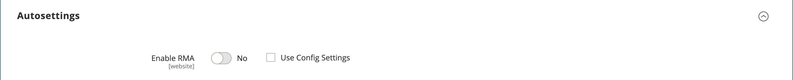

# Productinstellingen - [!UICONTROL Autosettings]

{{ee-feature}}

De _[!UICONTROL Autosettings]_de sectie omvat om het even welke attributen die gebiedsdelen voor andere verrichtingen zijn. U kunt de standaard [RMA-configuratie](../stores-purchase/rma-configure.md) het plaatsen aan het product of het met voeten treden, zoals nodig.

{width="600" zoomable="yes"}
