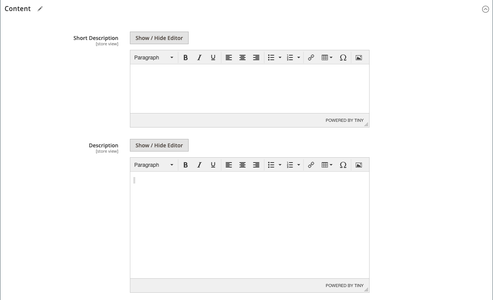

# Productinstellingen - [!UICONTROL Content]

De sectie _[!UICONTROL Content]_&#x200B;wordt gebruikt om de hoofdproductbeschrijving op de productpagina in te voeren en te bewerken. De korte beschrijving kan in de meeste voer van RSS worden gebruikt, en zou ook in cataloguslijsten, afhankelijk van [&#x200B; thema &#x200B;](../content-design/themes.md) kunnen verschijnen.

## Voeg de productbeschrijving toe in [!DNL Page Builder]

1. Open het product in de bewerkingsmodus.

1. De rol neer en breidt  uit de **[!UICONTROL Content]** sectie.

   {width="600" zoomable="yes"}

1. Ga a **[!UICONTROL Short Description]** van het product in en gebruik de [&#x200B; redacteurstoolbar &#x200B;](../content-design/editor.md) om te formatteren zoals nodig.

1. Klik op **[!UICONTROL Edit with Page Builder]** bij het label **[!UICONTROL Description]** .

1. Gebruik de [[!DNL Page Builder]](../page-builder/introduction.md) inhoudshulpmiddelen om [&#x200B; de bestaande tekst &#x200B;](../page-builder/text.md) uit te geven en andere inhoud (indien nodig) toe te voegen.

## [!DNL Page Builder] voorvertoning

Wanneer u de sectie _[!UICONTROL Content]_&#x200B;uitvouwt voor een bestaand product waarin inhoud is gemaakt met [!DNL Page Builder] , wordt een voorvertoning van de **[!UICONTROL Description]**-inhoud weergegeven zoals deze op de productpagina wordt weergegeven. Open de [!DNL Page Builder] -werkruimte, waar u de benodigde updates kunt uitvoeren, door op **[!UICONTROL Edit with Page Builder]**&#x200B;te klikken.

{width="600" zoomable="yes"}

Deze voorvertoning van inhoud is standaard ingeschakeld voor de product- en categorieformulieren. Als de prestaties te lijden hebben aan het laden van de voorproef, kunt u de voorproef in de [&#x200B; configuratie van het Beheer van de Inhoud &#x200B;](../configuration-reference/general/content-management.md#advanced-content-tools) montages onbruikbaar maken.

## De productbeschrijving toevoegen in de editor

Als [!DNL Page Builder] is uitgeschakeld voor uw winkel, gebruikt u de teksteditor om de productinhoud toe te voegen. Typ alleen normale ASCII-tekens in het tekstvak. Als u tekst plakt van een tekstverwerker, slaat u deze eerst op als een gewoon TXT-bestand om onzichtbare besturingstekens te verwijderen. Voor meer informatie, zie [&#x200B; Gebruikend de Redacteur &#x200B;](../content-design/editor.md).

1. Open het product in de bewerkingsmodus.

1. De rol neer en breidt  uit de **[!UICONTROL Content]** sectie.

   {width="600" zoomable="yes"}

1. Voer een **[!UICONTROL Short Description]** van het product en de indeling in.

1. Voer het hoofdproduct **[!UICONTROL Description]** in en gebruik de editor-werkbalk om de gegevens naar wens op te maken.

   U kunt de rechterbenedenhoek slepen om de hoogte van het tekstvak te wijzigen.
