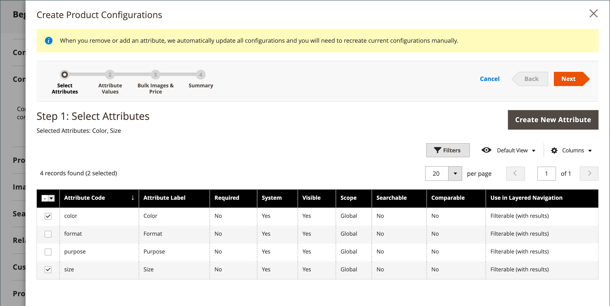

# Configureerbaar product

Een configureerbaar product wordt weergegeven als één product met vervolgkeuzemogelijkheden voor variaties (zoals kleur of grootte). Elke variatie is een afzonderlijk eenvoudig product met zijn eigen SKU, toelatend individuele inventaris het volgen-in tegenstelling tot eenvoudige producten met douaneopties.

**Best voor:** Producten met veelvoudige opties (kleur, grootte, materiaal, enz.) waar u inventaris voor elke variatie moet volgen. De eerste setup duurt langer, maar biedt een betere schaalbaarheid.

{width="700" zoomable="yes"}

## Voordat u begint

### Controlelijst voor vereisten

Voordat u een configureerbaar product maakt, moet u ervoor zorgen dat:

1. **Reeks van Attributen** - een attribuut dat variatiekenmerken (zoals kleur en grootte) omvat
1. **Gemaakte Attributen van de Variatie** - Attributen die met de montages hieronder worden gevormd
1. **Beelden van het Product** - (Facultatieve maar geadviseerde) Beelden voor het ouderproduct en elke variatie

### Kenmerkvereisten

Elk kenmerk dat wordt gebruikt voor productvariaties, moet de volgende instellingen hebben:

| Eigenschap | Vereiste instelling |
|--- |--- |
| [!UICONTROL Scope] | `Global` |
| [!UICONTROL Catalog Input Type for Store Owner] | `Dropdown` , `Visual Swatch` of `Text Swatch` |
| [!UICONTROL Values Required] | `Yes` |

{style="table-layout:auto"}

Voor instructies bij het creëren van attributen, zie {de Attributen van het 0} Product [.](product-attributes.md)

## Fase 1: De basis voor het product maken

### Stap 1: Kies het producttype

1. Voor _Admin_ sidebar, ga **[!UICONTROL Catalog]** > **[!UICONTROL Products]**.

1. Voor _[!UICONTROL Add Product]_( {width="25"}) menu bij de hoger-juiste hoek, kies **[!UICONTROL Configurable Product]**.

   {width="700" zoomable="yes"} toe

### Stap 2: Kies de kenmerkset

De [&#x200B; geplaatste attributen &#x200B;](attribute-sets.md) bepaalt welke gebieden in de productvorm verschijnen en welke attributen voor variaties beschikbaar zijn.

1. Klik op het veld voor de kenmerkset boven aan de pagina en voer een van de volgende handelingen uit:

   - Voer bij **[!UICONTROL Search]** de naam in van de kenmerkset.
   - Kies in de lijst de kenmerkset die u wilt gebruiken.

   Het formulier wordt bijgewerkt met de geselecteerde kenmerkset.

1. Als u een ander attribuut aan de kenmerkenreeks moet toevoegen, klik **[!UICONTROL Add Attribute]** en volg de instructies in [&#x200B; Toevoegend een Attribuut &#x200B;](product-attributes-add.md).

   {width="600" zoomable="yes"}

### Stap 3: Voer basisinformatie in

1. Voer het product **[!UICONTROL Product Name]** in.

1. Accepteer de standaardwaarde **[!UICONTROL SKU]** op basis van de productnaam of voer een andere waarde in.

1. Voer het product **[!UICONTROL Price]** in.

   >[!NOTE]
   >
   >Deze prijs wordt overschreven door de prijzen van het kinderproduct. De werkelijke prijs die aan klanten wordt weergegeven, is afkomstig van de onderliggende [!UICONTROL In Stock] -producten.

1. Stel **[!UICONTROL Enable Product]** in op `No` omdat het product nog niet kan worden gepubliceerd.

1. Klik op **[!UICONTROL Save]** en ga verder.

   Wanneer het product wordt bewaard, verschijnt de [&#x200B; verkiesster van de Mening van de Opslag &#x200B;](introduction.md#product-scope) in de upper-left hoek.

1. Kies de locatie **[!UICONTROL Store View]** waar het product beschikbaar moet zijn.

   {width="600" zoomable="yes"}

### Stap 4: volledige basisinstellingen

1. Stel **[!UICONTROL Tax Class]** in op een van de volgende opties:

   - `None`
   - `Taxable Goods`

1. Laat **[!UICONTROL Quantity]** leeg. De hoeveelheid wordt bepaald door de productvariaties.

1. Laat **[!UICONTROL Stock Status]** staan zoals ingesteld.

   De voorraadstatus van een configureerbaar product wordt bepaald door zijn bijbehorende variaties. Omdat het product zonder hoeveelheid is opgeslagen, is de waarde **[!UICONTROL Stock Status]** ingesteld op `Out of Stock` .

   >[!NOTE]
   >
   >De **Status van de Voorraad** van een configureerbaar product is a **_half-manueel_** gecontroleerd plaatsen, gedeeltelijk gebaseerd op de voorraadstatus van zijn kindproducten. Het maakt deel uit van de berekening van de a **_multi-criteria_** voorraadstatus. Zie [&#x200B; de Status van de Aandelen &#x200B;](#configure-stock-status) voor details vormen.

1. Voer het product **[!UICONTROL Weight]** in.

   >[!NOTE]
   >
   >Een configureerbaar product moet altijd een gewicht hebben. Als u **[!UICONTROL This item has no weight]** selecteert in het vervolgkeuzemenu, verandert deze automatisch in **[!UICONTROL This item has weight]** wanneer u het product opslaat.

1. Accepteer de standaardinstelling **[!UICONTROL Visibility]** van `Catalog, Search` .

1. Om het product in de lijst van [&#x200B; nieuwe producten &#x200B;](../content-design/widget-new-products-list.md) te voorzien, selecteer **[!UICONTROL Set Product as New]** checkbox.

1. Als u categorieën aan het product wilt toewijzen, klikt u op het vak **[!UICONTROL Select…]** en voert u een van de volgende handelingen uit:

   **kies een bestaande categorie:**

   - Typ in het vak om een overeenkomst te zoeken.

   - Schakel het selectievakje in van elke categorie die u wilt toewijzen.

   {width="600" zoomable="yes"}

   **creeer een nieuwe categorie:**

   - Klik op **[!UICONTROL New Category]**.

   - Voer de **[!UICONTROL Category Name]** in en kies de **[!UICONTROL Parent Category]** om de positie ervan in de menustructuur te bepalen.

   - Klik op **[!UICONTROL Create Category]**.

1. Kies de **[!UICONTROL Country of Manufacture]** .

   Afhankelijk van de kenmerkset kunnen er aanvullende kenmerken worden weergegeven. U kunt ze later voltooien.

### Stap 5: Opslaan en doorgaan

Dit is een goed moment om uw werk op te slaan. Klik op **[!UICONTROL Save]** in de rechterbovenhoek. In de volgende fase, zult u opstelling de configuraties voor elke variatie.

## Fase 2: Productvariaties toevoegen

De volgende stappen tonen hoe te om configuraties voor veelvoudige variaties toe te voegen. Op de voortgangsbalk boven aan de pagina wordt de huidige positie in het proces weergegeven.

**Voorbeeld:** voor een shirt met 3 kleuren en 3 grootte, zult u 9 eenvoudige producten met unieke SKUs (voor elke combinatie) creëren. Standaard zijn de productnaam en SKU voor elke variatie gebaseerd op de kenmerkwaarde en de bovenliggende productnaam of SKU.

### Stap 6: kies variatiekenmerken

1. Blader omlaag naar de sectie _[!UICONTROL Configurations]_&#x200B;en klik op **[!UICONTROL Create Configurations]**.

   {width="600" zoomable="yes"}

1. Schakel het selectievakje van elk kenmerk in dat u wilt opnemen als een variatie.

   In dit voorbeeld zijn `color` en `size` geselecteerd.

   {width="600" zoomable="yes"}

   De lijst omvat alle attributen van de kenmerkenreeks die in een configureerbaar product kunnen worden gebruikt.

1. Als u een attribuut moet toevoegen, klik **[!UICONTROL Create New Attribute]** en doe het volgende:

   - Voltooi de eigenschappen van het kenmerk.

   - Klik op **[!UICONTROL Save Attribute]**.

   - Schakel het selectievakje voor het kenmerk in.

1. Klik op **[!UICONTROL Next]** in de rechterbovenhoek.

### Stap 7: kenmerkwaarden selecteren

1. Selecteer voor elk kenmerk het selectievakje van de waarden die van toepassing zijn op het product.

   {width="600" zoomable="yes"}

1. Om de attributen opnieuw te rangschikken, greep _opnieuw rangschikt_ (  ) en beweeg de sectie naar een nieuwe positie.

   De volgorde bepaalt de positie van de vervolgkeuzelijsten op de productpagina.

1. Klik op **[!UICONTROL Next]** in de voortgangsbalk.

### Stap 8: images, prijzen en inventaris configureren

Deze stap bepaalt de beelden, de tarifering, en de hoeveelheid voor elke configuratie. De beschikbare opties zijn voor beide dezelfde. U kunt het zelfde plaatsen op alle SKUs toepassen, unieke montages op elke SKU toepassen, of de montages voor nu overslaan.

#### Afbeeldingen configureren

Kies de configuratieoptie die van toepassing is:

**Optie 1: Pas één enkele reeks beelden op alle SKUs** toe

1. Selecteer **[!UICONTROL Apply single set of images to all SKUs]** .

1. Blader naar elke afbeelding die u in de productgalerie wilt opnemen of sleep afbeeldingen naar het vak.

{width="600" zoomable="yes"}

**Optie 2: Pas unieke beelden voor elke SKU** toe

Omdat de originele productafbeelding al is geüpload, kunt u deze optie gebruiken om afbeeldingen voor elke variatie te uploaden. U kunt verschillende afbeeldingen toevoegen die in het winkelwagentje worden weergegeven wanneer iemand een bepaalde variatie aanschaft.

1. Selecteer **[!UICONTROL Apply unique images by attribute to each SKU]** .

1. Selecteer de **[!UICONTROL Attribute]** die de afbeeldingen illustreren, zoals `color` .

1. Blader voor elke kenmerkwaarde naar de afbeeldingen die u voor die configuratie wilt gebruiken of sleep ze naar het vak.

   Als u een afbeelding naar een waardevak sleept, wordt deze ook in de secties voor andere waarden weergegeven. Om een beeld te schrappen, klik het _Prullenbak_ () pictogram.

   {width="600" zoomable="yes"}

#### Prijzen configureren

>[!NOTE]
>
>Een configureerbaar product heeft geen eigen prijs in de catalogus. De configureerbare productprijs wordt afgeleid van de onderliggende [!UICONTROL In Stock] producten.

Kies de configuratieoptie die van toepassing is:

**Optie 1: Pas de zelfde prijs op alle SKUs** toe

1. Als de prijs voor alle variaties gelijk is, selecteert u **[!UICONTROL Apply single price to all SKUs]** .

1. Voer de **[!UICONTROL Price]** in.

   {width="600" zoomable="yes"}

**Optie 2: Pas een verschillende prijs voor elke SKU** toe

1. Selecteer **[!UICONTROL Apply unique prices by attribute to each SKU]** als de prijs voor elke variatie verschilt.

1. Selecteer **[!UICONTROL Attribute]** die de basis van het prijsverschil is.

1. Voer de **[!UICONTROL Price]** in voor elke kenmerkwaarde.

   In dit voorbeeld kost de XL-grootte meer.

   {width="600" zoomable="yes"}

#### Overzicht configureren

Kies de configuratieoptie die van toepassing is:

**Optie 1: Pas het zelfde aantal op alle SKUs** toe

Als de hoeveelheid voor alle SKU&#39;s gelijk is, selecteert u **[!UICONTROL Apply single quantity to each SKU]** en geeft u de hoeveelheid op.

_Single Source-verkopers :_

Voer de **[!UICONTROL Quantity]** in.

_MultiSource-handelaren die [&#x200B; Inventory management &#x200B;](../inventory-management/introduction.md):_gebruiken

Bronnen toewijzen en hoeveelheden toevoegen voor alle gegenereerde productvarianten:

1. Selecteer de optie **[!UICONTROL Apply single quantity to each SKU]** .

1. Klik op **[!UICONTROL Assign Sources]** om een bron toe te voegen.

1. Blader of zoek naar een bron die u wilt toevoegen. Schakel het selectievakje naast de bronnen voor het product in.

1. Voer een hoeveelheid voorraad ter plaatse per bron in.

   {width="600" zoomable="yes"} toe

**Optie 2: Pas verschillende hoeveelheid door attribuut toe**

_Single Source-verkopers :_

Voer de **[!UICONTROL Quantity]** in voor elke kenmerkwaarde.

_MultiSource-handelaren die [&#x200B; Inventory management &#x200B;](../inventory-management/introduction.md):_gebruiken

Bronnen toewijzen en hoeveelheden toevoegen voor alle gegenereerde productvarianten:

1. Selecteer **[!UICONTROL Apply unique quantity by attribute to each SKU]** .

1. Voer de **[!UICONTROL Quantity]** in voor elke variatie.

   {width="600" zoomable="yes"}

Wanneer de configuratie voor afbeeldingen, de prijs en het aantal is voltooid, klikt u op **[!UICONTROL Next]** in de rechterbovenhoek.

### Stap 9: Productconfiguraties genereren

Wacht tot de lijst met producten wordt weergegeven en voer een van de volgende handelingen uit:

- Klik op **[!UICONTROL Generate Products]** als u tevreden bent met de configuraties.

- Klik op **[!UICONTROL Back]** om correcties aan te brengen.

{width="600" zoomable="yes"} te produceren

De huidige productvariaties verschijnen bij de bodem van de _sectie van de Configuratie_.

{width="600" zoomable="yes"}

### Stap 10: productafbeeldingen toevoegen

1. De rol neer en breidt  uit de _[!UICONTROL Images and Videos]_&#x200B;sectie.

1. Klik de _tegel van de Camera_ en doorblader aan het belangrijkste beeld voor het configureerbare product te gebruiken.

Voor meer informatie, zie [&#x200B; Beelden en Video &#x200B;](product-images-and-video.md).

### Stap 11: Volledige productinformatie

Schuif omlaag en voltooi indien nodig de informatie in de volgende secties:

- [Inhoud](product-content.md)

- [Verwante producten, Up-Sells en Cross-Sells](related-products-up-sells-cross-sells.md)

- [Optimalisatie zoekmachine](product-search-engine-optimization.md)

- [Aanpasbare opties](settings-advanced-custom-options.md)

- [Producten op websites](settings-basic-websites.md)

- [Ontwerp](settings-advanced-design.md)

- [Cadeauopties](product-gift-options.md)

## Fase 3: Het product publiceren

### Stap 12: Het product publiceren

1. Als u het product wilt publiceren in de catalogus, stelt u **[!UICONTROL Enable Product]** in op `Yes` .

1. Voer een van de volgende handelingen uit:

   **Methode 1: sparen en voorproef**

   - Klik in de rechterbovenhoek op **[!UICONTROL Save]** .

   - Om het product in uw opslag te bekijken, verkies **[!UICONTROL Customer View]** op _Admin_ ( ) menu.

   De winkel wordt geopend in een nieuw browsertabblad.

   {width="600" zoomable="yes"}

   **Methode 2: sparen en sluit**

   Voor _[!UICONTROL Save]_( {width="25"}) menu, kies **[!UICONTROL Save & Close]**.

## De status van de voorraad configureren

De configureerbare status van de productvoorraad verschilt van de status van de eenvoudige productvoorraad. Voor een configureerbaar product, maakt de voorraadstatus deel uit van a **_multi-criteria_** berekening.

### Hoe de status van de voorraad werkt

De belangrijkste beginselen van het gedrag van de voorraadstatus:

| U stelt de status in op | Resultaat | Door onderliggende producten gecontroleerd? |
|---|---|---|
| `Out of Stock` (handmatig) | `Out of Stock` altijd weergeven in Admin en Storefront | Nee - blijft van kracht totdat de waarde handmatig wordt gewijzigd in `In Stock` |
| `In Stock` (handmatig) | De status is dynamisch gebaseerd op onderliggende producten | Gedeeltelijk - zie hieronder details |

{style="table-layout:auto"}

### Indien ingesteld op &quot;In stock&quot;

Wanneer u de status van de configureerbare productvoorraad handmatig instelt op `In Stock` , gedraagt deze zich anders afhankelijk van uw voorraadinstelling:

**met standaardbron/voorraad slechts:**

- **Admin en Storefront:** de status van het dossier wijst automatisch op de beschikbaarheid van het kindproduct

**met minstens één douanebron/voorraad:**

- **Storefront:** de status van de voorraad wijst automatisch op de beschikbaarheid van het kindproduct
- **Admin:** blijft als `In Stock` tot manueel veranderd (niet gecontroleerd door kindproducten)

>[!NOTE]
>
>De aandelen en de bronnen van de douane maken deel uit van de [&#x200B; Inventory management &#x200B;](../inventory-management/sources-stocks.md) uitbreiding. U wordt ten zeerste aangeraden dit gereedschap uitsluitend te gebruiken voor het beheer van de voorraad en de bron. De standaardbron- en voorraadfuncties maken deel uit van de module `CatalogInventory` , die nu is afgekeurd.

### Handmatige wijzigingen in de voorraadstatus

Als u de voorraadstatus handmatig instelt op `Out of Stock` (via een handeling van de Admin-gebruiker, het importeren van een bestand of een API-aanroep), blijft de status `Out of Stock` in zowel de Admin- als de Storefront staan totdat u deze handmatig terugzet naar `In Stock` . Het wordt niet beïnvloed door de status van de voorraad van het kinderproduct.

## Systeemconfiguratie (optioneel)

### Variatieafbeeldingen weergeven in miniaturen van winkelwagentjes

Als u voor elke variatie verschillende afbeeldingen hebt, kunt u het systeem zo configureren dat het juiste beeld wordt weergegeven voor de miniatuur van het winkelwagentje.

1. Voor _Admin_ sidebar, ga **[!UICONTROL Stores]** > _[!UICONTROL Settings]_>**[!UICONTROL Configuration]**.

1. Vouw in het linkerdeelvenster **[!UICONTROL Sales]** uit en kies **[!UICONTROL Checkout]** .

1. Breid  de _[!UICONTROL Shopping Cart]_&#x200B;sectie uit.

1. Stel **[!UICONTROL Configurable Product Image]** in op `Product Thumbnail Itself` .

1. Klik op **[!UICONTROL Save Config]**.

   {width="600" zoomable="yes"}

## Belangrijkste overwegingen

- **de types van Variatie:** de Kopers kunnen opties van dropdown, veelvoud selecteren, visueel monster, en de types van tekststaalinput selecteren. Elke optie is een afzonderlijk, eenvoudig product.

- **het volgen van de Inventaris:** in tegenstelling tot eenvoudige producten met douaneopties, configureerbare producten volgen inventaris voor elke variatie onafhankelijk.

- **de producttypes van het Kind:** de producten van het Kind kunnen eenvoudige of virtuele producten **zonder douaneopties** zijn. Als u onderliggende producten virtueel wilt maken, selecteert u `Тhis item has no weight` voor de instelling **[!UICONTROL Weight]** voor elk onderliggend item.

- **Globale taak:** De producten van het Kind worden toegewezen en unassigned van het configureerbare product **globaal** over alle websites, opslag, en opslagmeningen gelijktijdig.

- **het Tarief:** een configureerbaar product heeft zijn eigen prijs in de catalogus niet. De weergegeven prijs is afkomstig van de onderliggende [!UICONTROL In Stock] -producten.

- **Attributen:** de attributen van de Variatie moeten een globaal werkingsgebied hebben, en de klanten moeten worden vereist om een waarde te kiezen. De attributen moeten in de kenmerkenreeks worden omvat die voor het configureerbare product wordt gebruikt.

- **de duimnagels van het Kart:** de het winkelwagentduimnagel kan het beeld van of het configureerbare productverslag of de productvariatie tonen. Zie [&#x200B; hierboven de Configuratie van het 0&rbrace; Systeem.](#system-configuration-optional)

- **het gedrag van het Monster:** [&#x200B; de attributen van het Monster &#x200B;](swatches.md#create-swatches-for-products) kunnen worden gevormd om geen overeenkomstige eenvoudige productbeelden te tonen wanneer het monster door **[!UICONTROL Update Product Preview Image]** aan `No` op attributen te plaatsen uitgeeft pagina wordt geselecteerd.

- **galeriegedrag van het Beeld:** het thema controleert hoe de Galerij van het Beeld zich gedraagt wanneer de gebruikers tussen productconfiguraties schakelen. Het standaardgedrag voor het _Lege_ thema treedt de ouder configureerbare productbeelden met de geselecteerde variatie met voeten. Voor het thema Luminantie is het standaardgedrag dat de geselecteerde variatieafbeeldingen worden voorafgegaan aan de bovenliggende configureerbare productafbeeldingen.
