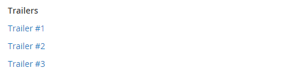

# Downloadbaar product

Een downloadbaar product kan alles zijn wat u als bestand kunt leveren, zoals een eBook, muziek, video, softwaretoepassing of update. U kunt elk nummer afzonderlijk in een album te koop aanbieden en verkopen. U kunt ook een downloadbaar product gebruiken om een elektronische versie van uw productcatalogus te leveren.

Omdat de download pas na de aankoop beschikbaar is, kunt u samples opgeven, zoals een fragment uit een boek, een clip uit een audiobestand of een trailer van een video. Een voorbeeld is iets dat de klant kan proberen voordat hij het product koopt. De bestanden die u ter beschikking stelt om te downloaden, kunnen worden geüpload naar uw server of van een andere server.

{width="700" zoomable="yes"}

Downloadbare producten kunnen worden geconfigureerd om te vereisen dat de klant zich aanmeldt bij een account om de koppeling te ontvangen of kunnen via e-mail worden verzonden en met anderen worden gedeeld. De status van de order voordat de download beschikbaar wordt, standaardwaarden en andere leveringsopties worden ingesteld in de configuratie. Houd rekening met het volgende wanneer u downloadbare catalogustoevoegingen wilt plannen:

- Downloadbare producten kunnen worden geüpload naar de server of worden gekoppeld vanaf een andere server op internet.

- U kunt bepalen hoe vaak een klant een product kan downloaden.

- Klanten die een downloadbaar product aanschaffen, kunnen zich eerst aanmelden voordat ze de kassa doorlopen.

- De levering van een downloadbaar product kan plaatsvinden wanneer de bestelling zich in een van de `Pending` of `Invoiced` status.

- Omdat downloadbare producten niet worden verzonden, wordt _Verzending_ stap van de afhandeling wordt overgeslagen wanneer het winkelwagentje alleen het downloadbare product bevat.

## Downloadopties configureren

De downloadbare configuratiemontages bepalen de standaardwaarden en de leveringsopties voor downloadbare producten en specificeren als de gasten downloads kunnen kopen.

1. Op de _Beheerder_ zijbalk, ga naar **[!UICONTROL Stores]** > _[!UICONTROL Settings]_>**[!UICONTROL Configuration]**.

1. Vouw in het linkerdeelvenster uit **[!UICONTROL Catalog]** en kiest u **[!UICONTROL Catalog]** onder.

1. Uitbreiden  de _[!UICONTROL Downloadable Product Options]_sectie.

   {width="700" zoomable="yes"}

   Voor een gedetailleerde lijst van deze configuratieopties, zie [_Downloadbare productopties_](../configuration-reference/catalog/catalog.md#downloadable-product-options) in de _Configuratieverwijzing_.

1. Om de status van het bestelproces te bepalen wanneer de download beschikbaar wordt, stelt u **[!UICONTROL Order Item Status to Enable Downloads]** op een van de volgende wijzen:

   - `Pending`
   - `Invoiced`

1. Als u een standaardlimiet wilt instellen voor het aantal downloads dat één klant kan uitvoeren, voert u het aantal in voor **[!UICONTROL Default Maximum Number of Downloads]**.

1. Set **[!UICONTROL Shareable]** op een van de volgende wijzen:

   - `Yes` - Hiermee kunnen klanten de downloadkoppeling naar anderen e-mailen.
   - `No` - Hiermee voorkomt u dat klanten de downloadkoppeling delen met anderen door te vereisen dat klanten zich aanmelden bij hun accounts om toegang te krijgen tot downloadkoppelingen.

1. Voor **[!UICONTROL Default Sample Title]** voert u de kop in die u boven de selectie van monsters wilt weergeven.

   {width="400"}

1. Voor **[!UICONTROL Default Link Title]**, voert u de standaardtekst in die u voor downloadkoppelingen wilt gebruiken.

1. Als u de downloadkoppeling in een nieuw browservenster wilt openen, stelt u **[!UICONTROL Opens Links in New Window]** tot `Yes`.

   Deze instelling wordt gebruikt om het browservenster naar de winkel open te houden.

1. Als u wilt bepalen hoe downloadbare inhoud wordt geleverd, stelt u **[!UICONTROL Use Content Disposition]** op een van de volgende wijzen:

   - `Attachment` - Levert de downloadkoppeling per e-mail als bijlage.
   - `Inline` - Levert de downloadkoppeling als een koppeling op een webpagina.

1. Als u wilt dat kopers zich registreren voor een klantenaccount en zich aanmelden voordat ze een download aanschaffen, stelt u **[!UICONTROL Disable Guest Checkout if Cart Contains Downloadable Items]** tot `Yes`.

1. Klik op **[!UICONTROL Save Config]**.

## Een downloadbaar product maken

De volgende instructies tonen het proces aan van het maken van een downloadbaar product met een [productsjabloon](attribute-sets.md), vereiste velden en basisinstellingen. Elk vereist veld is gemarkeerd met een rood sterretje (`*`). Wanneer u de basisbeginselen hebt voltooid, kunt u de overige productinstellingen naar wens voltooien.

>[!NOTE]
>
>Downloadbare bestandsnamen kunnen letters en cijfers bevatten. Een streepje of onderstrepingsteken kan worden gebruikt om een spatie tussen woorden te vertegenwoordigen. Ongeldige tekens in de bestandsnaam worden vervangen door een onderstrepingsteken.

### Stap 1: Kies het producttype

1. Op de _Beheerder_ zijbalk, ga naar **[!UICONTROL Catalog]** > **[!UICONTROL Products]**.

1. Op de _[!UICONTROL Add Product]_( {width="25"} ) in de rechterbovenhoek, kiest u `Downloadable Product`.

   {width="700" zoomable="yes"}

### Stap 2: Kies de kenmerkset

De voorbeeldgegevens bevatten een [kenmerkset](attribute-sets.md) gebeld _Downloadbaar_ met speciale velden voor downloadbare producten. U kunt een bestaande sjabloon gebruiken of een andere sjabloon maken voordat het product wordt opgeslagen.

Voer een van de volgende handelingen uit om de kenmerkset te kiezen die als sjabloon voor het product wordt gebruikt:

- Voor **[!UICONTROL Search]**, voert u de naam in van de kenmerkset.

- Kies in de lijst de optie `Downloadable` kenmerkset.

Het formulier wordt bijgewerkt met de wijziging.

{width="600" zoomable="yes"}

### Stap 3: Voer de vereiste instellingen in

1. Voer de **[!UICONTROL Product Name]**.

1. De standaardinstelling accepteren **[!UICONTROL SKU]** die is gebaseerd op de productnaam of een andere naam invoert.

1. Voer het product in **[!UICONTROL Price]**.

1. Aangezien het product nog niet gereed is om te publiceren, stelt u **[!UICONTROL Enable Product]** tot `No`.

1. klikken **[!UICONTROL Save]** en doorgaan.

   Wanneer het product wordt opgeslagen, wordt [Winkelweergave](introduction.md#product-scope) wordt in de linkerbovenhoek weergegeven.

1. Kies de optie **[!UICONTROL Store View]** waar het product beschikbaar moet zijn.

   {width="600" zoomable="yes"}

### Stap 4: De basisinstellingen voltooien

1. Set **[!UICONTROL Tax Class]** op een van de volgende wijzen:

   - `None`
   - `Taxable Goods`

1. Voer de **[!UICONTROL Quantity]** van het product dat in voorraad is.

   Let op het volgende:

   - Standaard, **[!UICONTROL Stock Status]** is ingesteld op `Out of Stock`.

   - Omdat downloadbare producten niet worden verzonden, wordt **[!UICONTROL Weight]** wordt niet gebruikt. Als u deze functie inschakelt, wordt deze een [Eenvoudig product](product-create-simple.md) en de _Is dit downloadbare product?_ kan niet worden gebruikt.

   >[!NOTE]
   >
   >Als u [Inventory management](../inventory-management/introduction.md), wordt de hoeveelheid in deze sectie ingesteld door Single Source-handelaren. De multi-Bron handelaars voegen bronnen en hoeveelheden in de Bronsectie toe. Zie het volgende _Bronnen en hoeveelheden toewijzen (Inventory management)_ sectie.

1. De standaardinstelling accepteren **[!UICONTROL Visibility]** instellen van `Catalog, Search`.

1. Als u het product in de [lijst van nieuwe producten](../content-design/widget-new-products-list.md), selecteert u de **[!UICONTROL Set Product as New]** selectievakje.

1. Om _[!UICONTROL Categories]_voor het product klikt u op de knop **[!UICONTROL Select…]**en voer een van de volgende handelingen uit:

   **Een bestaande categorie kiezen**:

   - Typ in het vak totdat u een overeenkomst hebt gevonden.

   - Schakel het selectievakje in van elke categorie die u wilt toewijzen.

   **Een categorie maken**:

   - Klik op **[!UICONTROL New Category]**.

   - Voer de **[!UICONTROL Category Name]** en kiest u **[!UICONTROL Parent Category]**, die zijn positie in de [menustructuur](category-root.md).

   - Klik op **[!UICONTROL Create Category]**.

1. Set **[!UICONTROL Format]** op een van de volgende wijzen:

   - `Download`
   - `DVD`

   Indien nodig kunt u de [attribute](attribute-product-create.md) om meer waarden toe te voegen.

   Er kunnen aanvullende kenmerken zijn die het product beschrijven. De selectie varieert per kenmerkset en u kunt deze later voltooien.

#### Bronnen en hoeveelheden toewijzen ([!DNL Inventory Management])

{{$include /help/_includes/inventory-assign-sources.md}}

### Stap 5: Voer de downloadbare gegevens in

Omlaag schuiven, uitvouwen  de _[!UICONTROL Downloadable Information]_en selecteert u de **[!UICONTROL Is this downloadable product?]**selectievakje.

Als deze optie is ingeschakeld, wordt _[!UICONTROL Downloadable Information]_de sectie bestaat uit twee delen. In het eerste deel wordt elke downloadkoppeling beschreven en in het tweede deel wordt elk voorbeeldbestand beschreven. De standaardwaarde voor veel van deze opties kunt u instellen in het gedeelte [configuratie](#configure-the-download-options).

{width="600" zoomable="yes"}

#### De koppelingen voltooien

1. In de _[!UICONTROL Links]_in, voert u de **[!UICONTROL Title]**die u wilt gebruiken als koptekst voor de downloadkoppelingen.

1. Selecteer, indien van toepassing, de **[!UICONTROL Links can be purchased separately]** selectievakje.

1. Klikken **[!UICONTROL Add Link]** en voer de volgende handelingen uit:

   - Voer de **[!UICONTROL Title]** en **[!UICONTROL Price]** van de download.

   - Voor beide **[!UICONTROL File]** en **[!UICONTROL Sample]** kiest u een van de volgende verspreidingsmethoden voor de downloads:

      - `Upload File` - Kies deze methode om het distributiebestand naar de server te uploaden. Blader naar het bestand en selecteer het voor uploaden.
      - `URL` - Kies deze methode om het distributiebestand te openen via een URL. Voer de volledige URL in naar het downloadbestand.

   >[!NOTE]
   >
   >Koppelingen naar externe bronnen kunt u niet gebruiken als downloadbare producten. Geldige koppelingsdomeinen zijn in het programma vooraf gedefinieerd `env.php` bestand (zie [env.php reference](https://experienceleague.adobe.com/docs/commerce-operations/configuration-guide/files/config-reference-envphp.html) in de _Configuratiegids_).

   - Set **[!UICONTROL Shareable]** op een van de volgende wijzen:

      - `No` - Vereist dat klanten zich aanmelden bij hun accounts om toegang te krijgen tot de downloadkoppeling.

      - `Yes` - Verstuurt de koppeling via e-mail, die klanten met anderen kunnen delen.

      - `Use Config` - Hiermee wordt de methode gebruikt die is opgegeven in het dialoogvenster [Downloadbare productopties](../configuration-reference/catalog/catalog.md) configuratie.

   - Voer een van de volgende handelingen uit:

      - Als u het downloaden per klant wilt beperken, voert u het maximumaantal in voor **[!UICONTROL Max. Downloads]**.
      - Als u onbeperkte downloads wilt toestaan, selecteert u de optie **[!UICONTROL Unlimited]** selectievakje.

   {width="600" zoomable="yes"}

1. Als u nog een koppeling wilt toevoegen, klikt u op **[!UICONTROL Add Link]** en herhaal deze stappen.

#### De monsters invullen

1. In de _[!UICONTROL Samples]_in, voert u de **[!UICONTROL Title]**die u als kop voor de monsters wilt gebruiken.

1. Klik op **[!UICONTROL Add Link]**.

   {width="600" zoomable="yes"}

1. Vul de koppelingsdetails als volgt in:

   - Voer de **[!UICONTROL Title]** van het afzonderlijke monster.

   - Kies een van de volgende verspreidingsmethoden:

      - `Upload File` - Kies deze methode om het distributiebestand naar de server te uploaden. Blader naar het bestand en selecteer het voor uploaden.
      - `URL` - Kies deze methode om het distributiebestand te openen via een URL. Voer de volledige URL in naar het downloadbestand.

   - Als u nog een voorbeeld wilt toevoegen, klikt u op **[!UICONTROL Add Link]** en herhaal deze stappen.

   - Als u de volgorde van de monsters wilt wijzigen, neemt u de _Volgorde wijzigen_ (  ) en sleep het voorbeeld naar een nieuwe positie.

### Stap 6: De productinformatie invullen

Schuif omlaag en voltooi indien nodig de informatie in de volgende secties:

- [Inhoud](product-content.md)
- [Afbeeldingen en video&#39;s](product-images-and-video.md)
- [Optimalisatie zoekmachine](product-search-engine-optimization.md)
- [Verwante producten, Up-Sells en Cross-Sells](related-products-up-sells-cross-sells.md)
- [Aanpasbare opties](settings-advanced-custom-options.md)
- [Producten op websites](settings-basic-websites.md)
- [Ontwerp](settings-advanced-design.md)
- [Cadeauopties](product-gift-options.md)

### Stap 7: Het product publiceren

Als u het product wilt publiceren in de catalogus, stelt u **[!UICONTROL Enable Product]** tot `Yes` en voer een van de volgende handelingen uit:

**Methode 1:** Opslaan en voorvertonen

- Klik in de rechterbovenhoek op **[!UICONTROL Save]**.

- Kies **[!UICONTROL Customer View]** op de _Beheerder_ (  ).

  De winkel wordt geopend in een nieuw browsertabblad.

  {width="600" zoomable="yes"}

**Methode 2:** Opslaan en sluiten

Op de _[!UICONTROL Save]_( {width="25"} ), kiest u **[!UICONTROL Save & Close]**.

## Storefront-ervaring

In het dashboard van de klantenrekening, _[!UICONTROL My Downloadable Products]_de paginakoppelingen aan elke orde van downloadbare producten. De downloads worden beschikbaar via de account van de klant wanneer de bestelling is voltooid.

{width="700" zoomable="yes"}

In de volgende tabel worden de _Mijn downloadbare producten_ waarden:

| Kolom | Beschrijving |
|--- |--- |
| [!UICONTROL Order#] | De [bestellen](../stores-purchase/orders.md) waarin het downloadbare product is aangeschaft. Verzekert een verbinding aan het ordendetail. |
| [!UICONTROL Date] | Aanmaakdatum van bestelling. |
| [!UICONTROL Title] | De naam van het downloadbare product dat bij de bestelling is aangeschaft. Verzekert een verbinding aan het downloadbare product. |
| [!UICONTROL Status] | Status van orderverwerking. |
| [!UICONTROL Remaining Downloads] | Aantal beschikbare downloads van het gedownloade product. |

_**Een productbestand downloaden van het dashboard van de account**_

1. In hun accountdashboard kiest de klant **[!UICONTROL My Downloadable Products]**.

1. Hiermee zoekt u de volgorde in de lijst en klikt u op de koppeling na de titel.

1. Klik in de rechterbenedenhoek van het downloadvenster op de knop _downloaden_ pictogram.

1. Hiermee zoekt u het bestand op de downloadlocatie en slaat u het bestand op de gewenste locatie op.
