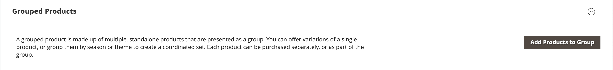

# Gegroepeerd product

Een gegroepeerd product bestaat uit eenvoudige zelfstandige producten die als groep worden aangeboden. U kunt variaties van één enkel product aanbieden of hen groeperen door seizoen of thema. Het aanbieden van een gegroepeerd product kan klanten ertoe aanzetten extra items te kopen. Een gegroepeerd product biedt een eenvoudige manier om variaties van een product aan te bieden en ze allemaal op dezelfde pagina weer te geven.

Zo kunt u bijvoorbeeld open-stock-flatware verkopen en elk type gereedschap weergeven dat in een formele plaatsinstelling wordt gebruikt. Sommigen zouden meerdere salade-vorken, visvorken, diner-vorken, dinemessen, vismessen, botermessen, soep-lepels en dessert-lepels kunnen bestellen. Andere klanten zouden een eenvoudige vork, een mes, en een lepel kunnen opdracht geven. Klanten kunnen elk gewenst aantal items bestellen.

Hoewel ze als groep worden aangeboden, wordt elk product in de groep als afzonderlijk artikel aangekocht. In het winkelwagentje worden elk artikel en de aangeschafte hoeveelheid weergegeven als een afzonderlijk artikel.

De volgende instructies tonen het proces aan van het maken van een gegroepeerd product met een [productsjabloon](attribute-sets.md), vereiste velden en basisinstellingen. Elk vereist veld is gemarkeerd met een rood sterretje (`*`). Wanneer u de basisbeginselen hebt voltooid, kunt u de overige productinstellingen naar wens voltooien.

{width="700" zoomable="yes"}

## Stap 1: Kies het producttype

1. Op de _Beheerder_ zijbalk, ga naar **[!UICONTROL Catalog]** > **[!UICONTROL Products]**.

1. Op de _[!UICONTROL Add Product]_( {width="25"} ) in de rechterbovenhoek, kiest u **[!UICONTROL Grouped Product]**.

   {width="700" zoomable="yes"}

## Stap 2: Kies de kenmerkset

Als u de optie [kenmerkset](attribute-sets.md) die als malplaatje voor het product wordt gebruikt, doe één van het volgende:

- Als u wilt zoeken, voert u de naam in van de **[!UICONTROL Attribute Set]**.
- Kies in de lijst de kenmerkset die u wilt gebruiken.

Het formulier wordt bijgewerkt met de wijziging.

{width="600" zoomable="yes"}

Als de vereiste kenmerken niet bestaan, kunt u nieuwe kenmerken toevoegen tijdens het maken van een product:

- Klik in de rechterbovenhoek op **[!UICONTROL Add Attribute]**.
- Een nieuw kenmerk definiëren (zie [Een kenmerk toevoegen aan een product](product-attributes-add.md)).

  {width="600" zoomable="yes"}

Als u een bestaand kenmerk aan het product wilt toevoegen, gebruikt u de opdracht [filterbesturingselementen](../getting-started/admin-grid-controls.md) om het kenmerk in het raster te zoeken en ga als volgt te werk:

- Schakel het selectievakje in de eerste kolom van elk kenmerk dat u wilt toevoegen in.
- Klik op **[!UICONTROL Add Selected]**.

## Stap 3: Voer de vereiste instellingen in

1. Voer de **[!UICONTROL Product Name]**.

1. De standaardinstelling accepteren **[!UICONTROL SKU]** die is gebaseerd op de productnaam of een andere naam invoert.

   De **[!UICONTROL Quantity]** is niet beschikbaar omdat de waarde is afgeleid van de afzonderlijke producten waaruit de groep bestaat.

   Een gegroepeerd product bevat geen eigen prijs in de catalogus. De prijs van het gegroepeerde product wordt afgeleid van de prijs van de afzonderlijke producten die in de groep zijn opgenomen.

1. Aangezien het product nog niet gereed is om te publiceren, stelt u **[!UICONTROL Enable Product]** tot `No` (  ).

1. Klikken **[!UICONTROL Save]** en doorgaan.

   Wanneer het product wordt opgeslagen, wordt de productnaam boven aan de pagina weergegeven en wordt de [Winkelweergave](introduction.md#product-scope) wordt in de linkerbovenhoek weergegeven.

1. Kies de optie **[!UICONTROL Store View]** waar het product beschikbaar moet zijn.

   {width="600" zoomable="yes"}

## Stap 4: De basisinstellingen voltooien

1. Accepteer de **[!UICONTROL Stock Status]** instellen van `In Stock`.

1. Om **[!UICONTROL Categories]** voor het product klikt u op de knop **[!UICONTROL Select…]** en voer een van de volgende handelingen uit:

   **Kies een bestaande categorie:**

   - Typ in het vak totdat u een overeenkomst hebt gevonden.

   - Schakel het selectievakje in van de categorie die u wilt toewijzen.

   **Een categorie maken:**

   - Klik op **[!UICONTROL New Category]**.

   - Voer de **[!UICONTROL Category Name]** en kiest u **[!UICONTROL Parent Category]**, die de positie in de menustructuur bepaalt.

   - Klik op **[!UICONTROL Create Category]**.

1. Accepteer de **[!UICONTROL Visibility]** instellingen van `Catalog, Search`.

1. Als u het product in de [lijst van nieuwe producten](../content-design/widget-new-products-list.md), kiest u de **[!UICONTROL Set Product as New]** **[!UICONTROL from]** en **[!UICONTROL to]** data op de kalender.

1. Kies de optie **[!UICONTROL Country of Manufacture]**.

   Er kunnen aanvullende individuele kenmerken zijn die het product beschrijven. De selectie varieert kenmerkset en u kunt deze later voltooien.

## Stap 5: Producten toevoegen aan de groep

1. Omlaag schuiven naar de **[!UICONTROL Grouped Products]** sectie en klik op **[!UICONTROL Add Products to Group]**.

   {width="600" zoomable="yes"}

1. Gebruik indien nodig de [filters](../getting-started/admin-grid-controls.md) om de producten te zoeken die u in de groep wilt opnemen.

1. Schakel in de lijst het selectievakje in van elk item dat u in de groep wilt opnemen.

   >[!NOTE]
   >
   >Alleen eenvoudige, downloadbare en virtuele producten zonder configureerbare opties kunnen worden gegroepeerd in onderliggende producten. Andere producttypen worden niet in de keuzelijst weergegeven.

   {width="600" zoomable="yes"}

1. Als u deze aan de productgroep wilt toevoegen, klikt u op **[!UICONTROL Add Selected Products]**.

   De geselecteerde producten worden weergegeven in de _[!UICONTROL Grouped Products]_sectie.

   Voor handelaren uit meerdere bronnen met [Inventory management](../inventory-management/sources-stocks.md), bevat het raster een **[!UICONTROL Quantity per Source]** kolom met elke toegewezen bron en voorraadhoeveelheid.

   {width="600" zoomable="yes"}

1. Voer een **[!UICONTROL Default Quantity]** voor een van de items.

1. Als u de volgorde van de producten wilt wijzigen, neemt u de _Volgorde wijzigen_ icon (  ) in de eerste kolom en sleep het product naar de nieuwe positie in de lijst.

1. Als u een product uit de groep wilt verwijderen, klikt u op **[!UICONTROL Remove]**.

## Stap 5: De productinformatie invullen

Voer de benodigde gegevens in de volgende secties in:

- [Inhoud](product-content.md)
- [Afbeeldingen en video&#39;s](product-images-and-video.md)
- [Optimalisatie zoekmachine](product-search-engine-optimization.md)
- [Verwante producten, Up-Sells en Cross-Sells](related-products-up-sells-cross-sells.md)
- [Aanpasbare opties](settings-advanced-custom-options.md)
- [Producten op websites](settings-basic-websites.md)
- [Ontwerp](settings-advanced-design.md)
- [Cadeauopties](product-gift-options.md)

## Stap 6: Het product publiceren

1. Als u het product wilt publiceren in de catalogus, stelt u **[!UICONTROL Enable Product]** tot `Yes`.

1. Voer een van de volgende handelingen uit:

   **Methode 1:** Opslaan en voorvertonen

   - Klik in de rechterbovenhoek op **[!UICONTROL Save]**.

   - Kies **[!UICONTROL Customer View]** op de _Beheerder_ (  ).

     De winkel wordt geopend in een nieuw browsertabblad.

     {width="700" zoomable="yes"}

   **Methode 2:** Opslaan en sluiten

   - Op de _[!UICONTROL Save]_( {width="25"} ), kiest u **[!UICONTROL Save & Close]**.

## Stap 7: De miniaturen van het winkelwagentje configureren (optioneel)

Als u voor elk product in de groep een andere afbeelding hebt, kunt u de configuratie zo instellen dat de juiste afbeelding wordt gebruikt voor de miniatuur van het winkelwagentje.

1. Op de _Beheerder_ zijbalk, ga naar **[!UICONTROL Stores]** > _[!UICONTROL Settings]_>**[!UICONTROL Configuration]**.

1. Vouw in het linkerdeelvenster uit **[!UICONTROL Sales]** en kiest u **[!UICONTROL Checkout]**.

1. Uitbreiden  de **[!UICONTROL Shopping Cart]**.

   Voor een gedetailleerde lijst van deze configuratieopties, zie [Winkelwagentje](../configuration-reference/sales/checkout.md#shopping-cart) in de _Configuratieverwijzing_.

1. Set **[!UICONTROL Grouped Product Image]** tot `Product Thumbnail Itself`.

   {width="600" zoomable="yes"}

   Schakel indien nodig de optie **[!UICONTROL Use system value]** Schakel het selectievakje in om deze optie in te stellen.

1. Klik op **[!UICONTROL Save Config]**.

## Te onthouden zaken

- Een gegroepeerd product is in wezen een verzameling eenvoudige, verwante producten.

- Gegroepeerde onderliggende producten kunnen eenvoudig, downloadbaar of virtueel zijn **[!UICONTROL without custom options]**.

- Elk aangeschaft artikel wordt afzonderlijk in het winkelwagentje weergegeven in plaats van als onderdeel van de groep.

- Een gegroepeerd product bevat geen eigen prijs in de catalogus. De prijs van het gegroepeerde product wordt afgeleid van de prijs van de afzonderlijke producten die in de groep zijn opgenomen.

- De miniatuurafbeelding in het winkelwagentje kan zo worden ingesteld dat de afbeelding van het gegroepeerde bovenliggende product of het bijbehorende product wordt weergegeven.
