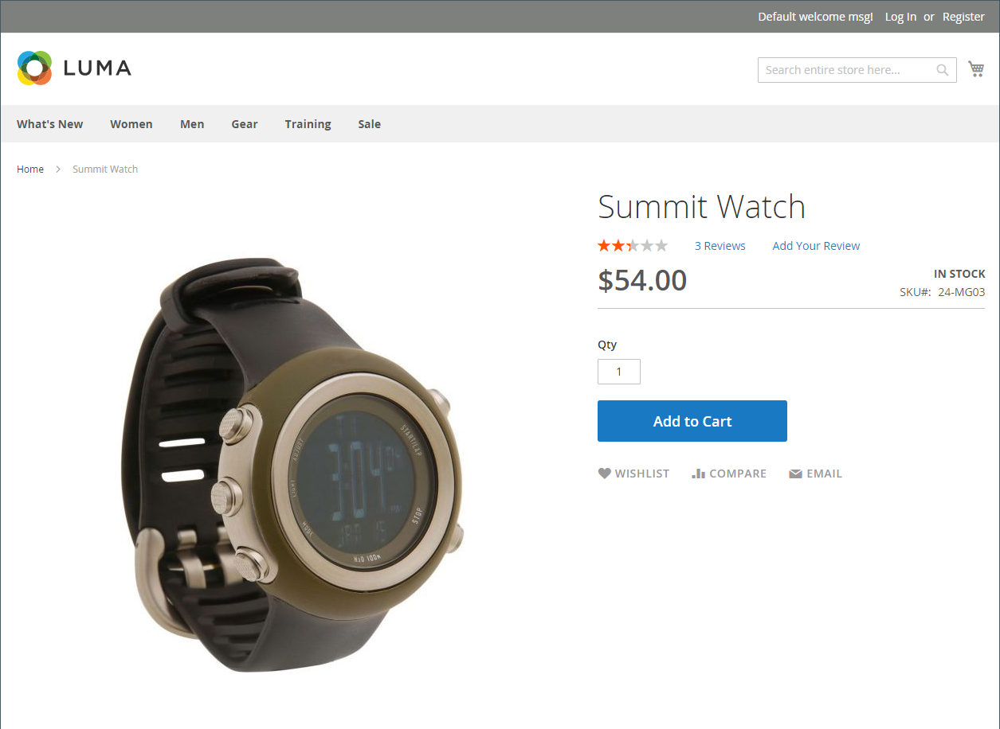

# Eenvoudig product

Een van de sleutels tot het benutten van de kracht van producttypen is het leren wanneer een eenvoudig, zelfstandig product moet worden gebruikt. Een eenvoudig product kan afzonderlijk of als deel van een gegroepeerd, configureerbaar, of bundelproduct worden verkocht. Een eenvoudig product met douaneopties wordt soms bedoeld als a _samengesteld product_.

De volgende instructies tonen het proces aan om een eenvoudig product te creëren gebruikend a [ productmalplaatje ](attribute-sets.md), vereiste gebieden, en basismontages. Elk vereist gebied is duidelijk met een rode asterisk (`*`). Wanneer u de basisbeginselen hebt voltooid, kunt u de overige productinstellingen naar wens voltooien.

{width="700" zoomable="yes"}

## Stap 1: Kies het producttype

1. Voor _Admin_ sidebar, ga **[!UICONTROL Catalog]** > **[!UICONTROL Products]**.

1. Voor _[!UICONTROL Add Product]_( {width="25"}) menu bij hoger-recht, kies **[!UICONTROL Simple Product]**.

   {width="700" zoomable="yes"} toe

## Stap 2: Kies de kenmerkset

Om de [ geplaatste attributen ](attribute-sets.md) te kiezen die als malplaatje voor het product wordt gebruikt:

- Klik in het veld **[!UICONTROL Attribute Set]** en voer de naam van de kenmerkset in (geheel of gedeeltelijk).

- Kies in de weergegeven lijst de kenmerkset die u wilt gebruiken.

Het formulier wordt bijgewerkt met de wijziging.

{width="600" zoomable="yes"}

## Stap 3: Voer de vereiste instellingen in

1. Voer de **[!UICONTROL Product Name]** in.

1. Accepteer de standaardwaarde **[!UICONTROL SKU]** die is gebaseerd op de productnaam of voer een andere naam in.

1. Voer het product **[!UICONTROL Price]** in.

1. Aangezien het product nog niet gereed is om te publiceren, stelt u de optie **[!UICONTROL Enable Product]** in op `No` .

1. Klik op **[!UICONTROL Save]** en ga verder.

   Wanneer het product wordt bewaard, verschijnt de [ verkiesster van de Mening van de Opslag ](introduction.md#product-scope) in de upper-left hoek.

1. Kies de locatie **[!UICONTROL Store View]** waar het product beschikbaar moet zijn.

   {width="600" zoomable="yes"}

## Stap 4: De basisinstellingen voltooien

1. Stel **[!UICONTROL Tax Class]** in op een van de volgende opties:

   - `None`
   - `Taxable Goods`
   - `Refund Adjustments`
   - `Gift Options`
   - `Order Gift Wrapping`
   - `Item Gift Wrapping`
   - `Printed Gift Card`
   - `Reward Points`
   - `VAT Reduced`
   - `VAT Standard`

1. Voer de **[!UICONTROL Quantity]** in van het product dat in voorraad is.

   Standaard is **[!UICONTROL Stock Status]** ingesteld op `In Stock` .

   >[!NOTE]
   >
   >Als u [ Inventory management ](../inventory-management/introduction.md) toelaat, plaatsen de Enige verkopers van Source de hoeveelheid in deze sectie. De multi handelaars van Source voegen bronnen en hoeveelheden in de Bronsectie toe. Zie het volgende _toewijzen Bronnen en Hoeveelheden (Inventory management)_ sectie.

1. Voer de **[!UICONTROL Weight]** van het product in.

1. Accepteer de standaardinstelling **[!UICONTROL Visibility]** van `Catalog, Search` .

1. Als u _[!UICONTROL Categories]_aan het product wilt toewijzen, klikt u op het vak **[!UICONTROL Select…]**en voert u een van de volgende handelingen uit:

   **kies een bestaande categorie**:

   - Typ in het vak totdat u een overeenkomst hebt gevonden.

   - Schakel het selectievakje in van elke categorie die u wilt toewijzen.

   **creeer een categorie**:

   - Klik op **[!UICONTROL New Category]**.

   - Voer de **[!UICONTROL Category Name]** in en kies de **[!UICONTROL Parent Category]** die de positie in de menustructuur bepaalt.

   - Klik op **[!UICONTROL Create Category]**.

1. Om het product in de lijst van [ nieuwe producten ](../content-design/widget-new-products-list.md) te voorzien, selecteer **[!UICONTROL Set Product as New]** checkbox.

1. Kies de **[!UICONTROL Country of Manufacture]** .

Er kunnen aanvullende individuele kenmerken zijn die het product beschrijven. De selectie varieert per kenmerkset en u kunt deze later voltooien.

### Bronnen en hoeveelheden toewijzen ([!DNL Inventory Management])

{{$include /help/_includes/inventory-assign-sources.md}}

## Stap 5: De productinformatie invullen

Schuif omlaag en voltooi indien nodig de informatie in de volgende secties:

- [Inhoud](product-content.md)
- [Afbeeldingen en video&#39;s](product-images-and-video.md)
- [Verwante producten, Up-Sells en Cross-Sells](related-products-up-sells-cross-sells.md)
- [Optimalisatie zoekmachine](product-search-engine-optimization.md)
- [Aanpasbare opties](settings-advanced-custom-options.md)
- [Producten op websites](settings-basic-websites.md)
- [Ontwerp](settings-advanced-design.md)
- [Cadeauopties](product-gift-options.md)

## Stap 6: Het product publiceren

1. Als u het product wilt publiceren in de catalogus, stelt u de **[!UICONTROL Enable Product]** switch in op `Yes` .

1. Voer een van de volgende handelingen uit:

   - **Methode 1:** sparen en Voorproef

      - Klik in de rechterbovenhoek op **[!UICONTROL Save]** .

      - Om het product in uw opslag te bekijken, verkies **[!UICONTROL Customer View]** op _Admin_ () menu.

     De winkel wordt geopend in een nieuw browsertabblad.

     {width="600" zoomable="yes"}

   - **Methode 2:** sparen en sluit

     Voor _[!UICONTROL Save]_( {width="25"}) menu, kies **[!UICONTROL Save & Close]**.

## Te onthouden zaken

- Eenvoudige producten kunnen worden opgenomen in configureerbare, bundel- en gegroepeerde producttypen.

- De eenvoudige productconfiguratie treedt configureerbare productconfiguraties voor een specifiek product met voeten.

- Een eenvoudig product kan aangepaste opties hebben met verschillende typen invoer, waardoor het mogelijk is om veel productvariaties van één SKU te verkopen.

<!-- Last updated from includes: 2023-05-19 17:14:58 -->
