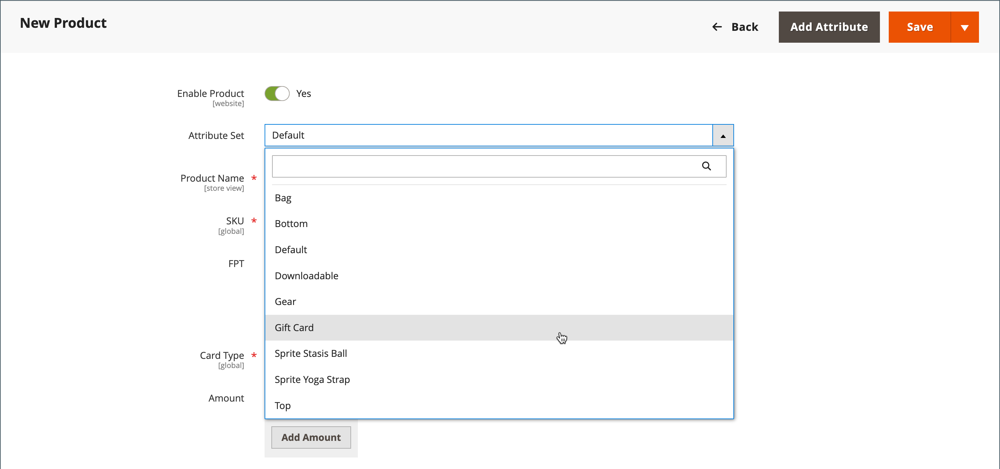

# Cadeauproduct

{{ee-feature}}

Elke cadeaukaart heeft een unieke code die door slechts één klant kan worden afgelost tijdens het afrekenen. A [codepool](../stores-purchase/product-gift-card-accounts.md#step-3-establish-the-gift-card-code-pool) moet worden vastgesteld voordat cadeaukaarten kunnen worden verkocht. Zie [Workflow voor creditcards](../stores-purchase/product-gift-card-workflow.md) voor meer informatie over de inwisseling van cadeaukaarten in het winkelwagentje .

{width="700" zoomable="yes"}

Er zijn drie soorten cadeaukaartproducten:

- **Virtueel** - Er wordt een virtuele cadeaukaart verzonden naar het e-mailadres van de ontvanger, dat vereist is bij de aankoop van de cadeaukaart. Een verzendadres is niet nodig.

- **Fysiek** - Een fysieke cadeaukaart wordt verzonden naar het adres van de ontvanger, dat vereist is tijdens de aankoop van de cadeaukaart.

- **Gecombineerd** - Een gecombineerde cadeaukaart wordt verzonden en naar de ontvanger gemaild. Het e-mailadres en het verzendadres van de ontvanger zijn vereist tijdens de aankoop van de cadeaukaart.

## Een cadeaukaartproduct maken

In de volgende instructies wordt het maken van een cadeaukaart met een [productsjabloon](attribute-sets.md), vereiste velden en basisinstellingen. Elk vereist veld is gemarkeerd met een rood sterretje (`*`). Wanneer u de basisbeginselen hebt voltooid, kunt u de overige productinstellingen naar wens voltooien.

### Stap 1: Kies het producttype

1. Op de _Beheerder_ zijbalk, ga naar **[!UICONTROL Catalog]** > **[!UICONTROL Products]**.

1. In de rechterbovenhoek op het tabblad _[!UICONTROL Add Product]_( {width="25"}  ), kiest u **[!UICONTROL Gift Card]**.

   {width="700" zoomable="yes"}

### Stap 2: Kies de kenmerkset

U kunt de standaardinstelling gebruiken `Gift Card` kenmerkset of kies een andere set. Voer een van de volgende handelingen uit om de kenmerkset te kiezen die als sjabloon voor het product wordt gebruikt:

- Klik in het dialoogvenster **[!UICONTROL Attribute Set]** en voert u de naam van de kenmerkset geheel of gedeeltelijk in.

- Kies in de weergegeven lijst de kenmerkset die u wilt gebruiken.

{width="600" zoomable="yes"}

### Stap 3: Voer de vereiste instellingen in

1. Voer een **[!UICONTROL Product Name]** voor de cadeaukaart.

   U kunt ook het type cadeaukaart in de naam aangeven. Bijvoorbeeld: _Virtuele leumkaart_.

1. Voer een **[!UICONTROL SKU]** voor het product.

   Door gebrek, wordt de Naam van het Product gebruikt als gebrek SKU.

1. Set **[!UICONTROL Card Type]** op een van de volgende wijzen:

   - `Virtual` - Virtuele cadeaukaarten worden via e-mail aan de ontvanger bezorgd.
   - `Physical` - Fysieke cadeaukaarten kunnen vooraf in massa worden geproduceerd en worden voorzien van unieke codes.
   - `Combined` - Een gecombineerde cadeaukaart heeft de kenmerken van zowel een virtuele als een fysieke cadeaukaart.

   {width="600" zoomable="yes"}

1. Als u de klant een keuze wilt bieden uit vaste bedragen, klikt u op **[!UICONTROL Add Amount]** en voert u de eerste vaste waarde van de kaart in als een decimaal.

   Herhaal deze stap voor elke waarde om de selectie van vaste bedragen in te voeren.

1. Ga als volgt te werk om klanten de mogelijkheid te bieden de waarde van de cadeaukaart in te stellen:

   - Set **[!UICONTROL Open Amount]** tot `Yes`.

   - Als u het bereik van de aanvaardbare minimum- en maximumwaarden wilt definiëren, voert u de **[!UICONTROL Open Amount From]** en **[!UICONTROL To]** waarden.

   U kunt cadeaukaarten maken met een vaste prijs, een open prijs of beide.

   >[!NOTE]
   >
   >Een cadeaukaartproduct heeft geen eigen prijs in de catalogus. De prijs van de cadeau-kaart wordt afgeleid van het geselecteerde bedrag van de cadeau-kaart tijdens de aankoop.

   {width="600" zoomable="yes"}

### Stap 4: De basisinstellingen voltooien

1. Voor een fysieke of gecombineerde cadeaukaart voert u de **[!UICONTROL Quantity]** in voorraad.

1. Als de cadeaukaart die moet worden verzonden, voert u de **[!UICONTROL Weight]** van het pakket.

1. In de **[!UICONTROL Categories]** veld, kies `Gift Card`.

Er kunnen aanvullende individuele kenmerken zijn die het product beschrijven. De selectie varieert kenmerkset en u kunt deze later voltooien.

### Stap 5: De kaartgegevens van de cadeau invullen

De _[!UICONTROL Gift Card Information]_van de productinstellingen kan worden gebruikt om de [kaartenconfiguratie](../configuration-reference/sales/gift-cards.md) instellingen die bepalen hoe de kaart wordt beheerd.

1. Omlaag schuiven naar de _[!UICONTROL Gift Card Information]_sectie.

   De standaardinstellingen in deze sectie worden bepaald door de systeemconfiguratie.

   {width="600" zoomable="yes"}

1. Wijzig aanvullende velden op basis van de manier waarop de cadeaukaart moet werken:

   - **[!UICONTROL Treat Balance as Store Credit]** - Hiermee bepaalt u of de houder van de cadeau-kaart het saldo kan inwisselen als winkelkrediet.

   - **[!UICONTROL Lifetime (days)]** - Hiermee bepaalt u het aantal dagen na aankoop tot de cadeaukaart verloopt. Als u geen limiet wilt instellen voor de levensduur van de kaart, laat u dit veld leeg.

   - **[!UICONTROL Allow Message]** - Hiermee wordt bepaald of de koper van de cadeaukaart een bericht voor de ontvanger kan invoeren. Een cadeaubericht kan worden opgenomen voor zowel virtuele (e-mail) als fysieke (verzonden) cadeaukaarten.

   - **[!UICONTROL Email Template]** - Hiermee bepaalt u de e-mailsjabloon die wordt gebruikt voor het bericht dat aan de ontvanger van een cadeaukaart wordt verzonden.

### Stap 6: De productinformatie invullen

Voer de benodigde gegevens in de volgende secties in:

- [Inhoud](product-content.md)
- [Afbeeldingen en video&#39;s](product-images-and-video.md)
- [Verwante producten, Up-Sells en Cross-Sells](related-products-up-sells-cross-sells.md)
- [Optimalisatie zoekmachine](product-search-engine-optimization.md)
- [Aanpasbare opties](settings-advanced-custom-options.md)
- [Producten op websites](settings-basic-websites.md)
- [Ontwerp](settings-advanced-design.md)
- [Cadeauopties](product-gift-options.md)

### Stap 7: Het product publiceren

1. Als u het product wilt publiceren in de catalogus, stelt u de optie **Product inschakelen** schakelen naar `Yes`.

1. Voer een van de volgende handelingen uit:

   **Methode 1:** Opslaan en voorvertonen

   - Klik in de rechterbovenhoek op **[!UICONTROL Save]**.

   - Kies **[!UICONTROL Customer View]** op de _Beheerder_ (  ),

   {width="600" zoomable="yes"}

   **Methode 2:** Opslaan en sluiten

   Op de _[!UICONTROL Save]_( {width="25"} ), kiest u **[!UICONTROL Save & Close]**.

## Te onthouden zaken

- A _codepool_ Er moeten unieke nummers worden gegenereerd voordat een cadeaukaart te koop kan worden aangeboden.

- Cadeaukaarten kunnen worden ingesteld op `Redeemable` of `Non-Redeemable`.

- Belastingen zijn **_niet toegepast_** aan cadeaukaarten tijdens de aankoop van de cadeau-kaart. Belastingen worden alleen op producten toegepast wanneer een aangeschafte cadeaukaart wordt gebruikt om producten te kopen.

- De levensduur van een cadeaukaart kan onbeperkt zijn of op een opgegeven aantal dagen worden ingesteld.

- De waarde van een cadeaukaart kan worden ingesteld op een vast bedrag of worden ingesteld op een open bedrag met een minimum- en maximumwaarde.

- Een cadeaukaartproduct heeft geen eigen prijs in de catalogus. De prijs van de cadeau-kaart wordt afgeleid van het geselecteerde bedrag van de cadeau-kaart tijdens de aankoop.

- Een kaartenaccount voor de klant kan worden gemaakt wanneer de bestelling wordt geplaatst of op het moment van de factuur.
